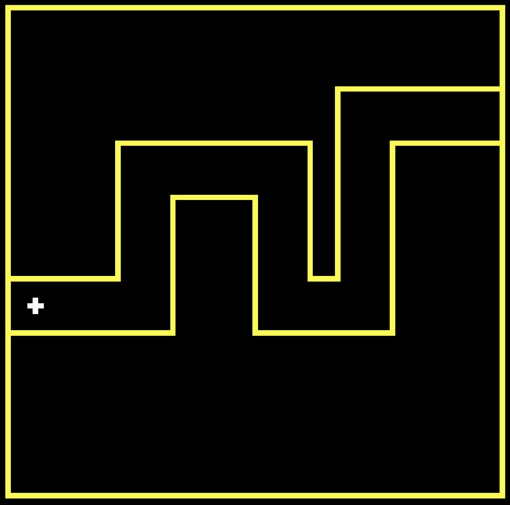
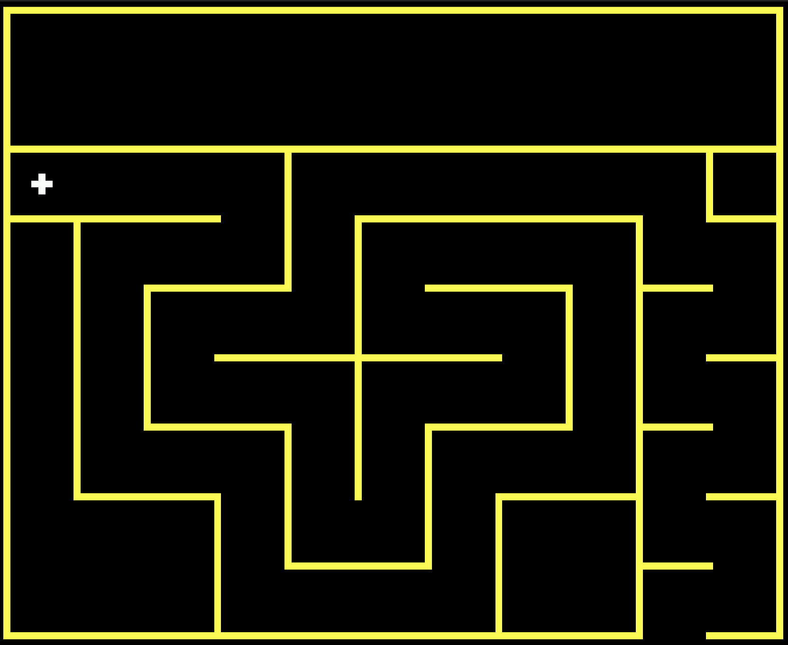
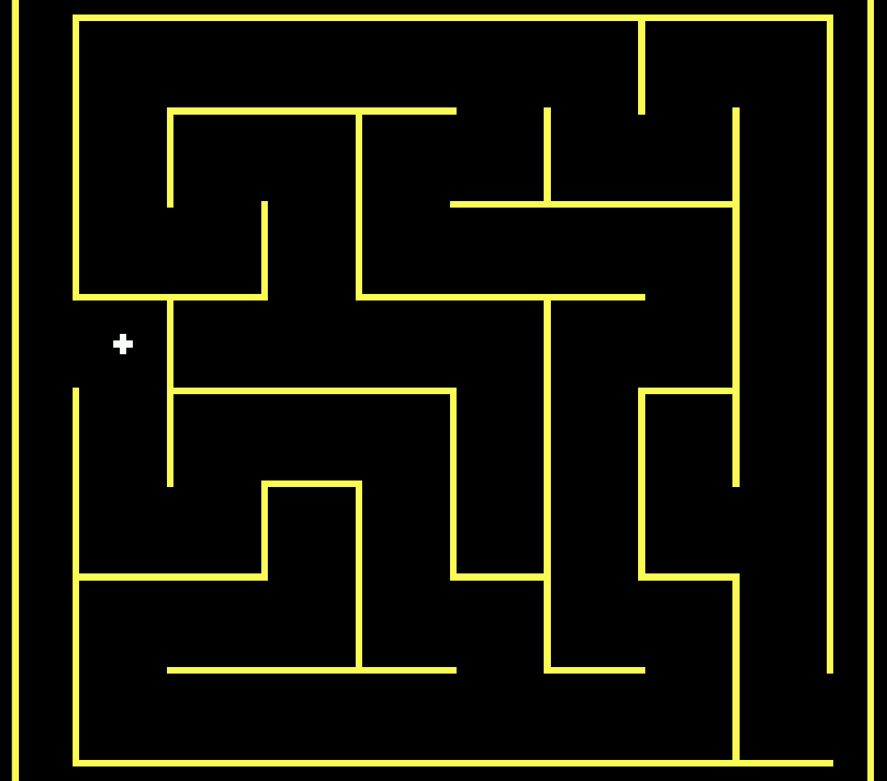

# Haptic Game for the Blind
Within the domain of contemporary technology, haptics encompasses the intricate interplay between human tactile interaction and the nuanced feedback produced by computer interfaces. The fundamental endeavor is to authentically replicate real-world stimuli, fostering an immersive and responsive user experience. Drawing inspiration from the vision of crafting accessibility-first experiences for the blind, our objective is to develop a gaming platform that intrinsically prioritizes inclusion for this user demographic.

## Prototype Contents
Placeholder


**Table of Content**
- [Haptic Game for the Blind](#haptic-game-for-the-blind)
  - [Prototype Contents](#prototype-contents)
- [HapNav](#hapnav)
  - [HapNav Game Overview](#hapnav-game-overview)
      - [Core Gameplay: Trial-and-Error Learning for Intuitive Mastery](#core-gameplay-trial-and-error-learning-for-intuitive-mastery)
      - [Mission Design: Skillful Navigation and Spatial Awareness](#mission-design-skillful-navigation-and-spatial-awareness)
      - [Freedom to Explore: Unconstrained Gaming](#freedom-to-explore-unconstrained-gaming)
      - [Inclusivity: A New Dimension for Visually Impaired Players](#inclusivity-a-new-dimension-for-visually-impaired-players)
      - [Analogical Metaphor: Intuitively Navigating a Stylized World](#analogical-metaphor-intuitively-navigating-a-stylized-world)
      - [Empowering the Visually Impaired: Novel Interaction with Digital Environments](#empowering-the-visually-impaired-novel-interaction-with-digital-environments)
  - [Game Objective](#game-objective)
  - [The Setup](#the-setup)
  - [Game Demonstration](#game-demonstration)
  - [Other Content](#other-content)
    - [Controller Designs](#controller-designs)
    - [Music \& Rytms](#music--rytms)
    - [Vibration Patterns](#vibration-patterns)
    - [Additional Maps](#additional-maps)
    - [Help and Guides for Alternative Setups](#help-and-guides-for-alternative-setups)
      - [Displays](#displays)
        - [IlI941](#ili941)
        - [ST7790](#st7790)
  - [The Big Picture](#the-big-picture)
  - [Get Started](#get-started)
  - [Contribution](#contribution)
  - [Acknowledgments](#acknowledgments)

Current Prototype Iteration            |  Original Prototype Design
:-------------------------:|:-------------------------:
  |  

# HapNav
This project aims to create an engaging and accessible game experience for the blind and visually impaired community. By harnessing the power of Arduino, this innovative game leverages multiple modalities to provide a unique gaming experience. It not only serves as an exciting game but also contributes to the field of accessibility research.

**If you'd like to experiment with the prototype, you can interact with the design using this interactive [wokwi sketch](https://wokwi.com/projects/380777984099163137).**


## HapNav Game Overview
HapNav challenges players to navigate a pre-defined map entirely by touch and intuition. Equipped with a joystick module, players rely on a vibration motor for feedback, indicating whether they stay within the intricate pathways of the designated route.

#### Core Gameplay: Trial-and-Error Learning for Intuitive Mastery
At the heart of HapNav's gameplay lies a unique trial-and-error approach. As players embark on the journey, they decipher the shapes, bends, and twists of the map, progressively forming an intuitive and detailed mental image.

#### Mission Design: Skillful Navigation and Spatial Awareness
Your primary mission in HapNav is clear: skillfully navigate the map, reaching the endpoint while staying true to the pre-established path. This objective tests your spatial awareness and motor skills, encouraging the development of a deep familiarity with the virtual terrain.

#### Freedom to Explore: Unconstrained Gaming
Unlike many traditional games, HapNav liberates players from health systems, time limits, or other inhibiting factors. The game's core intention is to offer a platform for unrestricted exploration and learning within its two-dimensional world. Rely solely on your mind's image of the map, fostering a sense of freedom as you navigate the virtual landscape.

#### Inclusivity: A New Dimension for Visually Impaired Players
The primary benefit for users lies in the formation of a detailed mental model encapsulating the map's intricacies. HapNav introduces an intriguing element where visually impaired individuals are encouraged to 'see' or cultivate a spatial representation of the map by actively navigating it. This adds a distinctive layer to the gaming experience, enabling users to develop a two-dimensional understanding of the synthetic environment.

#### Analogical Metaphor: Intuitively Navigating a Stylized World
Drawing on an analogical metaphor, HapNav invites players to intuitively 'see' and maneuver through a stylized world, enhancing their ability to construct mental images and navigate with heightened spatial intuition.

#### Empowering the Visually Impaired: Novel Interaction with Digital Environments
The cultivation of a cognitive map empowers players to heighten their spatial awareness within this compact virtual realm. This innovative approach fosters a deeper level of engagement and inclusion for individuals with visual impairments, offering a novel way to interact with and perceive digital environments. Immerse yourself in HapNav's dynamic and immersive gaming experience, where sensory feedback, strategic navigation, and the trial-and-error learning process combine to create a captivating journey. Get ready to experience gaming in a whole new dimension with HapNav.

**Here's a brief overview of the game:**

## Game Objective
The primary aim of the game is to successfully conquer the intricate maze-like level design, all while relying solely on tactile cues and without any visual assistance. The player's progress is determined by the absence of vibrations in the controller. Whenever the player veers off the intended path, the vibration motor responds with varying intensity, offering real-time feedback about their proximity to the desired route that constitutes the map's level design. Upon reaching the end of the level, a triumphant vibration sequence will mark their victory.

<div align="center">  </div>

**The game unfolds as follows:**

- Players utilize a thumbstick or joystick component within the controller to navigate the level map.
- Through a process of trial and error, players gradually gain an understanding of the map's structure and composition, progressing step by step.
- In the event of the player straying from the prescribed path, a vibrator activates, intensifying in response to the player's deviation. This prompts the user to adjust their joystick input and steer back onto the desired path, thereby advancing in the game.
- Success is achieved when the player consistently follows the main path, ultimately triggering the celebratory vibration sequence to signify victory.


<div align="center">  </div>

<div align="center">  </div>


 Below, you'll find the wiring table for reference:
| ESP32 | Joystick | Vibration Motor |
| :---         |     :---:      |          :--- |
| 3V3   | +5V     |     |
| 5V     |        | VCC      |
| GND     | GND       | GND      |
| D34     | VRX       |       |
| D35     | VRY       |       |
| D14     | SW       |       |
| D2     |        | IN      |
</div>


## The Setup
We've devised a haptic vibrational feedback kit, harnessing the motion of an analog joystick. Leveraging the Arduino platform, we can read the analog joystick's input and orchestrate the vibration motor's response, providing tactile feedback directly into the user's hand. The primary objective of this kit is to acquaint users with haptic feedback (through the mode of games), achieved by seamlessly integrating uncomplicated components into a handheld device that interfaces with Arduino. The end result is a portable gadget that imparts vibrational responses in direct correlation to shifts in joystick position.

1. **Technical Specifications**: This project involves programming an .ino file in embedded C for Arduino. You'll find the code required to create a working game that meets the specified requirements.

3. **Level Map Design**: The game features a level map with distinct states, including starting points, turning points, and an end point. The level design consists of straight lines and 90-degree turns, providing a structured and engaging experience. This repository has three different type map designs that can be used directly, or inspire to other map designs.

| Basic Snake Game | Plus Sign Map | Maze Map |
| :---         |     :---:      |          ---: |
|    |     |     |

1. **Joystick Navigation**: The joystick module serves as the primary control mechanism. Players use it to guide their position on the level map. The code ensures that player movements align with the predefined path.

2. **Vibrator Feedback**: The game employs a vibrator component to provide feedback to the player. Vibrations vary in intensity based on the player's proximity to the predefined path, creating an immersive and tactile experience.

3. **Turn Point Indicators**: To aid player progress, the vibrator delivers quick, distinct vibrations when the player reaches a turning point. This feature enhances the player's sense of direction and progress.

4. **End Point Celebration**: Upon successfully completing the level, the game celebrates the player's achievement with a series of quick vibrations, indicating the level's completion.

## Game Demonstration

<div align="center"> <video src="https://github.com/QC20/Haptic-Game-For-The-Blind/assets/36644388/ce326c95-b368-4e37-82a2-daf027f6be1e" controls title="Game Maze Display Demontration" width="80%" height="80%"> </div>


**Controller Design**
``` stl
solid Mesh
  facet normal 0.000000 -0.000000 -1.000000
    outer loop
      vertex 0.833000 85.858002 0.010000
      vertex 1.373000 85.958000 0.010000
      vertex -1.000000 80.997002 0.010000
    endloop
  endfacet
  facet normal 0.000000 0.000000 1.000000
    outer loop
      vertex 5.759000 48.007999 2.010000
      vertex 5.698000 48.075001 2.010000
      vertex 2.600000 44.097000 2.010000
    endloop
  endfacet
  facet normal 0.000000 0.000000 1.000000
    outer loop
      vertex 2.600000 44.097000 2.010000
      vertex 5.858000 47.915001 2.010000
      vertex 5.807000 47.959999 2.010000
    endloop
  endfacet
  facet normal 0.000000 0.000000 1.000000
    outer loop
      vertex 2.600000 44.097000 2.010000
      vertex 5.807000 47.959999 2.010000
      vertex 5.759000 48.007999 2.010000
    endloop
  endfacet
  facet normal 0.000000 0.000000 1.000000
    outer loop
      vertex 6.102000 47.745998 2.010000
      vertex 6.004000 47.805000 2.010000
      vertex 2.600000 44.097000 2.010000
    endloop
  endfacet
  facet normal 0.000000 0.000000 1.000000
    outer loop
      vertex 5.930000 47.858002 2.010000
      vertex 5.858000 47.915001 2.010000
      vertex 2.600000 44.097000 2.010000
    endloop
  endfacet
  facet normal 0.000000 0.000000 1.000000
    outer loop
      vertex 2.600000 44.097000 2.010000
      vertex 5.698000 48.075001 2.010000
      vertex 5.654000 48.127998 2.010000
    endloop
  endfacet
  facet normal 0.000000 0.000000 1.000000
    outer loop
      vertex 6.004000 47.805000 2.010000
      vertex 5.930000 47.858002 2.010000
      vertex 2.600000 44.097000 2.010000
    endloop
  endfacet
  facet normal 0.000000 0.000000 1.000000
    outer loop
      vertex 10.810000 44.097000 2.010000
      vertex 6.868000 47.569000 2.010000
      vertex 6.755000 47.568001 2.010000
    endloop
  endfacet
  facet normal 0.000000 1.000000 0.000000
    outer loop
      vertex 10.810000 44.097000 6.000000
      vertex 10.810000 44.097000 2.010000
      vertex 2.600000 44.097000 6.000000
    endloop
  endfacet
  facet normal -1.000000 0.000000 0.000000
    outer loop
      vertex -3.000000 80.997002 0.010000
      vertex -3.000000 35.497002 0.010000
      vertex -3.000000 35.497002 16.000000
    endloop
  endfacet
  facet normal -1.000000 0.000000 0.000000
    outer loop
      vertex -3.000000 35.497002 16.000000
      vertex -3.000000 33.000000 16.000000
      vertex -3.000000 33.000000 16.010000
    endloop
  endfacet
  facet normal -1.000000 0.000000 0.000000
    outer loop
      vertex -3.000000 33.000000 16.010000
      vertex -3.000000 80.997002 16.010000
      vertex -3.000000 35.497002 16.000000
    endloop
  endfacet
  facet normal -1.000000 -0.000000 -0.000000
    outer loop
      vertex -3.000000 35.497002 0.010000
      vertex -3.000000 35.497002 0.000000
      vertex -3.000000 -39.000000 0.010000
    endloop
  endfacet
  facet normal -1.000000 0.000000 0.000000
    outer loop
      vertex -3.000000 33.000000 16.000000
      vertex -3.000000 35.497002 16.000000
      vertex -3.000000 35.497002 0.010000
    endloop
  endfacet
  facet normal -1.000000 0.000000 0.000000
    outer loop
      vertex -3.000000 35.497002 16.000000
      vertex -3.000000 80.997002 16.010000
      vertex -3.000000 80.997002 0.010000
    endloop
  endfacet
  facet normal -1.000000 0.000000 -0.000000
    outer loop
      vertex -3.000000 33.000000 16.000000
      vertex -3.000000 35.497002 0.010000
      vertex -3.000000 -39.000000 0.010000
    endloop
  endfacet
  facet normal -1.000000 0.000000 0.000000
    outer loop
      vertex -3.000000 -39.000000 16.000000
      vertex -3.000000 -37.000999 16.010000
      vertex -3.000000 -37.000999 16.000000
    endloop
  endfacet
  facet normal -1.000000 0.000000 0.000000
    outer loop
      vertex -3.000000 -82.998001 16.010000
      vertex -3.000000 -37.000999 16.010000
      vertex -3.000000 -39.000000 16.000000
    endloop
  endfacet
  facet normal -1.000000 0.000000 0.000000
    outer loop
      vertex -3.000000 -39.000000 0.010000
      vertex -3.000000 -39.000000 16.000000
      vertex -3.000000 -37.000999 16.000000
    endloop
  endfacet
  facet normal -1.000000 0.000000 0.000000
    outer loop
      vertex -3.000000 -39.000000 0.010000
      vertex -3.000000 -37.000999 16.000000
      vertex -3.000000 33.000000 16.000000
    endloop
  endfacet
  facet normal -1.000000 0.000000 0.000000
    outer loop
      vertex -3.000000 35.497002 0.000000
      vertex -3.000000 -39.000000 0.000000
      vertex -3.000000 -39.000000 0.010000
    endloop
  endfacet
  facet normal -1.000000 0.000000 -0.000000
    outer loop
      vertex -3.000000 -39.000000 16.000000
      vertex -3.000000 -39.000000 0.010000
      vertex -3.000000 -82.998001 0.010000
    endloop
  endfacet
  facet normal -1.000000 0.000000 0.000000
    outer loop
      vertex -3.000000 -82.998001 0.010000
      vertex -3.000000 -82.998001 16.010000
      vertex -3.000000 -39.000000 16.000000
    endloop
  endfacet
  facet normal 0.000000 1.000000 0.000000
    outer loop
      vertex 10.810000 44.097000 2.010000
      vertex 2.600000 44.097000 2.010000
      vertex 2.600000 44.097000 6.000000
    endloop
  endfacet
  facet normal 0.000000 -1.000000 0.000000
    outer loop
      vertex 52.000000 -87.998001 7.010000
      vertex 52.000000 -87.998001 0.010000
      vertex 82.000000 -87.998001 0.010000
    endloop
  endfacet
  facet normal 0.000000 -1.000000 0.000000
    outer loop
      vertex 82.000000 -87.998001 0.010000
      vertex 82.000000 -87.998001 7.010000
      vertex 52.000000 -87.998001 7.010000
    endloop
  endfacet
  facet normal 0.000000 -1.000000 0.000000
    outer loop
      vertex 20.474001 -87.998001 9.492000
      vertex 20.643000 -87.998001 9.155000
      vertex 32.000000 -87.998001 16.010000
    endloop
  endfacet
  facet normal 0.000000 -1.000000 0.000000
    outer loop
      vertex 20.820999 -87.998001 8.685000
      vertex 20.938000 -87.998001 8.197000
      vertex 32.000000 -87.998001 16.010000
    endloop
  endfacet
  facet normal 0.000000 -1.000000 0.000000
    outer loop
      vertex 32.000000 -87.998001 16.010000
      vertex 20.643000 -87.998001 9.155000
      vertex 20.820999 -87.998001 8.685000
    endloop
  endfacet
  facet normal 0.000000 -1.000000 0.000000
    outer loop
      vertex 32.000000 -87.998001 16.010000
      vertex 20.343000 -87.998001 9.706000
      vertex 20.474001 -87.998001 9.492000
    endloop
  endfacet
  facet normal 0.000000 -1.000000 0.000000
    outer loop
      vertex 19.090000 -87.998001 10.920000
      vertex 19.299999 -87.998001 10.782000
      vertex 32.000000 -87.998001 16.010000
    endloop
  endfacet
  facet normal 0.000000 -1.000000 0.000000
    outer loop
      vertex 18.872000 -87.998001 11.045000
      vertex 19.090000 -87.998001 10.920000
      vertex 32.000000 -87.998001 16.010000
    endloop
  endfacet
  facet normal 0.000000 -1.000000 0.000000
    outer loop
      vertex 19.299999 -87.998001 10.782000
      vertex 19.500999 -87.998001 10.631000
      vertex 32.000000 -87.998001 16.010000
    endloop
  endfacet
  facet normal 0.000000 -1.000000 0.000000
    outer loop
      vertex 18.646000 -87.998001 11.155000
      vertex 18.872000 -87.998001 11.045000
      vertex 32.000000 -87.998001 16.010000
    endloop
  endfacet
  facet normal 0.000000 -1.000000 0.000000
    outer loop
      vertex 19.500999 -87.998001 10.631000
      vertex 19.691999 -87.998001 10.468000
      vertex 32.000000 -87.998001 16.010000
    endloop
  endfacet
  facet normal 0.000000 -1.000000 0.000000
    outer loop
      vertex 32.000000 -87.998001 16.010000
      vertex 19.691999 -87.998001 10.468000
      vertex 19.872000 -87.998001 10.293000
    endloop
  endfacet
  facet normal 0.000000 -1.000000 0.000000
    outer loop
      vertex 32.000000 -87.998001 16.010000
      vertex 20.041000 -87.998001 10.107000
      vertex 20.198000 -87.998001 9.911000
    endloop
  endfacet
  facet normal 0.000000 -1.000000 0.000000
    outer loop
      vertex 17.688000 -87.998001 11.450000
      vertex 17.934000 -87.998001 11.399000
      vertex 32.000000 -87.998001 16.010000
    endloop
  endfacet
  facet normal 0.000000 -1.000000 0.000000
    outer loop
      vertex 32.000000 -87.998001 16.010000
      vertex 17.438999 -87.998001 11.485000
      vertex 17.688000 -87.998001 11.450000
    endloop
  endfacet
  facet normal 0.000000 -1.000000 0.000000
    outer loop
      vertex 32.000000 -87.998001 16.010000
      vertex 18.414000 -87.998001 11.251000
      vertex 18.646000 -87.998001 11.155000
    endloop
  endfacet
  facet normal -0.000000 -1.000000 0.000000
    outer loop
      vertex 32.000000 -87.998001 16.010000
      vertex 2.000000 -87.998001 16.010000
      vertex 17.000000 -87.998001 11.510000
    endloop
  endfacet
  facet normal 0.000000 -1.000000 0.000000
    outer loop
      vertex 17.188000 -87.998001 11.505000
      vertex 17.438999 -87.998001 11.485000
      vertex 32.000000 -87.998001 16.010000
    endloop
  endfacet
  facet normal 0.000000 -1.000000 0.000000
    outer loop
      vertex 32.000000 -87.998001 16.010000
      vertex 18.176001 -87.998001 11.333000
      vertex 18.414000 -87.998001 11.251000
    endloop
  endfacet
  facet normal 0.000000 -1.000000 0.000000
    outer loop
      vertex 32.000000 -87.998001 16.010000
      vertex 17.934000 -87.998001 11.399000
      vertex 18.176001 -87.998001 11.333000
    endloop
  endfacet
  facet normal -0.904894 0.425637 0.000000
    outer loop
      vertex 34.455002 -83.267998 2.010000
      vertex 34.582001 -82.998001 16.010000
      vertex 34.582001 -82.998001 2.010000
    endloop
  endfacet
  facet normal 0.000000 -1.000000 0.000000
    outer loop
      vertex 17.000000 -87.998001 11.510000
      vertex 17.188000 -87.998001 11.505000
      vertex 32.000000 -87.998001 16.010000
    endloop
  endfacet
  facet normal 0.000000 -1.000000 0.000000
    outer loop
      vertex 2.000000 -87.998001 16.010000
      vertex 16.812000 -87.998001 11.505000
      vertex 17.000000 -87.998001 11.510000
    endloop
  endfacet
  facet normal 0.000000 -1.000000 0.000000
    outer loop
      vertex 2.000000 -87.998001 16.010000
      vertex 16.561001 -87.998001 11.485000
      vertex 16.812000 -87.998001 11.505000
    endloop
  endfacet
  facet normal 0.000000 -1.000000 0.000000
    outer loop
      vertex 20.198000 -87.998001 9.911000
      vertex 20.343000 -87.998001 9.706000
      vertex 32.000000 -87.998001 16.010000
    endloop
  endfacet
  facet normal 0.000000 -1.000000 0.000000
    outer loop
      vertex 20.041000 -87.998001 10.107000
      vertex 32.000000 -87.998001 16.010000
      vertex 19.872000 -87.998001 10.293000
    endloop
  endfacet
  facet normal 0.000000 0.000000 1.000000
    outer loop
      vertex 34.000000 -82.998001 2.010000
      vertex 34.179001 -83.742996 2.010000
      vertex 34.455002 -83.267998 2.010000
    endloop
  endfacet
  facet normal 0.000000 -0.000000 1.000000
    outer loop
      vertex 34.455002 -83.267998 2.010000
      vertex 34.582001 -82.998001 2.010000
      vertex 34.000000 -82.998001 2.010000
    endloop
  endfacet
  facet normal 0.000000 -1.000000 0.000000
    outer loop
      vertex 32.000000 -87.998001 0.010000
      vertex 32.000000 -87.998001 16.010000
      vertex 20.993000 -87.998001 7.698000
    endloop
  endfacet
  facet normal 1.000000 0.000000 -0.000000
    outer loop
      vertex 0.000000 40.997002 2.010000
      vertex 0.000000 40.997002 6.000000
      vertex 0.000000 35.497002 2.010000
    endloop
  endfacet
  facet normal 1.000000 0.000000 0.000000
    outer loop
      vertex 0.000000 35.497002 19.000000
      vertex 0.000000 35.497002 2.010000
      vertex 0.000000 40.997002 6.000000
    endloop
  endfacet
  facet normal -0.000000 1.000000 0.000000
    outer loop
      vertex 52.000000 85.997002 7.010000
      vertex 82.000000 85.997002 7.010000
      vertex 82.000000 85.997002 0.010000
    endloop
  endfacet
  facet normal 0.000000 1.000000 0.000000
    outer loop
      vertex 52.000000 85.997002 7.010000
      vertex 82.000000 85.997002 0.010000
      vertex 52.000000 85.997002 0.010000
    endloop
  endfacet
  facet normal 1.000000 0.000000 0.000000
    outer loop
      vertex 0.000000 33.000000 2.010000
      vertex 0.000000 35.497002 2.010000
      vertex 0.000000 33.000000 19.000000
    endloop
  endfacet
  facet normal 0.000000 0.000000 1.000000
    outer loop
      vertex 33.750999 -84.305000 2.010000
      vertex 34.179001 -83.742996 2.010000
      vertex 34.000000 -82.998001 2.010000
    endloop
  endfacet
  facet normal 0.000000 0.000000 1.000000
    outer loop
      vertex 33.479000 -84.588997 2.010000
      vertex 33.750999 -84.305000 2.010000
      vertex 34.000000 -82.998001 2.010000
    endloop
  endfacet
  facet normal -0.000000 0.000000 -1.000000
    outer loop
      vertex 36.179001 -85.742996 0.010000
      vertex 35.698002 -86.362999 0.010000
      vertex -3.000000 -39.000000 0.010000
    endloop
  endfacet
  facet normal 0.000000 0.000000 -1.000000
    outer loop
      vertex -3.000000 -39.000000 0.010000
      vertex 36.676998 -84.765999 0.010000
      vertex 36.179001 -85.742996 0.010000
    endloop
  endfacet
  facet normal 1.000000 0.000000 -0.000000
    outer loop
      vertex 0.000000 35.497002 2.010000
      vertex 0.000000 35.497002 19.000000
      vertex 0.000000 33.000000 19.000000
    endloop
  endfacet
  facet normal -0.000000 1.000000 0.000000
    outer loop
      vertex 2.000000 85.997002 16.010000
      vertex 32.000000 85.997002 16.010000
      vertex 2.000000 85.997002 0.010000
    endloop
  endfacet
  facet normal 0.000000 1.000000 0.000000
    outer loop
      vertex 32.000000 85.997002 16.010000
      vertex 32.000000 85.997002 0.010000
      vertex 2.000000 85.997002 0.010000
    endloop
  endfacet
  facet normal 0.000000 0.000000 -1.000000
    outer loop
      vertex -3.000000 -39.000000 0.000000
      vertex 32.768002 35.497002 0.000000
      vertex 37.000000 32.768002 0.000000
    endloop
  endfacet
  facet normal 0.000000 0.000000 -1.000000
    outer loop
      vertex -3.000000 -39.000000 0.010000
      vertex 35.306999 -86.749001 0.010000
      vertex 34.758999 -87.163002 0.010000
    endloop
  endfacet
  facet normal -0.000000 0.000000 -1.000000
    outer loop
      vertex 34.234001 -87.469002 0.010000
      vertex 33.091000 -87.877998 0.010000
      vertex -3.000000 -39.000000 0.010000
    endloop
  endfacet
  facet normal 0.702540 -0.711643 0.001477
    outer loop
      vertex 35.306999 -86.749001 0.010000
      vertex 35.698002 -86.362999 0.010000
      vertex 35.792000 -86.237000 16.010000
    endloop
  endfacet
  facet normal 0.000000 0.000000 1.000000
    outer loop
      vertex -1.000000 35.497002 16.010000
      vertex -3.000000 33.000000 16.010000
      vertex -1.000000 33.000000 16.010000
    endloop
  endfacet
  facet normal 0.000000 -1.000000 0.000000
    outer loop
      vertex -1.000000 33.000000 16.000000
      vertex -3.000000 33.000000 16.010000
      vertex -3.000000 33.000000 16.000000
    endloop
  endfacet
  facet normal -0.000000 -1.000000 -0.000000
    outer loop
      vertex -1.000000 33.000000 16.010000
      vertex -3.000000 33.000000 16.010000
      vertex -1.000000 33.000000 16.000000
    endloop
  endfacet
  facet normal -1.000000 0.000000 0.000000
    outer loop
      vertex -1.000000 33.000000 16.010000
      vertex -1.000000 35.497002 19.000000
      vertex -1.000000 35.497002 16.010000
    endloop
  endfacet
  facet normal -1.000000 0.000000 0.000000
    outer loop
      vertex -1.000000 33.000000 19.000000
      vertex -1.000000 35.497002 19.000000
      vertex -1.000000 33.000000 16.010000
    endloop
  endfacet
  facet normal 0.790108 -0.612967 0.000185
    outer loop
      vertex 36.179001 -85.742996 0.010000
      vertex 35.792000 -86.237000 16.010000
      vertex 35.698002 -86.362999 0.010000
    endloop
  endfacet
  facet normal -0.000000 1.000000 0.000000
    outer loop
      vertex -3.000000 35.497002 0.010000
      vertex 37.000000 35.497002 0.010000
      vertex 32.768002 35.497002 0.000000
    endloop
  endfacet
  facet normal -1.000000 0.000000 0.000000
    outer loop
      vertex -1.000000 40.997002 0.010000
      vertex -1.000000 80.997002 0.000000
      vertex -1.000000 40.997002 0.000000
    endloop
  endfacet
  facet normal 0.868858 0.495044 0.004020
    outer loop
      vertex 86.382004 83.405998 0.010000
      vertex 86.120003 83.808998 7.010000
      vertex 86.560997 83.035004 7.010000
    endloop
  endfacet
  facet normal -1.000000 0.000000 0.000000
    outer loop
      vertex -1.000000 -37.000999 19.000000
      vertex -1.000000 33.000000 19.000000
      vertex -1.000000 33.000000 16.010000
    endloop
  endfacet
  facet normal -1.000000 0.000000 -0.000000
    outer loop
      vertex -1.000000 33.000000 16.010000
      vertex -1.000000 33.000000 16.000000
      vertex -1.000000 -37.000999 16.000000
    endloop
  endfacet
  facet normal 0.000000 0.000000 1.000000
    outer loop
      vertex -3.000000 33.000000 16.000000
      vertex -3.000000 -37.000999 16.000000
      vertex -1.000000 -37.000999 16.000000
    endloop
  endfacet
  facet normal 0.000000 0.000000 1.000000
    outer loop
      vertex 82.000000 85.997002 7.010000
      vertex 81.301003 83.808998 7.010000
      vertex 82.675003 83.211998 7.010000
    endloop
  endfacet
  facet normal 0.000000 0.000000 1.000000
    outer loop
      vertex 85.476997 84.584999 7.010000
      vertex 83.766998 85.674004 7.010000
      vertex 82.675003 83.211998 7.010000
    endloop
  endfacet
  facet normal 0.000000 -0.000000 1.000000
    outer loop
      vertex 84.487000 81.195000 7.010000
      vertex 86.120003 83.808998 7.010000
      vertex 82.675003 83.211998 7.010000
    endloop
  endfacet
  facet normal 0.000000 0.000000 1.000000
    outer loop
      vertex 87.000000 80.997002 7.010000
      vertex 86.883003 82.008003 7.010000
      vertex 84.487000 81.195000 7.010000
    endloop
  endfacet
  facet normal 0.770001 0.638034 0.003440
    outer loop
      vertex 86.120003 83.808998 7.010000
      vertex 85.644997 84.419998 0.010000
      vertex 85.476997 84.584999 7.010000
    endloop
  endfacet
  facet normal -0.502865 -0.864363 0.001495
    outer loop
      vertex 82.675003 83.211998 7.010000
      vertex 82.128998 83.521004 2.010000
      vertex 82.875000 83.086998 2.010000
    endloop
  endfacet
  facet normal -0.637662 -0.770291 -0.006249
    outer loop
      vertex 83.478996 82.586998 2.010000
      vertex 82.675003 83.211998 7.010000
      vertex 82.875000 83.086998 2.010000
    endloop
  endfacet
  facet normal 0.954186 0.299176 0.004791
    outer loop
      vertex 86.883003 82.008003 7.010000
      vertex 86.704002 82.691002 0.010000
      vertex 86.560997 83.035004 7.010000
    endloop
  endfacet
  facet normal 0.847380 0.530986 0.001147
    outer loop
      vertex 86.382004 83.405998 0.010000
      vertex 86.089996 83.872002 0.010000
      vertex 86.120003 83.808998 7.010000
    endloop
  endfacet
  facet normal 0.911801 0.410630 -0.001552
    outer loop
      vertex 86.382004 83.405998 0.010000
      vertex 86.560997 83.035004 7.010000
      vertex 86.704002 82.691002 0.010000
    endloop
  endfacet
  facet normal 0.096016 0.995380 0.000000
    outer loop
      vertex 82.819000 85.917999 7.010000
      vertex 82.000000 85.997002 0.010000
      vertex 82.000000 85.997002 7.010000
    endloop
  endfacet
  facet normal 0.537134 0.843430 0.010617
    outer loop
      vertex 83.766998 85.674004 7.010000
      vertex 85.476997 84.584999 7.010000
      vertex 84.198997 85.487000 0.010000
    endloop
  endfacet
  facet normal 0.505592 0.862524 0.020696
    outer loop
      vertex 85.476997 84.584999 7.010000
      vertex 84.612000 85.260002 0.010000
      vertex 84.408997 85.378998 0.010000
    endloop
  endfacet
  facet normal 0.776283 0.630380 0.002346
    outer loop
      vertex 85.644997 84.419998 0.010000
      vertex 86.120003 83.808998 7.010000
      vertex 86.089996 83.872002 0.010000
    endloop
  endfacet
  facet normal 0.000000 0.000000 1.000000
    outer loop
      vertex 7.209000 76.684998 10.010000
      vertex 6.534000 76.702003 10.010000
      vertex 5.473000 74.716003 10.010000
    endloop
  endfacet
  facet normal 0.000000 0.000000 1.000000
    outer loop
      vertex 6.169000 73.995003 10.010000
      vertex 7.704000 76.426003 10.010000
      vertex 7.209000 76.684998 10.010000
    endloop
  endfacet
  facet normal -0.338229 0.941053 0.004636
    outer loop
      vertex 6.352000 76.676003 2.010000
      vertex 6.288000 76.653000 2.010000
      vertex 6.534000 76.702003 10.010000
    endloop
  endfacet
  facet normal 0.000000 0.000000 1.000000
    outer loop
      vertex 31.395000 -85.799004 16.010000
      vertex 31.243999 -85.841003 16.010000
      vertex 32.000000 -87.998001 16.010000
    endloop
  endfacet
  facet normal 0.000000 0.000000 1.000000
    outer loop
      vertex 31.243999 -85.841003 16.010000
      vertex 31.014000 -85.893997 16.010000
      vertex 32.000000 -87.998001 16.010000
    endloop
  endfacet
  facet normal 0.000000 0.000000 1.000000
    outer loop
      vertex 30.782000 -85.935997 16.010000
      vertex 30.627001 -85.959000 16.010000
      vertex 32.000000 -87.998001 16.010000
    endloop
  endfacet
  facet normal 0.000000 0.000000 1.000000
    outer loop
      vertex 32.594002 -85.267998 16.010000
      vertex 31.395000 -85.799004 16.010000
      vertex 32.000000 -87.998001 16.010000
    endloop
  endfacet
  facet normal 0.087953 0.996083 0.009154
    outer loop
      vertex 6.891000 76.744003 2.010000
      vertex 6.534000 76.702003 10.010000
      vertex 6.959000 76.737999 2.010000
    endloop
  endfacet
  facet normal 0.131239 0.991285 0.011432
    outer loop
      vertex 6.959000 76.737999 2.010000
      vertex 6.534000 76.702003 10.010000
      vertex 7.027000 76.728996 2.010000
    endloop
  endfacet
  facet normal 1.000000 0.000000 0.000000
    outer loop
      vertex 35.000000 33.000000 19.010000
      vertex 35.000000 33.000000 19.000000
      vertex 35.000000 35.497002 19.000000
    endloop
  endfacet
  facet normal -1.000000 0.000000 0.000000
    outer loop
      vertex 34.000000 33.000000 19.010000
      vertex 34.000000 78.997002 19.010000
      vertex 34.000000 35.497002 19.000000
    endloop
  endfacet
  facet normal -1.000000 0.000000 0.000000
    outer loop
      vertex 34.000000 35.497002 19.000000
      vertex 34.000000 33.000000 19.000000
      vertex 34.000000 33.000000 19.010000
    endloop
  endfacet
  facet normal 0.000000 -1.000000 0.000000
    outer loop
      vertex 34.000000 33.000000 19.000000
      vertex 35.000000 33.000000 19.010000
      vertex 34.000000 33.000000 19.010000
    endloop
  endfacet
  facet normal 0.000000 -1.000000 0.000000
    outer loop
      vertex 35.000000 33.000000 19.000000
      vertex 35.000000 33.000000 19.010000
      vertex 34.000000 33.000000 19.000000
    endloop
  endfacet
  facet normal 1.000000 0.000000 0.000000
    outer loop
      vertex 0.000000 35.497002 19.000000
      vertex 0.000000 33.000000 19.010000
      vertex 0.000000 33.000000 19.000000
    endloop
  endfacet
  facet normal 1.000000 -0.000000 0.000000
    outer loop
      vertex 0.000000 33.000000 19.010000
      vertex 0.000000 35.497002 19.000000
      vertex 0.000000 78.997002 19.010000
    endloop
  endfacet
  facet normal -1.000000 0.000000 0.000000
    outer loop
      vertex -1.000000 33.000000 19.010000
      vertex -1.000000 78.997002 19.010000
      vertex -1.000000 35.497002 19.000000
    endloop
  endfacet
  facet normal -1.000000 0.000000 0.000000
    outer loop
      vertex -1.000000 35.497002 19.000000
      vertex -1.000000 33.000000 19.000000
      vertex -1.000000 33.000000 19.010000
    endloop
  endfacet
  facet normal 0.000000 -1.000000 -0.000000
    outer loop
      vertex 0.000000 33.000000 19.010000
      vertex -1.000000 33.000000 19.000000
      vertex 0.000000 33.000000 19.000000
    endloop
  endfacet
  facet normal 0.000000 -1.000000 0.000000
    outer loop
      vertex -1.000000 33.000000 19.010000
      vertex -1.000000 33.000000 19.000000
      vertex 0.000000 33.000000 19.010000
    endloop
  endfacet
  facet normal 0.000000 0.000000 1.000000
    outer loop
      vertex 30.392000 -85.982002 16.010000
      vertex 30.157000 -85.996002 16.010000
      vertex 32.000000 -87.998001 16.010000
    endloop
  endfacet
  facet normal 0.000000 0.000000 1.000000
    outer loop
      vertex 30.157000 -85.996002 16.010000
      vertex 30.000000 -85.998001 16.010000
      vertex 32.000000 -87.998001 16.010000
    endloop
  endfacet
  facet normal 0.000000 -0.000000 1.000000
    outer loop
      vertex 35.000000 -82.998001 19.010000
      vertex 35.000000 -37.000999 19.010000
      vertex 34.000000 -37.000999 19.010000
    endloop
  endfacet
  facet normal 0.000000 0.000000 1.000000
    outer loop
      vertex 35.000000 -82.998001 19.010000
      vertex 34.000000 -37.000999 19.010000
      vertex 34.000000 -82.998001 19.010000
    endloop
  endfacet
  facet normal 0.000000 0.000000 1.000000
    outer loop
      vertex 0.000000 -37.000999 19.010000
      vertex -1.000000 -37.000999 19.010000
      vertex -1.000000 -82.998001 19.010000
    endloop
  endfacet
  facet normal 0.000000 0.000000 1.000000
    outer loop
      vertex -1.000000 -82.998001 19.010000
      vertex 0.000000 -82.998001 19.010000
      vertex 0.000000 -37.000999 19.010000
    endloop
  endfacet
  facet normal 1.000000 0.000000 0.000000
    outer loop
      vertex 35.000000 -37.000999 19.010000
      vertex 35.000000 -82.998001 19.010000
      vertex 35.000000 -39.000000 19.000000
    endloop
  endfacet
  facet normal 1.000000 0.000000 0.000000
    outer loop
      vertex 35.000000 -39.000000 19.000000
      vertex 35.000000 -37.000999 19.000000
      vertex 35.000000 -37.000999 19.010000
    endloop
  endfacet
  facet normal -1.000000 0.000000 -0.000000
    outer loop
      vertex 34.000000 -37.000999 19.010000
      vertex 34.000000 -37.000999 19.000000
      vertex 34.000000 -39.000000 19.000000
    endloop
  endfacet
  facet normal -0.969272 -0.245933 0.005329
    outer loop
      vertex 25.215000 48.362000 10.010000
      vertex 25.084999 48.701000 2.010000
      vertex 25.101999 48.633999 2.010000
    endloop
  endfacet
  facet normal 0.000000 1.000000 -0.000000
    outer loop
      vertex 35.000000 -37.000999 19.000000
      vertex 34.000000 -37.000999 19.010000
      vertex 35.000000 -37.000999 19.010000
    endloop
  endfacet
  facet normal 0.000000 1.000000 0.000000
    outer loop
      vertex 34.000000 -37.000999 19.000000
      vertex 34.000000 -37.000999 19.010000
      vertex 35.000000 -37.000999 19.000000
    endloop
  endfacet
  facet normal -1.000000 0.000000 0.000000
    outer loop
      vertex 34.000000 -39.000000 19.000000
      vertex 34.000000 -82.998001 19.010000
      vertex 34.000000 -37.000999 19.010000
    endloop
  endfacet
  facet normal 1.000000 0.000000 0.000000
    outer loop
      vertex 0.000000 -39.000000 19.000000
      vertex 0.000000 -37.000999 19.000000
      vertex 0.000000 -37.000999 19.010000
    endloop
  endfacet
  facet normal 1.000000 0.000000 0.000000
    outer loop
      vertex 0.000000 -37.000999 19.010000
      vertex 0.000000 -82.998001 19.010000
      vertex 0.000000 -39.000000 19.000000
    endloop
  endfacet
  facet normal -1.000000 0.000000 -0.000000
    outer loop
      vertex -1.000000 -37.000999 19.010000
      vertex -1.000000 -37.000999 19.000000
      vertex -1.000000 -39.000000 19.000000
    endloop
  endfacet
  facet normal 0.000000 1.000000 -0.000000
    outer loop
      vertex 0.000000 -37.000999 19.000000
      vertex -1.000000 -37.000999 19.010000
      vertex 0.000000 -37.000999 19.010000
    endloop
  endfacet
  facet normal 0.000000 1.000000 0.000000
    outer loop
      vertex -1.000000 -37.000999 19.000000
      vertex -1.000000 -37.000999 19.010000
      vertex 0.000000 -37.000999 19.000000
    endloop
  endfacet
  facet normal -0.000000 0.000000 1.000000
    outer loop
      vertex 34.000000 33.000000 19.000000
      vertex 34.000000 -37.000999 19.000000
      vertex 35.000000 33.000000 19.000000
    endloop
  endfacet
  facet normal 0.000000 0.000000 1.000000
    outer loop
      vertex -1.000000 -37.000999 19.000000
      vertex 0.000000 33.000000 19.000000
      vertex -1.000000 33.000000 19.000000
    endloop
  endfacet
  facet normal 0.000000 -0.000000 1.000000
    outer loop
      vertex 35.000000 -37.000999 19.000000
      vertex 35.000000 33.000000 19.000000
      vertex 34.000000 -37.000999 19.000000
    endloop
  endfacet
  facet normal -0.000000 0.000000 1.000000
    outer loop
      vertex 26.179001 47.605000 10.010000
      vertex 26.423000 47.571999 10.010000
      vertex 27.809999 48.437000 10.010000
    endloop
  endfacet
  facet normal -0.000000 0.000000 1.000000
    outer loop
      vertex 25.740999 47.808998 10.010000
      vertex 26.179001 47.605000 10.010000
      vertex 27.809999 48.437000 10.010000
    endloop
  endfacet
  facet normal 0.000000 -0.000000 1.000000
    outer loop
      vertex 0.000000 -37.000999 19.000000
      vertex 0.000000 33.000000 19.000000
      vertex -1.000000 -37.000999 19.000000
    endloop
  endfacet
  facet normal 0.000000 0.000000 1.000000
    outer loop
      vertex 32.450001 -87.972000 16.010000
      vertex 34.266998 -87.446999 16.010000
      vertex 32.594002 -85.267998 16.010000
    endloop
  endfacet
  facet normal 0.000000 0.000000 1.000000
    outer loop
      vertex 32.000000 -87.998001 16.010000
      vertex 32.450001 -87.972000 16.010000
      vertex 32.594002 -85.267998 16.010000
    endloop
  endfacet
  facet normal 0.000000 0.000000 1.000000
    outer loop
      vertex 31.014000 -85.893997 16.010000
      vertex 30.782000 -85.935997 16.010000
      vertex 32.000000 -87.998001 16.010000
    endloop
  endfacet
  facet normal 0.000000 0.000000 1.000000
    outer loop
      vertex 30.627001 -85.959000 16.010000
      vertex 30.392000 -85.982002 16.010000
      vertex 32.000000 -87.998001 16.010000
    endloop
  endfacet
  facet normal 0.057684 -0.998334 -0.001579
    outer loop
      vertex 32.450001 -87.972000 16.010000
      vertex 32.000000 -87.998001 16.010000
      vertex 32.860001 -87.922997 0.010000
    endloop
  endfacet
  facet normal 0.000000 0.000000 1.000000
    outer loop
      vertex 32.000000 -87.998001 16.010000
      vertex 30.000000 -85.998001 16.010000
      vertex 4.000000 -85.998001 16.010000
    endloop
  endfacet
  facet normal 0.000000 0.000000 -1.000000
    outer loop
      vertex 87.000000 35.497002 0.010000
      vertex 74.524002 50.641998 0.010000
      vertex 74.845001 50.882999 0.010000
    endloop
  endfacet
  facet normal 0.000000 0.000000 -1.000000
    outer loop
      vertex 87.000000 35.497002 0.010000
      vertex 73.515999 49.980000 0.010000
      vertex 73.859001 50.189999 0.010000
    endloop
  endfacet
  facet normal 0.000000 -0.000000 -1.000000
    outer loop
      vertex 74.195000 50.410000 0.010000
      vertex 87.000000 35.497002 0.010000
      vertex 73.859001 50.189999 0.010000
    endloop
  endfacet
  facet normal 0.000000 0.000000 -1.000000
    outer loop
      vertex 87.000000 35.497002 0.010000
      vertex 74.195000 50.410000 0.010000
      vertex 74.524002 50.641998 0.010000
    endloop
  endfacet
  facet normal -0.146796 0.989158 0.004090
    outer loop
      vertex 30.782000 -85.935997 16.010000
      vertex 31.469999 -85.776001 2.010000
      vertex 30.627001 -85.959000 16.010000
    endloop
  endfacet
  facet normal 0.000000 0.000000 1.000000
    outer loop
      vertex 85.000000 35.497002 2.010000
      vertex 74.195000 50.410000 2.010000
      vertex 73.859001 50.189999 2.010000
    endloop
  endfacet
  facet normal -0.574676 0.818381 0.000552
    outer loop
      vertex 32.525002 -85.306999 2.010000
      vertex 32.594002 -85.267998 16.010000
      vertex 33.247002 -84.800003 2.010000
    endloop
  endfacet
  facet normal 0.000000 0.000000 1.000000
    outer loop
      vertex 85.000000 35.497002 2.010000
      vertex 73.859001 50.189999 2.010000
      vertex 73.515999 49.980000 2.010000
    endloop
  endfacet
  facet normal -0.547790 0.836616 0.000000
    outer loop
      vertex 73.859001 50.189999 2.010000
      vertex 74.195000 50.410000 0.010000
      vertex 73.859001 50.189999 0.010000
    endloop
  endfacet
  facet normal -0.547790 0.836616 0.000000
    outer loop
      vertex 74.195000 50.410000 2.010000
      vertex 74.195000 50.410000 0.010000
      vertex 73.859001 50.189999 2.010000
    endloop
  endfacet
  facet normal -0.584219 0.811594 -0.001960
    outer loop
      vertex 74.524002 50.641998 0.010000
      vertex 74.195000 50.410000 2.010000
      vertex 74.683998 50.762001 2.010000
    endloop
  endfacet
  facet normal -0.576288 0.817247 0.000000
    outer loop
      vertex 74.524002 50.641998 0.010000
      vertex 74.195000 50.410000 0.010000
      vertex 74.195000 50.410000 2.010000
    endloop
  endfacet
  facet normal 0.000000 0.000000 1.000000
    outer loop
      vertex 32.000000 -87.998001 16.010000
      vertex 4.000000 -85.998001 16.010000
      vertex 2.000000 -87.998001 16.010000
    endloop
  endfacet
  facet normal -0.522150 0.852854 0.000000
    outer loop
      vertex 73.515999 49.980000 0.010000
      vertex 73.859001 50.189999 2.010000
      vertex 73.859001 50.189999 0.010000
    endloop
  endfacet
  facet normal 0.000000 1.000000 0.000000
    outer loop
      vertex 30.000000 -85.998001 16.010000
      vertex 20.739000 -85.998001 8.923000
      vertex 20.533001 -85.998001 9.381000
    endloop
  endfacet
  facet normal 0.000000 1.000000 -0.000000
    outer loop
      vertex 20.533001 -85.998001 9.381000
      vertex 20.271000 -85.998001 9.809000
      vertex 30.000000 -85.998001 16.010000
    endloop
  endfacet
  facet normal 0.000000 0.000000 -1.000000
    outer loop
      vertex 72.810997 49.591999 0.010000
      vertex 73.166000 49.779999 0.010000
      vertex 87.000000 35.497002 0.010000
    endloop
  endfacet
  facet normal 0.000000 0.000000 -1.000000
    outer loop
      vertex 72.449997 49.415001 0.010000
      vertex 72.810997 49.591999 0.010000
      vertex 87.000000 35.497002 0.010000
    endloop
  endfacet
  facet normal 0.000000 1.000000 -0.000000
    outer loop
      vertex 20.886999 -85.998001 8.443000
      vertex 20.739000 -85.998001 8.923000
      vertex 30.000000 -85.998001 16.010000
    endloop
  endfacet
  facet normal 0.000000 1.000000 -0.000000
    outer loop
      vertex 20.971001 -85.998001 7.980000
      vertex 20.886999 -85.998001 8.443000
      vertex 30.000000 -85.998001 16.010000
    endloop
  endfacet
  facet normal -0.911990 -0.003807 -0.410196
    outer loop
      vertex 20.643000 -87.998001 9.155000
      vertex 20.533001 -85.998001 9.381000
      vertex 20.739000 -85.998001 8.923000
    endloop
  endfacet
  facet normal -0.935173 0.003805 -0.354171
    outer loop
      vertex 20.820999 -87.998001 8.685000
      vertex 20.643000 -87.998001 9.155000
      vertex 20.739000 -85.998001 8.923000
    endloop
  endfacet
  facet normal 0.000000 0.000000 -1.000000
    outer loop
      vertex 87.000000 35.497002 0.010000
      vertex 73.166000 49.779999 0.010000
      vertex 73.515999 49.980000 0.010000
    endloop
  endfacet
  facet normal -0.972434 0.003880 -0.233146
    outer loop
      vertex 20.820999 -87.998001 8.685000
      vertex 20.886999 -85.998001 8.443000
      vertex 20.938000 -87.998001 8.197000
    endloop
  endfacet
  facet normal -0.955599 -0.004117 -0.294640
    outer loop
      vertex 20.739000 -85.998001 8.923000
      vertex 20.886999 -85.998001 8.443000
      vertex 20.820999 -87.998001 8.685000
    endloop
  endfacet
  facet normal 0.000000 0.000000 1.000000
    outer loop
      vertex 85.000000 35.497002 2.010000
      vertex 72.449997 49.415001 2.010000
      vertex 71.898003 49.173000 2.010000
    endloop
  endfacet
  facet normal 0.000000 0.000000 1.000000
    outer loop
      vertex 85.000000 35.497002 2.010000
      vertex 72.810997 49.591999 2.010000
      vertex 72.449997 49.415001 2.010000
    endloop
  endfacet
  facet normal 0.000000 0.000000 1.000000
    outer loop
      vertex 85.000000 35.497002 2.010000
      vertex 71.898003 49.173000 2.010000
      vertex 71.146004 48.889000 2.010000
    endloop
  endfacet
  facet normal 0.000000 0.000000 1.000000
    outer loop
      vertex 85.000000 35.497002 2.010000
      vertex 73.166000 49.779999 2.010000
      vertex 72.810997 49.591999 2.010000
    endloop
  endfacet
  facet normal -0.401519 0.915851 0.000000
    outer loop
      vertex 71.898003 49.173000 2.010000
      vertex 72.449997 49.415001 0.010000
      vertex 71.898003 49.173000 0.010000
    endloop
  endfacet
  facet normal -0.401519 0.915851 0.000000
    outer loop
      vertex 72.449997 49.415001 2.010000
      vertex 72.449997 49.415001 0.010000
      vertex 71.898003 49.173000 2.010000
    endloop
  endfacet
  facet normal -0.440232 0.897884 0.000000
    outer loop
      vertex 72.449997 49.415001 2.010000
      vertex 72.810997 49.591999 0.010000
      vertex 72.449997 49.415001 0.010000
    endloop
  endfacet
  facet normal -0.440232 0.897884 0.000000
    outer loop
      vertex 72.810997 49.591999 2.010000
      vertex 72.810997 49.591999 0.010000
      vertex 72.449997 49.415001 2.010000
    endloop
  endfacet
  facet normal -0.467998 0.883729 0.000000
    outer loop
      vertex 72.810997 49.591999 2.010000
      vertex 73.166000 49.779999 0.010000
      vertex 72.810997 49.591999 0.010000
    endloop
  endfacet
  facet normal -0.467998 0.883729 0.000000
    outer loop
      vertex 73.166000 49.779999 2.010000
      vertex 73.166000 49.779999 0.010000
      vertex 72.810997 49.591999 2.010000
    endloop
  endfacet
  facet normal -0.496142 0.868241 0.000000
    outer loop
      vertex 73.166000 49.779999 2.010000
      vertex 73.515999 49.980000 0.010000
      vertex 73.166000 49.779999 0.010000
    endloop
  endfacet
  facet normal -0.496142 0.868241 0.000000
    outer loop
      vertex 73.515999 49.980000 2.010000
      vertex 73.515999 49.980000 0.010000
      vertex 73.166000 49.779999 2.010000
    endloop
  endfacet
  facet normal -0.000000 1.000000 0.000000
    outer loop
      vertex 18.872000 -85.998001 11.045000
      vertex 30.000000 -85.998001 16.010000
      vertex 19.195000 -85.998001 10.851000
    endloop
  endfacet
  facet normal -0.522150 0.852854 0.000000
    outer loop
      vertex 73.515999 49.980000 2.010000
      vertex 73.859001 50.189999 2.010000
      vertex 73.515999 49.980000 0.010000
    endloop
  endfacet
  facet normal 0.000000 -1.000000 -0.000000
    outer loop
      vertex 20.993000 -87.998001 7.698000
      vertex 20.989000 -87.998001 7.228000
      vertex 32.000000 -87.998001 0.010000
    endloop
  endfacet
  facet normal 0.000000 -1.000000 0.000000
    outer loop
      vertex 32.000000 -87.998001 16.010000
      vertex 20.938000 -87.998001 8.197000
      vertex 20.993000 -87.998001 7.698000
    endloop
  endfacet
  facet normal 0.000000 -1.000000 -0.000000
    outer loop
      vertex 20.989000 -87.998001 7.228000
      vertex 20.938000 -87.998001 6.823000
      vertex 32.000000 -87.998001 0.010000
    endloop
  endfacet
  facet normal 0.000000 -1.000000 -0.000000
    outer loop
      vertex 20.820999 -87.998001 6.335000
      vertex 20.643000 -87.998001 5.865000
      vertex 32.000000 -87.998001 0.010000
    endloop
  endfacet
  facet normal 0.000000 -1.000000 0.000000
    outer loop
      vertex 32.000000 -87.998001 0.010000
      vertex 20.938000 -87.998001 6.823000
      vertex 20.820999 -87.998001 6.335000
    endloop
  endfacet
  facet normal 0.000000 -1.000000 0.000000
    outer loop
      vertex 32.000000 -87.998001 0.010000
      vertex 19.500999 -87.998001 4.389000
      vertex 19.299999 -87.998001 4.238000
    endloop
  endfacet
  facet normal 0.000000 -1.000000 -0.000000
    outer loop
      vertex 19.872000 -87.998001 4.727000
      vertex 19.691999 -87.998001 4.552000
      vertex 32.000000 -87.998001 0.010000
    endloop
  endfacet
  facet normal 0.000000 -1.000000 0.000000
    outer loop
      vertex 32.000000 -87.998001 0.010000
      vertex 19.691999 -87.998001 4.552000
      vertex 19.500999 -87.998001 4.389000
    endloop
  endfacet
  facet normal 0.000000 -1.000000 -0.000000
    outer loop
      vertex 19.299999 -87.998001 4.238000
      vertex 19.090000 -87.998001 4.100000
      vertex 32.000000 -87.998001 0.010000
    endloop
  endfacet
  facet normal 0.000000 -1.000000 0.000000
    outer loop
      vertex 32.000000 -87.998001 0.010000
      vertex 20.198000 -87.998001 5.109000
      vertex 20.041000 -87.998001 4.913000
    endloop
  endfacet
  facet normal 0.000000 -1.000000 0.000000
    outer loop
      vertex 32.000000 -87.998001 0.010000
      vertex 20.041000 -87.998001 4.913000
      vertex 19.872000 -87.998001 4.727000
    endloop
  endfacet
  facet normal 0.000000 -1.000000 0.000000
    outer loop
      vertex 32.000000 -87.998001 0.010000
      vertex 20.408001 -87.998001 5.421000
      vertex 20.198000 -87.998001 5.109000
    endloop
  endfacet
  facet normal 0.000000 -1.000000 0.000000
    outer loop
      vertex 32.000000 -87.998001 0.010000
      vertex 20.643000 -87.998001 5.865000
      vertex 20.408001 -87.998001 5.421000
    endloop
  endfacet
  facet normal -0.280529 0.959840 0.003262
    outer loop
      vertex 6.352000 76.676003 2.010000
      vertex 6.534000 76.702003 10.010000
      vertex 6.417000 76.695000 2.010000
    endloop
  endfacet
  facet normal 0.000000 -1.000000 0.000000
    outer loop
      vertex 32.000000 -87.998001 0.010000
      vertex 18.872000 -87.998001 3.975000
      vertex 18.646000 -87.998001 3.865000
    endloop
  endfacet
  facet normal 0.000000 -1.000000 -0.000000
    outer loop
      vertex 18.646000 -87.998001 3.865000
      vertex 18.414000 -87.998001 3.769000
      vertex 32.000000 -87.998001 0.010000
    endloop
  endfacet
  facet normal 0.000000 -1.000000 0.000000
    outer loop
      vertex 32.000000 -87.998001 0.010000
      vertex 18.176001 -87.998001 3.687000
      vertex 17.934000 -87.998001 3.621000
    endloop
  endfacet
  facet normal 0.000000 -1.000000 0.000000
    outer loop
      vertex 32.000000 -87.998001 0.010000
      vertex 19.090000 -87.998001 4.100000
      vertex 18.872000 -87.998001 3.975000
    endloop
  endfacet
  facet normal -0.239999 0.970769 0.002660
    outer loop
      vertex 6.534000 76.702003 10.010000
      vertex 6.506000 76.717003 2.010000
      vertex 6.417000 76.695000 2.010000
    endloop
  endfacet
  facet normal -0.000000 -1.000000 0.000000
    outer loop
      vertex 16.686001 -87.998001 3.523000
      vertex 16.437000 -87.998001 3.550000
      vertex 2.000000 -87.998001 0.010000
    endloop
  endfacet
  facet normal 0.000000 -1.000000 0.000000
    outer loop
      vertex 32.000000 -87.998001 0.010000
      vertex 17.934000 -87.998001 3.621000
      vertex 17.688000 -87.998001 3.570000
    endloop
  endfacet
  facet normal 0.000000 -1.000000 0.000000
    outer loop
      vertex 32.000000 -87.998001 0.010000
      vertex 17.688000 -87.998001 3.570000
      vertex 17.438999 -87.998001 3.535000
    endloop
  endfacet
  facet normal 0.000000 -1.000000 0.000000
    outer loop
      vertex 32.000000 -87.998001 0.010000
      vertex 17.438999 -87.998001 3.535000
      vertex 17.188000 -87.998001 3.515000
    endloop
  endfacet
  facet normal 0.000000 -1.000000 0.000000
    outer loop
      vertex 32.000000 -87.998001 0.010000
      vertex 17.188000 -87.998001 3.515000
      vertex 16.937000 -87.998001 3.511000
    endloop
  endfacet
  facet normal 0.000000 -1.000000 -0.000000
    outer loop
      vertex 16.937000 -87.998001 3.511000
      vertex 2.000000 -87.998001 0.010000
      vertex 32.000000 -87.998001 0.010000
    endloop
  endfacet
  facet normal -0.000000 -1.000000 0.000000
    outer loop
      vertex 16.937000 -87.998001 3.511000
      vertex 16.686001 -87.998001 3.523000
      vertex 2.000000 -87.998001 0.010000
    endloop
  endfacet
  facet normal 0.000000 -1.000000 0.000000
    outer loop
      vertex 32.000000 -87.998001 0.010000
      vertex 18.414000 -87.998001 3.769000
      vertex 18.176001 -87.998001 3.687000
    endloop
  endfacet
  facet normal -0.363864 0.931436 0.005483
    outer loop
      vertex 6.534000 76.702003 10.010000
      vertex 6.288000 76.653000 2.010000
      vertex 6.224000 76.627998 2.010000
    endloop
  endfacet
  facet normal -0.420398 0.907306 0.007897
    outer loop
      vertex 6.534000 76.702003 10.010000
      vertex 6.224000 76.627998 2.010000
      vertex 6.183000 76.609001 2.010000
    endloop
  endfacet
  facet normal 0.000000 -1.000000 0.000000
    outer loop
      vertex 15.824000 -87.998001 11.333000
      vertex 16.066000 -87.998001 11.399000
      vertex 2.000000 -87.998001 16.010000
    endloop
  endfacet
  facet normal 0.000000 -1.000000 0.000000
    outer loop
      vertex 15.354000 -87.998001 11.155000
      vertex 15.586000 -87.998001 11.251000
      vertex 2.000000 -87.998001 16.010000
    endloop
  endfacet
  facet normal 0.000000 -1.000000 0.000000
    outer loop
      vertex 14.910000 -87.998001 10.920000
      vertex 15.129000 -87.998001 11.045000
      vertex 2.000000 -87.998001 16.010000
    endloop
  endfacet
  facet normal 0.000000 -1.000000 0.000000
    outer loop
      vertex 15.129000 -87.998001 11.045000
      vertex 15.354000 -87.998001 11.155000
      vertex 2.000000 -87.998001 16.010000
    endloop
  endfacet
  facet normal 0.000000 -1.000000 0.000000
    outer loop
      vertex 14.128000 -87.998001 10.293000
      vertex 14.308000 -87.998001 10.468000
      vertex 2.000000 -87.998001 16.010000
    endloop
  endfacet
  facet normal 0.000000 -1.000000 0.000000
    outer loop
      vertex 14.308000 -87.998001 10.468000
      vertex 14.499000 -87.998001 10.631000
      vertex 2.000000 -87.998001 16.010000
    endloop
  endfacet
  facet normal 0.000000 -1.000000 0.000000
    outer loop
      vertex 14.499000 -87.998001 10.631000
      vertex 14.700000 -87.998001 10.782000
      vertex 2.000000 -87.998001 16.010000
    endloop
  endfacet
  facet normal 0.000000 -1.000000 0.000000
    outer loop
      vertex 2.000000 -87.998001 16.010000
      vertex 14.700000 -87.998001 10.782000
      vertex 14.910000 -87.998001 10.920000
    endloop
  endfacet
  facet normal 0.000000 -1.000000 0.000000
    outer loop
      vertex 15.586000 -87.998001 11.251000
      vertex 15.824000 -87.998001 11.333000
      vertex 2.000000 -87.998001 16.010000
    endloop
  endfacet
  facet normal -0.000000 -1.000000 0.000000
    outer loop
      vertex 16.312000 -87.998001 11.450000
      vertex 2.000000 -87.998001 16.010000
      vertex 16.066000 -87.998001 11.399000
    endloop
  endfacet
  facet normal -0.000000 -1.000000 0.000000
    outer loop
      vertex 16.561001 -87.998001 11.485000
      vertex 2.000000 -87.998001 16.010000
      vertex 16.312000 -87.998001 11.450000
    endloop
  endfacet
  facet normal 0.000000 -1.000000 0.000000
    outer loop
      vertex 13.179000 -87.998001 8.685000
      vertex 13.357000 -87.998001 9.155000
      vertex 2.000000 -87.998001 16.010000
    endloop
  endfacet
  facet normal 0.000000 -1.000000 0.000000
    outer loop
      vertex 13.357000 -87.998001 9.155000
      vertex 13.526000 -87.998001 9.492000
      vertex 2.000000 -87.998001 16.010000
    endloop
  endfacet
  facet normal 0.000000 -1.000000 0.000000
    outer loop
      vertex 13.526000 -87.998001 9.492000
      vertex 13.657000 -87.998001 9.706000
      vertex 2.000000 -87.998001 16.010000
    endloop
  endfacet
  facet normal 0.000000 -1.000000 0.000000
    outer loop
      vertex 13.657000 -87.998001 9.706000
      vertex 13.802000 -87.998001 9.911000
      vertex 2.000000 -87.998001 16.010000
    endloop
  endfacet
  facet normal 0.000000 -1.000000 0.000000
    outer loop
      vertex 2.000000 -87.998001 16.010000
      vertex 13.062000 -87.998001 8.197000
      vertex 13.179000 -87.998001 8.685000
    endloop
  endfacet
  facet normal 0.000000 -1.000000 0.000000
    outer loop
      vertex 13.802000 -87.998001 9.911000
      vertex 13.959000 -87.998001 10.107000
      vertex 2.000000 -87.998001 16.010000
    endloop
  endfacet
  facet normal 0.000000 -1.000000 0.000000
    outer loop
      vertex 13.959000 -87.998001 10.107000
      vertex 14.128000 -87.998001 10.293000
      vertex 2.000000 -87.998001 16.010000
    endloop
  endfacet
  facet normal -0.779790 0.626038 0.001878
    outer loop
      vertex 5.698000 76.214996 10.010000
      vertex 5.698000 76.238998 2.010000
      vertex 5.641000 76.167999 2.010000
    endloop
  endfacet
  facet normal -0.707080 0.707129 0.002652
    outer loop
      vertex 5.698000 76.214996 10.010000
      vertex 5.791000 76.337997 2.010000
      vertex 5.743000 76.290001 2.010000
    endloop
  endfacet
  facet normal 0.000000 -1.000000 0.000000
    outer loop
      vertex 2.000000 -87.998001 16.010000
      vertex 2.000000 -87.998001 0.010000
      vertex 13.007000 -87.998001 7.698000
    endloop
  endfacet
  facet normal 0.000000 -1.000000 0.000000
    outer loop
      vertex 13.007000 -87.998001 7.698000
      vertex 13.062000 -87.998001 8.197000
      vertex 2.000000 -87.998001 16.010000
    endloop
  endfacet
  facet normal -0.680032 0.733177 0.002790
    outer loop
      vertex 5.911000 76.443001 2.010000
      vertex 5.698000 76.214996 10.010000
      vertex 6.029000 76.522003 10.010000
    endloop
  endfacet
  facet normal 0.000000 -1.000000 0.000000
    outer loop
      vertex 2.000000 -87.998001 0.010000
      vertex 13.015000 -87.998001 7.196000
      vertex 13.007000 -87.998001 7.698000
    endloop
  endfacet
  facet normal -1.000000 0.000000 0.000000
    outer loop
      vertex 85.000000 -39.000000 7.000000
      vertex 85.000000 -37.000999 7.010000
      vertex 85.000000 -37.000999 7.000000
    endloop
  endfacet
  facet normal -0.000000 -1.000000 0.000000
    outer loop
      vertex 14.804000 -87.998001 4.167000
      vertex 14.599000 -87.998001 4.312000
      vertex 2.000000 -87.998001 0.010000
    endloop
  endfacet
  facet normal -0.000000 -1.000000 0.000000
    outer loop
      vertex 14.599000 -87.998001 4.312000
      vertex 14.403000 -87.998001 4.469000
      vertex 2.000000 -87.998001 0.010000
    endloop
  endfacet
  facet normal 0.000000 1.000000 0.000000
    outer loop
      vertex 85.000000 -37.000999 7.000000
      vertex 87.000000 -37.000999 7.010000
      vertex 87.000000 -37.000999 7.000000
    endloop
  endfacet
  facet normal -0.000000 1.000000 0.000000
    outer loop
      vertex 85.000000 -37.000999 7.010000
      vertex 87.000000 -37.000999 7.010000
      vertex 85.000000 -37.000999 7.000000
    endloop
  endfacet
  facet normal -0.000000 -1.000000 0.000000
    outer loop
      vertex 14.217000 -87.998001 4.638000
      vertex 14.042000 -87.998001 4.818000
      vertex 2.000000 -87.998001 0.010000
    endloop
  endfacet
  facet normal -0.000000 0.000000 1.000000
    outer loop
      vertex 85.000000 -80.998001 7.010000
      vertex 87.000000 -82.998001 7.010000
      vertex 87.000000 -37.000999 7.010000
    endloop
  endfacet
  facet normal 0.000000 -1.000000 0.000000
    outer loop
      vertex 2.000000 -87.998001 0.010000
      vertex 14.403000 -87.998001 4.469000
      vertex 14.217000 -87.998001 4.638000
    endloop
  endfacet
  facet normal -0.353305 0.935508 0.000000
    outer loop
      vertex 71.898003 49.173000 0.010000
      vertex 71.146004 48.889000 0.010000
      vertex 71.146004 48.889000 2.010000
    endloop
  endfacet
  facet normal -0.353305 0.935508 0.000000
    outer loop
      vertex 71.146004 48.889000 2.010000
      vertex 71.898003 49.173000 2.010000
      vertex 71.898003 49.173000 0.010000
    endloop
  endfacet
  facet normal 0.000000 0.000000 1.000000
    outer loop
      vertex 87.000000 33.000000 7.000000
      vertex 85.000000 -37.000999 7.000000
      vertex 87.000000 -37.000999 7.000000
    endloop
  endfacet
  facet normal -0.000000 -1.000000 0.000000
    outer loop
      vertex 13.410000 -87.998001 5.751000
      vertex 13.218000 -87.998001 6.215000
      vertex 2.000000 -87.998001 0.010000
    endloop
  endfacet
  facet normal -0.000000 -1.000000 0.000000
    outer loop
      vertex 13.218000 -87.998001 6.215000
      vertex 13.086000 -87.998001 6.699000
      vertex 2.000000 -87.998001 0.010000
    endloop
  endfacet
  facet normal 0.000000 -0.000000 -1.000000
    outer loop
      vertex 87.000000 -32.768002 0.000000
      vertex 87.000000 -39.000000 0.000000
      vertex 81.919998 -39.000000 0.000000
    endloop
  endfacet
  facet normal -0.000000 -1.000000 0.000000
    outer loop
      vertex 14.042000 -87.998001 4.818000
      vertex 13.879000 -87.998001 5.009000
      vertex 2.000000 -87.998001 0.010000
    endloop
  endfacet
  facet normal -0.000000 -1.000000 0.000000
    outer loop
      vertex 13.879000 -87.998001 5.009000
      vertex 13.728000 -87.998001 5.210000
      vertex 2.000000 -87.998001 0.010000
    endloop
  endfacet
  facet normal -0.000000 -1.000000 0.000000
    outer loop
      vertex 13.728000 -87.998001 5.210000
      vertex 13.590000 -87.998001 5.420000
      vertex 2.000000 -87.998001 0.010000
    endloop
  endfacet
  facet normal -0.000000 -1.000000 0.000000
    outer loop
      vertex 13.590000 -87.998001 5.420000
      vertex 13.410000 -87.998001 5.751000
      vertex 2.000000 -87.998001 0.010000
    endloop
  endfacet
  facet normal 0.000000 -1.000000 0.000000
    outer loop
      vertex 2.000000 -87.998001 0.010000
      vertex 13.086000 -87.998001 6.699000
      vertex 13.015000 -87.998001 7.196000
    endloop
  endfacet
  facet normal 0.000000 0.000000 1.000000
    outer loop
      vertex 85.000000 78.997002 7.010000
      vertex 85.000000 33.000000 7.010000
      vertex 87.000000 33.000000 7.010000
    endloop
  endfacet
  facet normal 0.000000 -1.000000 0.000000
    outer loop
      vertex 2.000000 -87.998001 0.010000
      vertex 15.018000 -87.998001 4.036000
      vertex 14.804000 -87.998001 4.167000
    endloop
  endfacet
  facet normal -0.000000 -1.000000 0.000000
    outer loop
      vertex 15.705000 -87.998001 3.726000
      vertex 15.469000 -87.998001 3.815000
      vertex 2.000000 -87.998001 0.010000
    endloop
  endfacet
  facet normal -1.000000 0.000000 0.000000
    outer loop
      vertex 85.000000 35.497002 7.000000
      vertex 85.000000 33.000000 7.000000
      vertex 85.000000 33.000000 7.010000
    endloop
  endfacet
  facet normal -1.000000 0.000000 0.000000
    outer loop
      vertex 85.000000 33.000000 7.010000
      vertex 85.000000 78.997002 7.010000
      vertex 85.000000 35.497002 7.000000
    endloop
  endfacet
  facet normal 0.000000 -1.000000 -0.000000
    outer loop
      vertex 87.000000 33.000000 7.010000
      vertex 85.000000 33.000000 7.000000
      vertex 87.000000 33.000000 7.000000
    endloop
  endfacet
  facet normal 0.000000 -1.000000 0.000000
    outer loop
      vertex 85.000000 33.000000 7.010000
      vertex 85.000000 33.000000 7.000000
      vertex 87.000000 33.000000 7.010000
    endloop
  endfacet
  facet normal -0.000000 -1.000000 0.000000
    outer loop
      vertex 16.188999 -87.998001 3.594000
      vertex 15.945000 -87.998001 3.652000
      vertex 2.000000 -87.998001 0.010000
    endloop
  endfacet
  facet normal -0.000000 -1.000000 0.000000
    outer loop
      vertex 15.945000 -87.998001 3.652000
      vertex 15.705000 -87.998001 3.726000
      vertex 2.000000 -87.998001 0.010000
    endloop
  endfacet
  facet normal 0.000000 -1.000000 0.000000
    outer loop
      vertex 2.000000 -87.998001 0.010000
      vertex 16.437000 -87.998001 3.550000
      vertex 16.188999 -87.998001 3.594000
    endloop
  endfacet
  facet normal 0.000000 -1.000000 -0.000000
    outer loop
      vertex 15.240000 -87.998001 3.918000
      vertex 2.000000 -87.998001 0.010000
      vertex 15.469000 -87.998001 3.815000
    endloop
  endfacet
  facet normal 0.000000 -1.000000 -0.000000
    outer loop
      vertex 15.018000 -87.998001 4.036000
      vertex 2.000000 -87.998001 0.010000
      vertex 15.240000 -87.998001 3.918000
    endloop
  endfacet
  facet normal 0.000000 -1.000000 0.000000
    outer loop
      vertex 87.000000 -39.000000 0.000000
      vertex 87.000000 -39.000000 0.010000
      vertex 81.919998 -39.000000 0.000000
    endloop
  endfacet
  facet normal -0.816653 0.577124 0.002428
    outer loop
      vertex 5.698000 76.214996 10.010000
      vertex 5.641000 76.167999 2.010000
      vertex 5.588000 76.093002 2.010000
    endloop
  endfacet
  facet normal -0.898748 0.438409 0.007097
    outer loop
      vertex 5.698000 76.214996 10.010000
      vertex 5.508000 75.955002 2.010000
      vertex 5.488000 75.914001 2.010000
    endloop
  endfacet
  facet normal -1.000000 0.000000 0.000000
    outer loop
      vertex 85.000000 -37.000999 2.010000
      vertex 85.000000 -37.000999 7.000000
      vertex 85.000000 33.000000 7.000000
    endloop
  endfacet
  facet normal -1.000000 0.000000 0.000000
    outer loop
      vertex 85.000000 -37.000999 2.010000
      vertex 85.000000 -39.000000 2.010000
      vertex 85.000000 -39.000000 7.000000
    endloop
  endfacet
  facet normal -1.000000 0.000000 0.000000
    outer loop
      vertex 85.000000 -37.000999 2.010000
      vertex 85.000000 -39.000000 7.000000
      vertex 85.000000 -37.000999 7.000000
    endloop
  endfacet
  facet normal 0.000000 -0.000000 1.000000
    outer loop
      vertex 8.202000 74.940002 10.010000
      vertex 8.245000 75.237000 10.010000
      vertex 8.014000 76.087997 10.010000
    endloop
  endfacet
  facet normal 0.000000 0.000000 1.000000
    outer loop
      vertex 6.169000 73.995003 10.010000
      vertex 8.014000 76.087997 10.010000
      vertex 7.704000 76.426003 10.010000
    endloop
  endfacet
  facet normal 0.000000 -0.000000 1.000000
    outer loop
      vertex 6.721000 73.853996 10.010000
      vertex 8.014000 76.087997 10.010000
      vertex 6.169000 73.995003 10.010000
    endloop
  endfacet
  facet normal 0.000000 -0.000000 1.000000
    outer loop
      vertex 7.395000 73.978996 10.010000
      vertex 8.014000 76.087997 10.010000
      vertex 6.721000 73.853996 10.010000
    endloop
  endfacet
  facet normal 0.000000 -0.000000 1.000000
    outer loop
      vertex 7.879000 74.331001 10.010000
      vertex 8.014000 76.087997 10.010000
      vertex 7.395000 73.978996 10.010000
    endloop
  endfacet
  facet normal 0.000000 0.000000 1.000000
    outer loop
      vertex 8.014000 76.087997 10.010000
      vertex 7.879000 74.331001 10.010000
      vertex 8.069000 74.601997 10.010000
    endloop
  endfacet
  facet normal 0.000000 -0.000000 1.000000
    outer loop
      vertex 8.069000 74.601997 10.010000
      vertex 8.202000 74.940002 10.010000
      vertex 8.014000 76.087997 10.010000
    endloop
  endfacet
  facet normal -0.000000 0.000000 1.000000
    outer loop
      vertex 5.360000 75.425003 10.010000
      vertex 5.473000 74.716003 10.010000
      vertex 6.534000 76.702003 10.010000
    endloop
  endfacet
  facet normal 0.000000 1.000000 0.000000
    outer loop
      vertex 30.000000 -85.998001 16.010000
      vertex 19.525000 -85.998001 10.611000
      vertex 19.195000 -85.998001 10.851000
    endloop
  endfacet
  facet normal 0.000000 1.000000 0.000000
    outer loop
      vertex 30.000000 -85.998001 16.010000
      vertex 20.271000 -85.998001 9.809000
      vertex 20.041000 -85.998001 10.107000
    endloop
  endfacet
  facet normal 0.000000 1.000000 0.000000
    outer loop
      vertex 30.000000 -85.998001 16.010000
      vertex 19.805000 -85.998001 10.360000
      vertex 19.525000 -85.998001 10.611000
    endloop
  endfacet
  facet normal -0.514887 0.000000 -0.857258
    outer loop
      vertex 19.195000 -85.998001 10.851000
      vertex 18.872000 -87.998001 11.045000
      vertex 18.872000 -85.998001 11.045000
    endloop
  endfacet
  facet normal 0.000000 0.000000 1.000000
    outer loop
      vertex 6.534000 76.702003 10.010000
      vertex 6.029000 76.522003 10.010000
      vertex 5.698000 76.214996 10.010000
    endloop
  endfacet
  facet normal -0.000000 0.000000 1.000000
    outer loop
      vertex 5.698000 76.214996 10.010000
      vertex 5.421000 75.738998 10.010000
      vertex 6.534000 76.702003 10.010000
    endloop
  endfacet
  facet normal 0.000000 0.000000 1.000000
    outer loop
      vertex 6.534000 76.702003 10.010000
      vertex 5.421000 75.738998 10.010000
      vertex 5.360000 75.425003 10.010000
    endloop
  endfacet
  facet normal -0.000000 0.000000 1.000000
    outer loop
      vertex 5.473000 74.716003 10.010000
      vertex 5.704000 74.352997 10.010000
      vertex 7.209000 76.684998 10.010000
    endloop
  endfacet
  facet normal -0.000000 0.000000 1.000000
    outer loop
      vertex 5.704000 74.352997 10.010000
      vertex 6.169000 73.995003 10.010000
      vertex 7.209000 76.684998 10.010000
    endloop
  endfacet
  facet normal -0.437639 0.000000 -0.899151
    outer loop
      vertex 18.646000 -85.998001 11.155000
      vertex 18.872000 -85.998001 11.045000
      vertex 18.872000 -87.998001 11.045000
    endloop
  endfacet
  facet normal -0.382354 0.000000 -0.924016
    outer loop
      vertex 18.646000 -85.998001 11.155000
      vertex 18.414000 -87.998001 11.251000
      vertex 18.414000 -85.998001 11.251000
    endloop
  endfacet
  facet normal -0.667492 -0.002496 -0.744613
    outer loop
      vertex 19.525000 -85.998001 10.611000
      vertex 19.805000 -85.998001 10.360000
      vertex 19.691999 -87.998001 10.468000
    endloop
  endfacet
  facet normal 0.000000 1.000000 0.000000
    outer loop
      vertex 30.000000 -85.998001 16.010000
      vertex 18.646000 -85.998001 11.155000
      vertex 18.414000 -85.998001 11.251000
    endloop
  endfacet
  facet normal 0.000000 1.000000 0.000000
    outer loop
      vertex 30.000000 -85.998001 16.010000
      vertex 17.188000 -85.998001 11.505000
      vertex 16.906000 -85.998001 11.508000
    endloop
  endfacet
  facet normal 0.000000 1.000000 0.000000
    outer loop
      vertex 30.000000 -85.998001 16.010000
      vertex 18.176001 -85.998001 11.333000
      vertex 17.934000 -85.998001 11.399000
    endloop
  endfacet
  facet normal 0.000000 1.000000 0.000000
    outer loop
      vertex 30.000000 -85.998001 16.010000
      vertex 17.934000 -85.998001 11.399000
      vertex 17.688000 -85.998001 11.450000
    endloop
  endfacet
  facet normal 0.000000 1.000000 0.000000
    outer loop
      vertex 30.000000 -85.998001 16.010000
      vertex 17.688000 -85.998001 11.450000
      vertex 17.438999 -85.998001 11.485000
    endloop
  endfacet
  facet normal 0.000000 1.000000 0.000000
    outer loop
      vertex 30.000000 -85.998001 16.010000
      vertex 17.438999 -85.998001 11.485000
      vertex 17.188000 -85.998001 11.505000
    endloop
  endfacet
  facet normal 0.000000 1.000000 0.000000
    outer loop
      vertex 30.000000 -85.998001 16.010000
      vertex 18.872000 -85.998001 11.045000
      vertex 18.646000 -85.998001 11.155000
    endloop
  endfacet
  facet normal 0.000000 1.000000 -0.000000
    outer loop
      vertex 16.906000 -85.998001 11.508000
      vertex 4.000000 -85.998001 16.010000
      vertex 30.000000 -85.998001 16.010000
    endloop
  endfacet
  facet normal 0.000000 1.000000 0.000000
    outer loop
      vertex 16.906000 -85.998001 11.508000
      vertex 16.561001 -85.998001 11.485000
      vertex 4.000000 -85.998001 16.010000
    endloop
  endfacet
  facet normal 0.000000 1.000000 0.000000
    outer loop
      vertex 30.000000 -85.998001 16.010000
      vertex 18.414000 -85.998001 11.251000
      vertex 18.176001 -85.998001 11.333000
    endloop
  endfacet
  facet normal -0.202999 -0.000000 -0.979179
    outer loop
      vertex 17.688000 -85.998001 11.450000
      vertex 17.934000 -85.998001 11.399000
      vertex 17.688000 -87.998001 11.450000
    endloop
  endfacet
  facet normal 0.989681 -0.143289 0.000592
    outer loop
      vertex 8.245000 75.237000 10.010000
      vertex 8.202000 74.940002 10.010000
      vertex 8.212000 74.975998 2.010000
    endloop
  endfacet
  facet normal -0.263117 -0.000000 -0.964764
    outer loop
      vertex 18.176001 -85.998001 11.333000
      vertex 18.176001 -87.998001 11.333000
      vertex 17.934000 -85.998001 11.399000
    endloop
  endfacet
  facet normal -0.139193 0.000000 -0.990265
    outer loop
      vertex 17.438999 -85.998001 11.485000
      vertex 17.688000 -85.998001 11.450000
      vertex 17.688000 -87.998001 11.450000
    endloop
  endfacet
  facet normal -0.010639 0.000000 -0.999943
    outer loop
      vertex 17.188000 -87.998001 11.505000
      vertex 16.906000 -85.998001 11.508000
      vertex 17.188000 -85.998001 11.505000
    endloop
  endfacet
  facet normal -0.079431 0.000000 -0.996840
    outer loop
      vertex 17.438999 -85.998001 11.485000
      vertex 17.188000 -87.998001 11.505000
      vertex 17.188000 -85.998001 11.505000
    endloop
  endfacet
  facet normal -0.325746 0.000000 -0.945457
    outer loop
      vertex 18.414000 -87.998001 11.251000
      vertex 18.176001 -87.998001 11.333000
      vertex 18.176001 -85.998001 11.333000
    endloop
  endfacet
  facet normal -0.325746 0.000000 -0.945457
    outer loop
      vertex 18.176001 -85.998001 11.333000
      vertex 18.414000 -85.998001 11.251000
      vertex 18.414000 -87.998001 11.251000
    endloop
  endfacet
  facet normal 0.000000 1.000000 0.000000
    outer loop
      vertex 30.000000 -85.998001 16.010000
      vertex 20.041000 -85.998001 10.107000
      vertex 19.805000 -85.998001 10.360000
    endloop
  endfacet
  facet normal 0.998533 -0.054087 -0.002354
    outer loop
      vertex 8.212000 74.975998 2.010000
      vertex 8.238000 75.456001 2.010000
      vertex 8.245000 75.237000 10.010000
    endloop
  endfacet
  facet normal -0.791636 0.000000 -0.610993
    outer loop
      vertex 20.271000 -85.998001 9.809000
      vertex 20.041000 -87.998001 10.107000
      vertex 20.041000 -85.998001 10.107000
    endloop
  endfacet
  facet normal 0.000000 0.000000 1.000000
    outer loop
      vertex 16.384001 79.097000 2.010000
      vertex 8.238000 75.456001 2.010000
      vertex 8.212000 74.975998 2.010000
    endloop
  endfacet
  facet normal -0.497420 -0.003814 -0.867502
    outer loop
      vertex 18.872000 -87.998001 11.045000
      vertex 19.195000 -85.998001 10.851000
      vertex 19.090000 -87.998001 10.920000
    endloop
  endfacet
  facet normal 0.000000 0.000000 1.000000
    outer loop
      vertex 8.212000 74.975998 2.010000
      vertex 8.058000 74.598999 2.010000
      vertex 25.271000 74.530998 2.010000
    endloop
  endfacet
  facet normal -0.549181 0.000000 -0.835704
    outer loop
      vertex 19.299999 -87.998001 10.782000
      vertex 19.090000 -87.998001 10.920000
      vertex 19.195000 -85.998001 10.851000
    endloop
  endfacet
  facet normal -0.437639 -0.000000 -0.899151
    outer loop
      vertex 18.646000 -85.998001 11.155000
      vertex 18.872000 -87.998001 11.045000
      vertex 18.646000 -87.998001 11.155000
    endloop
  endfacet
  facet normal -0.588171 -0.001029 -0.808736
    outer loop
      vertex 19.525000 -85.998001 10.611000
      vertex 19.500999 -87.998001 10.631000
      vertex 19.195000 -85.998001 10.851000
    endloop
  endfacet
  facet normal -0.600631 -0.003950 -0.799516
    outer loop
      vertex 19.195000 -85.998001 10.851000
      vertex 19.500999 -87.998001 10.631000
      vertex 19.299999 -87.998001 10.782000
    endloop
  endfacet
  facet normal -0.697078 0.000667 -0.716995
    outer loop
      vertex 19.691999 -87.998001 10.468000
      vertex 19.805000 -85.998001 10.360000
      vertex 19.872000 -87.998001 10.293000
    endloop
  endfacet
  facet normal -0.382354 0.000000 -0.924016
    outer loop
      vertex 18.414000 -87.998001 11.251000
      vertex 18.646000 -85.998001 11.155000
      vertex 18.646000 -87.998001 11.155000
    endloop
  endfacet
  facet normal -0.649148 0.000183 -0.760662
    outer loop
      vertex 19.500999 -87.998001 10.631000
      vertex 19.525000 -85.998001 10.611000
      vertex 19.691999 -87.998001 10.468000
    endloop
  endfacet
  facet normal 0.000000 0.000000 1.000000
    outer loop
      vertex 2.600000 79.097000 6.000000
      vertex -0.582000 80.997002 6.000000
      vertex 0.000000 78.997002 6.000000
    endloop
  endfacet
  facet normal -0.202999 -0.000000 -0.979179
    outer loop
      vertex 17.934000 -85.998001 11.399000
      vertex 17.934000 -87.998001 11.399000
      vertex 17.688000 -87.998001 11.450000
    endloop
  endfacet
  facet normal -0.263117 -0.000000 -0.964764
    outer loop
      vertex 17.934000 -85.998001 11.399000
      vertex 18.176001 -87.998001 11.333000
      vertex 17.934000 -87.998001 11.399000
    endloop
  endfacet
  facet normal -0.139193 -0.000000 -0.990265
    outer loop
      vertex 17.438999 -85.998001 11.485000
      vertex 17.688000 -87.998001 11.450000
      vertex 17.438999 -87.998001 11.485000
    endloop
  endfacet
  facet normal -0.026587 -0.002249 -0.999644
    outer loop
      vertex 17.000000 -87.998001 11.510000
      vertex 16.906000 -85.998001 11.508000
      vertex 17.188000 -87.998001 11.505000
    endloop
  endfacet
  facet normal -0.079431 0.000000 -0.996840
    outer loop
      vertex 17.188000 -87.998001 11.505000
      vertex 17.438999 -85.998001 11.485000
      vertex 17.438999 -87.998001 11.485000
    endloop
  endfacet
  facet normal 0.066521 0.000000 -0.997785
    outer loop
      vertex 16.561001 -87.998001 11.485000
      vertex 16.561001 -85.998001 11.485000
      vertex 16.906000 -85.998001 11.508000
    endloop
  endfacet
  facet normal 0.079431 -0.002238 -0.996838
    outer loop
      vertex 16.561001 -87.998001 11.485000
      vertex 16.906000 -85.998001 11.508000
      vertex 16.812000 -87.998001 11.505000
    endloop
  endfacet
  facet normal 0.000000 0.000000 1.000000
    outer loop
      vertex 87.000000 -37.000999 7.010000
      vertex 85.000000 -37.000999 7.010000
      vertex 85.000000 -80.998001 7.010000
    endloop
  endfacet
  facet normal 0.026587 0.000250 -0.999646
    outer loop
      vertex 16.906000 -85.998001 11.508000
      vertex 17.000000 -87.998001 11.510000
      vertex 16.812000 -87.998001 11.505000
    endloop
  endfacet
  facet normal -0.780477 -0.003397 -0.625176
    outer loop
      vertex 20.041000 -87.998001 10.107000
      vertex 20.271000 -85.998001 9.809000
      vertex 20.198000 -87.998001 9.911000
    endloop
  endfacet
  facet normal -1.000000 0.000000 0.000000
    outer loop
      vertex 85.000000 -80.998001 7.010000
      vertex 85.000000 -37.000999 7.010000
      vertex 85.000000 -39.000000 7.000000
    endloop
  endfacet
  facet normal 0.000000 0.000000 -1.000000
    outer loop
      vertex 33.243999 85.839996 0.010000
      vertex 33.470001 85.775002 0.010000
      vertex 35.000000 80.997002 0.010000
    endloop
  endfacet
  facet normal 0.000000 0.000000 -1.000000
    outer loop
      vertex 33.091000 85.876999 0.010000
      vertex 33.243999 85.839996 0.010000
      vertex 35.000000 80.997002 0.010000
    endloop
  endfacet
  facet normal -0.852881 -0.003816 -0.522091
    outer loop
      vertex 20.474001 -87.998001 9.492000
      vertex 20.343000 -87.998001 9.706000
      vertex 20.271000 -85.998001 9.809000
    endloop
  endfacet
  facet normal -0.852881 -0.003816 -0.522092
    outer loop
      vertex 20.271000 -85.998001 9.809000
      vertex 20.533001 -85.998001 9.381000
      vertex 20.474001 -87.998001 9.492000
    endloop
  endfacet
  facet normal -0.731245 -0.001646 -0.682112
    outer loop
      vertex 20.041000 -85.998001 10.107000
      vertex 19.872000 -87.998001 10.293000
      vertex 19.805000 -85.998001 10.360000
    endloop
  endfacet
  facet normal -0.740119 0.000000 -0.672476
    outer loop
      vertex 20.041000 -87.998001 10.107000
      vertex 19.872000 -87.998001 10.293000
      vertex 20.041000 -85.998001 10.107000
    endloop
  endfacet
  facet normal -0.893896 0.001491 -0.448271
    outer loop
      vertex 20.643000 -87.998001 9.155000
      vertex 20.474001 -87.998001 9.492000
      vertex 20.533001 -85.998001 9.381000
    endloop
  endfacet
  facet normal -0.816415 0.000348 -0.577466
    outer loop
      vertex 20.198000 -87.998001 9.911000
      vertex 20.271000 -85.998001 9.809000
      vertex 20.343000 -87.998001 9.706000
    endloop
  endfacet
  facet normal 0.086885 -0.996218 0.000000
    outer loop
      vertex 32.000000 -87.998001 16.010000
      vertex 32.000000 -87.998001 0.010000
      vertex 32.860001 -87.922997 0.010000
    endloop
  endfacet
  facet normal 0.000000 0.000000 -1.000000
    outer loop
      vertex 34.270000 85.452003 0.010000
      vertex 34.810001 85.132004 0.010000
      vertex 35.000000 80.997002 0.010000
    endloop
  endfacet
  facet normal 0.000000 0.000000 -1.000000
    outer loop
      vertex 34.056999 85.553001 0.010000
      vertex 34.270000 85.452003 0.010000
      vertex 35.000000 80.997002 0.010000
    endloop
  endfacet
  facet normal 0.000000 -0.000000 -1.000000
    outer loop
      vertex 85.644997 84.419998 0.010000
      vertex 86.089996 83.872002 0.010000
      vertex 73.859001 71.804001 0.010000
    endloop
  endfacet
  facet normal 0.630903 0.775855 -0.003146
    outer loop
      vertex 85.476997 84.584999 7.010000
      vertex 85.644997 84.419998 0.010000
      vertex 84.612000 85.260002 0.010000
    endloop
  endfacet
  facet normal 0.457134 0.888855 0.031076
    outer loop
      vertex 84.408997 85.378998 0.010000
      vertex 84.198997 85.487000 0.010000
      vertex 85.476997 84.584999 7.010000
    endloop
  endfacet
  facet normal 0.092732 0.995691 0.000388
    outer loop
      vertex 82.000000 85.997002 0.010000
      vertex 82.819000 85.917999 7.010000
      vertex 82.859001 85.917000 0.010000
    endloop
  endfacet
  facet normal 0.233857 0.972270 0.001198
    outer loop
      vertex 83.544998 85.751999 0.010000
      vertex 82.859001 85.917000 0.010000
      vertex 82.819000 85.917999 7.010000
    endloop
  endfacet
  facet normal 0.000000 0.000000 -1.000000
    outer loop
      vertex 73.859001 71.804001 0.010000
      vertex 84.408997 85.378998 0.010000
      vertex 84.612000 85.260002 0.010000
    endloop
  endfacet
  facet normal 0.000000 0.000000 -1.000000
    outer loop
      vertex 73.859001 71.804001 0.010000
      vertex 84.198997 85.487000 0.010000
      vertex 84.408997 85.378998 0.010000
    endloop
  endfacet
  facet normal 0.000000 0.000000 -1.000000
    outer loop
      vertex 73.859001 71.804001 0.010000
      vertex 83.544998 85.751999 0.010000
      vertex 84.198997 85.487000 0.010000
    endloop
  endfacet
  facet normal 0.249255 0.968433 0.002886
    outer loop
      vertex 82.819000 85.917999 7.010000
      vertex 83.766998 85.674004 7.010000
      vertex 83.544998 85.751999 0.010000
    endloop
  endfacet
  facet normal 0.375540 0.926805 -0.001583
    outer loop
      vertex 83.544998 85.751999 0.010000
      vertex 83.766998 85.674004 7.010000
      vertex 84.198997 85.487000 0.010000
    endloop
  endfacet
  facet normal -0.708988 -0.704745 -0.025911
    outer loop
      vertex 83.644997 82.419998 2.010000
      vertex 82.675003 83.211998 7.010000
      vertex 83.478996 82.586998 2.010000
    endloop
  endfacet
  facet normal 0.000000 0.000000 1.000000
    outer loop
      vertex 81.262001 83.832001 2.010000
      vertex 80.449997 83.971001 2.010000
      vertex 74.027000 71.694000 2.010000
    endloop
  endfacet
  facet normal 0.000000 0.000000 1.000000
    outer loop
      vertex 74.027000 71.694000 2.010000
      vertex 83.478996 82.586998 2.010000
      vertex 82.875000 83.086998 2.010000
    endloop
  endfacet
  facet normal 0.000000 0.000000 1.000000
    outer loop
      vertex 82.128998 83.521004 2.010000
      vertex 81.262001 83.832001 2.010000
      vertex 74.027000 71.694000 2.010000
    endloop
  endfacet
  facet normal 0.000000 0.000000 1.000000
    outer loop
      vertex 74.027000 71.694000 2.010000
      vertex 83.644997 82.419998 2.010000
      vertex 83.478996 82.586998 2.010000
    endloop
  endfacet
  facet normal 0.972784 0.231702 -0.002268
    outer loop
      vertex 86.956001 81.633003 0.010000
      vertex 86.704002 82.691002 0.010000
      vertex 86.883003 82.008003 7.010000
    endloop
  endfacet
  facet normal 0.000000 0.000000 1.000000
    outer loop
      vertex 84.487000 81.195000 7.010000
      vertex 84.821999 80.316002 7.010000
      vertex 87.000000 80.997002 7.010000
    endloop
  endfacet
  facet normal 0.000000 0.000000 1.000000
    outer loop
      vertex 86.560997 83.035004 7.010000
      vertex 86.120003 83.808998 7.010000
      vertex 84.487000 81.195000 7.010000
    endloop
  endfacet
  facet normal -0.000000 0.000000 1.000000
    outer loop
      vertex 84.821999 80.316002 7.010000
      vertex 85.000000 78.997002 7.010000
      vertex 87.000000 80.997002 7.010000
    endloop
  endfacet
  facet normal 0.000000 0.000000 1.000000
    outer loop
      vertex 86.883003 82.008003 7.010000
      vertex 86.560997 83.035004 7.010000
      vertex 84.487000 81.195000 7.010000
    endloop
  endfacet
  facet normal 0.993362 0.114955 0.004201
    outer loop
      vertex 86.956001 81.633003 0.010000
      vertex 86.883003 82.008003 7.010000
      vertex 87.000000 80.997002 7.010000
    endloop
  endfacet
  facet normal -0.767547 -0.640334 -0.029043
    outer loop
      vertex 84.487000 81.195000 7.010000
      vertex 83.750999 82.304001 2.010000
      vertex 83.902000 82.123001 2.010000
    endloop
  endfacet
  facet normal -0.737575 -0.674024 -0.040928
    outer loop
      vertex 83.750999 82.304001 2.010000
      vertex 84.487000 81.195000 7.010000
      vertex 83.644997 82.419998 2.010000
    endloop
  endfacet
  facet normal -0.794213 -0.607317 -0.019795
    outer loop
      vertex 84.044998 81.935997 2.010000
      vertex 84.487000 81.195000 7.010000
      vertex 83.902000 82.123001 2.010000
    endloop
  endfacet
  facet normal -0.979692 -0.200372 0.007429
    outer loop
      vertex 25.084999 48.701000 2.010000
      vertex 25.215000 48.362000 10.010000
      vertex 25.076000 48.744999 2.010000
    endloop
  endfacet
  facet normal -0.934431 -0.356125 -0.003764
    outer loop
      vertex 84.821999 80.316002 7.010000
      vertex 84.487000 81.195000 7.010000
      vertex 84.623001 80.890999 2.010000
    endloop
  endfacet
  facet normal -0.991016 -0.133739 -0.001052
    outer loop
      vertex 84.821999 80.316002 7.010000
      vertex 84.834999 80.259003 2.010000
      vertex 85.000000 78.997002 7.010000
    endloop
  endfacet
  facet normal 0.997616 0.069015 -0.000000
    outer loop
      vertex 87.000000 80.997002 0.010000
      vertex 86.956001 81.633003 0.010000
      vertex 87.000000 80.997002 7.010000
    endloop
  endfacet
  facet normal -0.224525 0.974468 0.000900
    outer loop
      vertex 31.014000 -85.893997 16.010000
      vertex 31.243999 -85.841003 16.010000
      vertex 31.469999 -85.776001 2.010000
    endloop
  endfacet
  facet normal -0.984528 -0.175007 0.008728
    outer loop
      vertex 25.215000 48.362000 10.010000
      vertex 25.068001 48.790001 2.010000
      vertex 25.076000 48.744999 2.010000
    endloop
  endfacet
  facet normal -0.404939 0.914344 -0.000667
    outer loop
      vertex 31.395000 -85.799004 16.010000
      vertex 32.594002 -85.267998 16.010000
      vertex 31.469999 -85.776001 2.010000
    endloop
  endfacet
  facet normal -0.267970 0.963427 0.000147
    outer loop
      vertex 31.243999 -85.841003 16.010000
      vertex 31.395000 -85.799004 16.010000
      vertex 31.469999 -85.776001 2.010000
    endloop
  endfacet
  facet normal -0.974662 -0.223648 0.003970
    outer loop
      vertex 25.052999 48.925999 2.010000
      vertex 25.215000 48.362000 10.010000
      vertex 25.052999 49.068001 10.010000
    endloop
  endfacet
  facet normal -0.178137 0.984002 0.002491
    outer loop
      vertex 31.469999 -85.776001 2.010000
      vertex 30.782000 -85.935997 16.010000
      vertex 31.014000 -85.893997 16.010000
    endloop
  endfacet
  facet normal -0.849638 -0.527364 0.001542
    outer loop
      vertex 25.215000 48.362000 10.010000
      vertex 25.252001 48.278999 2.010000
      vertex 25.288000 48.221001 2.010000
    endloop
  endfacet
  facet normal -0.012731 0.999919 0.000000
    outer loop
      vertex 30.000000 -85.998001 2.010000
      vertex 30.000000 -85.998001 16.010000
      vertex 30.157000 -85.996002 16.010000
    endloop
  endfacet
  facet normal -0.059469 0.998230 0.000143
    outer loop
      vertex 30.392000 -85.982002 16.010000
      vertex 30.392000 -85.980003 2.010000
      vertex 30.157000 -85.996002 16.010000
    endloop
  endfacet
  facet normal -0.097418 0.995244 0.000142
    outer loop
      vertex 30.392000 -85.980003 2.010000
      vertex 30.392000 -85.982002 16.010000
      vertex 30.627001 -85.959000 16.010000
    endloop
  endfacet
  facet normal 0.000000 0.000000 1.000000
    outer loop
      vertex 80.704002 -85.947998 2.010000
      vertex 84.911003 -81.934998 2.010000
      vertex 84.938004 -81.779999 2.010000
    endloop
  endfacet
  facet normal 0.000000 0.000000 1.000000
    outer loop
      vertex 34.000000 -82.998001 2.010000
      vertex 33.247002 -84.800003 2.010000
      vertex 33.479000 -84.588997 2.010000
    endloop
  endfacet
  facet normal -0.185941 0.982560 0.001647
    outer loop
      vertex 31.469999 -85.776001 2.010000
      vertex 30.392000 -85.980003 2.010000
      vertex 30.627001 -85.959000 16.010000
    endloop
  endfacet
  facet normal -0.321941 0.946721 -0.008505
    outer loop
      vertex 31.767000 -85.675003 2.010000
      vertex 31.469999 -85.776001 2.010000
      vertex 32.594002 -85.267998 16.010000
    endloop
  endfacet
  facet normal -0.436742 0.899587 -0.000354
    outer loop
      vertex 32.525002 -85.306999 2.010000
      vertex 31.767000 -85.675003 2.010000
      vertex 32.594002 -85.267998 16.010000
    endloop
  endfacet
  facet normal 0.000000 0.000000 1.000000
    outer loop
      vertex 34.000000 -39.000000 2.010000
      vertex 31.767000 -85.675003 2.010000
      vertex 32.525002 -85.306999 2.010000
    endloop
  endfacet
  facet normal 0.000000 0.000000 1.000000
    outer loop
      vertex 32.525002 -85.306999 2.010000
      vertex 34.000000 -82.998001 2.010000
      vertex 34.000000 -39.000000 2.010000
    endloop
  endfacet
  facet normal 0.000000 -0.000000 1.000000
    outer loop
      vertex 33.247002 -84.800003 2.010000
      vertex 34.000000 -82.998001 2.010000
      vertex 32.525002 -85.306999 2.010000
    endloop
  endfacet
  facet normal 0.000000 0.000000 1.000000
    outer loop
      vertex 34.000000 -39.000000 2.010000
      vertex 31.469999 -85.776001 2.010000
      vertex 31.767000 -85.675003 2.010000
    endloop
  endfacet
  facet normal -0.996872 0.079032 0.000000
    outer loop
      vertex 85.000000 -80.998001 7.010000
      vertex 85.000000 -80.998001 2.010000
      vertex 84.938004 -81.779999 2.010000
    endloop
  endfacet
  facet normal 0.000000 -0.000000 1.000000
    outer loop
      vertex 84.938004 -81.779999 2.010000
      vertex 85.000000 -80.998001 2.010000
      vertex 80.704002 -85.947998 2.010000
    endloop
  endfacet
  facet normal 0.000000 0.000000 1.000000
    outer loop
      vertex 34.000000 -39.000000 2.010000
      vertex 16.384001 -85.998001 2.010000
      vertex 30.000000 -85.998001 2.010000
    endloop
  endfacet
  facet normal -0.045864 0.998948 0.000372
    outer loop
      vertex 30.392000 -85.980003 2.010000
      vertex 30.000000 -85.998001 2.010000
      vertex 30.157000 -85.996002 16.010000
    endloop
  endfacet
  facet normal 0.000000 -0.000000 1.000000
    outer loop
      vertex 84.879997 -82.088997 2.010000
      vertex 84.911003 -81.934998 2.010000
      vertex 80.704002 -85.947998 2.010000
    endloop
  endfacet
  facet normal 0.000000 0.000000 1.000000
    outer loop
      vertex 34.000000 -39.000000 2.010000
      vertex 30.392000 -85.980003 2.010000
      vertex 31.469999 -85.776001 2.010000
    endloop
  endfacet
  facet normal -0.000000 0.000000 -1.000000
    outer loop
      vertex 33.091000 -87.877998 0.010000
      vertex 32.860001 -87.922997 0.010000
      vertex -3.000000 -39.000000 0.010000
    endloop
  endfacet
  facet normal 0.000000 0.000000 1.000000
    outer loop
      vertex 87.000000 -82.998001 7.010000
      vertex 85.000000 -80.998001 7.010000
      vertex 84.642998 -82.804001 7.010000
    endloop
  endfacet
  facet normal -0.000000 0.000000 -1.000000
    outer loop
      vertex 32.860001 -87.922997 0.010000
      vertex 32.000000 -87.998001 0.010000
      vertex -3.000000 -39.000000 0.010000
    endloop
  endfacet
  facet normal 0.000000 0.000000 -1.000000
    outer loop
      vertex -3.000000 -39.000000 0.010000
      vertex 34.758999 -87.163002 0.010000
      vertex 34.234001 -87.469002 0.010000
    endloop
  endfacet
  facet normal 0.971411 -0.237394 0.001921
    outer loop
      vertex 86.917999 -83.875999 0.010000
      vertex 86.900002 -83.892998 7.010000
      vertex 86.754997 -84.542999 0.010000
    endloop
  endfacet
  facet normal 0.952470 -0.304524 0.008090
    outer loop
      vertex 86.900002 -83.892998 7.010000
      vertex 86.492996 -85.166000 7.010000
      vertex 86.704002 -84.692001 0.010000
    endloop
  endfacet
  facet normal 0.000000 1.000000 0.000000
    outer loop
      vertex 30.000000 -85.998001 2.010000
      vertex 20.886999 -85.998001 6.577000
      vertex 20.973000 -85.998001 7.071000
    endloop
  endfacet
  facet normal 0.000000 0.000000 1.000000
    outer loop
      vertex 86.900002 -83.892998 7.010000
      vertex 84.642998 -82.804001 7.010000
      vertex 84.075996 -83.887001 7.010000
    endloop
  endfacet
  facet normal 0.000000 1.000000 0.000000
    outer loop
      vertex 30.000000 -85.998001 2.010000
      vertex 20.997000 -85.998001 7.573000
      vertex 20.971001 -85.998001 7.980000
    endloop
  endfacet
  facet normal -0.000000 1.000000 0.000000
    outer loop
      vertex 20.591999 -85.998001 5.750000
      vertex 20.739000 -85.998001 6.097000
      vertex 30.000000 -85.998001 2.010000
    endloop
  endfacet
  facet normal 0.000000 1.000000 0.000000
    outer loop
      vertex 20.886999 -85.998001 6.577000
      vertex 30.000000 -85.998001 2.010000
      vertex 20.739000 -85.998001 6.097000
    endloop
  endfacet
  facet normal 0.000000 1.000000 0.000000
    outer loop
      vertex 30.000000 -85.998001 2.010000
      vertex 20.973000 -85.998001 7.071000
      vertex 20.997000 -85.998001 7.573000
    endloop
  endfacet
  facet normal -0.000000 1.000000 0.000000
    outer loop
      vertex 20.971001 -85.998001 7.980000
      vertex 30.000000 -85.998001 16.010000
      vertex 30.000000 -85.998001 2.010000
    endloop
  endfacet
  facet normal -0.955599 -0.004117 0.294641
    outer loop
      vertex 20.820999 -87.998001 6.335000
      vertex 20.886999 -85.998001 6.577000
      vertex 20.739000 -85.998001 6.097000
    endloop
  endfacet
  facet normal -0.992162 0.001870 0.124940
    outer loop
      vertex 20.973000 -85.998001 7.071000
      vertex 20.938000 -87.998001 6.823000
      vertex 20.989000 -87.998001 7.228000
    endloop
  endfacet
  facet normal -0.993970 0.004514 -0.109557
    outer loop
      vertex 20.971001 -85.998001 7.980000
      vertex 20.993000 -87.998001 7.698000
      vertex 20.938000 -87.998001 8.197000
    endloop
  endfacet
  facet normal 0.000000 0.000000 1.000000
    outer loop
      vertex 84.075996 -83.887001 7.010000
      vertex 83.124001 -84.898003 7.010000
      vertex 85.800003 -86.244003 7.010000
    endloop
  endfacet
  facet normal 0.000000 0.000000 1.000000
    outer loop
      vertex 84.075996 -83.887001 7.010000
      vertex 86.492996 -85.166000 7.010000
      vertex 86.900002 -83.892998 7.010000
    endloop
  endfacet
  facet normal -0.999961 0.002532 0.008510
    outer loop
      vertex 20.997000 -85.998001 7.573000
      vertex 20.989000 -87.998001 7.228000
      vertex 20.993000 -87.998001 7.698000
    endloop
  endfacet
  facet normal -0.972434 0.003880 0.233146
    outer loop
      vertex 20.938000 -87.998001 6.823000
      vertex 20.886999 -85.998001 6.577000
      vertex 20.820999 -87.998001 6.335000
    endloop
  endfacet
  facet normal -0.985174 -0.004027 0.171509
    outer loop
      vertex 20.886999 -85.998001 6.577000
      vertex 20.938000 -87.998001 6.823000
      vertex 20.973000 -85.998001 7.071000
    endloop
  endfacet
  facet normal -0.998850 -0.004242 0.047754
    outer loop
      vertex 20.997000 -85.998001 7.573000
      vertex 20.973000 -85.998001 7.071000
      vertex 20.989000 -87.998001 7.228000
    endloop
  endfacet
  facet normal -0.997964 -0.001989 -0.063750
    outer loop
      vertex 20.997000 -85.998001 7.573000
      vertex 20.993000 -87.998001 7.698000
      vertex 20.971001 -85.998001 7.980000
    endloop
  endfacet
  facet normal -0.983932 -0.003133 -0.178514
    outer loop
      vertex 20.886999 -85.998001 8.443000
      vertex 20.971001 -85.998001 7.980000
      vertex 20.938000 -87.998001 8.197000
    endloop
  endfacet
  facet normal -0.885917 0.463819 -0.004892
    outer loop
      vertex 84.179001 -83.742996 2.010000
      vertex 84.075996 -83.887001 7.010000
      vertex 84.642998 -82.804001 7.010000
    endloop
  endfacet
  facet normal -0.920782 -0.001051 0.390075
    outer loop
      vertex 20.739000 -85.998001 6.097000
      vertex 20.591999 -85.998001 5.750000
      vertex 20.643000 -87.998001 5.865000
    endloop
  endfacet
  facet normal -0.852811 0.521879 -0.018868
    outer loop
      vertex 84.179001 -83.742996 2.010000
      vertex 84.642998 -82.804001 7.010000
      vertex 84.343002 -83.474998 2.010000
    endloop
  endfacet
  facet normal -0.935173 0.003805 0.354171
    outer loop
      vertex 20.643000 -87.998001 5.865000
      vertex 20.820999 -87.998001 6.335000
      vertex 20.739000 -85.998001 6.097000
    endloop
  endfacet
  facet normal -0.000000 1.000000 0.000000
    outer loop
      vertex 19.691999 -85.998001 4.552000
      vertex 19.872000 -85.998001 4.727000
      vertex 30.000000 -85.998001 2.010000
    endloop
  endfacet
  facet normal -0.000000 1.000000 0.000000
    outer loop
      vertex 19.500999 -85.998001 4.389000
      vertex 19.691999 -85.998001 4.552000
      vertex 30.000000 -85.998001 2.010000
    endloop
  endfacet
  facet normal -0.567966 0.823044 0.003740
    outer loop
      vertex 83.124001 -84.898003 7.010000
      vertex 83.306999 -84.749001 2.010000
      vertex 82.338997 -85.417000 2.010000
    endloop
  endfacet
  facet normal -0.000000 1.000000 0.000000
    outer loop
      vertex 20.198000 -85.998001 5.109000
      vertex 20.343000 -85.998001 5.314000
      vertex 30.000000 -85.998001 2.010000
    endloop
  endfacet
  facet normal -0.000000 1.000000 0.000000
    outer loop
      vertex 19.872000 -85.998001 4.727000
      vertex 20.041000 -85.998001 4.913000
      vertex 30.000000 -85.998001 2.010000
    endloop
  endfacet
  facet normal 0.000000 1.000000 0.000000
    outer loop
      vertex 30.000000 -85.998001 2.010000
      vertex 19.299999 -85.998001 4.238000
      vertex 19.500999 -85.998001 4.389000
    endloop
  endfacet
  facet normal -0.000000 1.000000 0.000000
    outer loop
      vertex 20.041000 -85.998001 4.913000
      vertex 20.198000 -85.998001 5.109000
      vertex 30.000000 -85.998001 2.010000
    endloop
  endfacet
  facet normal -0.000000 1.000000 0.000000
    outer loop
      vertex 20.343000 -85.998001 5.314000
      vertex 20.474001 -85.998001 5.528000
      vertex 30.000000 -85.998001 2.010000
    endloop
  endfacet
  facet normal -0.000000 1.000000 0.000000
    outer loop
      vertex 20.474001 -85.998001 5.528000
      vertex 20.591999 -85.998001 5.750000
      vertex 30.000000 -85.998001 2.010000
    endloop
  endfacet
  facet normal -0.697078 0.000000 0.716995
    outer loop
      vertex 19.691999 -87.998001 4.552000
      vertex 19.872000 -85.998001 4.727000
      vertex 19.691999 -85.998001 4.552000
    endloop
  endfacet
  facet normal -0.697078 0.000000 0.716995
    outer loop
      vertex 19.872000 -87.998001 4.727000
      vertex 19.872000 -85.998001 4.727000
      vertex 19.691999 -87.998001 4.552000
    endloop
  endfacet
  facet normal -0.600636 0.000000 0.799523
    outer loop
      vertex 19.299999 -87.998001 4.238000
      vertex 19.500999 -85.998001 4.389000
      vertex 19.299999 -85.998001 4.238000
    endloop
  endfacet
  facet normal -0.600636 0.000000 0.799523
    outer loop
      vertex 19.500999 -87.998001 4.389000
      vertex 19.500999 -85.998001 4.389000
      vertex 19.299999 -87.998001 4.238000
    endloop
  endfacet
  facet normal -0.852886 0.000213 0.522097
    outer loop
      vertex 20.408001 -87.998001 5.421000
      vertex 20.474001 -85.998001 5.528000
      vertex 20.343000 -85.998001 5.314000
    endloop
  endfacet
  facet normal -0.780481 0.000000 0.625179
    outer loop
      vertex 20.041000 -87.998001 4.913000
      vertex 20.198000 -85.998001 5.109000
      vertex 20.041000 -85.998001 4.913000
    endloop
  endfacet
  facet normal -0.780481 0.000000 0.625179
    outer loop
      vertex 20.198000 -87.998001 5.109000
      vertex 20.198000 -85.998001 5.109000
      vertex 20.041000 -87.998001 4.913000
    endloop
  endfacet
  facet normal 0.000000 -0.000000 1.000000
    outer loop
      vertex 85.800003 -86.244003 7.010000
      vertex 86.492996 -85.166000 7.010000
      vertex 84.075996 -83.887001 7.010000
    endloop
  endfacet
  facet normal -0.649150 0.000000 0.760660
    outer loop
      vertex 19.500999 -85.998001 4.389000
      vertex 19.691999 -87.998001 4.552000
      vertex 19.691999 -85.998001 4.552000
    endloop
  endfacet
  facet normal -0.649150 0.000000 0.760660
    outer loop
      vertex 19.500999 -87.998001 4.389000
      vertex 19.691999 -87.998001 4.552000
      vertex 19.500999 -85.998001 4.389000
    endloop
  endfacet
  facet normal -0.740119 0.000000 0.672476
    outer loop
      vertex 19.872000 -85.998001 4.727000
      vertex 20.041000 -87.998001 4.913000
      vertex 20.041000 -85.998001 4.913000
    endloop
  endfacet
  facet normal -0.740119 0.000000 0.672476
    outer loop
      vertex 19.872000 -87.998001 4.727000
      vertex 20.041000 -87.998001 4.913000
      vertex 19.872000 -85.998001 4.727000
    endloop
  endfacet
  facet normal 0.000000 0.000000 1.000000
    outer loop
      vertex 83.374001 -87.795998 7.010000
      vertex 83.124001 -84.898003 7.010000
      vertex 81.912003 -85.614998 7.010000
    endloop
  endfacet
  facet normal 0.000000 -0.000000 1.000000
    outer loop
      vertex 83.374001 -87.795998 7.010000
      vertex 84.197998 -87.486000 7.010000
      vertex 83.124001 -84.898003 7.010000
    endloop
  endfacet
  facet normal 0.000000 0.000000 1.000000
    outer loop
      vertex 83.124001 -84.898003 7.010000
      vertex 84.197998 -87.486000 7.010000
      vertex 85.800003 -86.244003 7.010000
    endloop
  endfacet
  facet normal 0.000000 0.000000 1.000000
    outer loop
      vertex 81.912003 -85.614998 7.010000
      vertex 82.000000 -87.998001 7.010000
      vertex 83.374001 -87.795998 7.010000
    endloop
  endfacet
  facet normal -0.829586 0.000000 0.558378
    outer loop
      vertex 20.198000 -87.998001 5.109000
      vertex 20.408001 -87.998001 5.421000
      vertex 20.198000 -85.998001 5.109000
    endloop
  endfacet
  facet normal -0.816407 0.004361 0.577461
    outer loop
      vertex 20.198000 -85.998001 5.109000
      vertex 20.408001 -87.998001 5.421000
      vertex 20.343000 -85.998001 5.314000
    endloop
  endfacet
  facet normal -0.549180 0.000000 0.835704
    outer loop
      vertex 19.299999 -87.998001 4.238000
      vertex 19.090000 -85.998001 4.100000
      vertex 19.090000 -87.998001 4.100000
    endloop
  endfacet
  facet normal -0.549180 0.000000 0.835704
    outer loop
      vertex 19.299999 -85.998001 4.238000
      vertex 19.090000 -85.998001 4.100000
      vertex 19.299999 -87.998001 4.238000
    endloop
  endfacet
  facet normal -0.883830 0.004140 0.467790
    outer loop
      vertex 20.408001 -87.998001 5.421000
      vertex 20.643000 -87.998001 5.865000
      vertex 20.474001 -85.998001 5.528000
    endloop
  endfacet
  facet normal -0.883007 0.004470 0.469338
    outer loop
      vertex 20.474001 -85.998001 5.528000
      vertex 20.643000 -87.998001 5.865000
      vertex 20.591999 -85.998001 5.750000
    endloop
  endfacet
  facet normal 0.000000 1.000000 0.000000
    outer loop
      vertex 30.000000 -85.998001 2.010000
      vertex 18.872000 -85.998001 3.975000
      vertex 19.090000 -85.998001 4.100000
    endloop
  endfacet
  facet normal 0.000000 0.000000 -1.000000
    outer loop
      vertex 32.000000 -87.998001 0.010000
      vertex 2.000000 -87.998001 0.010000
      vertex -3.000000 -39.000000 0.010000
    endloop
  endfacet
  facet normal 0.000000 1.000000 0.000000
    outer loop
      vertex 30.000000 -85.998001 2.010000
      vertex 19.090000 -85.998001 4.100000
      vertex 19.299999 -85.998001 4.238000
    endloop
  endfacet
  facet normal -0.000000 1.000000 0.000000
    outer loop
      vertex 18.646000 -85.998001 3.865000
      vertex 18.872000 -85.998001 3.975000
      vertex 30.000000 -85.998001 2.010000
    endloop
  endfacet
  facet normal -0.497423 0.000000 0.867508
    outer loop
      vertex 18.872000 -87.998001 3.975000
      vertex 19.090000 -85.998001 4.100000
      vertex 18.872000 -85.998001 3.975000
    endloop
  endfacet
  facet normal -0.437640 0.000000 0.899150
    outer loop
      vertex 18.872000 -85.998001 3.975000
      vertex 18.646000 -85.998001 3.865000
      vertex 18.872000 -87.998001 3.975000
    endloop
  endfacet
  facet normal -0.000000 1.000000 0.000000
    outer loop
      vertex 18.176001 -85.998001 3.687000
      vertex 18.414000 -85.998001 3.769000
      vertex 30.000000 -85.998001 2.010000
    endloop
  endfacet
  facet normal -0.000000 1.000000 0.000000
    outer loop
      vertex 18.414000 -85.998001 3.769000
      vertex 18.646000 -85.998001 3.865000
      vertex 30.000000 -85.998001 2.010000
    endloop
  endfacet
  facet normal 0.000000 1.000000 0.000000
    outer loop
      vertex 18.176001 -85.998001 3.687000
      vertex 30.000000 -85.998001 2.010000
      vertex 16.384001 -85.998001 2.010000
    endloop
  endfacet
  facet normal 0.000000 1.000000 0.000000
    outer loop
      vertex 16.384001 -85.998001 2.010000
      vertex 17.934000 -85.998001 3.621000
      vertex 18.176001 -85.998001 3.687000
    endloop
  endfacet
  facet normal 0.000000 1.000000 0.000000
    outer loop
      vertex 16.384001 -85.998001 2.010000
      vertex 17.438999 -85.998001 3.535000
      vertex 17.688000 -85.998001 3.570000
    endloop
  endfacet
  facet normal -0.382351 0.000000 0.924017
    outer loop
      vertex 18.414000 -85.998001 3.769000
      vertex 18.414000 -87.998001 3.769000
      vertex 18.646000 -85.998001 3.865000
    endloop
  endfacet
  facet normal -0.325747 0.000000 0.945457
    outer loop
      vertex 18.414000 -85.998001 3.769000
      vertex 18.176001 -85.998001 3.687000
      vertex 18.414000 -87.998001 3.769000
    endloop
  endfacet
  facet normal -0.139193 0.000000 0.990265
    outer loop
      vertex 17.688000 -87.998001 3.570000
      vertex 17.688000 -85.998001 3.570000
      vertex 17.438999 -85.998001 3.535000
    endloop
  endfacet
  facet normal -0.203001 0.000000 0.979179
    outer loop
      vertex 17.934000 -85.998001 3.621000
      vertex 17.688000 -85.998001 3.570000
      vertex 17.688000 -87.998001 3.570000
    endloop
  endfacet
  facet normal -0.000000 1.000000 0.000000
    outer loop
      vertex 16.937000 -85.998001 3.511000
      vertex 17.188000 -85.998001 3.515000
      vertex 16.384001 -85.998001 2.010000
    endloop
  endfacet
  facet normal 0.000000 1.000000 0.000000
    outer loop
      vertex 17.438999 -85.998001 3.535000
      vertex 16.384001 -85.998001 2.010000
      vertex 17.188000 -85.998001 3.515000
    endloop
  endfacet
  facet normal 0.000000 1.000000 0.000000
    outer loop
      vertex 16.384001 -85.998001 2.010000
      vertex 16.437000 -85.998001 3.550000
      vertex 16.686001 -85.998001 3.523000
    endloop
  endfacet
  facet normal 0.000000 1.000000 0.000000
    outer loop
      vertex 16.384001 -85.998001 2.010000
      vertex 16.686001 -85.998001 3.523000
      vertex 16.937000 -85.998001 3.511000
    endloop
  endfacet
  facet normal 0.000000 0.000000 1.000000
    outer loop
      vertex 34.044998 81.935997 2.010000
      vertex 33.590000 82.475998 2.010000
      vertex 34.582001 80.997002 2.010000
    endloop
  endfacet
  facet normal -0.015935 0.000000 0.999873
    outer loop
      vertex 16.937000 -85.998001 3.511000
      vertex 16.937000 -87.998001 3.511000
      vertex 17.188000 -85.998001 3.515000
    endloop
  endfacet
  facet normal 0.107801 0.000000 0.994172
    outer loop
      vertex 16.437000 -85.998001 3.550000
      vertex 16.437000 -87.998001 3.550000
      vertex 16.686001 -87.998001 3.523000
    endloop
  endfacet
  facet normal 0.107801 -0.000000 0.994172
    outer loop
      vertex 16.686001 -87.998001 3.523000
      vertex 16.686001 -85.998001 3.523000
      vertex 16.437000 -85.998001 3.550000
    endloop
  endfacet
  facet normal 0.047755 0.000000 0.998859
    outer loop
      vertex 16.937000 -85.998001 3.511000
      vertex 16.686001 -85.998001 3.523000
      vertex 16.686001 -87.998001 3.523000
    endloop
  endfacet
  facet normal 0.047755 0.000000 0.998859
    outer loop
      vertex 16.686001 -87.998001 3.523000
      vertex 16.937000 -87.998001 3.511000
      vertex 16.937000 -85.998001 3.511000
    endloop
  endfacet
  facet normal 0.000000 1.000000 0.000000
    outer loop
      vertex 35.000000 78.997002 19.010000
      vertex 35.000000 78.997002 16.010000
      vertex 34.000000 78.997002 19.010000
    endloop
  endfacet
  facet normal 0.000000 1.000000 0.000000
    outer loop
      vertex 16.384001 -85.998001 2.010000
      vertex 17.688000 -85.998001 3.570000
      vertex 17.934000 -85.998001 3.621000
    endloop
  endfacet
  facet normal -1.000000 0.000000 0.000000
    outer loop
      vertex 85.000000 35.497002 7.000000
      vertex 85.000000 78.997002 7.010000
      vertex 85.000000 78.997002 2.010000
    endloop
  endfacet
  facet normal -1.000000 0.000000 0.000000
    outer loop
      vertex 85.000000 33.000000 2.010000
      vertex 85.000000 35.497002 7.000000
      vertex 85.000000 35.497002 2.010000
    endloop
  endfacet
  facet normal -1.000000 0.000000 0.000000
    outer loop
      vertex 85.000000 33.000000 7.000000
      vertex 85.000000 35.497002 7.000000
      vertex 85.000000 33.000000 2.010000
    endloop
  endfacet
  facet normal -0.000000 0.000000 1.000000
    outer loop
      vertex 34.632999 80.873001 16.010000
      vertex 34.789001 80.429001 16.010000
      vertex 37.000000 80.997002 16.010000
    endloop
  endfacet
  facet normal -0.000000 0.000000 1.000000
    outer loop
      vertex 34.789001 80.429001 16.010000
      vertex 34.923000 79.856003 16.010000
      vertex 37.000000 80.997002 16.010000
    endloop
  endfacet
  facet normal 0.000000 0.000000 1.000000
    outer loop
      vertex 37.000000 80.997002 16.010000
      vertex 36.981998 81.389000 16.010000
      vertex 34.632999 80.873001 16.010000
    endloop
  endfacet
  facet normal -0.000000 0.000000 1.000000
    outer loop
      vertex 34.923000 79.856003 16.010000
      vertex 35.000000 78.997002 16.010000
      vertex 37.000000 80.997002 16.010000
    endloop
  endfacet
  facet normal 0.000000 0.000000 -1.000000
    outer loop
      vertex 87.000000 35.497002 0.010000
      vertex 70.182999 48.598999 0.010000
      vertex 70.570999 48.705002 0.010000
    endloop
  endfacet
  facet normal 0.000000 0.000000 1.000000
    outer loop
      vertex 85.000000 35.497002 2.010000
      vertex 73.515999 49.980000 2.010000
      vertex 73.166000 49.779999 2.010000
    endloop
  endfacet
  facet normal 0.000000 0.000000 -1.000000
    outer loop
      vertex -3.000000 -39.000000 0.010000
      vertex 35.698002 -86.362999 0.010000
      vertex 35.306999 -86.749001 0.010000
    endloop
  endfacet
  facet normal -0.382351 0.000000 0.924017
    outer loop
      vertex 18.646000 -87.998001 3.865000
      vertex 18.646000 -85.998001 3.865000
      vertex 18.414000 -87.998001 3.769000
    endloop
  endfacet
  facet normal -0.263117 0.000000 0.964764
    outer loop
      vertex 17.934000 -87.998001 3.621000
      vertex 18.176001 -85.998001 3.687000
      vertex 17.934000 -85.998001 3.621000
    endloop
  endfacet
  facet normal -0.263117 0.000000 0.964764
    outer loop
      vertex 18.176001 -87.998001 3.687000
      vertex 18.176001 -85.998001 3.687000
      vertex 17.934000 -87.998001 3.621000
    endloop
  endfacet
  facet normal -0.325747 0.000000 0.945457
    outer loop
      vertex 18.414000 -87.998001 3.769000
      vertex 18.176001 -85.998001 3.687000
      vertex 18.176001 -87.998001 3.687000
    endloop
  endfacet
  facet normal -0.497423 0.000000 0.867508
    outer loop
      vertex 19.090000 -87.998001 4.100000
      vertex 19.090000 -85.998001 4.100000
      vertex 18.872000 -87.998001 3.975000
    endloop
  endfacet
  facet normal -0.437640 0.000000 0.899150
    outer loop
      vertex 18.872000 -87.998001 3.975000
      vertex 18.646000 -85.998001 3.865000
      vertex 18.646000 -87.998001 3.865000
    endloop
  endfacet
  facet normal -0.015935 0.000000 0.999873
    outer loop
      vertex 17.188000 -87.998001 3.515000
      vertex 17.188000 -85.998001 3.515000
      vertex 16.937000 -87.998001 3.511000
    endloop
  endfacet
  facet normal -0.139193 0.000000 0.990265
    outer loop
      vertex 17.438999 -87.998001 3.535000
      vertex 17.688000 -87.998001 3.570000
      vertex 17.438999 -85.998001 3.535000
    endloop
  endfacet
  facet normal -0.203001 0.000000 0.979179
    outer loop
      vertex 17.934000 -85.998001 3.621000
      vertex 17.688000 -87.998001 3.570000
      vertex 17.934000 -87.998001 3.621000
    endloop
  endfacet
  facet normal -0.079430 0.000000 0.996841
    outer loop
      vertex 17.438999 -87.998001 3.535000
      vertex 17.188000 -85.998001 3.515000
      vertex 17.188000 -87.998001 3.515000
    endloop
  endfacet
  facet normal -0.079430 0.000000 0.996841
    outer loop
      vertex 17.438999 -85.998001 3.535000
      vertex 17.188000 -85.998001 3.515000
      vertex 17.438999 -87.998001 3.535000
    endloop
  endfacet
  facet normal 0.174691 -0.000000 0.984623
    outer loop
      vertex 16.437000 -87.998001 3.550000
      vertex 16.437000 -85.998001 3.550000
      vertex 16.188999 -87.998001 3.594000
    endloop
  endfacet
  facet normal 0.000000 1.000000 -0.000000
    outer loop
      vertex 16.312000 -85.998001 11.450000
      vertex 4.000000 -85.998001 16.010000
      vertex 16.561001 -85.998001 11.485000
    endloop
  endfacet
  facet normal 0.000000 1.000000 -0.000000
    outer loop
      vertex 16.066000 -85.998001 11.399000
      vertex 4.000000 -85.998001 16.010000
      vertex 16.312000 -85.998001 11.450000
    endloop
  endfacet
  facet normal 0.000000 1.000000 0.000000
    outer loop
      vertex 4.000000 -85.998001 16.010000
      vertex 16.066000 -85.998001 11.399000
      vertex 15.824000 -85.998001 11.333000
    endloop
  endfacet
  facet normal 0.000000 1.000000 0.000000
    outer loop
      vertex 4.000000 -85.998001 16.010000
      vertex 15.824000 -85.998001 11.333000
      vertex 15.586000 -85.998001 11.251000
    endloop
  endfacet
  facet normal 0.139193 0.000000 -0.990265
    outer loop
      vertex 16.561001 -85.998001 11.485000
      vertex 16.561001 -87.998001 11.485000
      vertex 16.312000 -87.998001 11.450000
    endloop
  endfacet
  facet normal 0.000000 1.000000 0.000000
    outer loop
      vertex 14.700000 -85.998001 10.782000
      vertex 14.499000 -85.998001 10.631000
      vertex 4.000000 -85.998001 16.010000
    endloop
  endfacet
  facet normal 0.000000 1.000000 -0.000000
    outer loop
      vertex 15.354000 -85.998001 11.155000
      vertex 4.000000 -85.998001 16.010000
      vertex 15.586000 -85.998001 11.251000
    endloop
  endfacet
  facet normal 0.000000 1.000000 0.000000
    outer loop
      vertex 15.354000 -85.998001 11.155000
      vertex 15.129000 -85.998001 11.045000
      vertex 4.000000 -85.998001 16.010000
    endloop
  endfacet
  facet normal 0.000000 1.000000 0.000000
    outer loop
      vertex 15.129000 -85.998001 11.045000
      vertex 14.910000 -85.998001 10.920000
      vertex 4.000000 -85.998001 16.010000
    endloop
  endfacet
  facet normal 0.000000 1.000000 0.000000
    outer loop
      vertex 14.910000 -85.998001 10.920000
      vertex 14.700000 -85.998001 10.782000
      vertex 4.000000 -85.998001 16.010000
    endloop
  endfacet
  facet normal 0.600636 0.000000 -0.799523
    outer loop
      vertex 14.700000 -85.998001 10.782000
      vertex 14.499000 -87.998001 10.631000
      vertex 14.499000 -85.998001 10.631000
    endloop
  endfacet
  facet normal 0.000000 1.000000 0.000000
    outer loop
      vertex 4.000000 -85.998001 16.010000
      vertex 14.308000 -85.998001 10.468000
      vertex 14.128000 -85.998001 10.293000
    endloop
  endfacet
  facet normal 0.000000 1.000000 0.000000
    outer loop
      vertex 4.000000 -85.998001 16.010000
      vertex 14.499000 -85.998001 10.631000
      vertex 14.308000 -85.998001 10.468000
    endloop
  endfacet
  facet normal 0.649148 0.000000 -0.760662
    outer loop
      vertex 14.499000 -85.998001 10.631000
      vertex 14.499000 -87.998001 10.631000
      vertex 14.308000 -85.998001 10.468000
    endloop
  endfacet
  facet normal -0.991291 -0.131210 0.011195
    outer loop
      vertex 25.068001 48.790001 2.010000
      vertex 25.215000 48.362000 10.010000
      vertex 25.059000 48.858002 2.010000
    endloop
  endfacet
  facet normal 0.000000 1.000000 0.000000
    outer loop
      vertex 13.179000 -85.998001 8.685000
      vertex 13.066000 -85.998001 8.228000
      vertex 4.000000 -85.998001 16.010000
    endloop
  endfacet
  facet normal 0.000000 1.000000 0.000000
    outer loop
      vertex 4.000000 -85.998001 16.010000
      vertex 13.357000 -85.998001 9.155000
      vertex 13.179000 -85.998001 8.685000
    endloop
  endfacet
  facet normal 0.000000 1.000000 0.000000
    outer loop
      vertex 4.000000 -85.998001 16.010000
      vertex 13.592000 -85.998001 9.599000
      vertex 13.357000 -85.998001 9.155000
    endloop
  endfacet
  facet normal 0.000000 1.000000 0.000000
    outer loop
      vertex 4.000000 -85.998001 16.010000
      vertex 14.128000 -85.998001 10.293000
      vertex 13.880000 -85.998001 10.009000
    endloop
  endfacet
  facet normal 0.000000 1.000000 0.000000
    outer loop
      vertex 4.000000 -85.998001 16.010000
      vertex 13.880000 -85.998001 10.009000
      vertex 13.592000 -85.998001 9.599000
    endloop
  endfacet
  facet normal 0.970764 0.000000 -0.240035
    outer loop
      vertex 13.179000 -87.998001 8.685000
      vertex 13.066000 -85.998001 8.228000
      vertex 13.179000 -85.998001 8.685000
    endloop
  endfacet
  facet normal 0.935179 0.000000 -0.354176
    outer loop
      vertex 13.179000 -87.998001 8.685000
      vertex 13.357000 -85.998001 9.155000
      vertex 13.357000 -87.998001 9.155000
    endloop
  endfacet
  facet normal 0.935179 0.000000 -0.354176
    outer loop
      vertex 13.179000 -85.998001 8.685000
      vertex 13.357000 -85.998001 9.155000
      vertex 13.179000 -87.998001 8.685000
    endloop
  endfacet
  facet normal -0.896629 -0.442782 0.000825
    outer loop
      vertex 25.215000 48.362000 10.010000
      vertex 25.179001 48.419998 2.010000
      vertex 25.219000 48.339001 2.010000
    endloop
  endfacet
  facet normal 0.818287 -0.003748 -0.574797
    outer loop
      vertex 13.880000 -85.998001 10.009000
      vertex 13.802000 -87.998001 9.911000
      vertex 13.592000 -85.998001 9.599000
    endloop
  endfacet
  facet normal 0.780481 0.000195 -0.625179
    outer loop
      vertex 13.959000 -87.998001 10.107000
      vertex 13.802000 -87.998001 9.911000
      vertex 13.880000 -85.998001 10.009000
    endloop
  endfacet
  facet normal 0.549179 0.000000 -0.835705
    outer loop
      vertex 14.700000 -85.998001 10.782000
      vertex 14.910000 -87.998001 10.920000
      vertex 14.700000 -87.998001 10.782000
    endloop
  endfacet
  facet normal 0.549179 0.000000 -0.835705
    outer loop
      vertex 14.910000 -85.998001 10.920000
      vertex 14.910000 -87.998001 10.920000
      vertex 14.700000 -85.998001 10.782000
    endloop
  endfacet
  facet normal 0.202999 0.000000 -0.979179
    outer loop
      vertex 16.066000 -87.998001 11.399000
      vertex 16.066000 -85.998001 11.399000
      vertex 16.312000 -85.998001 11.450000
    endloop
  endfacet
  facet normal 0.202999 0.000000 -0.979179
    outer loop
      vertex 16.312000 -85.998001 11.450000
      vertex 16.312000 -87.998001 11.450000
      vertex 16.066000 -87.998001 11.399000
    endloop
  endfacet
  facet normal 0.600636 0.000000 -0.799523
    outer loop
      vertex 14.499000 -87.998001 10.631000
      vertex 14.700000 -85.998001 10.782000
      vertex 14.700000 -87.998001 10.782000
    endloop
  endfacet
  facet normal 0.753234 0.000000 -0.657753
    outer loop
      vertex 14.128000 -85.998001 10.293000
      vertex 14.128000 -87.998001 10.293000
      vertex 13.880000 -85.998001 10.009000
    endloop
  endfacet
  facet normal 0.263118 0.000000 -0.964764
    outer loop
      vertex 16.066000 -87.998001 11.399000
      vertex 15.824000 -87.998001 11.333000
      vertex 15.824000 -85.998001 11.333000
    endloop
  endfacet
  facet normal 0.263118 0.000000 -0.964764
    outer loop
      vertex 15.824000 -85.998001 11.333000
      vertex 16.066000 -85.998001 11.399000
      vertex 16.066000 -87.998001 11.399000
    endloop
  endfacet
  facet normal 0.000000 0.000000 1.000000
    outer loop
      vertex 30.600000 44.097000 6.000000
      vertex 23.610001 40.997002 6.000000
      vertex 34.000000 40.997002 6.000000
    endloop
  endfacet
  facet normal 0.000000 0.000000 -1.000000
    outer loop
      vertex 87.000000 35.497002 0.010000
      vertex 70.570999 48.705002 0.010000
      vertex 71.146004 48.889000 0.010000
    endloop
  endfacet
  facet normal 0.000000 0.000000 -1.000000
    outer loop
      vertex 87.000000 35.497002 0.010000
      vertex 71.146004 48.889000 0.010000
      vertex 71.898003 49.173000 0.010000
    endloop
  endfacet
  facet normal 0.000000 0.000000 -1.000000
    outer loop
      vertex 87.000000 35.497002 0.010000
      vertex 71.898003 49.173000 0.010000
      vertex 72.449997 49.415001 0.010000
    endloop
  endfacet
  facet normal 0.000000 0.000000 -1.000000
    outer loop
      vertex 69.595001 48.465000 0.010000
      vertex 70.182999 48.598999 0.010000
      vertex 87.000000 35.497002 0.010000
    endloop
  endfacet
  facet normal 0.000000 0.000000 1.000000
    outer loop
      vertex 85.000000 35.497002 2.010000
      vertex 71.146004 48.889000 2.010000
      vertex 70.570999 48.705002 2.010000
    endloop
  endfacet
  facet normal 0.000000 0.000000 1.000000
    outer loop
      vertex 85.000000 35.497002 2.010000
      vertex 70.570999 48.705002 2.010000
      vertex 70.182999 48.598999 2.010000
    endloop
  endfacet
  facet normal 0.000000 0.000000 1.000000
    outer loop
      vertex 85.000000 35.497002 2.010000
      vertex 70.182999 48.598999 2.010000
      vertex 69.595001 48.465000 2.010000
    endloop
  endfacet
  facet normal -0.263544 0.964647 0.000000
    outer loop
      vertex 70.182999 48.598999 2.010000
      vertex 70.570999 48.705002 0.010000
      vertex 70.182999 48.598999 0.010000
    endloop
  endfacet
  facet normal -0.263544 0.964647 0.000000
    outer loop
      vertex 70.570999 48.705002 2.010000
      vertex 70.570999 48.705002 0.010000
      vertex 70.182999 48.598999 2.010000
    endloop
  endfacet
  facet normal -0.304771 0.952426 0.000000
    outer loop
      vertex 70.570999 48.705002 0.010000
      vertex 71.146004 48.889000 2.010000
      vertex 71.146004 48.889000 0.010000
    endloop
  endfacet
  facet normal -0.304771 0.952426 0.000000
    outer loop
      vertex 70.570999 48.705002 2.010000
      vertex 71.146004 48.889000 2.010000
      vertex 70.570999 48.705002 0.010000
    endloop
  endfacet
  facet normal 0.000000 0.000000 -1.000000
    outer loop
      vertex 69.001999 48.355000 0.010000
      vertex 69.595001 48.465000 0.010000
      vertex 87.000000 35.497002 0.010000
    endloop
  endfacet
  facet normal 0.000000 0.000000 -1.000000
    outer loop
      vertex 67.602997 48.213001 0.010000
      vertex 68.205002 48.254002 0.010000
      vertex 87.000000 35.497002 0.010000
    endloop
  endfacet
  facet normal 0.000000 0.000000 -1.000000
    outer loop
      vertex 87.000000 35.497002 0.010000
      vertex 68.205002 48.254002 0.010000
      vertex 68.603996 48.298000 0.010000
    endloop
  endfacet
  facet normal 0.000000 0.000000 1.000000
    outer loop
      vertex 69.001999 48.355000 2.010000
      vertex 85.000000 33.000000 2.010000
      vertex 85.000000 35.497002 2.010000
    endloop
  endfacet
  facet normal 0.000000 0.000000 1.000000
    outer loop
      vertex 69.001999 48.355000 2.010000
      vertex 68.603996 48.298000 2.010000
      vertex 85.000000 33.000000 2.010000
    endloop
  endfacet
  facet normal 0.000000 0.000000 1.000000
    outer loop
      vertex 85.000000 35.497002 2.010000
      vertex 69.595001 48.465000 2.010000
      vertex 69.001999 48.355000 2.010000
    endloop
  endfacet
  facet normal 0.000000 0.000000 1.000000
    outer loop
      vertex 68.603996 48.298000 2.010000
      vertex 68.205002 48.254002 2.010000
      vertex 85.000000 33.000000 2.010000
    endloop
  endfacet
  facet normal 0.000000 0.000000 1.000000
    outer loop
      vertex 68.205002 48.254002 2.010000
      vertex 67.602997 48.213001 2.010000
      vertex 85.000000 33.000000 2.010000
    endloop
  endfacet
  facet normal -0.222194 0.975003 0.000000
    outer loop
      vertex 69.595001 48.465000 0.010000
      vertex 70.182999 48.598999 2.010000
      vertex 70.182999 48.598999 0.010000
    endloop
  endfacet
  facet normal -0.222194 0.975003 0.000000
    outer loop
      vertex 69.595001 48.465000 2.010000
      vertex 70.182999 48.598999 2.010000
      vertex 69.595001 48.465000 0.010000
    endloop
  endfacet
  facet normal -0.141767 0.989900 0.000000
    outer loop
      vertex 68.603996 48.298000 2.010000
      vertex 69.001999 48.355000 0.010000
      vertex 68.603996 48.298000 0.010000
    endloop
  endfacet
  facet normal -0.141767 0.989900 0.000000
    outer loop
      vertex 69.001999 48.355000 2.010000
      vertex 69.001999 48.355000 0.010000
      vertex 68.603996 48.298000 2.010000
    endloop
  endfacet
  facet normal -0.182386 0.983227 0.000000
    outer loop
      vertex 69.001999 48.355000 0.010000
      vertex 69.595001 48.465000 2.010000
      vertex 69.595001 48.465000 0.010000
    endloop
  endfacet
  facet normal -0.182386 0.983227 0.000000
    outer loop
      vertex 69.001999 48.355000 2.010000
      vertex 69.595001 48.465000 2.010000
      vertex 69.001999 48.355000 0.010000
    endloop
  endfacet
  facet normal -0.067949 0.997689 0.000000
    outer loop
      vertex 67.602997 48.213001 2.010000
      vertex 68.205002 48.254002 0.010000
      vertex 67.602997 48.213001 0.010000
    endloop
  endfacet
  facet normal -0.067949 0.997689 0.000000
    outer loop
      vertex 68.205002 48.254002 2.010000
      vertex 68.205002 48.254002 0.010000
      vertex 67.602997 48.213001 2.010000
    endloop
  endfacet
  facet normal -0.109610 0.993975 0.000000
    outer loop
      vertex 68.205002 48.254002 0.010000
      vertex 68.603996 48.298000 2.010000
      vertex 68.603996 48.298000 0.010000
    endloop
  endfacet
  facet normal -0.109610 0.993975 0.000000
    outer loop
      vertex 68.205002 48.254002 2.010000
      vertex 68.603996 48.298000 2.010000
      vertex 68.205002 48.254002 0.010000
    endloop
  endfacet
  facet normal 0.000000 0.000000 1.000000
    outer loop
      vertex 84.642998 -82.804001 7.010000
      vertex 86.900002 -83.892998 7.010000
      vertex 87.000000 -82.998001 7.010000
    endloop
  endfacet
  facet normal 0.000000 0.000000 -1.000000
    outer loop
      vertex 87.000000 -82.998001 0.010000
      vertex 86.754997 -84.542999 0.010000
      vertex 86.704002 -84.692001 0.010000
    endloop
  endfacet
  facet normal 0.026529 0.999648 0.000000
    outer loop
      vertex 67.000000 48.196999 2.010000
      vertex 67.000000 48.196999 0.010000
      vertex 66.397003 48.213001 2.010000
    endloop
  endfacet
  facet normal -0.026529 0.999648 0.000000
    outer loop
      vertex 67.602997 48.213001 2.010000
      vertex 67.000000 48.196999 0.010000
      vertex 67.000000 48.196999 2.010000
    endloop
  endfacet
  facet normal 0.404657 0.914468 0.001257
    outer loop
      vertex 7.209000 76.684998 10.010000
      vertex 7.444000 76.592003 2.010000
      vertex 7.270000 76.668999 2.010000
    endloop
  endfacet
  facet normal 0.067949 0.997689 0.000000
    outer loop
      vertex 66.397003 48.213001 2.010000
      vertex 65.794998 48.254002 0.010000
      vertex 65.794998 48.254002 2.010000
    endloop
  endfacet
  facet normal 0.000000 0.000000 1.000000
    outer loop
      vertex 66.397003 48.213001 2.010000
      vertex 65.794998 48.254002 2.010000
      vertex 49.000000 33.000000 2.010000
    endloop
  endfacet
  facet normal 0.286348 0.958126 0.000267
    outer loop
      vertex 7.209000 76.684998 10.010000
      vertex 7.270000 76.668999 2.010000
      vertex 7.183000 76.695000 2.010000
    endloop
  endfacet
  facet normal -0.000000 0.000000 1.000000
    outer loop
      vertex 67.000000 48.196999 2.010000
      vertex 85.000000 33.000000 2.010000
      vertex 67.602997 48.213001 2.010000
    endloop
  endfacet
  facet normal 0.000000 0.000000 1.000000
    outer loop
      vertex 67.000000 48.196999 2.010000
      vertex 66.397003 48.213001 2.010000
      vertex 49.000000 33.000000 2.010000
    endloop
  endfacet
  facet normal 0.463596 0.886040 0.003318
    outer loop
      vertex 7.704000 76.426003 10.010000
      vertex 7.444000 76.592003 2.010000
      vertex 7.209000 76.684998 10.010000
    endloop
  endfacet
  facet normal -0.026529 0.999648 0.000000
    outer loop
      vertex 67.602997 48.213001 0.010000
      vertex 67.000000 48.196999 0.010000
      vertex 67.602997 48.213001 2.010000
    endloop
  endfacet
  facet normal 0.026529 0.999648 0.000000
    outer loop
      vertex 66.397003 48.213001 2.010000
      vertex 67.000000 48.196999 0.010000
      vertex 66.397003 48.213001 0.010000
    endloop
  endfacet
  facet normal -0.925077 -0.379778 0.001409
    outer loop
      vertex 25.179001 48.419998 2.010000
      vertex 25.215000 48.362000 10.010000
      vertex 25.139999 48.514999 2.010000
    endloop
  endfacet
  facet normal 0.067949 0.997689 -0.000000
    outer loop
      vertex 66.397003 48.213001 0.010000
      vertex 65.794998 48.254002 0.010000
      vertex 66.397003 48.213001 2.010000
    endloop
  endfacet
  facet normal -0.985795 0.167951 -0.000218
    outer loop
      vertex 25.049999 49.040001 2.010000
      vertex 25.052999 49.068001 10.010000
      vertex 25.118999 49.445000 2.010000
    endloop
  endfacet
  facet normal 0.808394 0.588632 -0.003468
    outer loop
      vertex 7.794000 76.343002 2.010000
      vertex 8.014000 76.087997 10.010000
      vertex 8.094000 75.931000 2.010000
    endloop
  endfacet
  facet normal 0.000000 0.000000 -1.000000
    outer loop
      vertex 67.000000 48.196999 0.010000
      vertex 67.602997 48.213001 0.010000
      vertex 87.000000 35.497002 0.010000
    endloop
  endfacet
  facet normal 0.000000 -0.000000 -1.000000
    outer loop
      vertex 67.000000 48.196999 0.010000
      vertex 87.000000 35.497002 0.010000
      vertex 47.000000 35.497002 0.010000
    endloop
  endfacet
  facet normal 0.000000 0.000000 -1.000000
    outer loop
      vertex 47.000000 35.497002 0.010000
      vertex 65.794998 48.254002 0.010000
      vertex 66.397003 48.213001 0.010000
    endloop
  endfacet
  facet normal 0.000000 0.000000 -1.000000
    outer loop
      vertex 87.000000 35.497002 0.010000
      vertex 68.603996 48.298000 0.010000
      vertex 69.001999 48.355000 0.010000
    endloop
  endfacet
  facet normal -0.000000 0.000000 1.000000
    outer loop
      vertex 27.947001 48.925999 2.010000
      vertex 30.600000 44.097000 2.010000
      vertex 27.948000 49.074001 2.010000
    endloop
  endfacet
  facet normal 0.000000 0.000000 1.000000
    outer loop
      vertex 30.600000 44.097000 2.010000
      vertex 27.947001 48.925999 2.010000
      vertex 27.941000 48.858002 2.010000
    endloop
  endfacet
  facet normal 0.000000 0.000000 1.000000
    outer loop
      vertex 30.600000 44.097000 2.010000
      vertex 27.924000 48.744999 2.010000
      vertex 27.898001 48.633999 2.010000
    endloop
  endfacet
  facet normal 0.000000 0.000000 1.000000
    outer loop
      vertex 27.860001 48.514999 2.010000
      vertex 27.820999 48.419998 2.010000
      vertex 30.600000 44.097000 2.010000
    endloop
  endfacet
  facet normal 0.000000 0.000000 1.000000
    outer loop
      vertex 30.600000 44.097000 2.010000
      vertex 27.820999 48.419998 2.010000
      vertex 27.764999 48.308998 2.010000
    endloop
  endfacet
  facet normal 0.000000 0.000000 1.000000
    outer loop
      vertex 27.898001 48.633999 2.010000
      vertex 27.860001 48.514999 2.010000
      vertex 30.600000 44.097000 2.010000
    endloop
  endfacet
  facet normal 0.000000 0.000000 1.000000
    outer loop
      vertex 30.600000 44.097000 2.010000
      vertex 27.764999 48.308998 2.010000
      vertex 27.712000 48.221001 2.010000
    endloop
  endfacet
  facet normal 0.000000 0.000000 -1.000000
    outer loop
      vertex 47.000000 35.497002 0.010000
      vertex 66.397003 48.213001 0.010000
      vertex 67.000000 48.196999 0.010000
    endloop
  endfacet
  facet normal 0.000000 0.000000 1.000000
    outer loop
      vertex 27.931999 48.790001 2.010000
      vertex 27.924000 48.744999 2.010000
      vertex 30.600000 44.097000 2.010000
    endloop
  endfacet
  facet normal 0.000000 0.000000 1.000000
    outer loop
      vertex 30.600000 44.097000 2.010000
      vertex 27.941000 48.858002 2.010000
      vertex 27.931999 48.790001 2.010000
    endloop
  endfacet
  facet normal 0.000000 1.000000 0.000000
    outer loop
      vertex 34.000000 78.997002 6.000000
      vertex 34.000000 78.997002 19.010000
      vertex 35.000000 78.997002 16.010000
    endloop
  endfacet
  facet normal 0.000000 1.000000 0.000000
    outer loop
      vertex 35.000000 78.997002 16.010000
      vertex 35.000000 78.997002 6.000000
      vertex 34.000000 78.997002 6.000000
    endloop
  endfacet
  facet normal -0.943459 -0.331490 0.000700
    outer loop
      vertex 34.582001 80.997002 6.000000
      vertex 34.789001 80.429001 16.010000
      vertex 34.632999 80.873001 16.010000
    endloop
  endfacet
  facet normal 0.000000 0.000000 -1.000000
    outer loop
      vertex 87.000000 -82.998001 0.010000
      vertex 86.505997 -85.162003 0.010000
      vertex 86.179001 -85.742996 0.010000
    endloop
  endfacet
  facet normal -0.994231 -0.107262 0.000000
    outer loop
      vertex 35.000000 78.997002 6.000000
      vertex 35.000000 78.997002 16.010000
      vertex 34.896000 79.960999 6.000000
    endloop
  endfacet
  facet normal -0.973728 -0.227712 0.000238
    outer loop
      vertex 34.896000 79.960999 6.000000
      vertex 34.923000 79.856003 16.010000
      vertex 34.789001 80.429001 16.010000
    endloop
  endfacet
  facet normal -0.996005 -0.089281 0.001750
    outer loop
      vertex 34.896000 79.960999 6.000000
      vertex 35.000000 78.997002 16.010000
      vertex 34.923000 79.856003 16.010000
    endloop
  endfacet
  facet normal -0.000000 0.000000 1.000000
    outer loop
      vertex 47.000000 80.997002 7.010000
      vertex 49.050999 79.700996 7.010000
      vertex 49.476002 81.103996 7.010000
    endloop
  endfacet
  facet normal 0.000000 0.000000 1.000000
    outer loop
      vertex 47.000000 80.997002 7.010000
      vertex 49.000000 78.997002 7.010000
      vertex 49.050999 79.700996 7.010000
    endloop
  endfacet
  facet normal -0.000000 -1.000000 -0.000000
    outer loop
      vertex 85.000000 33.000000 2.010000
      vertex 49.000000 33.000000 2.010000
      vertex 85.000000 33.000000 2.000000
    endloop
  endfacet
  facet normal 0.000000 0.000000 1.000000
    outer loop
      vertex 80.000000 -85.998001 2.010000
      vertex 80.704002 -85.947998 2.010000
      vertex 85.000000 -80.998001 2.010000
    endloop
  endfacet
  facet normal -1.000000 0.000000 0.000000
    outer loop
      vertex 85.000000 -80.998001 2.010000
      vertex 85.000000 -80.998001 7.010000
      vertex 85.000000 -39.000000 7.000000
    endloop
  endfacet
  facet normal -1.000000 0.000000 -0.000000
    outer loop
      vertex 85.000000 -39.000000 7.000000
      vertex 85.000000 -39.000000 2.010000
      vertex 85.000000 -80.998001 2.010000
    endloop
  endfacet
  facet normal 0.000000 -0.000000 1.000000
    outer loop
      vertex 85.000000 -80.998001 2.010000
      vertex 85.000000 -39.000000 2.010000
      vertex 80.000000 -85.998001 2.010000
    endloop
  endfacet
  facet normal 0.000000 1.000000 -0.000000
    outer loop
      vertex 87.000000 35.497002 0.000000
      vertex 47.000000 35.497002 0.010000
      vertex 87.000000 35.497002 0.010000
    endloop
  endfacet
  facet normal 0.982561 -0.185938 0.000468
    outer loop
      vertex 49.050999 79.700996 7.010000
      vertex 49.046001 79.662003 2.010000
      vertex 49.140999 80.164001 2.010000
    endloop
  endfacet
  facet normal 0.997386 -0.072253 -0.000433
    outer loop
      vertex 49.000000 78.997002 7.010000
      vertex 49.046001 79.662003 2.010000
      vertex 49.050999 79.700996 7.010000
    endloop
  endfacet
  facet normal -0.995048 0.099401 0.000000
    outer loop
      vertex 47.000000 80.997002 0.010000
      vertex 47.000000 80.997002 7.010000
      vertex 47.094002 81.938004 0.010000
    endloop
  endfacet
  facet normal 0.921557 -0.388240 0.001490
    outer loop
      vertex 86.704002 -84.692001 0.010000
      vertex 86.492996 -85.166000 7.010000
      vertex 86.505997 -85.162003 0.010000
    endloop
  endfacet
  facet normal 0.000000 0.000000 1.000000
    outer loop
      vertex 54.000000 -85.998001 2.010000
      vertex 80.000000 -85.998001 2.010000
      vertex 85.000000 -39.000000 2.010000
    endloop
  endfacet
  facet normal 0.946072 -0.323786 0.010468
    outer loop
      vertex 86.754997 -84.542999 0.010000
      vertex 86.900002 -83.892998 7.010000
      vertex 86.704002 -84.692001 0.010000
    endloop
  endfacet
  facet normal 0.325745 0.000000 -0.945458
    outer loop
      vertex 15.824000 -87.998001 11.333000
      vertex 15.586000 -87.998001 11.251000
      vertex 15.824000 -85.998001 11.333000
    endloop
  endfacet
  facet normal 0.325745 0.000000 -0.945458
    outer loop
      vertex 15.586000 -87.998001 11.251000
      vertex 15.586000 -85.998001 11.251000
      vertex 15.824000 -85.998001 11.333000
    endloop
  endfacet
  facet normal 0.439208 0.000000 -0.898385
    outer loop
      vertex 15.129000 -87.998001 11.045000
      vertex 15.129000 -85.998001 11.045000
      vertex 15.354000 -85.998001 11.155000
    endloop
  endfacet
  facet normal 0.439208 0.000000 -0.898385
    outer loop
      vertex 15.354000 -85.998001 11.155000
      vertex 15.354000 -87.998001 11.155000
      vertex 15.129000 -87.998001 11.045000
    endloop
  endfacet
  facet normal 0.382354 0.000000 -0.924016
    outer loop
      vertex 15.586000 -87.998001 11.251000
      vertex 15.354000 -87.998001 11.155000
      vertex 15.354000 -85.998001 11.155000
    endloop
  endfacet
  facet normal 0.382354 0.000000 -0.924016
    outer loop
      vertex 15.354000 -85.998001 11.155000
      vertex 15.586000 -85.998001 11.251000
      vertex 15.586000 -87.998001 11.251000
    endloop
  endfacet
  facet normal 0.495712 0.000000 -0.868487
    outer loop
      vertex 15.129000 -87.998001 11.045000
      vertex 14.910000 -87.998001 10.920000
      vertex 14.910000 -85.998001 10.920000
    endloop
  endfacet
  facet normal 0.495712 0.000000 -0.868487
    outer loop
      vertex 14.910000 -85.998001 10.920000
      vertex 15.129000 -85.998001 11.045000
      vertex 15.129000 -87.998001 11.045000
    endloop
  endfacet
  facet normal 0.697080 0.000000 -0.716993
    outer loop
      vertex 14.308000 -85.998001 10.468000
      vertex 14.308000 -87.998001 10.468000
      vertex 14.128000 -87.998001 10.293000
    endloop
  endfacet
  facet normal 0.697080 0.000000 -0.716993
    outer loop
      vertex 14.128000 -85.998001 10.293000
      vertex 14.308000 -85.998001 10.468000
      vertex 14.128000 -87.998001 10.293000
    endloop
  endfacet
  facet normal -0.000000 0.000000 -1.000000
    outer loop
      vertex 87.000000 -32.768002 0.000000
      vertex 81.919998 -39.000000 0.000000
      vertex 47.000000 32.768002 0.000000
    endloop
  endfacet
  facet normal 0.649148 0.000000 -0.760662
    outer loop
      vertex 14.308000 -87.998001 10.468000
      vertex 14.308000 -85.998001 10.468000
      vertex 14.499000 -87.998001 10.631000
    endloop
  endfacet
  facet normal 1.000000 0.000000 0.000000
    outer loop
      vertex 35.000000 33.000000 19.000000
      vertex 35.000000 -37.000999 19.000000
      vertex 35.000000 -37.000999 16.010000
    endloop
  endfacet
  facet normal 0.139193 0.000000 -0.990265
    outer loop
      vertex 16.312000 -87.998001 11.450000
      vertex 16.312000 -85.998001 11.450000
      vertex 16.561001 -85.998001 11.485000
    endloop
  endfacet
  facet normal 0.852889 -0.000213 -0.522092
    outer loop
      vertex 13.526000 -87.998001 9.492000
      vertex 13.592000 -85.998001 9.599000
      vertex 13.657000 -87.998001 9.706000
    endloop
  endfacet
  facet normal 0.883829 -0.004139 -0.467792
    outer loop
      vertex 13.526000 -87.998001 9.492000
      vertex 13.357000 -85.998001 9.155000
      vertex 13.592000 -85.998001 9.599000
    endloop
  endfacet
  facet normal 0.893896 0.000000 -0.448274
    outer loop
      vertex 13.357000 -87.998001 9.155000
      vertex 13.357000 -85.998001 9.155000
      vertex 13.526000 -87.998001 9.492000
    endloop
  endfacet
  facet normal 0.972440 0.001669 -0.233145
    outer loop
      vertex 13.066000 -85.998001 8.228000
      vertex 13.179000 -87.998001 8.685000
      vertex 13.062000 -87.998001 8.197000
    endloop
  endfacet
  facet normal 0.816407 -0.004361 -0.577461
    outer loop
      vertex 13.657000 -87.998001 9.706000
      vertex 13.592000 -85.998001 9.599000
      vertex 13.802000 -87.998001 9.911000
    endloop
  endfacet
  facet normal 0.740114 -0.003717 -0.672472
    outer loop
      vertex 13.880000 -85.998001 10.009000
      vertex 14.128000 -87.998001 10.293000
      vertex 13.959000 -87.998001 10.107000
    endloop
  endfacet
  facet normal 0.000000 1.000000 0.000000
    outer loop
      vertex 13.016000 -85.998001 7.855000
      vertex 13.003000 -85.998001 7.447000
      vertex 4.000000 -85.998001 2.010000
    endloop
  endfacet
  facet normal 0.993814 -0.111039 0.002207
    outer loop
      vertex 86.900002 -83.892998 7.010000
      vertex 86.998001 -83.154999 0.010000
      vertex 87.000000 -82.998001 7.010000
    endloop
  endfacet
  facet normal 0.000000 0.000000 1.000000
    outer loop
      vertex 2.000000 -87.998001 16.010000
      vertex 3.373000 -85.959000 16.010000
      vertex 3.218000 -85.935997 16.010000
    endloop
  endfacet
  facet normal 1.000000 0.000000 0.000000
    outer loop
      vertex 35.000000 -37.000999 16.010000
      vertex 35.000000 -37.000999 16.000000
      vertex 35.000000 33.000000 16.000000
    endloop
  endfacet
  facet normal 1.000000 0.000000 0.000000
    outer loop
      vertex 37.000000 -39.000000 0.010000
      vertex 37.000000 -39.000000 0.000000
      vertex 37.000000 32.768002 0.000000
    endloop
  endfacet
  facet normal 0.999919 -0.012731 0.000000
    outer loop
      vertex 86.998001 -83.154999 0.010000
      vertex 87.000000 -82.998001 0.010000
      vertex 87.000000 -82.998001 7.010000
    endloop
  endfacet
  facet normal 0.000000 0.000000 -1.000000
    outer loop
      vertex 87.000000 -82.998001 0.010000
      vertex 86.998001 -83.154999 0.010000
      vertex 86.754997 -84.542999 0.010000
    endloop
  endfacet
  facet normal 1.000000 -0.000000 0.000000
    outer loop
      vertex 49.000000 -37.000999 2.010000
      vertex 49.000000 -37.000999 2.000000
      vertex 49.000000 33.000000 2.010000
    endloop
  endfacet
  facet normal 0.000000 0.000000 1.000000
    outer loop
      vertex 2.000000 -87.998001 16.010000
      vertex 2.757000 -85.841003 16.010000
      vertex 2.605000 -85.799004 16.010000
    endloop
  endfacet
  facet normal 0.000000 0.000000 1.000000
    outer loop
      vertex 2.605000 -85.799004 16.010000
      vertex 1.088000 -87.884003 16.010000
      vertex 2.000000 -87.998001 16.010000
    endloop
  endfacet
  facet normal 0.000000 0.000000 1.000000
    outer loop
      vertex 2.000000 -87.998001 16.010000
      vertex 3.218000 -85.935997 16.010000
      vertex 2.986000 -85.893997 16.010000
    endloop
  endfacet
  facet normal 0.000000 0.000000 1.000000
    outer loop
      vertex 2.000000 -87.998001 16.010000
      vertex 2.986000 -85.893997 16.010000
      vertex 2.757000 -85.841003 16.010000
    endloop
  endfacet
  facet normal 0.000000 0.000000 -1.000000
    outer loop
      vertex 87.000000 -82.998001 0.010000
      vertex 86.704002 -84.692001 0.010000
      vertex 86.505997 -85.162003 0.010000
    endloop
  endfacet
  facet normal 0.000000 0.000000 -1.000000
    outer loop
      vertex 86.998001 -83.154999 0.010000
      vertex 86.917999 -83.875999 0.010000
      vertex 86.754997 -84.542999 0.010000
    endloop
  endfacet
  facet normal 0.993898 -0.110282 0.002288
    outer loop
      vertex 86.917999 -83.875999 0.010000
      vertex 86.998001 -83.154999 0.010000
      vertex 86.900002 -83.892998 7.010000
    endloop
  endfacet
  facet normal 0.000000 0.000000 1.000000
    outer loop
      vertex 0.000000 -37.000999 2.000000
      vertex 34.000000 -37.000999 2.000000
      vertex 34.000000 33.000000 2.000000
    endloop
  endfacet
  facet normal 0.000000 1.000000 0.000000
    outer loop
      vertex 85.000000 -37.000999 2.000000
      vertex 49.000000 -37.000999 2.000000
      vertex 49.000000 -37.000999 2.010000
    endloop
  endfacet
  facet normal 0.871455 -0.490474 0.001338
    outer loop
      vertex 86.505997 -85.162003 0.010000
      vertex 86.492996 -85.166000 7.010000
      vertex 86.179001 -85.742996 0.010000
    endloop
  endfacet
  facet normal 0.841162 -0.540740 0.006841
    outer loop
      vertex 86.179001 -85.742996 0.010000
      vertex 86.492996 -85.166000 7.010000
      vertex 85.800003 -86.244003 7.010000
    endloop
  endfacet
  facet normal -0.980141 0.197339 -0.019535
    outer loop
      vertex 85.000000 -80.998001 7.010000
      vertex 84.911003 -81.934998 2.010000
      vertex 84.879997 -82.088997 2.010000
    endloop
  endfacet
  facet normal -0.963259 0.266162 -0.035922
    outer loop
      vertex 84.843002 -82.240997 2.010000
      vertex 84.801003 -82.392998 2.010000
      vertex 85.000000 -80.998001 7.010000
    endloop
  endfacet
  facet normal 0.000000 -1.000000 0.000000
    outer loop
      vertex 81.919998 -39.000000 0.000000
      vertex 87.000000 -39.000000 0.010000
      vertex 47.000000 -39.000000 0.010000
    endloop
  endfacet
  facet normal 0.000000 0.000000 1.000000
    outer loop
      vertex 1.088000 -87.884003 16.010000
      vertex 2.605000 -85.799004 16.010000
      vertex 1.406000 -85.267998 16.010000
    endloop
  endfacet
  facet normal 0.000000 0.000000 1.000000
    outer loop
      vertex 0.412000 -84.475998 16.010000
      vertex -1.588000 -86.475998 16.010000
      vertex -0.267000 -87.446999 16.010000
    endloop
  endfacet
  facet normal -0.985059 0.171595 -0.014623
    outer loop
      vertex 84.938004 -81.779999 2.010000
      vertex 84.911003 -81.934998 2.010000
      vertex 85.000000 -80.998001 7.010000
    endloop
  endfacet
  facet normal -0.971247 0.236389 -0.028269
    outer loop
      vertex 84.879997 -82.088997 2.010000
      vertex 84.843002 -82.240997 2.010000
      vertex 85.000000 -80.998001 7.010000
    endloop
  endfacet
  facet normal -0.000000 1.000000 0.000000
    outer loop
      vertex 49.000000 -37.000999 2.010000
      vertex 85.000000 -37.000999 2.010000
      vertex 85.000000 -37.000999 2.000000
    endloop
  endfacet
  facet normal -0.980905 0.193901 -0.015059
    outer loop
      vertex 84.642998 -82.804001 7.010000
      vertex 85.000000 -80.998001 7.010000
      vertex 84.801003 -82.392998 2.010000
    endloop
  endfacet
  facet normal -0.944070 0.329734 -0.002729
    outer loop
      vertex 84.642998 -82.804001 7.010000
      vertex 84.801003 -82.392998 2.010000
      vertex 84.633003 -82.874001 2.010000
    endloop
  endfacet
  facet normal 0.045864 0.998948 0.000341
    outer loop
      vertex 3.765000 -85.991997 16.010000
      vertex 4.000000 -85.998001 2.010000
      vertex 3.608000 -85.980003 2.010000
    endloop
  endfacet
  facet normal -0.728019 0.685529 -0.006216
    outer loop
      vertex 84.075996 -83.887001 7.010000
      vertex 83.306999 -84.749001 2.010000
      vertex 83.124001 -84.898003 7.010000
    endloop
  endfacet
  facet normal 0.146795 0.989159 0.004090
    outer loop
      vertex 3.373000 -85.959000 16.010000
      vertex 2.530000 -85.776001 2.010000
      vertex 3.218000 -85.935997 16.010000
    endloop
  endfacet
  facet normal -0.900623 0.434580 -0.004284
    outer loop
      vertex 84.633003 -82.874001 2.010000
      vertex 84.343002 -83.474998 2.010000
      vertex 84.642998 -82.804001 7.010000
    endloop
  endfacet
  facet normal 0.000000 0.000000 1.000000
    outer loop
      vertex 2.000000 -87.998001 16.010000
      vertex 4.000000 -85.998001 16.010000
      vertex 3.765000 -85.991997 16.010000
    endloop
  endfacet
  facet normal 0.000000 0.000000 1.000000
    outer loop
      vertex 2.000000 -87.998001 16.010000
      vertex 3.765000 -85.991997 16.010000
      vertex 3.530000 -85.975998 16.010000
    endloop
  endfacet
  facet normal 0.000000 0.000000 1.000000
    outer loop
      vertex 2.000000 -87.998001 16.010000
      vertex 3.530000 -85.975998 16.010000
      vertex 3.373000 -85.959000 16.010000
    endloop
  endfacet
  facet normal 0.000000 -0.000000 1.000000
    outer loop
      vertex 84.801003 -82.392998 2.010000
      vertex 84.843002 -82.240997 2.010000
      vertex 80.704002 -85.947998 2.010000
    endloop
  endfacet
  facet normal 0.000000 -0.000000 1.000000
    outer loop
      vertex 84.843002 -82.240997 2.010000
      vertex 84.879997 -82.088997 2.010000
      vertex 80.704002 -85.947998 2.010000
    endloop
  endfacet
  facet normal 0.000000 -0.000000 1.000000
    outer loop
      vertex 84.633003 -82.874001 2.010000
      vertex 84.801003 -82.392998 2.010000
      vertex 80.704002 -85.947998 2.010000
    endloop
  endfacet
  facet normal 0.000000 0.000000 1.000000
    outer loop
      vertex 80.704002 -85.947998 2.010000
      vertex 84.179001 -83.742996 2.010000
      vertex 84.343002 -83.474998 2.010000
    endloop
  endfacet
  facet normal 0.000000 -0.000000 1.000000
    outer loop
      vertex 84.343002 -83.474998 2.010000
      vertex 84.633003 -82.874001 2.010000
      vertex 80.704002 -85.947998 2.010000
    endloop
  endfacet
  facet normal -0.124033 -0.992277 0.001449
    outer loop
      vertex 2.000000 -87.998001 16.010000
      vertex 1.088000 -87.884003 16.010000
      vertex 1.765000 -87.991997 0.010000
    endloop
  endfacet
  facet normal 0.000000 0.000000 -1.000000
    outer loop
      vertex 87.000000 -82.998001 0.010000
      vertex 85.247002 -86.800003 0.010000
      vertex 84.905998 -87.065002 0.010000
    endloop
  endfacet
  facet normal -0.000000 0.000000 -1.000000
    outer loop
      vertex 86.179001 -85.742996 0.010000
      vertex 85.644997 -86.420998 0.010000
      vertex 87.000000 -82.998001 0.010000
    endloop
  endfacet
  facet normal -0.109733 -0.993959 0.002066
    outer loop
      vertex 1.140000 -87.922997 0.010000
      vertex 1.765000 -87.991997 0.010000
      vertex 1.088000 -87.884003 16.010000
    endloop
  endfacet
  facet normal -0.025542 -0.999674 -0.000000
    outer loop
      vertex 2.000000 -87.998001 16.010000
      vertex 1.765000 -87.991997 0.010000
      vertex 2.000000 -87.998001 0.010000
    endloop
  endfacet
  facet normal -0.263741 -0.964593 0.001494
    outer loop
      vertex 1.088000 -87.884003 16.010000
      vertex 0.233000 -87.675003 0.010000
      vertex 1.140000 -87.922997 0.010000
    endloop
  endfacet
  facet normal 0.000000 0.000000 -1.000000
    outer loop
      vertex 87.000000 -82.998001 0.010000
      vertex 84.905998 -87.065002 0.010000
      vertex 83.986000 -87.586998 0.010000
    endloop
  endfacet
  facet normal 0.000000 0.000000 -1.000000
    outer loop
      vertex 87.000000 -82.998001 0.010000
      vertex 85.644997 -86.420998 0.010000
      vertex 85.247002 -86.800003 0.010000
    endloop
  endfacet
  facet normal -0.748732 0.662862 -0.003667
    outer loop
      vertex 84.075996 -83.887001 7.010000
      vertex 83.973000 -84.030998 2.010000
      vertex 83.478996 -84.588997 2.010000
    endloop
  endfacet
  facet normal 0.000000 -0.000000 -1.000000
    outer loop
      vertex 86.704002 82.691002 0.010000
      vertex 86.956001 81.633003 0.010000
      vertex 73.859001 71.804001 0.010000
    endloop
  endfacet
  facet normal 0.623157 0.782094 -0.002073
    outer loop
      vertex 1.190000 -85.133003 2.010000
      vertex 0.412000 -84.475998 16.010000
      vertex 1.406000 -85.267998 16.010000
    endloop
  endfacet
  facet normal -0.813352 0.581772 -0.000000
    outer loop
      vertex 83.973000 -84.030998 2.010000
      vertex 84.075996 -83.887001 7.010000
      vertex 84.179001 -83.742996 2.010000
    endloop
  endfacet
  facet normal -0.447112 0.894192 -0.022620
    outer loop
      vertex 82.128998 -85.522003 2.010000
      vertex 83.124001 -84.898003 7.010000
      vertex 82.338997 -85.417000 2.010000
    endloop
  endfacet
  facet normal -0.509149 0.860657 -0.006089
    outer loop
      vertex 83.124001 -84.898003 7.010000
      vertex 82.128998 -85.522003 2.010000
      vertex 81.912003 -85.614998 7.010000
    endloop
  endfacet
  facet normal 0.025542 0.999674 0.000000
    outer loop
      vertex 4.000000 -85.998001 16.010000
      vertex 4.000000 -85.998001 2.010000
      vertex 3.765000 -85.991997 16.010000
    endloop
  endfacet
  facet normal -0.743350 -0.667798 -0.038430
    outer loop
      vertex 83.644997 82.419998 2.010000
      vertex 84.487000 81.195000 7.010000
      vertex 82.675003 83.211998 7.010000
    endloop
  endfacet
  facet normal 0.000000 0.000000 1.000000
    outer loop
      vertex 82.128998 -85.522003 2.010000
      vertex 80.704002 -85.947998 2.010000
      vertex 81.544998 -85.752998 2.010000
    endloop
  endfacet
  facet normal 0.000000 0.000000 1.000000
    outer loop
      vertex 82.338997 -85.417000 2.010000
      vertex 80.704002 -85.947998 2.010000
      vertex 82.128998 -85.522003 2.010000
    endloop
  endfacet
  facet normal 0.000000 0.000000 1.000000
    outer loop
      vertex 83.306999 -84.749001 2.010000
      vertex 80.704002 -85.947998 2.010000
      vertex 82.338997 -85.417000 2.010000
    endloop
  endfacet
  facet normal 0.000000 0.000000 1.000000
    outer loop
      vertex 83.478996 -84.588997 2.010000
      vertex 80.704002 -85.947998 2.010000
      vertex 83.306999 -84.749001 2.010000
    endloop
  endfacet
  facet normal 0.000000 -0.000000 1.000000
    outer loop
      vertex 83.973000 -84.030998 2.010000
      vertex 84.179001 -83.742996 2.010000
      vertex 80.704002 -85.947998 2.010000
    endloop
  endfacet
  facet normal 0.000000 0.000000 1.000000
    outer loop
      vertex 80.704002 -85.947998 2.010000
      vertex 83.478996 -84.588997 2.010000
      vertex 83.973000 -84.030998 2.010000
    endloop
  endfacet
  facet normal -0.680962 0.732005 -0.021466
    outer loop
      vertex 83.478996 -84.588997 2.010000
      vertex 83.306999 -84.749001 2.010000
      vertex 84.075996 -83.887001 7.010000
    endloop
  endfacet
  facet normal -0.948081 -0.318026 0.001160
    outer loop
      vertex 84.623001 80.890999 2.010000
      vertex 84.834999 80.259003 2.010000
      vertex 84.821999 80.316002 7.010000
    endloop
  endfacet
  facet normal -0.367812 0.929899 0.001332
    outer loop
      vertex 81.912003 -85.614998 7.010000
      vertex 82.128998 -85.522003 2.010000
      vertex 81.544998 -85.752998 2.010000
    endloop
  endfacet
  facet normal -0.875049 -0.484002 0.005626
    outer loop
      vertex 84.044998 81.935997 2.010000
      vertex 84.623001 80.890999 2.010000
      vertex 84.487000 81.195000 7.010000
    endloop
  endfacet
  facet normal 0.145451 -0.989339 0.007269
    outer loop
      vertex 83.374001 -87.795998 7.010000
      vertex 82.000000 -87.998001 7.010000
      vertex 82.860001 -87.922997 0.010000
    endloop
  endfacet
  facet normal 0.086885 -0.996218 0.000000
    outer loop
      vertex 82.000000 -87.998001 0.010000
      vertex 82.860001 -87.922997 0.010000
      vertex 82.000000 -87.998001 7.010000
    endloop
  endfacet
  facet normal 0.234270 -0.972171 0.000436
    outer loop
      vertex 83.374001 -87.795998 7.010000
      vertex 82.860001 -87.922997 0.010000
      vertex 83.470001 -87.776001 0.010000
    endloop
  endfacet
  facet normal 0.613550 -0.789521 0.014572
    outer loop
      vertex 85.247002 -86.800003 0.010000
      vertex 84.197998 -87.486000 7.010000
      vertex 84.905998 -87.065002 0.010000
    endloop
  endfacet
  facet normal 0.352116 -0.935952 0.002840
    outer loop
      vertex 84.197998 -87.486000 7.010000
      vertex 83.374001 -87.795998 7.010000
      vertex 83.986000 -87.586998 0.010000
    endloop
  endfacet
  facet normal 0.612696 -0.790293 0.006415
    outer loop
      vertex 84.197998 -87.486000 7.010000
      vertex 85.644997 -86.420998 0.010000
      vertex 85.800003 -86.244003 7.010000
    endloop
  endfacet
  facet normal 0.785591 -0.618743 -0.001751
    outer loop
      vertex 85.644997 -86.420998 0.010000
      vertex 86.179001 -85.742996 0.010000
      vertex 85.800003 -86.244003 7.010000
    endloop
  endfacet
  facet normal 0.689258 -0.723793 0.032359
    outer loop
      vertex 84.197998 -87.486000 7.010000
      vertex 85.247002 -86.800003 0.010000
      vertex 85.644997 -86.420998 0.010000
    endloop
  endfacet
  facet normal 0.493486 -0.869751 -0.002396
    outer loop
      vertex 84.197998 -87.486000 7.010000
      vertex 83.986000 -87.586998 0.010000
      vertex 84.905998 -87.065002 0.010000
    endloop
  endfacet
  facet normal 0.000000 0.000000 -1.000000
    outer loop
      vertex 73.859001 71.804001 0.010000
      vertex 84.612000 85.260002 0.010000
      vertex 85.644997 84.419998 0.010000
    endloop
  endfacet
  facet normal 0.000000 0.000000 -1.000000
    outer loop
      vertex 87.000000 -82.998001 0.010000
      vertex 83.470001 -87.776001 0.010000
      vertex 82.860001 -87.922997 0.010000
    endloop
  endfacet
  facet normal 0.000000 0.000000 -1.000000
    outer loop
      vertex 87.000000 -82.998001 0.010000
      vertex 82.860001 -87.922997 0.010000
      vertex 82.000000 -87.998001 0.010000
    endloop
  endfacet
  facet normal 0.000000 0.000000 -1.000000
    outer loop
      vertex 87.000000 -82.998001 0.010000
      vertex 83.986000 -87.586998 0.010000
      vertex 83.470001 -87.776001 0.010000
    endloop
  endfacet
  facet normal 0.000000 0.000000 -1.000000
    outer loop
      vertex 82.000000 -87.998001 0.010000
      vertex 87.000000 -39.000000 0.010000
      vertex 87.000000 -82.998001 0.010000
    endloop
  endfacet
  facet normal 0.000000 0.000000 -1.000000
    outer loop
      vertex 73.859001 71.804001 0.010000
      vertex 86.382004 83.405998 0.010000
      vertex 86.704002 82.691002 0.010000
    endloop
  endfacet
  facet normal 0.343939 -0.938990 0.002035
    outer loop
      vertex 83.986000 -87.586998 0.010000
      vertex 83.374001 -87.795998 7.010000
      vertex 83.470001 -87.776001 0.010000
    endloop
  endfacet
  facet normal 0.000000 0.000000 1.000000
    outer loop
      vertex 74.027000 71.694000 2.010000
      vertex 84.044998 81.935997 2.010000
      vertex 83.902000 82.123001 2.010000
    endloop
  endfacet
  facet normal 0.000000 0.000000 1.000000
    outer loop
      vertex 84.623001 80.890999 2.010000
      vertex 84.044998 81.935997 2.010000
      vertex 74.027000 71.694000 2.010000
    endloop
  endfacet
  facet normal 0.000000 0.000000 1.000000
    outer loop
      vertex 80.898003 -85.915001 7.010000
      vertex 80.000000 -85.998001 7.010000
      vertex 82.000000 -87.998001 7.010000
    endloop
  endfacet
  facet normal 0.000000 0.000000 1.000000
    outer loop
      vertex 82.000000 -87.998001 7.010000
      vertex 81.912003 -85.614998 7.010000
      vertex 80.898003 -85.915001 7.010000
    endloop
  endfacet
  facet normal 0.107640 0.994190 0.000315
    outer loop
      vertex 3.530000 -85.975998 16.010000
      vertex 3.608000 -85.980003 2.010000
      vertex 3.373000 -85.959000 16.010000
    endloop
  endfacet
  facet normal 0.000000 0.000000 -1.000000
    outer loop
      vertex 82.000000 -87.998001 0.010000
      vertex 52.000000 -87.998001 0.010000
      vertex 87.000000 -39.000000 0.010000
    endloop
  endfacet
  facet normal 0.000000 1.000000 0.000000
    outer loop
      vertex 4.000000 -85.998001 16.010000
      vertex 13.066000 -85.998001 8.228000
      vertex 13.016000 -85.998001 7.855000
    endloop
  endfacet
  facet normal 0.000000 -0.000000 -1.000000
    outer loop
      vertex 86.956001 81.633003 0.010000
      vertex 87.000000 80.997002 0.010000
      vertex 73.859001 71.804001 0.010000
    endloop
  endfacet
  facet normal -0.283700 0.958896 -0.005642
    outer loop
      vertex 81.912003 -85.614998 7.010000
      vertex 81.544998 -85.752998 2.010000
      vertex 80.898003 -85.915001 7.010000
    endloop
  endfacet
  facet normal -0.998192 -0.060105 -0.000000
    outer loop
      vertex 85.000000 78.997002 7.010000
      vertex 84.967003 79.544998 2.010000
      vertex 85.000000 78.997002 2.010000
    endloop
  endfacet
  facet normal -0.092035 0.995751 -0.003000
    outer loop
      vertex 80.704002 -85.947998 2.010000
      vertex 80.000000 -85.998001 7.010000
      vertex 80.898003 -85.915001 7.010000
    endloop
  endfacet
  facet normal 0.000000 1.000000 0.000000
    outer loop
      vertex 4.000000 -85.998001 2.010000
      vertex 13.025000 -85.998001 7.071000
      vertex 13.086000 -85.998001 6.699000
    endloop
  endfacet
  facet normal -0.070848 0.997487 0.000000
    outer loop
      vertex 80.000000 -85.998001 7.010000
      vertex 80.704002 -85.947998 2.010000
      vertex 80.000000 -85.998001 2.010000
    endloop
  endfacet
  facet normal -0.983247 -0.181781 -0.013434
    outer loop
      vertex 84.834999 80.259003 2.010000
      vertex 84.967003 79.544998 2.010000
      vertex 85.000000 78.997002 7.010000
    endloop
  endfacet
  facet normal -0.225875 0.974154 0.002335
    outer loop
      vertex 80.704002 -85.947998 2.010000
      vertex 80.898003 -85.915001 7.010000
      vertex 81.544998 -85.752998 2.010000
    endloop
  endfacet
  facet normal 0.000000 1.000000 0.000000
    outer loop
      vertex 13.086000 -85.998001 6.699000
      vertex 13.218000 -85.998001 6.215000
      vertex 4.000000 -85.998001 2.010000
    endloop
  endfacet
  facet normal 0.000000 0.000000 1.000000
    outer loop
      vertex 49.000000 78.997002 2.010000
      vertex 56.951000 68.918999 2.010000
      vertex 57.741001 69.829002 2.010000
    endloop
  endfacet
  facet normal 0.997616 -0.069010 0.000000
    outer loop
      vertex 49.046001 79.662003 2.010000
      vertex 49.000000 78.997002 7.010000
      vertex 49.000000 78.997002 2.010000
    endloop
  endfacet
  facet normal 0.000000 -0.000000 1.000000
    outer loop
      vertex 82.675003 83.211998 7.010000
      vertex 82.819000 85.917999 7.010000
      vertex 82.000000 85.997002 7.010000
    endloop
  endfacet
  facet normal 0.000000 0.000000 1.000000
    outer loop
      vertex 82.675003 83.211998 7.010000
      vertex 86.120003 83.808998 7.010000
      vertex 85.476997 84.584999 7.010000
    endloop
  endfacet
  facet normal 0.000000 0.000000 1.000000
    outer loop
      vertex 82.675003 83.211998 7.010000
      vertex 83.766998 85.674004 7.010000
      vertex 82.819000 85.917999 7.010000
    endloop
  endfacet
  facet normal 0.000000 -0.000000 1.000000
    outer loop
      vertex 80.411003 83.975998 7.010000
      vertex 82.000000 85.997002 7.010000
      vertex 80.000000 83.997002 7.010000
    endloop
  endfacet
  facet normal 0.000000 0.000000 1.000000
    outer loop
      vertex 82.000000 85.997002 7.010000
      vertex 80.411003 83.975998 7.010000
      vertex 81.301003 83.808998 7.010000
    endloop
  endfacet
  facet normal -0.398472 -0.917086 -0.013163
    outer loop
      vertex 82.675003 83.211998 7.010000
      vertex 81.301003 83.808998 7.010000
      vertex 82.128998 83.521004 2.010000
    endloop
  endfacet
  facet normal 0.000000 0.000000 -1.000000
    outer loop
      vertex 59.805000 71.584000 0.010000
      vertex 47.000000 80.997002 0.010000
      vertex 47.094002 81.938004 0.010000
    endloop
  endfacet
  facet normal 0.000000 0.000000 1.000000
    outer loop
      vertex 30.600000 44.097000 2.010000
      vertex 27.712000 48.221001 2.010000
      vertex 27.659000 48.146999 2.010000
    endloop
  endfacet
  facet normal 0.000000 0.000000 1.000000
    outer loop
      vertex 30.600000 44.097000 2.010000
      vertex 27.659000 48.146999 2.010000
      vertex 27.601999 48.075001 2.010000
    endloop
  endfacet
  facet normal 0.992917 0.118811 0.000166
    outer loop
      vertex 36.938000 81.778999 0.010000
      vertex 36.981998 81.389000 16.010000
      vertex 36.980000 81.428001 0.010000
    endloop
  endfacet
  facet normal -0.337641 -0.941274 -0.001697
    outer loop
      vertex 82.128998 83.521004 2.010000
      vertex 81.301003 83.808998 7.010000
      vertex 81.262001 83.832001 2.010000
    endloop
  endfacet
  facet normal -0.057684 -0.998335 0.000548
    outer loop
      vertex 80.411003 83.975998 7.010000
      vertex 80.000000 83.997002 2.010000
      vertex 80.449997 83.971001 2.010000
    endloop
  endfacet
  facet normal -0.051037 -0.998697 -0.000000
    outer loop
      vertex 80.000000 83.997002 7.010000
      vertex 80.000000 83.997002 2.010000
      vertex 80.411003 83.975998 7.010000
    endloop
  endfacet
  facet normal -0.184421 -0.982843 -0.003083
    outer loop
      vertex 80.411003 83.975998 7.010000
      vertex 81.262001 83.832001 2.010000
      vertex 81.301003 83.808998 7.010000
    endloop
  endfacet
  facet normal 0.000000 0.000000 1.000000
    outer loop
      vertex 34.000000 78.997002 6.000000
      vertex 35.000000 78.997002 6.000000
      vertex 34.896000 79.960999 6.000000
    endloop
  endfacet
  facet normal 0.000000 0.000000 1.000000
    outer loop
      vertex 34.896000 79.960999 6.000000
      vertex 34.582001 80.997002 6.000000
      vertex 34.000000 78.997002 6.000000
    endloop
  endfacet
  facet normal 0.574946 -0.818134 0.009723
    outer loop
      vertex 27.315001 47.818001 2.010000
      vertex 27.351999 47.844002 2.010000
      vertex 26.962000 47.665001 10.010000
    endloop
  endfacet
  facet normal 0.000000 -0.000000 1.000000
    outer loop
      vertex 34.000000 78.997002 6.000000
      vertex 34.582001 80.997002 6.000000
      vertex 30.600000 79.097000 6.000000
    endloop
  endfacet
  facet normal -0.957004 -0.290056 0.003332
    outer loop
      vertex 34.896000 79.960999 6.000000
      vertex 34.789001 80.429001 16.010000
      vertex 34.582001 80.997002 6.000000
    endloop
  endfacet
  facet normal 0.000000 0.000000 -1.000000
    outer loop
      vertex 73.859001 71.804001 0.010000
      vertex 82.000000 85.997002 0.010000
      vertex 82.859001 85.917000 0.010000
    endloop
  endfacet
  facet normal 0.000000 0.000000 1.000000
    outer loop
      vertex 74.027000 71.694000 2.010000
      vertex 83.750999 82.304001 2.010000
      vertex 83.644997 82.419998 2.010000
    endloop
  endfacet
  facet normal 0.000000 0.000000 1.000000
    outer loop
      vertex 74.027000 71.694000 2.010000
      vertex 82.875000 83.086998 2.010000
      vertex 82.128998 83.521004 2.010000
    endloop
  endfacet
  facet normal 0.000000 0.000000 1.000000
    outer loop
      vertex 80.449997 83.971001 2.010000
      vertex 80.000000 83.997002 2.010000
      vertex 74.027000 71.694000 2.010000
    endloop
  endfacet
  facet normal -0.168727 -0.985663 -0.000331
    outer loop
      vertex 81.262001 83.832001 2.010000
      vertex 80.411003 83.975998 7.010000
      vertex 80.449997 83.971001 2.010000
    endloop
  endfacet
  facet normal 0.000000 0.000000 -1.000000
    outer loop
      vertex 73.859001 71.804001 0.010000
      vertex 82.859001 85.917000 0.010000
      vertex 83.544998 85.751999 0.010000
    endloop
  endfacet
  facet normal 0.589381 -0.807785 0.010658
    outer loop
      vertex 27.351999 47.844002 2.010000
      vertex 27.389000 47.870998 2.010000
      vertex 26.962000 47.665001 10.010000
    endloop
  endfacet
  facet normal 0.000000 0.000000 1.000000
    outer loop
      vertex 27.127001 47.709999 2.010000
      vertex 27.002001 47.657001 2.010000
      vertex 30.600000 44.097000 2.010000
    endloop
  endfacet
  facet normal 0.000000 0.000000 1.000000
    outer loop
      vertex 30.600000 44.097000 2.010000
      vertex 27.002001 47.657001 2.010000
      vertex 26.882999 47.618999 2.010000
    endloop
  endfacet
  facet normal 0.000000 0.000000 1.000000
    outer loop
      vertex 27.315001 47.818001 2.010000
      vertex 27.277000 47.792999 2.010000
      vertex 30.600000 44.097000 2.010000
    endloop
  endfacet
  facet normal 0.000000 0.000000 1.000000
    outer loop
      vertex 30.600000 44.097000 2.010000
      vertex 27.601999 48.075001 2.010000
      vertex 27.533001 48.000000 2.010000
    endloop
  endfacet
  facet normal 0.000000 0.000000 1.000000
    outer loop
      vertex 30.600000 44.097000 2.010000
      vertex 26.794001 47.597000 2.010000
      vertex 26.659000 47.576000 2.010000
    endloop
  endfacet
  facet normal 0.000000 0.000000 1.000000
    outer loop
      vertex 26.882999 47.618999 2.010000
      vertex 26.794001 47.597000 2.010000
      vertex 30.600000 44.097000 2.010000
    endloop
  endfacet
  facet normal 0.998947 0.045874 0.000000
    outer loop
      vertex 37.000000 80.997002 16.010000
      vertex 37.000000 80.997002 0.010000
      vertex 36.981998 81.389000 16.010000
    endloop
  endfacet
  facet normal 0.000000 0.000000 1.000000
    outer loop
      vertex 27.277000 47.792999 2.010000
      vertex 27.127001 47.709999 2.010000
      vertex 30.600000 44.097000 2.010000
    endloop
  endfacet
  facet normal 0.000000 -1.000000 0.000000
    outer loop
      vertex 80.000000 83.997002 2.010000
      vertex 80.000000 83.997002 7.010000
      vertex 54.000000 83.997002 7.010000
    endloop
  endfacet
  facet normal 0.000000 0.000000 1.000000
    outer loop
      vertex 27.351999 47.844002 2.010000
      vertex 27.315001 47.818001 2.010000
      vertex 30.600000 44.097000 2.010000
    endloop
  endfacet
  facet normal 0.000000 -0.000000 1.000000
    outer loop
      vertex 54.000000 83.997002 7.010000
      vertex 82.000000 85.997002 7.010000
      vertex 52.000000 85.997002 7.010000
    endloop
  endfacet
  facet normal 0.000000 -0.000000 1.000000
    outer loop
      vertex 80.000000 83.997002 7.010000
      vertex 82.000000 85.997002 7.010000
      vertex 54.000000 83.997002 7.010000
    endloop
  endfacet
  facet normal 0.998925 0.046355 -0.000012
    outer loop
      vertex 37.000000 80.997002 0.010000
      vertex 36.980000 81.428001 0.010000
      vertex 36.981998 81.389000 16.010000
    endloop
  endfacet
  facet normal 0.000000 0.000000 1.000000
    outer loop
      vertex 27.533001 48.000000 2.010000
      vertex 27.389000 47.870998 2.010000
      vertex 30.600000 44.097000 2.010000
    endloop
  endfacet
  facet normal 0.000000 -1.000000 0.000000
    outer loop
      vertex 54.000000 83.997002 7.010000
      vertex 54.000000 83.997002 2.010000
      vertex 80.000000 83.997002 2.010000
    endloop
  endfacet
  facet normal 0.000000 0.000000 1.000000
    outer loop
      vertex 27.389000 47.870998 2.010000
      vertex 27.351999 47.844002 2.010000
      vertex 30.600000 44.097000 2.010000
    endloop
  endfacet
  facet normal -0.876157 -0.482024 -0.001507
    outer loop
      vertex 34.632999 80.873001 16.010000
      vertex 34.179001 81.741997 2.010000
      vertex 34.582001 80.997002 6.000000
    endloop
  endfacet
  facet normal 0.000000 0.000000 1.000000
    outer loop
      vertex 74.027000 71.694000 2.010000
      vertex 83.902000 82.123001 2.010000
      vertex 83.750999 82.304001 2.010000
    endloop
  endfacet
  facet normal -0.822767 -0.568314 -0.008595
    outer loop
      vertex 34.179001 81.741997 2.010000
      vertex 34.632999 80.873001 16.010000
      vertex 34.044998 81.935997 2.010000
    endloop
  endfacet
  facet normal -0.996032 -0.087897 0.013973
    outer loop
      vertex 25.059000 48.858002 2.010000
      vertex 25.215000 48.362000 10.010000
      vertex 25.052999 48.925999 2.010000
    endloop
  endfacet
  facet normal -0.999654 -0.026308 0.000467
    outer loop
      vertex 25.049999 49.040001 2.010000
      vertex 25.052999 48.925999 2.010000
      vertex 25.052999 49.068001 10.010000
    endloop
  endfacet
  facet normal -0.879558 -0.475791 0.000000
    outer loop
      vertex 34.582001 80.997002 2.010000
      vertex 34.582001 80.997002 6.000000
      vertex 34.179001 81.741997 2.010000
    endloop
  endfacet
  facet normal 0.000000 0.000000 1.000000
    outer loop
      vertex 84.967003 79.544998 2.010000
      vertex 84.834999 80.259003 2.010000
      vertex 74.027000 71.694000 2.010000
    endloop
  endfacet
  facet normal -0.000000 0.000000 1.000000
    outer loop
      vertex 75.609001 70.458000 2.010000
      vertex 76.466003 69.611000 2.010000
      vertex 85.000000 78.997002 2.010000
    endloop
  endfacet
  facet normal 0.000000 0.000000 1.000000
    outer loop
      vertex 25.076000 48.744999 2.010000
      vertex 25.068001 48.790001 2.010000
      vertex 16.384001 50.869999 2.010000
    endloop
  endfacet
  facet normal 0.000000 0.000000 1.000000
    outer loop
      vertex 25.084999 48.701000 2.010000
      vertex 25.076000 48.744999 2.010000
      vertex 16.384001 50.869999 2.010000
    endloop
  endfacet
  facet normal 0.000000 0.000000 -1.000000
    outer loop
      vertex 82.000000 85.997002 0.010000
      vertex 73.341003 72.113998 0.010000
      vertex 72.630997 72.489998 0.010000
    endloop
  endfacet
  facet normal 0.000000 0.000000 1.000000
    outer loop
      vertex 34.179001 81.741997 2.010000
      vertex 34.044998 81.935997 2.010000
      vertex 34.582001 80.997002 2.010000
    endloop
  endfacet
  facet normal 0.000000 0.000000 1.000000
    outer loop
      vertex 84.834999 80.259003 2.010000
      vertex 84.623001 80.890999 2.010000
      vertex 74.027000 71.694000 2.010000
    endloop
  endfacet
  facet normal 0.000000 0.000000 1.000000
    outer loop
      vertex 25.059000 48.858002 2.010000
      vertex 25.052999 48.925999 2.010000
      vertex 16.384001 50.869999 2.010000
    endloop
  endfacet
  facet normal 0.000000 0.000000 1.000000
    outer loop
      vertex 25.052999 48.925999 2.010000
      vertex 25.049999 49.040001 2.010000
      vertex 16.384001 50.869999 2.010000
    endloop
  endfacet
  facet normal 0.000000 0.000000 1.000000
    outer loop
      vertex 25.068001 48.790001 2.010000
      vertex 25.059000 48.858002 2.010000
      vertex 16.384001 50.869999 2.010000
    endloop
  endfacet
  facet normal 0.000000 0.000000 -1.000000
    outer loop
      vertex 35.000000 80.997002 0.010000
      vertex 36.980000 81.428001 0.010000
      vertex 37.000000 80.997002 0.010000
    endloop
  endfacet
  facet normal -0.815511 -0.578735 0.002759
    outer loop
      vertex 25.354000 48.127998 2.010000
      vertex 25.215000 48.362000 10.010000
      vertex 25.288000 48.221001 2.010000
    endloop
  endfacet
  facet normal -0.724555 -0.689176 0.007569
    outer loop
      vertex 25.215000 48.362000 10.010000
      vertex 25.354000 48.127998 2.010000
      vertex 25.740999 47.808998 10.010000
    endloop
  endfacet
  facet normal 0.000000 0.000000 -1.000000
    outer loop
      vertex 82.000000 85.997002 0.010000
      vertex 71.898003 72.820999 0.010000
      vertex 71.050003 73.135002 0.010000
    endloop
  endfacet
  facet normal -0.876214 -0.481921 0.000947
    outer loop
      vertex 25.215000 48.362000 10.010000
      vertex 25.219000 48.339001 2.010000
      vertex 25.252001 48.278999 2.010000
    endloop
  endfacet
  facet normal 0.000000 0.000000 -1.000000
    outer loop
      vertex 67.000000 73.796997 0.010000
      vertex 52.000000 85.997002 0.010000
      vertex 82.000000 85.997002 0.010000
    endloop
  endfacet
  facet normal -0.952605 -0.304195 0.003113
    outer loop
      vertex 25.139999 48.514999 2.010000
      vertex 25.215000 48.362000 10.010000
      vertex 25.101999 48.633999 2.010000
    endloop
  endfacet
  facet normal 0.000000 0.000000 -1.000000
    outer loop
      vertex 52.000000 85.997002 0.010000
      vertex 67.000000 73.796997 0.010000
      vertex 66.096001 73.761002 0.010000
    endloop
  endfacet
  facet normal 0.000000 0.000000 -1.000000
    outer loop
      vertex 52.000000 85.997002 0.010000
      vertex 66.096001 73.761002 0.010000
      vertex 65.196999 73.667999 0.010000
    endloop
  endfacet
  facet normal 0.000000 0.000000 1.000000
    outer loop
      vertex 23.610001 44.097000 2.010000
      vertex 25.288000 48.221001 2.010000
      vertex 25.252001 48.278999 2.010000
    endloop
  endfacet
  facet normal 0.000000 0.000000 1.000000
    outer loop
      vertex 23.610001 44.097000 2.010000
      vertex 25.252001 48.278999 2.010000
      vertex 25.219000 48.339001 2.010000
    endloop
  endfacet
  facet normal 0.000000 0.000000 1.000000
    outer loop
      vertex 25.219000 48.339001 2.010000
      vertex 25.179001 48.419998 2.010000
      vertex 16.384001 50.869999 2.010000
    endloop
  endfacet
  facet normal -0.000000 0.000000 1.000000
    outer loop
      vertex 68.205002 73.739998 2.010000
      vertex 68.803001 73.667999 2.010000
      vertex 80.000000 83.997002 2.010000
    endloop
  endfacet
  facet normal 0.000000 0.000000 1.000000
    outer loop
      vertex 25.179001 48.419998 2.010000
      vertex 25.139999 48.514999 2.010000
      vertex 16.384001 50.869999 2.010000
    endloop
  endfacet
  facet normal 0.000000 -0.000000 1.000000
    outer loop
      vertex 66.397003 73.780998 2.010000
      vertex 67.000000 73.796997 2.010000
      vertex 54.000000 83.997002 2.010000
    endloop
  endfacet
  facet normal 0.000000 0.000000 1.000000
    outer loop
      vertex 25.139999 48.514999 2.010000
      vertex 25.101999 48.633999 2.010000
      vertex 16.384001 50.869999 2.010000
    endloop
  endfacet
  facet normal 0.000000 0.000000 1.000000
    outer loop
      vertex 25.101999 48.633999 2.010000
      vertex 25.084999 48.701000 2.010000
      vertex 16.384001 50.869999 2.010000
    endloop
  endfacet
  facet normal 0.000000 0.000000 1.000000
    outer loop
      vertex 54.000000 83.997002 2.010000
      vertex 65.794998 73.739998 2.010000
      vertex 66.397003 73.780998 2.010000
    endloop
  endfacet
  facet normal -0.000000 0.000000 1.000000
    outer loop
      vertex 67.000000 73.796997 2.010000
      vertex 67.602997 73.780998 2.010000
      vertex 80.000000 83.997002 2.010000
    endloop
  endfacet
  facet normal -0.000000 0.000000 1.000000
    outer loop
      vertex 67.602997 73.780998 2.010000
      vertex 68.205002 73.739998 2.010000
      vertex 80.000000 83.997002 2.010000
    endloop
  endfacet
  facet normal -0.000000 0.000000 1.000000
    outer loop
      vertex 68.803001 73.667999 2.010000
      vertex 69.889000 73.461998 2.010000
      vertex 80.000000 83.997002 2.010000
    endloop
  endfacet
  facet normal -0.067949 -0.997689 0.000000
    outer loop
      vertex 67.602997 73.780998 0.010000
      vertex 68.205002 73.739998 2.010000
      vertex 67.602997 73.780998 2.010000
    endloop
  endfacet
  facet normal -0.067949 -0.997689 0.000000
    outer loop
      vertex 68.205002 73.739998 0.010000
      vertex 68.205002 73.739998 2.010000
      vertex 67.602997 73.780998 0.010000
    endloop
  endfacet
  facet normal -0.119536 -0.992830 -0.000000
    outer loop
      vertex 68.205002 73.739998 2.010000
      vertex 68.205002 73.739998 0.010000
      vertex 68.803001 73.667999 2.010000
    endloop
  endfacet
  facet normal 0.026522 -0.999630 0.006003
    outer loop
      vertex 66.397003 73.780998 2.010000
      vertex 66.096001 73.761002 0.010000
      vertex 67.000000 73.796997 2.010000
    endloop
  endfacet
  facet normal 0.039787 -0.999208 0.000000
    outer loop
      vertex 67.000000 73.796997 2.010000
      vertex 66.096001 73.761002 0.010000
      vertex 67.000000 73.796997 0.010000
    endloop
  endfacet
  facet normal 0.000000 0.000000 1.000000
    outer loop
      vertex 32.000000 85.997002 16.010000
      vertex 30.509001 83.963997 16.010000
      vertex 32.000999 83.572998 16.010000
    endloop
  endfacet
  facet normal -0.638916 -0.769276 0.000233
    outer loop
      vertex 25.354000 48.127998 2.010000
      vertex 25.832001 47.730999 2.010000
      vertex 25.740999 47.808998 10.010000
    endloop
  endfacet
  facet normal 0.067949 -0.997689 -0.000251
    outer loop
      vertex 65.794998 73.739998 2.010000
      vertex 66.096001 73.761002 0.010000
      vertex 66.397003 73.780998 2.010000
    endloop
  endfacet
  facet normal 0.000000 -0.000000 1.000000
    outer loop
      vertex 30.509001 83.963997 16.010000
      vertex 32.000000 85.997002 16.010000
      vertex 30.000000 83.997002 16.010000
    endloop
  endfacet
  facet normal 0.000000 0.000000 1.000000
    outer loop
      vertex 34.104000 85.514999 16.010000
      vertex 32.000999 83.572998 16.010000
      vertex 32.919998 83.032997 16.010000
    endloop
  endfacet
  facet normal 0.000000 0.000000 1.000000
    outer loop
      vertex 34.104000 85.514999 16.010000
      vertex 32.000000 85.997002 16.010000
      vertex 32.000999 83.572998 16.010000
    endloop
  endfacet
  facet normal -0.422201 -0.906500 0.002001
    outer loop
      vertex 25.740999 47.808998 10.010000
      vertex 26.096001 47.625999 2.010000
      vertex 26.179001 47.605000 10.010000
    endloop
  endfacet
  facet normal -0.026523 -0.999648 -0.000000
    outer loop
      vertex 67.602997 73.780998 2.010000
      vertex 67.000000 73.796997 2.010000
      vertex 67.602997 73.780998 0.010000
    endloop
  endfacet
  facet normal -0.026523 -0.999648 0.000000
    outer loop
      vertex 67.602997 73.780998 0.010000
      vertex 67.000000 73.796997 2.010000
      vertex 67.000000 73.796997 0.010000
    endloop
  endfacet
  facet normal -0.134030 -0.990977 -0.001211
    outer loop
      vertex 26.096001 47.625999 2.010000
      vertex 26.423000 47.571999 10.010000
      vertex 26.179001 47.605000 10.010000
    endloop
  endfacet
  facet normal 0.000000 0.000000 -1.000000
    outer loop
      vertex 73.859001 71.804001 0.010000
      vertex 86.089996 83.872002 0.010000
      vertex 86.382004 83.405998 0.010000
    endloop
  endfacet
  facet normal -0.369564 -0.929193 0.004856
    outer loop
      vertex 25.740999 47.808998 10.010000
      vertex 25.832001 47.730999 2.010000
      vertex 26.096001 47.625999 2.010000
    endloop
  endfacet
  facet normal -0.153027 -0.988222 -0.000416
    outer loop
      vertex 26.476999 47.567001 2.010000
      vertex 26.423000 47.571999 10.010000
      vertex 26.096001 47.625999 2.010000
    endloop
  endfacet
  facet normal -0.270638 -0.962678 -0.002422
    outer loop
      vertex 32.000999 83.572998 16.010000
      vertex 30.955999 83.902000 2.010000
      vertex 31.767000 83.674004 2.010000
    endloop
  endfacet
  facet normal 0.000000 0.000000 1.000000
    outer loop
      vertex 26.659000 47.576000 2.010000
      vertex 26.476999 47.567001 2.010000
      vertex 23.610001 44.097000 2.010000
    endloop
  endfacet
  facet normal -0.253502 -0.967327 -0.003810
    outer loop
      vertex 32.000999 83.572998 16.010000
      vertex 30.509001 83.963997 16.010000
      vertex 30.955999 83.902000 2.010000
    endloop
  endfacet
  facet normal 0.000000 0.000000 1.000000
    outer loop
      vertex 23.610001 44.097000 2.010000
      vertex 25.832001 47.730999 2.010000
      vertex 25.354000 48.127998 2.010000
    endloop
  endfacet
  facet normal 0.000000 0.000000 1.000000
    outer loop
      vertex 23.610001 44.097000 2.010000
      vertex 25.354000 48.127998 2.010000
      vertex 25.288000 48.221001 2.010000
    endloop
  endfacet
  facet normal 0.000000 0.000000 1.000000
    outer loop
      vertex 23.610001 44.097000 2.010000
      vertex 26.096001 47.625999 2.010000
      vertex 25.832001 47.730999 2.010000
    endloop
  endfacet
  facet normal -0.000000 0.000000 1.000000
    outer loop
      vertex 74.027000 71.694000 2.010000
      vertex 74.683998 71.232002 2.010000
      vertex 85.000000 78.997002 2.010000
    endloop
  endfacet
  facet normal -0.000000 0.000000 1.000000
    outer loop
      vertex 74.683998 71.232002 2.010000
      vertex 75.609001 70.458000 2.010000
      vertex 85.000000 78.997002 2.010000
    endloop
  endfacet
  facet normal 0.000000 0.000000 1.000000
    outer loop
      vertex 23.610001 44.097000 2.010000
      vertex 26.476999 47.567001 2.010000
      vertex 26.096001 47.625999 2.010000
    endloop
  endfacet
  facet normal 0.062083 0.998071 -0.000000
    outer loop
      vertex 32.000000 85.997002 0.010000
      vertex 32.000000 85.997002 16.010000
      vertex 32.626999 85.958000 0.010000
    endloop
  endfacet
  facet normal 0.000000 0.000000 1.000000
    outer loop
      vertex 23.610001 44.097000 2.010000
      vertex 30.600000 44.097000 2.010000
      vertex 26.659000 47.576000 2.010000
    endloop
  endfacet
  facet normal 0.000000 1.000000 0.000000
    outer loop
      vertex 30.600000 44.097000 6.000000
      vertex 30.600000 44.097000 2.010000
      vertex 23.610001 44.097000 2.010000
    endloop
  endfacet
  facet normal -0.064706 -0.997904 0.000000
    outer loop
      vertex 30.000000 83.997002 2.010000
      vertex 30.509001 83.963997 16.010000
      vertex 30.000000 83.997002 16.010000
    endloop
  endfacet
  facet normal 0.000000 0.000000 -1.000000
    outer loop
      vertex 73.859001 71.804001 0.010000
      vertex 73.341003 72.113998 0.010000
      vertex 82.000000 85.997002 0.010000
    endloop
  endfacet
  facet normal -0.513515 -0.858071 -0.004059
    outer loop
      vertex 74.027000 71.694000 2.010000
      vertex 73.341003 72.113998 0.010000
      vertex 73.859001 71.804001 0.010000
    endloop
  endfacet
  facet normal 0.000000 1.000000 0.000000
    outer loop
      vertex 30.600000 44.097000 6.000000
      vertex 23.610001 44.097000 2.010000
      vertex 23.610001 44.097000 6.000000
    endloop
  endfacet
  facet normal 0.000000 0.000000 1.000000
    outer loop
      vertex 80.000000 -85.998001 7.010000
      vertex 54.000000 -85.998001 7.010000
      vertex 52.000000 -87.998001 7.010000
    endloop
  endfacet
  facet normal 0.000000 0.000000 1.000000
    outer loop
      vertex 52.000000 -87.998001 7.010000
      vertex 82.000000 -87.998001 7.010000
      vertex 80.000000 -85.998001 7.010000
    endloop
  endfacet
  facet normal -1.000000 -0.000000 -0.000000
    outer loop
      vertex 23.610001 44.097000 6.000000
      vertex 23.610001 44.097000 2.010000
      vertex 23.610001 40.997002 6.000000
    endloop
  endfacet
  facet normal 0.000000 0.000000 1.000000
    outer loop
      vertex 23.610001 40.997002 6.000000
      vertex 30.600000 44.097000 6.000000
      vertex 23.610001 44.097000 6.000000
    endloop
  endfacet
  facet normal 0.000000 1.000000 0.000000
    outer loop
      vertex 54.000000 -85.998001 2.010000
      vertex 80.000000 -85.998001 7.010000
      vertex 80.000000 -85.998001 2.010000
    endloop
  endfacet
  facet normal -0.000000 1.000000 0.000000
    outer loop
      vertex 54.000000 -85.998001 7.010000
      vertex 80.000000 -85.998001 7.010000
      vertex 54.000000 -85.998001 2.010000
    endloop
  endfacet
  facet normal -1.000000 0.000000 0.000000
    outer loop
      vertex 23.610001 40.997002 2.010000
      vertex 23.610001 40.997002 6.000000
      vertex 23.610001 44.097000 2.010000
    endloop
  endfacet
  facet normal -0.000000 0.000000 1.000000
    outer loop
      vertex 10.810000 40.997002 2.010000
      vertex 34.000000 33.000000 2.010000
      vertex 23.610001 40.997002 2.010000
    endloop
  endfacet
  facet normal 0.000000 -0.000000 1.000000
    outer loop
      vertex 23.610001 40.997002 2.010000
      vertex 23.610001 44.097000 2.010000
      vertex 10.810000 40.997002 2.010000
    endloop
  endfacet
  facet normal 0.000000 0.000000 1.000000
    outer loop
      vertex 34.000000 33.000000 2.010000
      vertex 10.810000 40.997002 2.010000
      vertex 0.000000 33.000000 2.010000
    endloop
  endfacet
  facet normal 0.000000 -0.000000 1.000000
    outer loop
      vertex 34.000000 33.000000 2.010000
      vertex 34.000000 35.497002 2.010000
      vertex 23.610001 40.997002 2.010000
    endloop
  endfacet
  facet normal 0.000000 -1.000000 -0.000000
    outer loop
      vertex 34.000000 33.000000 2.010000
      vertex 0.000000 33.000000 2.000000
      vertex 34.000000 33.000000 2.000000
    endloop
  endfacet
  facet normal 0.000000 -1.000000 0.000000
    outer loop
      vertex 0.000000 33.000000 2.010000
      vertex 0.000000 33.000000 2.000000
      vertex 34.000000 33.000000 2.010000
    endloop
  endfacet
  facet normal 0.000000 0.000000 1.000000
    outer loop
      vertex 51.312000 -85.197998 7.010000
      vertex 49.801998 -87.486000 7.010000
      vertex 50.625999 -87.795998 7.010000
    endloop
  endfacet
  facet normal 0.000000 0.000000 1.000000
    outer loop
      vertex 49.924000 -83.887001 7.010000
      vertex 47.507000 -85.166000 7.010000
      vertex 48.055000 -86.057999 7.010000
    endloop
  endfacet
  facet normal -0.864300 0.502966 0.003239
    outer loop
      vertex 5.698000 76.214996 10.010000
      vertex 5.469000 75.873001 2.010000
      vertex 5.421000 75.738998 10.010000
    endloop
  endfacet
  facet normal 0.000000 0.000000 1.000000
    outer loop
      vertex 49.924000 -83.887001 7.010000
      vertex 49.222000 -82.468002 7.010000
      vertex 47.099998 -83.903000 7.010000
    endloop
  endfacet
  facet normal 0.000000 0.000000 1.000000
    outer loop
      vertex 52.088001 -85.614998 7.010000
      vertex 50.625999 -87.795998 7.010000
      vertex 52.000000 -87.998001 7.010000
    endloop
  endfacet
  facet normal 0.000000 0.000000 1.000000
    outer loop
      vertex 50.625999 -87.795998 7.010000
      vertex 52.088001 -85.614998 7.010000
      vertex 51.312000 -85.197998 7.010000
    endloop
  endfacet
  facet normal 0.000000 0.000000 1.000000
    outer loop
      vertex 49.801998 -87.486000 7.010000
      vertex 51.312000 -85.197998 7.010000
      vertex 50.411999 -84.475998 7.010000
    endloop
  endfacet
  facet normal 0.000000 0.000000 1.000000
    outer loop
      vertex 48.055000 -86.057999 7.010000
      vertex 50.411999 -84.475998 7.010000
      vertex 49.924000 -83.887001 7.010000
    endloop
  endfacet
  facet normal 0.000000 -1.000000 0.000000
    outer loop
      vertex -1.000000 40.997002 0.000000
      vertex 32.768002 40.997002 0.000000
      vertex -1.000000 40.997002 0.010000
    endloop
  endfacet
  facet normal 0.000000 -0.000000 -1.000000
    outer loop
      vertex -1.000000 40.997002 0.010000
      vertex 37.000000 35.497002 0.010000
      vertex -3.000000 35.497002 0.010000
    endloop
  endfacet
  facet normal 0.851129 0.524011 -0.031487
    outer loop
      vertex 49.657001 -83.474998 2.010000
      vertex 49.222000 -82.468002 7.010000
      vertex 49.821999 -83.742996 2.010000
    endloop
  endfacet
  facet normal 0.000000 1.000000 0.000000
    outer loop
      vertex 32.768002 35.497002 0.000000
      vertex -3.000000 35.497002 0.000000
      vertex -3.000000 35.497002 0.010000
    endloop
  endfacet
  facet normal 0.134259 0.990906 -0.008994
    outer loop
      vertex 53.296001 -85.947998 2.010000
      vertex 52.701000 -85.821999 7.010000
      vertex 54.000000 -85.998001 7.010000
    endloop
  endfacet
  facet normal 0.879345 0.475793 -0.019321
    outer loop
      vertex 49.544998 -83.267998 2.010000
      vertex 49.222000 -82.468002 7.010000
      vertex 49.657001 -83.474998 2.010000
    endloop
  endfacet
  facet normal 0.896300 0.443413 -0.005514
    outer loop
      vertex 49.924000 -83.887001 7.010000
      vertex 49.821999 -83.742996 2.010000
      vertex 49.222000 -82.468002 7.010000
    endloop
  endfacet
  facet normal -1.000000 0.000000 -0.000000
    outer loop
      vertex 85.000000 33.000000 2.010000
      vertex 85.000000 33.000000 2.000000
      vertex 85.000000 -37.000999 2.000000
    endloop
  endfacet
  facet normal -0.000000 0.000000 1.000000
    outer loop
      vertex 6.230000 47.686001 10.010000
      vertex 6.582000 47.589001 10.010000
      vertex 8.156000 48.534000 10.010000
    endloop
  endfacet
  facet normal 0.927273 0.374386 0.000000
    outer loop
      vertex 49.544998 -83.267998 2.010000
      vertex 49.222000 -82.468002 2.010000
      vertex 49.222000 -82.468002 7.010000
    endloop
  endfacet
  facet normal 0.000000 0.000000 1.000000
    outer loop
      vertex 52.000000 -87.998001 7.010000
      vertex 54.000000 -85.998001 7.010000
      vertex 52.701000 -85.821999 7.010000
    endloop
  endfacet
  facet normal 0.000000 0.000000 1.000000
    outer loop
      vertex 52.000000 -87.998001 7.010000
      vertex 52.701000 -85.821999 7.010000
      vertex 52.088001 -85.614998 7.010000
    endloop
  endfacet
  facet normal -0.352115 -0.935952 0.002840
    outer loop
      vertex 50.625999 -87.795998 7.010000
      vertex 49.801998 -87.486000 7.010000
      vertex 50.014000 -87.586998 0.010000
    endloop
  endfacet
  facet normal 0.000000 0.000000 1.000000
    outer loop
      vertex 85.000000 -37.000999 7.000000
      vertex 87.000000 33.000000 7.000000
      vertex 85.000000 33.000000 7.000000
    endloop
  endfacet
  facet normal -0.145451 -0.989339 0.007269
    outer loop
      vertex 50.625999 -87.795998 7.010000
      vertex 51.139999 -87.922997 0.010000
      vertex 52.000000 -87.998001 7.010000
    endloop
  endfacet
  facet normal -1.000000 -0.000000 0.000000
    outer loop
      vertex 85.000000 33.000000 2.010000
      vertex 85.000000 -37.000999 2.000000
      vertex 85.000000 -37.000999 2.010000
    endloop
  endfacet
  facet normal -1.000000 0.000000 0.000000
    outer loop
      vertex 85.000000 -37.000999 2.010000
      vertex 85.000000 33.000000 7.000000
      vertex 85.000000 33.000000 2.010000
    endloop
  endfacet
  facet normal 0.070849 0.997487 0.000000
    outer loop
      vertex 54.000000 -85.998001 7.010000
      vertex 54.000000 -85.998001 2.010000
      vertex 53.296001 -85.947998 2.010000
    endloop
  endfacet
  facet normal 0.000000 0.000000 1.000000
    outer loop
      vertex 7.082000 47.606998 10.010000
      vertex 7.598000 47.813000 10.010000
      vertex 8.156000 48.534000 10.010000
    endloop
  endfacet
  facet normal 0.000000 0.000000 1.000000
    outer loop
      vertex 8.156000 48.534000 10.010000
      vertex 6.582000 47.589001 10.010000
      vertex 7.082000 47.606998 10.010000
    endloop
  endfacet
  facet normal 0.339916 0.940452 0.002739
    outer loop
      vertex 52.088001 -85.614998 7.010000
      vertex 52.701000 -85.821999 2.010000
      vertex 51.870998 -85.522003 2.010000
    endloop
  endfacet
  facet normal 0.319936 0.947439 0.000000
    outer loop
      vertex 52.701000 -85.821999 7.010000
      vertex 52.701000 -85.821999 2.010000
      vertex 52.088001 -85.614998 7.010000
    endloop
  endfacet
  facet normal 0.625734 0.780002 -0.007422
    outer loop
      vertex 50.693001 -84.749001 2.010000
      vertex 50.411999 -84.475998 7.010000
      vertex 51.312000 -85.197998 7.010000
    endloop
  endfacet
  facet normal 0.770011 0.637974 0.008441
    outer loop
      vertex 50.411999 -84.475998 7.010000
      vertex 50.693001 -84.749001 2.010000
      vertex 49.924000 -83.887001 7.010000
    endloop
  endfacet
  facet normal 0.207169 0.978305 0.000000
    outer loop
      vertex 53.296001 -85.947998 2.010000
      vertex 52.701000 -85.821999 2.010000
      vertex 52.701000 -85.821999 7.010000
    endloop
  endfacet
  facet normal 0.000000 0.000000 1.000000
    outer loop
      vertex 61.917000 49.250000 2.010000
      vertex 61.549999 49.415001 2.010000
      vertex 49.000000 35.497002 2.010000
    endloop
  endfacet
  facet normal 0.600854 0.799355 -0.002604
    outer loop
      vertex 51.289001 -85.196999 2.010000
      vertex 50.693001 -84.749001 2.010000
      vertex 51.312000 -85.197998 7.010000
    endloop
  endfacet
  facet normal 0.401515 0.915853 -0.000000
    outer loop
      vertex 61.549999 49.415001 0.010000
      vertex 61.549999 49.415001 2.010000
      vertex 62.102001 49.173000 0.010000
    endloop
  endfacet
  facet normal 0.410054 0.912057 0.002816
    outer loop
      vertex 61.549999 49.415001 2.010000
      vertex 61.917000 49.250000 2.010000
      vertex 62.102001 49.173000 0.010000
    endloop
  endfacet
  facet normal 0.000000 -0.000000 -1.000000
    outer loop
      vertex 60.140999 50.189999 0.010000
      vertex 60.484001 49.980000 0.010000
      vertex 47.000000 35.497002 0.010000
    endloop
  endfacet
  facet normal 0.000000 -0.000000 -1.000000
    outer loop
      vertex 60.484001 49.980000 0.010000
      vertex 61.011002 49.686001 0.010000
      vertex 47.000000 35.497002 0.010000
    endloop
  endfacet
  facet normal 0.000000 0.000000 -1.000000
    outer loop
      vertex 47.000000 35.497002 0.010000
      vertex 59.805000 50.410000 0.010000
      vertex 60.140999 50.189999 0.010000
    endloop
  endfacet
  facet normal 0.000000 0.000000 1.000000
    outer loop
      vertex 60.140999 50.189999 2.010000
      vertex 59.805000 50.410000 2.010000
      vertex 49.000000 35.497002 2.010000
    endloop
  endfacet
  facet normal 0.000000 0.000000 1.000000
    outer loop
      vertex 61.011002 49.686001 2.010000
      vertex 60.484001 49.980000 2.010000
      vertex 49.000000 35.497002 2.010000
    endloop
  endfacet
  facet normal 0.000000 0.000000 1.000000
    outer loop
      vertex 60.484001 49.980000 2.010000
      vertex 60.140999 50.189999 2.010000
      vertex 49.000000 35.497002 2.010000
    endloop
  endfacet
  facet normal 0.000000 0.000000 1.000000
    outer loop
      vertex 61.549999 49.415001 2.010000
      vertex 61.011002 49.686001 2.010000
      vertex 49.000000 35.497002 2.010000
    endloop
  endfacet
  facet normal 0.000000 0.000000 1.000000
    outer loop
      vertex 59.805000 50.410000 2.010000
      vertex 59.316002 50.762001 2.010000
      vertex 49.000000 35.497002 2.010000
    endloop
  endfacet
  facet normal 0.487188 0.873297 0.000000
    outer loop
      vertex 60.484001 49.980000 2.010000
      vertex 61.011002 49.686001 0.010000
      vertex 60.484001 49.980000 0.010000
    endloop
  endfacet
  facet normal 0.487188 0.873297 0.000000
    outer loop
      vertex 61.011002 49.686001 2.010000
      vertex 61.011002 49.686001 0.010000
      vertex 60.484001 49.980000 2.010000
    endloop
  endfacet
  facet normal 0.481940 -0.876203 0.001204
    outer loop
      vertex 7.598000 47.813000 10.010000
      vertex 7.458000 47.724998 2.010000
      vertex 7.538000 47.769001 2.010000
    endloop
  endfacet
  facet normal 0.547790 0.836616 0.000000
    outer loop
      vertex 59.805000 50.410000 2.010000
      vertex 60.140999 50.189999 0.010000
      vertex 59.805000 50.410000 0.010000
    endloop
  endfacet
  facet normal 0.547790 0.836616 0.000000
    outer loop
      vertex 60.140999 50.189999 2.010000
      vertex 60.140999 50.189999 0.010000
      vertex 59.805000 50.410000 2.010000
    endloop
  endfacet
  facet normal 0.522150 0.852854 0.000000
    outer loop
      vertex 60.140999 50.189999 0.010000
      vertex 60.484001 49.980000 2.010000
      vertex 60.484001 49.980000 0.010000
    endloop
  endfacet
  facet normal 0.522150 0.852854 0.000000
    outer loop
      vertex 60.140999 50.189999 2.010000
      vertex 60.484001 49.980000 2.010000
      vertex 60.140999 50.189999 0.010000
    endloop
  endfacet
  facet normal 0.449203 0.893430 0.000000
    outer loop
      vertex 61.011002 49.686001 0.010000
      vertex 61.549999 49.415001 2.010000
      vertex 61.549999 49.415001 0.010000
    endloop
  endfacet
  facet normal 0.449203 0.893430 0.000000
    outer loop
      vertex 61.011002 49.686001 2.010000
      vertex 61.549999 49.415001 2.010000
      vertex 61.011002 49.686001 0.010000
    endloop
  endfacet
  facet normal 0.000000 0.000000 1.000000
    outer loop
      vertex 53.296001 -85.947998 2.010000
      vertex 49.222000 -82.468002 2.010000
      vertex 49.544998 -83.267998 2.010000
    endloop
  endfacet
  facet normal 0.000000 0.000000 1.000000
    outer loop
      vertex 53.296001 -85.947998 2.010000
      vertex 49.544998 -83.267998 2.010000
      vertex 49.657001 -83.474998 2.010000
    endloop
  endfacet
  facet normal 0.000000 0.000000 1.000000
    outer loop
      vertex 53.296001 -85.947998 2.010000
      vertex 49.657001 -83.474998 2.010000
      vertex 49.821999 -83.742996 2.010000
    endloop
  endfacet
  facet normal 0.000000 0.000000 1.000000
    outer loop
      vertex 49.821999 -83.742996 2.010000
      vertex 50.693001 -84.749001 2.010000
      vertex 52.701000 -85.821999 2.010000
    endloop
  endfacet
  facet normal 0.000000 0.000000 1.000000
    outer loop
      vertex 53.296001 -85.947998 2.010000
      vertex 49.821999 -83.742996 2.010000
      vertex 52.701000 -85.821999 2.010000
    endloop
  endfacet
  facet normal 0.584220 0.811595 0.000000
    outer loop
      vertex 59.316002 50.762001 2.010000
      vertex 59.805000 50.410000 2.010000
      vertex 59.805000 50.410000 0.010000
    endloop
  endfacet
  facet normal 0.000000 0.000000 -1.000000
    outer loop
      vertex 47.000000 35.497002 0.010000
      vertex 58.841000 51.133999 0.010000
      vertex 59.316002 50.762001 0.010000
    endloop
  endfacet
  facet normal -0.000000 0.000000 -1.000000
    outer loop
      vertex 59.805000 50.410000 0.010000
      vertex 47.000000 35.497002 0.010000
      vertex 59.316002 50.762001 0.010000
    endloop
  endfacet
  facet normal 0.584220 0.811595 -0.000000
    outer loop
      vertex 59.316002 50.762001 0.010000
      vertex 59.316002 50.762001 2.010000
      vertex 59.805000 50.410000 0.010000
    endloop
  endfacet
  facet normal 0.756007 0.654554 0.003429
    outer loop
      vertex 50.693001 -84.749001 2.010000
      vertex 49.821999 -83.742996 2.010000
      vertex 49.924000 -83.887001 7.010000
    endloop
  endfacet
  facet normal 0.769368 -0.638752 0.008317
    outer loop
      vertex 7.598000 47.813000 10.010000
      vertex 7.902000 48.075001 2.010000
      vertex 7.946000 48.127998 2.010000
    endloop
  endfacet
  facet normal 0.473350 0.880864 -0.004161
    outer loop
      vertex 51.312000 -85.197998 7.010000
      vertex 52.088001 -85.614998 7.010000
      vertex 51.870998 -85.522003 2.010000
    endloop
  endfacet
  facet normal 1.000000 0.000000 0.000000
    outer loop
      vertex 35.000000 35.497002 19.000000
      vertex 35.000000 35.497002 16.010000
      vertex 35.000000 78.997002 16.010000
    endloop
  endfacet
  facet normal 0.000000 0.000000 1.000000
    outer loop
      vertex 50.693001 -84.749001 2.010000
      vertex 51.289001 -85.196999 2.010000
      vertex 52.701000 -85.821999 2.010000
    endloop
  endfacet
  facet normal 0.000000 0.000000 1.000000
    outer loop
      vertex 51.289001 -85.196999 2.010000
      vertex 51.870998 -85.522003 2.010000
      vertex 52.701000 -85.821999 2.010000
    endloop
  endfacet
  facet normal 0.487559 0.873088 -0.002068
    outer loop
      vertex 51.289001 -85.196999 2.010000
      vertex 51.312000 -85.197998 7.010000
      vertex 51.870998 -85.522003 2.010000
    endloop
  endfacet
  facet normal -1.000000 0.000000 0.000000
    outer loop
      vertex 34.000000 40.997002 6.000000
      vertex 34.000000 35.497002 19.000000
      vertex 34.000000 78.997002 19.010000
    endloop
  endfacet
  facet normal -0.086885 -0.996218 0.000000
    outer loop
      vertex 51.139999 -87.922997 0.010000
      vertex 52.000000 -87.998001 0.010000
      vertex 52.000000 -87.998001 7.010000
    endloop
  endfacet
  facet normal -0.433888 -0.900967 -0.000141
    outer loop
      vertex 49.660999 -87.417000 0.010000
      vertex 50.014000 -87.586998 0.010000
      vertex 49.801998 -87.486000 7.010000
    endloop
  endfacet
  facet normal -0.343939 -0.938990 0.002035
    outer loop
      vertex 50.014000 -87.586998 0.010000
      vertex 50.529999 -87.776001 0.010000
      vertex 50.625999 -87.795998 7.010000
    endloop
  endfacet
  facet normal -0.234270 -0.972171 0.000436
    outer loop
      vertex 51.139999 -87.922997 0.010000
      vertex 50.625999 -87.795998 7.010000
      vertex 50.529999 -87.776001 0.010000
    endloop
  endfacet
  facet normal 0.000000 0.000000 -1.000000
    outer loop
      vertex 47.000000 35.497002 0.010000
      vertex 64.404999 48.465000 0.010000
      vertex 64.998001 48.355000 0.010000
    endloop
  endfacet
  facet normal 0.000000 0.000000 -1.000000
    outer loop
      vertex 47.000000 35.497002 0.010000
      vertex 64.998001 48.355000 0.010000
      vertex 65.396004 48.298000 0.010000
    endloop
  endfacet
  facet normal 0.000000 0.000000 1.000000
    outer loop
      vertex 65.396004 48.298000 2.010000
      vertex 64.998001 48.355000 2.010000
      vertex 49.000000 33.000000 2.010000
    endloop
  endfacet
  facet normal 0.000000 0.000000 1.000000
    outer loop
      vertex 65.794998 48.254002 2.010000
      vertex 65.396004 48.298000 2.010000
      vertex 49.000000 33.000000 2.010000
    endloop
  endfacet
  facet normal 0.000000 0.000000 1.000000
    outer loop
      vertex 64.998001 48.355000 2.010000
      vertex 64.404999 48.465000 2.010000
      vertex 49.000000 35.497002 2.010000
    endloop
  endfacet
  facet normal 0.141767 0.989900 0.000000
    outer loop
      vertex 64.998001 48.355000 2.010000
      vertex 65.396004 48.298000 0.010000
      vertex 64.998001 48.355000 0.010000
    endloop
  endfacet
  facet normal 0.141767 0.989900 0.000000
    outer loop
      vertex 65.396004 48.298000 2.010000
      vertex 65.396004 48.298000 0.010000
      vertex 64.998001 48.355000 2.010000
    endloop
  endfacet
  facet normal 0.182386 0.983227 0.000000
    outer loop
      vertex 64.404999 48.465000 0.010000
      vertex 64.998001 48.355000 2.010000
      vertex 64.998001 48.355000 0.010000
    endloop
  endfacet
  facet normal 0.182386 0.983227 0.000000
    outer loop
      vertex 64.404999 48.465000 2.010000
      vertex 64.998001 48.355000 2.010000
      vertex 64.404999 48.465000 0.010000
    endloop
  endfacet
  facet normal 0.109610 0.993975 0.000000
    outer loop
      vertex 65.794998 48.254002 0.010000
      vertex 65.396004 48.298000 0.010000
      vertex 65.396004 48.298000 2.010000
    endloop
  endfacet
  facet normal 0.109610 0.993975 0.000000
    outer loop
      vertex 65.396004 48.298000 2.010000
      vertex 65.794998 48.254002 2.010000
      vertex 65.794998 48.254002 0.010000
    endloop
  endfacet
  facet normal 0.000000 -0.000000 1.000000
    outer loop
      vertex 8.156000 48.534000 10.010000
      vertex 8.245000 49.084999 10.010000
      vertex 5.353000 48.988998 10.010000
    endloop
  endfacet
  facet normal 0.222194 0.975003 0.000000
    outer loop
      vertex 63.817001 48.598999 0.010000
      vertex 64.404999 48.465000 2.010000
      vertex 64.404999 48.465000 0.010000
    endloop
  endfacet
  facet normal 0.222194 0.975003 0.000000
    outer loop
      vertex 63.817001 48.598999 2.010000
      vertex 64.404999 48.465000 2.010000
      vertex 63.817001 48.598999 0.010000
    endloop
  endfacet
  facet normal 0.000000 0.000000 1.000000
    outer loop
      vertex 8.245000 49.084999 10.010000
      vertex 5.512000 49.673000 10.010000
      vertex 5.353000 48.988998 10.010000
    endloop
  endfacet
  facet normal 0.000000 0.000000 1.000000
    outer loop
      vertex 5.353000 48.988998 10.010000
      vertex 5.499000 48.414001 10.010000
      vertex 8.156000 48.534000 10.010000
    endloop
  endfacet
  facet normal 0.000000 0.000000 -1.000000
    outer loop
      vertex 47.000000 35.497002 0.010000
      vertex 62.854000 48.889000 0.010000
      vertex 63.429001 48.705002 0.010000
    endloop
  endfacet
  facet normal 0.000000 -0.000000 -1.000000
    outer loop
      vertex 62.102001 49.173000 0.010000
      vertex 62.854000 48.889000 0.010000
      vertex 47.000000 35.497002 0.010000
    endloop
  endfacet
  facet normal 0.000000 0.000000 -1.000000
    outer loop
      vertex 47.000000 35.497002 0.010000
      vertex 63.429001 48.705002 0.010000
      vertex 63.817001 48.598999 0.010000
    endloop
  endfacet
  facet normal 0.000000 0.000000 -1.000000
    outer loop
      vertex 47.000000 35.497002 0.010000
      vertex 63.817001 48.598999 0.010000
      vertex 64.404999 48.465000 0.010000
    endloop
  endfacet
  facet normal 0.000000 0.000000 1.000000
    outer loop
      vertex 62.287998 49.096001 2.010000
      vertex 61.917000 49.250000 2.010000
      vertex 49.000000 35.497002 2.010000
    endloop
  endfacet
  facet normal 0.000000 0.000000 1.000000
    outer loop
      vertex 49.000000 33.000000 2.010000
      vertex 85.000000 33.000000 2.010000
      vertex 67.000000 48.196999 2.010000
    endloop
  endfacet
  facet normal 0.000000 0.000000 1.000000
    outer loop
      vertex 62.854000 48.889000 2.010000
      vertex 62.287998 49.096001 2.010000
      vertex 49.000000 35.497002 2.010000
    endloop
  endfacet
  facet normal 0.343475 0.939162 -0.000000
    outer loop
      vertex 62.854000 48.889000 0.010000
      vertex 62.287998 49.096001 2.010000
      vertex 62.854000 48.889000 2.010000
    endloop
  endfacet
  facet normal 0.353303 0.935504 0.003160
    outer loop
      vertex 62.102001 49.173000 0.010000
      vertex 62.287998 49.096001 2.010000
      vertex 62.854000 48.889000 0.010000
    endloop
  endfacet
  facet normal 0.304772 0.952425 0.000000
    outer loop
      vertex 62.854000 48.889000 2.010000
      vertex 63.429001 48.705002 0.010000
      vertex 62.854000 48.889000 0.010000
    endloop
  endfacet
  facet normal 0.304772 0.952425 0.000000
    outer loop
      vertex 63.429001 48.705002 2.010000
      vertex 63.429001 48.705002 0.010000
      vertex 62.854000 48.889000 2.010000
    endloop
  endfacet
  facet normal 0.383378 0.923592 -0.000095
    outer loop
      vertex 61.917000 49.250000 2.010000
      vertex 62.287998 49.096001 2.010000
      vertex 62.102001 49.173000 0.010000
    endloop
  endfacet
  facet normal 0.263544 0.964647 0.000000
    outer loop
      vertex 63.429001 48.705002 0.010000
      vertex 63.817001 48.598999 2.010000
      vertex 63.817001 48.598999 0.010000
    endloop
  endfacet
  facet normal 0.263544 0.964647 0.000000
    outer loop
      vertex 63.429001 48.705002 2.010000
      vertex 63.817001 48.598999 2.010000
      vertex 63.429001 48.705002 0.010000
    endloop
  endfacet
  facet normal 0.000000 0.000000 -1.000000
    outer loop
      vertex 47.000000 35.497002 0.010000
      vertex 65.396004 48.298000 0.010000
      vertex 65.794998 48.254002 0.010000
    endloop
  endfacet
  facet normal 0.000000 0.000000 1.000000
    outer loop
      vertex 64.404999 48.465000 2.010000
      vertex 63.817001 48.598999 2.010000
      vertex 49.000000 35.497002 2.010000
    endloop
  endfacet
  facet normal 0.000000 0.000000 1.000000
    outer loop
      vertex 63.817001 48.598999 2.010000
      vertex 63.429001 48.705002 2.010000
      vertex 49.000000 35.497002 2.010000
    endloop
  endfacet
  facet normal 0.000000 0.000000 -1.000000
    outer loop
      vertex 47.000000 35.497002 0.010000
      vertex 61.011002 49.686001 0.010000
      vertex 61.549999 49.415001 0.010000
    endloop
  endfacet
  facet normal 0.000000 0.000000 -1.000000
    outer loop
      vertex 47.000000 35.497002 0.010000
      vertex 61.549999 49.415001 0.010000
      vertex 62.102001 49.173000 0.010000
    endloop
  endfacet
  facet normal -0.000000 0.000000 1.000000
    outer loop
      vertex 5.781000 47.990002 10.010000
      vertex 6.230000 47.686001 10.010000
      vertex 8.156000 48.534000 10.010000
    endloop
  endfacet
  facet normal 0.000000 0.000000 1.000000
    outer loop
      vertex 63.429001 48.705002 2.010000
      vertex 62.854000 48.889000 2.010000
      vertex 49.000000 35.497002 2.010000
    endloop
  endfacet
  facet normal 0.000000 0.000000 1.000000
    outer loop
      vertex 8.156000 48.534000 10.010000
      vertex 5.499000 48.414001 10.010000
      vertex 5.781000 47.990002 10.010000
    endloop
  endfacet
  facet normal -1.000000 0.000000 0.000125
    outer loop
      vertex 5.353000 48.988998 10.010000
      vertex 5.352000 49.074001 2.010000
      vertex 5.352000 48.949001 2.010000
    endloop
  endfacet
  facet normal -0.661609 -0.749849 0.000662
    outer loop
      vertex 5.858000 47.915001 2.010000
      vertex 5.781000 47.990002 10.010000
      vertex 5.807000 47.959999 2.010000
    endloop
  endfacet
  facet normal -0.403775 -0.914859 0.000148
    outer loop
      vertex 31.767000 83.674004 2.010000
      vertex 32.270000 83.452003 2.010000
      vertex 32.000999 83.572998 16.010000
    endloop
  endfacet
  facet normal -0.620697 -0.784049 0.001376
    outer loop
      vertex 5.930000 47.858002 2.010000
      vertex 5.781000 47.990002 10.010000
      vertex 5.858000 47.915001 2.010000
    endloop
  endfacet
  facet normal -0.098887 -0.995098 0.001249
    outer loop
      vertex 30.000000 83.997002 2.010000
      vertex 30.955999 83.902000 2.010000
      vertex 30.509001 83.963997 16.010000
    endloop
  endfacet
  facet normal 0.000000 0.000000 1.000000
    outer loop
      vertex 34.582001 80.997002 2.010000
      vertex 31.767000 83.674004 2.010000
      vertex 30.955999 83.902000 2.010000
    endloop
  endfacet
  facet normal 0.000000 0.000000 1.000000
    outer loop
      vertex 34.582001 80.997002 2.010000
      vertex 32.270000 83.452003 2.010000
      vertex 31.767000 83.674004 2.010000
    endloop
  endfacet
  facet normal 0.000000 0.000000 1.000000
    outer loop
      vertex 34.582001 80.997002 2.010000
      vertex 32.744999 83.176003 2.010000
      vertex 32.270000 83.452003 2.010000
    endloop
  endfacet
  facet normal 0.000000 0.000000 -1.000000
    outer loop
      vertex 32.860001 85.921997 0.010000
      vertex 33.091000 85.876999 0.010000
      vertex 35.000000 80.997002 0.010000
    endloop
  endfacet
  facet normal 0.000000 0.000000 -1.000000
    outer loop
      vertex 33.470001 85.775002 0.010000
      vertex 33.766998 85.674004 0.010000
      vertex 35.000000 80.997002 0.010000
    endloop
  endfacet
  facet normal 0.000000 0.000000 -1.000000
    outer loop
      vertex 35.000000 80.997002 0.010000
      vertex 32.000000 85.997002 0.010000
      vertex 32.626999 85.958000 0.010000
    endloop
  endfacet
  facet normal 0.000000 0.000000 -1.000000
    outer loop
      vertex 33.766998 85.674004 0.010000
      vertex 34.056999 85.553001 0.010000
      vertex 35.000000 80.997002 0.010000
    endloop
  endfacet
  facet normal 0.000000 0.000000 -1.000000
    outer loop
      vertex 32.626999 85.958000 0.010000
      vertex 32.860001 85.921997 0.010000
      vertex 35.000000 80.997002 0.010000
    endloop
  endfacet
  facet normal 0.025186 0.999675 0.004068
    outer loop
      vertex 6.534000 76.702003 10.010000
      vertex 7.209000 76.684998 10.010000
      vertex 7.072000 76.721001 2.010000
    endloop
  endfacet
  facet normal 0.736978 0.675916 0.001278
    outer loop
      vertex 7.704000 76.426003 10.010000
      vertex 8.014000 76.087997 10.010000
      vertex 7.794000 76.343002 2.010000
    endloop
  endfacet
  facet normal -0.979690 -0.200404 0.006771
    outer loop
      vertex 5.385000 48.701000 2.010000
      vertex 5.499000 48.414001 10.010000
      vertex 5.376000 48.744999 2.010000
    endloop
  endfacet
  facet normal -0.969276 -0.245927 0.004990
    outer loop
      vertex 5.402000 48.633999 2.010000
      vertex 5.499000 48.414001 10.010000
      vertex 5.385000 48.701000 2.010000
    endloop
  endfacet
  facet normal 0.000000 0.000000 1.000000
    outer loop
      vertex 25.608000 76.432999 10.010000
      vertex 25.278999 76.061996 10.010000
      vertex 25.461000 74.291000 10.010000
    endloop
  endfacet
  facet normal 0.000000 0.000000 1.000000
    outer loop
      vertex 25.973000 76.639999 10.010000
      vertex 25.608000 76.432999 10.010000
      vertex 25.461000 74.291000 10.010000
    endloop
  endfacet
  facet normal -0.582283 -0.812982 0.002569
    outer loop
      vertex 5.930000 47.858002 2.010000
      vertex 6.004000 47.805000 2.010000
      vertex 5.781000 47.990002 10.010000
    endloop
  endfacet
  facet normal -0.907283 0.420445 0.007997
    outer loop
      vertex 5.469000 75.873001 2.010000
      vertex 5.698000 76.214996 10.010000
      vertex 5.488000 75.914001 2.010000
    endloop
  endfacet
  facet normal -0.856525 0.516091 0.003907
    outer loop
      vertex 5.541000 76.014999 2.010000
      vertex 5.698000 76.214996 10.010000
      vertex 5.588000 76.093002 2.010000
    endloop
  endfacet
  facet normal 0.987569 0.157188 -0.000174
    outer loop
      vertex 8.203000 49.340000 2.010000
      vertex 8.245000 49.084999 10.010000
      vertex 8.249000 49.050999 2.010000
    endloop
  endfacet
  facet normal -0.876196 0.481927 0.005147
    outer loop
      vertex 5.698000 76.214996 10.010000
      vertex 5.541000 76.014999 2.010000
      vertex 5.508000 75.955002 2.010000
    endloop
  endfacet
  facet normal -0.481969 0.876188 0.000530
    outer loop
      vertex 6.062000 76.544998 2.010000
      vertex 6.029000 76.522003 10.010000
      vertex 6.122000 76.578003 2.010000
    endloop
  endfacet
  facet normal 0.000000 0.000000 1.000000
    outer loop
      vertex 8.178000 48.569000 2.010000
      vertex 8.048000 48.278999 2.010000
      vertex 10.810000 44.097000 2.010000
    endloop
  endfacet
  facet normal 0.000000 0.000000 1.000000
    outer loop
      vertex 16.384001 50.869999 2.010000
      vertex 8.249000 49.050999 2.010000
      vertex 8.178000 48.569000 2.010000
    endloop
  endfacet
  facet normal 0.000000 0.000000 1.000000
    outer loop
      vertex 27.493999 76.343002 10.010000
      vertex 27.547001 74.302002 10.010000
      vertex 27.771000 74.605003 10.010000
    endloop
  endfacet
  facet normal 0.000000 0.000000 1.000000
    outer loop
      vertex 27.493999 76.343002 10.010000
      vertex 27.135000 76.594002 10.010000
      vertex 26.966000 73.927002 10.010000
    endloop
  endfacet
  facet normal 0.000000 -1.000000 -0.000000
    outer loop
      vertex 10.810000 40.997002 6.000000
      vertex 0.000000 40.997002 2.010000
      vertex 10.810000 40.997002 2.010000
    endloop
  endfacet
  facet normal 0.000000 0.000000 1.000000
    outer loop
      vertex 16.384001 50.869999 2.010000
      vertex 10.810000 44.097000 2.010000
      vertex 23.610001 44.097000 2.010000
    endloop
  endfacet
  facet normal 0.898658 0.438376 0.015481
    outer loop
      vertex 27.812000 75.914001 2.010000
      vertex 27.792000 75.955002 2.010000
      vertex 27.941999 75.364998 10.010000
    endloop
  endfacet
  facet normal 0.835134 0.549435 0.025936
    outer loop
      vertex 27.698999 76.112000 2.010000
      vertex 27.941999 75.364998 10.010000
      vertex 27.724001 76.073997 2.010000
    endloop
  endfacet
  facet normal 1.000000 0.000000 -0.000000
    outer loop
      vertex 10.810000 44.097000 2.010000
      vertex 10.810000 44.097000 6.000000
      vertex 10.810000 40.997002 2.010000
    endloop
  endfacet
  facet normal 0.996128 0.087910 0.000879
    outer loop
      vertex 27.941999 75.364998 10.010000
      vertex 27.945000 75.411003 2.010000
      vertex 27.938999 75.478996 2.010000
    endloop
  endfacet
  facet normal 0.965058 0.261961 0.006327
    outer loop
      vertex 8.238000 75.456001 2.010000
      vertex 8.014000 76.087997 10.010000
      vertex 8.245000 75.237000 10.010000
    endloop
  endfacet
  facet normal 0.000000 -0.000000 1.000000
    outer loop
      vertex 10.810000 44.097000 2.010000
      vertex 16.384001 50.869999 2.010000
      vertex 8.178000 48.569000 2.010000
    endloop
  endfacet
  facet normal 0.956983 0.290118 0.003876
    outer loop
      vertex 8.014000 76.087997 10.010000
      vertex 8.238000 75.456001 2.010000
      vertex 8.094000 75.931000 2.010000
    endloop
  endfacet
  facet normal 1.000000 0.000000 0.000000
    outer loop
      vertex 10.810000 40.997002 2.010000
      vertex 10.810000 44.097000 6.000000
      vertex 10.810000 40.997002 6.000000
    endloop
  endfacet
  facet normal 0.000000 0.000000 1.000000
    outer loop
      vertex 10.810000 40.997002 2.010000
      vertex 23.610001 44.097000 2.010000
      vertex 10.810000 44.097000 2.010000
    endloop
  endfacet
  facet normal 0.000000 0.000000 1.000000
    outer loop
      vertex 10.810000 40.997002 2.010000
      vertex 0.000000 40.997002 2.010000
      vertex 0.000000 35.497002 2.010000
    endloop
  endfacet
  facet normal 0.000000 0.000000 1.000000
    outer loop
      vertex 10.810000 40.997002 2.010000
      vertex 0.000000 35.497002 2.010000
      vertex 0.000000 33.000000 2.010000
    endloop
  endfacet
  facet normal -0.960819 -0.277171 0.001550
    outer loop
      vertex 5.473000 74.716003 10.010000
      vertex 5.390000 74.959000 2.010000
      vertex 5.420000 74.855003 2.010000
    endloop
  endfacet
  facet normal 0.000000 0.000000 1.000000
    outer loop
      vertex 26.563000 76.732002 10.010000
      vertex 26.687000 73.862000 10.010000
      vertex 26.966000 73.927002 10.010000
    endloop
  endfacet
  facet normal 0.000000 -0.000000 1.000000
    outer loop
      vertex 26.966000 73.927002 10.010000
      vertex 27.135000 76.594002 10.010000
      vertex 26.563000 76.732002 10.010000
    endloop
  endfacet
  facet normal 0.000000 0.000000 1.000000
    outer loop
      vertex 26.966000 73.927002 10.010000
      vertex 27.547001 74.302002 10.010000
      vertex 27.493999 76.343002 10.010000
    endloop
  endfacet
  facet normal 0.000000 -0.000000 1.000000
    outer loop
      vertex 27.771000 74.605003 10.010000
      vertex 27.941999 75.364998 10.010000
      vertex 27.493999 76.343002 10.010000
    endloop
  endfacet
  facet normal 0.999758 -0.021981 0.001124
    outer loop
      vertex 27.941999 75.364998 10.010000
      vertex 27.948000 75.228996 2.010000
      vertex 27.950001 75.320000 2.010000
    endloop
  endfacet
  facet normal -0.997726 -0.066513 0.010892
    outer loop
      vertex 5.356000 75.161003 2.010000
      vertex 5.473000 74.716003 10.010000
      vertex 5.353000 75.206001 2.010000
    endloop
  endfacet
  facet normal -0.998938 -0.044406 0.012264
    outer loop
      vertex 5.473000 74.716003 10.010000
      vertex 5.351000 75.250999 2.010000
      vertex 5.353000 75.206001 2.010000
    endloop
  endfacet
  facet normal 0.998493 0.054872 0.000690
    outer loop
      vertex 27.941999 75.364998 10.010000
      vertex 27.950001 75.320000 2.010000
      vertex 27.945000 75.411003 2.010000
    endloop
  endfacet
  facet normal -0.981691 0.190474 0.001408
    outer loop
      vertex 5.372000 75.545998 2.010000
      vertex 5.360000 75.425003 10.010000
      vertex 5.385000 75.612999 2.010000
    endloop
  endfacet
  facet normal -0.981646 0.190704 0.001414
    outer loop
      vertex 5.360000 75.425003 10.010000
      vertex 5.421000 75.738998 10.010000
      vertex 5.385000 75.612999 2.010000
    endloop
  endfacet
  facet normal 0.165966 -0.986130 0.001481
    outer loop
      vertex 7.094000 47.597000 2.010000
      vertex 7.082000 47.606998 10.010000
      vertex 6.993000 47.580002 2.010000
    endloop
  endfacet
  facet normal 0.000000 0.000000 1.000000
    outer loop
      vertex 34.582001 80.997002 2.010000
      vertex 30.000000 83.997002 2.010000
      vertex 4.000000 83.997002 2.010000
    endloop
  endfacet
  facet normal 0.000000 1.000000 0.000000
    outer loop
      vertex 35.000000 80.997002 0.010000
      vertex -1.000000 80.997002 0.000000
      vertex -1.000000 80.997002 0.010000
    endloop
  endfacet
  facet normal 0.000000 -1.000000 0.000000
    outer loop
      vertex 2.600000 79.097000 2.010000
      vertex 16.384001 79.097000 2.010000
      vertex 2.600000 79.097000 6.000000
    endloop
  endfacet
  facet normal 0.804123 -0.594462 0.000397
    outer loop
      vertex 27.547001 74.302002 10.010000
      vertex 27.599001 74.366997 2.010000
      vertex 27.771000 74.605003 10.010000
    endloop
  endfacet
  facet normal 0.000000 0.000000 -1.000000
    outer loop
      vertex -1.000000 80.997002 0.010000
      vertex 1.373000 85.958000 0.010000
      vertex 2.000000 85.997002 0.010000
    endloop
  endfacet
  facet normal -0.966352 -0.257216 0.001958
    outer loop
      vertex 25.055000 75.199997 10.010000
      vertex 25.104000 74.955002 2.010000
      vertex 25.198999 74.658997 10.010000
    endloop
  endfacet
  facet normal 0.000000 0.000000 1.000000
    outer loop
      vertex 25.097000 75.651001 10.010000
      vertex 25.055000 75.199997 10.010000
      vertex 25.461000 74.291000 10.010000
    endloop
  endfacet
  facet normal 0.000000 0.000000 1.000000
    outer loop
      vertex 26.563000 76.732002 10.010000
      vertex 26.069000 73.914001 10.010000
      vertex 26.687000 73.862000 10.010000
    endloop
  endfacet
  facet normal 0.000000 0.000000 1.000000
    outer loop
      vertex 25.278999 76.061996 10.010000
      vertex 25.097000 75.651001 10.010000
      vertex 25.461000 74.291000 10.010000
    endloop
  endfacet
  facet normal 0.000000 0.000000 1.000000
    outer loop
      vertex 26.563000 76.732002 10.010000
      vertex 25.973000 76.639999 10.010000
      vertex 25.461000 74.291000 10.010000
    endloop
  endfacet
  facet normal 0.000000 0.000000 1.000000
    outer loop
      vertex 25.055000 75.199997 10.010000
      vertex 25.198999 74.658997 10.010000
      vertex 25.461000 74.291000 10.010000
    endloop
  endfacet
  facet normal -0.000000 0.000000 1.000000
    outer loop
      vertex 25.461000 74.291000 10.010000
      vertex 25.757000 74.057999 10.010000
      vertex 26.563000 76.732002 10.010000
    endloop
  endfacet
  facet normal -0.000000 0.000000 1.000000
    outer loop
      vertex 25.757000 74.057999 10.010000
      vertex 26.069000 73.914001 10.010000
      vertex 26.563000 76.732002 10.010000
    endloop
  endfacet
  facet normal 0.991135 0.000077 -0.132861
    outer loop
      vertex 13.016000 -85.998001 7.855000
      vertex 13.066000 -85.998001 8.228000
      vertex 13.062000 -87.998001 8.197000
    endloop
  endfacet
  facet normal 0.998292 -0.001341 0.058409
    outer loop
      vertex 13.025000 -85.998001 7.071000
      vertex 13.003000 -85.998001 7.447000
      vertex 13.015000 -87.998001 7.196000
    endloop
  endfacet
  facet normal 0.000000 1.000000 0.000000
    outer loop
      vertex 4.000000 -85.998001 2.010000
      vertex 14.574000 -85.998001 4.331000
      vertex 14.804000 -85.998001 4.167000
    endloop
  endfacet
  facet normal 0.000000 0.000000 1.000000
    outer loop
      vertex 49.021999 -81.469002 2.010000
      vertex 53.296001 -85.947998 2.010000
      vertex 54.000000 -85.998001 2.010000
    endloop
  endfacet
  facet normal 0.998911 0.046657 0.000000
    outer loop
      vertex 49.000000 -80.998001 7.010000
      vertex 49.021999 -81.469002 2.010000
      vertex 49.000000 -80.998001 2.010000
    endloop
  endfacet
  facet normal 0.000000 0.000000 1.000000
    outer loop
      vertex 54.000000 -85.998001 2.010000
      vertex 49.000000 -80.998001 2.010000
      vertex 49.021999 -81.469002 2.010000
    endloop
  endfacet
  facet normal 0.000000 1.000000 0.000000
    outer loop
      vertex 14.574000 -85.998001 4.331000
      vertex 4.000000 -85.998001 2.010000
      vertex 14.286000 -85.998001 4.574000
    endloop
  endfacet
  facet normal 0.000000 1.000000 0.000000
    outer loop
      vertex 13.465000 -85.998001 5.639000
      vertex 13.590000 -85.998001 5.420000
      vertex 4.000000 -85.998001 2.010000
    endloop
  endfacet
  facet normal 0.000000 1.000000 0.000000
    outer loop
      vertex 4.000000 -85.998001 2.010000
      vertex 13.355000 -85.998001 5.864000
      vertex 13.465000 -85.998001 5.639000
    endloop
  endfacet
  facet normal 0.000000 1.000000 0.000000
    outer loop
      vertex 4.000000 -85.998001 2.010000
      vertex 13.218000 -85.998001 6.215000
      vertex 13.355000 -85.998001 5.864000
    endloop
  endfacet
  facet normal 0.000000 1.000000 0.000000
    outer loop
      vertex 4.000000 -85.998001 2.010000
      vertex 13.590000 -85.998001 5.420000
      vertex 13.728000 -85.998001 5.210000
    endloop
  endfacet
  facet normal 0.000000 1.000000 0.000000
    outer loop
      vertex 4.000000 -85.998001 2.010000
      vertex 13.728000 -85.998001 5.210000
      vertex 13.879000 -85.998001 5.009000
    endloop
  endfacet
  facet normal 0.000000 1.000000 0.000000
    outer loop
      vertex 4.000000 -85.998001 2.010000
      vertex 13.879000 -85.998001 5.009000
      vertex 14.042000 -85.998001 4.818000
    endloop
  endfacet
  facet normal 0.000000 1.000000 0.000000
    outer loop
      vertex 4.000000 -85.998001 2.010000
      vertex 14.042000 -85.998001 4.818000
      vertex 14.286000 -85.998001 4.574000
    endloop
  endfacet
  facet normal 0.760660 -0.000000 0.649150
    outer loop
      vertex 14.042000 -87.998001 4.818000
      vertex 14.042000 -85.998001 4.818000
      vertex 13.879000 -85.998001 5.009000
    endloop
  endfacet
  facet normal 0.760660 0.000000 0.649150
    outer loop
      vertex 13.879000 -85.998001 5.009000
      vertex 13.879000 -87.998001 5.009000
      vertex 14.042000 -87.998001 4.818000
    endloop
  endfacet
  facet normal 0.799523 0.000000 0.600636
    outer loop
      vertex 13.728000 -85.998001 5.210000
      vertex 13.879000 -87.998001 5.009000
      vertex 13.879000 -85.998001 5.009000
    endloop
  endfacet
  facet normal 0.716994 0.000000 0.697079
    outer loop
      vertex 14.217000 -87.998001 4.638000
      vertex 14.042000 -85.998001 4.818000
      vertex 14.042000 -87.998001 4.818000
    endloop
  endfacet
  facet normal 0.707105 -0.001768 0.707106
    outer loop
      vertex 14.286000 -85.998001 4.574000
      vertex 14.042000 -85.998001 4.818000
      vertex 14.217000 -87.998001 4.638000
    endloop
  endfacet
  facet normal 0.999491 -0.001998 -0.031845
    outer loop
      vertex 13.016000 -85.998001 7.855000
      vertex 13.007000 -87.998001 7.698000
      vertex 13.003000 -85.998001 7.447000
    endloop
  endfacet
  facet normal 0.993972 0.004127 -0.109557
    outer loop
      vertex 13.062000 -87.998001 8.197000
      vertex 13.007000 -87.998001 7.698000
      vertex 13.016000 -85.998001 7.855000
    endloop
  endfacet
  facet normal 0.522095 0.000000 0.852887
    outer loop
      vertex 14.804000 -85.998001 4.167000
      vertex 14.804000 -87.998001 4.167000
      vertex 15.018000 -87.998001 4.036000
    endloop
  endfacet
  facet normal 0.625180 0.000400 0.780480
    outer loop
      vertex 14.574000 -85.998001 4.331000
      vertex 14.403000 -87.998001 4.469000
      vertex 14.599000 -87.998001 4.312000
    endloop
  endfacet
  facet normal 0.000000 1.000000 0.000000
    outer loop
      vertex 87.000000 35.497002 0.000000
      vertex 47.000000 35.497002 0.000000
      vertex 47.000000 35.497002 0.010000
    endloop
  endfacet
  facet normal 0.835706 0.000000 0.549177
    outer loop
      vertex 13.728000 -85.998001 5.210000
      vertex 13.590000 -87.998001 5.420000
      vertex 13.728000 -87.998001 5.210000
    endloop
  endfacet
  facet normal 0.835706 0.000000 0.549177
    outer loop
      vertex 13.590000 -85.998001 5.420000
      vertex 13.590000 -87.998001 5.420000
      vertex 13.728000 -85.998001 5.210000
    endloop
  endfacet
  facet normal 0.878500 0.002594 0.477735
    outer loop
      vertex 13.465000 -85.998001 5.639000
      vertex 13.410000 -87.998001 5.751000
      vertex 13.590000 -87.998001 5.420000
    endloop
  endfacet
  facet normal 0.868487 0.000000 0.495712
    outer loop
      vertex 13.590000 -85.998001 5.420000
      vertex 13.465000 -85.998001 5.639000
      vertex 13.590000 -87.998001 5.420000
    endloop
  endfacet
  facet normal 0.999865 0.003999 0.015935
    outer loop
      vertex 13.015000 -87.998001 7.196000
      vertex 13.003000 -85.998001 7.447000
      vertex 13.007000 -87.998001 7.698000
    endloop
  endfacet
  facet normal 0.964764 0.000000 0.263117
    outer loop
      vertex 13.086000 -87.998001 6.699000
      vertex 13.218000 -87.998001 6.215000
      vertex 13.218000 -85.998001 6.215000
    endloop
  endfacet
  facet normal 0.964764 0.000000 0.263117
    outer loop
      vertex 13.218000 -85.998001 6.215000
      vertex 13.086000 -85.998001 6.699000
      vertex 13.086000 -87.998001 6.699000
    endloop
  endfacet
  facet normal 0.989942 0.003889 0.141420
    outer loop
      vertex 13.015000 -87.998001 7.196000
      vertex 13.086000 -87.998001 6.699000
      vertex 13.025000 -85.998001 7.071000
    endloop
  endfacet
  facet normal 0.986820 0.000000 0.161819
    outer loop
      vertex 13.086000 -85.998001 6.699000
      vertex 13.025000 -85.998001 7.071000
      vertex 13.086000 -87.998001 6.699000
    endloop
  endfacet
  facet normal 0.577465 -0.000538 0.816415
    outer loop
      vertex 14.599000 -87.998001 4.312000
      vertex 14.804000 -87.998001 4.167000
      vertex 14.574000 -85.998001 4.331000
    endloop
  endfacet
  facet normal 0.580569 0.000000 0.814211
    outer loop
      vertex 14.574000 -85.998001 4.331000
      vertex 14.804000 -87.998001 4.167000
      vertex 14.804000 -85.998001 4.167000
    endloop
  endfacet
  facet normal 0.000000 0.000000 -1.000000
    outer loop
      vertex -3.000000 -39.000000 0.010000
      vertex 36.801998 -84.392998 0.010000
      vertex 36.676998 -84.765999 0.010000
    endloop
  endfacet
  facet normal 0.000000 0.000000 -1.000000
    outer loop
      vertex -3.000000 -39.000000 0.010000
      vertex 36.966999 -83.546997 0.010000
      vertex 36.801998 -84.392998 0.010000
    endloop
  endfacet
  facet normal 0.000000 -1.000000 0.000000
    outer loop
      vertex 34.582001 -82.998001 16.010000
      vertex 35.000000 -82.998001 16.010000
      vertex 35.000000 -82.998001 19.010000
    endloop
  endfacet
  facet normal -0.000000 -1.000000 0.000000
    outer loop
      vertex 35.000000 -82.998001 19.010000
      vertex 34.000000 -82.998001 19.010000
      vertex 34.582001 -82.998001 16.010000
    endloop
  endfacet
  facet normal 0.000000 0.000000 1.000000
    outer loop
      vertex 35.000000 35.497002 16.010000
      vertex 35.000000 33.000000 16.010000
      vertex 37.000000 33.000000 16.010000
    endloop
  endfacet
  facet normal -0.000000 0.000000 1.000000
    outer loop
      vertex 35.000000 35.497002 16.010000
      vertex 37.000000 33.000000 16.010000
      vertex 37.000000 80.997002 16.010000
    endloop
  endfacet
  facet normal 1.000000 0.000000 0.000000
    outer loop
      vertex 37.000000 35.497002 16.000000
      vertex 37.000000 33.000000 16.010000
      vertex 37.000000 33.000000 16.000000
    endloop
  endfacet
  facet normal 1.000000 0.000000 0.000000
    outer loop
      vertex 37.000000 80.997002 16.010000
      vertex 37.000000 33.000000 16.010000
      vertex 37.000000 35.497002 16.000000
    endloop
  endfacet
  facet normal 0.000000 0.000000 1.000000
    outer loop
      vertex 34.076000 -83.887001 16.010000
      vertex 35.000000 -82.998001 16.010000
      vertex 34.582001 -82.998001 16.010000
    endloop
  endfacet
  facet normal 0.000000 -1.000000 0.000000
    outer loop
      vertex 35.000000 33.000000 16.000000
      vertex 37.000000 33.000000 16.010000
      vertex 35.000000 33.000000 16.010000
    endloop
  endfacet
  facet normal 0.000000 -1.000000 0.000000
    outer loop
      vertex 37.000000 33.000000 16.000000
      vertex 37.000000 33.000000 16.010000
      vertex 35.000000 33.000000 16.000000
    endloop
  endfacet
  facet normal 0.000000 0.000000 1.000000
    outer loop
      vertex 36.561001 -84.992996 16.010000
      vertex 35.000000 -82.998001 16.010000
      vertex 34.076000 -83.887001 16.010000
    endloop
  endfacet
  facet normal 0.000000 0.000000 1.000000
    outer loop
      vertex 34.076000 -83.887001 16.010000
      vertex 32.594002 -85.267998 16.010000
      vertex 35.076000 -86.931999 16.010000
    endloop
  endfacet
  facet normal 1.000000 -0.000000 0.000000
    outer loop
      vertex 35.000000 33.000000 19.000000
      vertex 35.000000 35.497002 16.010000
      vertex 35.000000 35.497002 19.000000
    endloop
  endfacet
  facet normal 1.000000 0.000000 -0.000000
    outer loop
      vertex 35.000000 33.000000 16.010000
      vertex 35.000000 33.000000 19.000000
      vertex 35.000000 -37.000999 16.010000
    endloop
  endfacet
  facet normal 1.000000 0.000000 0.000000
    outer loop
      vertex 35.000000 33.000000 16.010000
      vertex 35.000000 35.497002 16.010000
      vertex 35.000000 33.000000 19.000000
    endloop
  endfacet
  facet normal 0.000000 0.000000 1.000000
    outer loop
      vertex 35.000000 -82.998001 16.010000
      vertex 36.561001 -84.992996 16.010000
      vertex 36.924999 -83.818001 16.010000
    endloop
  endfacet
  facet normal -0.000000 0.000000 1.000000
    outer loop
      vertex 35.000000 -82.998001 16.010000
      vertex 36.924999 -83.818001 16.010000
      vertex 37.000000 -82.998001 16.010000
    endloop
  endfacet
  facet normal 0.672475 0.000483 0.740120
    outer loop
      vertex 14.403000 -87.998001 4.469000
      vertex 14.286000 -85.998001 4.574000
      vertex 14.217000 -87.998001 4.638000
    endloop
  endfacet
  facet normal 0.000000 -0.000000 1.000000
    outer loop
      vertex 34.266998 -87.446999 16.010000
      vertex 35.076000 -86.931999 16.010000
      vertex 32.594002 -85.267998 16.010000
    endloop
  endfacet
  facet normal 0.644869 -0.002400 0.764289
    outer loop
      vertex 14.574000 -85.998001 4.331000
      vertex 14.286000 -85.998001 4.574000
      vertex 14.403000 -87.998001 4.469000
    endloop
  endfacet
  facet normal 0.898383 -0.000110 0.439212
    outer loop
      vertex 13.355000 -85.998001 5.864000
      vertex 13.410000 -87.998001 5.751000
      vertex 13.465000 -85.998001 5.639000
    endloop
  endfacet
  facet normal 0.931545 0.005075 0.363592
    outer loop
      vertex 13.410000 -87.998001 5.751000
      vertex 13.355000 -85.998001 5.864000
      vertex 13.218000 -85.998001 6.215000
    endloop
  endfacet
  facet normal 0.924017 0.000000 0.382351
    outer loop
      vertex 13.218000 -85.998001 6.215000
      vertex 13.218000 -87.998001 6.215000
      vertex 13.410000 -87.998001 5.751000
    endloop
  endfacet
  facet normal 0.799523 0.000000 0.600636
    outer loop
      vertex 13.879000 -87.998001 5.009000
      vertex 13.728000 -85.998001 5.210000
      vertex 13.728000 -87.998001 5.210000
    endloop
  endfacet
  facet normal 0.000000 0.000000 1.000000
    outer loop
      vertex 47.000000 33.000000 7.010000
      vertex 49.000000 33.000000 7.010000
      vertex 49.000000 78.997002 7.010000
    endloop
  endfacet
  facet normal 0.000000 0.000000 1.000000
    outer loop
      vertex 49.000000 78.997002 7.010000
      vertex 47.000000 80.997002 7.010000
      vertex 47.000000 33.000000 7.010000
    endloop
  endfacet
  facet normal 0.000000 1.000000 0.000000
    outer loop
      vertex 13.003000 -85.998001 7.447000
      vertex 13.025000 -85.998001 7.071000
      vertex 4.000000 -85.998001 2.010000
    endloop
  endfacet
  facet normal -1.000000 0.000000 0.000000
    outer loop
      vertex 47.000000 35.497002 7.000000
      vertex 47.000000 33.000000 7.000000
      vertex 47.000000 33.000000 7.010000
    endloop
  endfacet
  facet normal -1.000000 -0.000000 0.000000
    outer loop
      vertex 47.000000 80.997002 7.010000
      vertex 47.000000 35.497002 7.000000
      vertex 47.000000 33.000000 7.010000
    endloop
  endfacet
  facet normal 1.000000 0.000000 0.000000
    outer loop
      vertex 49.000000 35.497002 7.000000
      vertex 49.000000 33.000000 7.010000
      vertex 49.000000 33.000000 7.000000
    endloop
  endfacet
  facet normal 1.000000 0.000000 0.000000
    outer loop
      vertex 49.000000 78.997002 7.010000
      vertex 49.000000 33.000000 7.010000
      vertex 49.000000 35.497002 7.000000
    endloop
  endfacet
  facet normal 0.000000 -1.000000 0.000000
    outer loop
      vertex 47.000000 33.000000 7.000000
      vertex 49.000000 33.000000 7.010000
      vertex 47.000000 33.000000 7.010000
    endloop
  endfacet
  facet normal 0.000000 -1.000000 0.000000
    outer loop
      vertex 49.000000 33.000000 7.000000
      vertex 49.000000 33.000000 7.010000
      vertex 47.000000 33.000000 7.000000
    endloop
  endfacet
  facet normal 0.000000 1.000000 0.000000
    outer loop
      vertex 15.018000 -85.998001 4.036000
      vertex 15.240000 -85.998001 3.918000
      vertex 4.000000 -85.998001 2.010000
    endloop
  endfacet
  facet normal 0.000000 1.000000 0.000000
    outer loop
      vertex 16.384001 -85.998001 2.010000
      vertex 15.945000 -85.998001 3.652000
      vertex 16.188999 -85.998001 3.594000
    endloop
  endfacet
  facet normal 0.000000 1.000000 -0.000000
    outer loop
      vertex 16.384001 -85.998001 2.010000
      vertex 16.188999 -85.998001 3.594000
      vertex 16.437000 -85.998001 3.550000
    endloop
  endfacet
  facet normal 0.000000 1.000000 0.000000
    outer loop
      vertex 15.469000 -85.998001 3.815000
      vertex 15.705000 -85.998001 3.726000
      vertex 16.384001 -85.998001 2.010000
    endloop
  endfacet
  facet normal 0.000000 1.000000 0.000000
    outer loop
      vertex 15.705000 -85.998001 3.726000
      vertex 15.945000 -85.998001 3.652000
      vertex 16.384001 -85.998001 2.010000
    endloop
  endfacet
  facet normal 0.000000 1.000000 0.000000
    outer loop
      vertex 15.240000 -85.998001 3.918000
      vertex 15.469000 -85.998001 3.815000
      vertex 16.384001 -85.998001 2.010000
    endloop
  endfacet
  facet normal 0.000000 1.000000 0.000000
    outer loop
      vertex 16.384001 -85.998001 2.010000
      vertex 4.000000 -85.998001 2.010000
      vertex 15.240000 -85.998001 3.918000
    endloop
  endfacet
  facet normal 0.000000 1.000000 0.000000
    outer loop
      vertex 4.000000 -85.998001 2.010000
      vertex 14.804000 -85.998001 4.167000
      vertex 15.018000 -85.998001 4.036000
    endloop
  endfacet
  facet normal 0.294646 -0.000000 0.955606
    outer loop
      vertex 15.705000 -87.998001 3.726000
      vertex 15.945000 -85.998001 3.652000
      vertex 15.705000 -85.998001 3.726000
    endloop
  endfacet
  facet normal 0.294646 -0.000000 0.955606
    outer loop
      vertex 15.945000 -87.998001 3.652000
      vertex 15.945000 -85.998001 3.652000
      vertex 15.705000 -87.998001 3.726000
    endloop
  endfacet
  facet normal 0.000000 0.000000 1.000000
    outer loop
      vertex 34.076000 -83.887001 16.010000
      vertex 35.076000 -86.931999 16.010000
      vertex 35.792000 -86.237000 16.010000
    endloop
  endfacet
  facet normal 0.000000 -0.000000 1.000000
    outer loop
      vertex 35.792000 -86.237000 16.010000
      vertex 36.561001 -84.992996 16.010000
      vertex 34.076000 -83.887001 16.010000
    endloop
  endfacet
  facet normal 0.231261 -0.000000 0.972892
    outer loop
      vertex 15.945000 -87.998001 3.652000
      vertex 16.188999 -85.998001 3.594000
      vertex 15.945000 -85.998001 3.652000
    endloop
  endfacet
  facet normal 0.231261 -0.000000 0.972892
    outer loop
      vertex 16.188999 -87.998001 3.594000
      vertex 16.188999 -85.998001 3.594000
      vertex 15.945000 -87.998001 3.652000
    endloop
  endfacet
  facet normal 0.469348 -0.000000 0.883013
    outer loop
      vertex 15.018000 -87.998001 4.036000
      vertex 15.240000 -85.998001 3.918000
      vertex 15.018000 -85.998001 4.036000
    endloop
  endfacet
  facet normal 0.469348 -0.000000 0.883013
    outer loop
      vertex 15.240000 -87.998001 3.918000
      vertex 15.240000 -85.998001 3.918000
      vertex 15.018000 -87.998001 4.036000
    endloop
  endfacet
  facet normal 0.522095 0.000000 0.852887
    outer loop
      vertex 14.804000 -85.998001 4.167000
      vertex 15.018000 -87.998001 4.036000
      vertex 15.018000 -85.998001 4.036000
    endloop
  endfacet
  facet normal 0.352861 0.000000 0.935676
    outer loop
      vertex 15.469000 -85.998001 3.815000
      vertex 15.705000 -87.998001 3.726000
      vertex 15.705000 -85.998001 3.726000
    endloop
  endfacet
  facet normal 0.352861 -0.000000 0.935676
    outer loop
      vertex 15.469000 -87.998001 3.815000
      vertex 15.705000 -87.998001 3.726000
      vertex 15.469000 -85.998001 3.815000
    endloop
  endfacet
  facet normal 0.174691 0.000000 0.984623
    outer loop
      vertex 16.437000 -85.998001 3.550000
      vertex 16.188999 -85.998001 3.594000
      vertex 16.188999 -87.998001 3.594000
    endloop
  endfacet
  facet normal 1.000000 0.000000 0.000000
    outer loop
      vertex 37.000000 35.497002 0.010000
      vertex 37.000000 80.997002 0.010000
      vertex 37.000000 35.497002 16.000000
    endloop
  endfacet
  facet normal 0.410199 0.000000 0.911996
    outer loop
      vertex 15.469000 -87.998001 3.815000
      vertex 15.240000 -85.998001 3.918000
      vertex 15.240000 -87.998001 3.918000
    endloop
  endfacet
  facet normal 0.410199 0.000000 0.911996
    outer loop
      vertex 15.469000 -85.998001 3.815000
      vertex 15.240000 -85.998001 3.918000
      vertex 15.469000 -87.998001 3.815000
    endloop
  endfacet
  facet normal 0.000000 0.000000 1.000000
    outer loop
      vertex 4.000000 -85.998001 2.010000
      vertex 16.384001 -85.998001 2.010000
      vertex 34.000000 -39.000000 2.010000
    endloop
  endfacet
  facet normal 0.000000 0.000000 -1.000000
    outer loop
      vertex 1.765000 -87.991997 0.010000
      vertex -2.677000 -84.765999 0.010000
      vertex -2.778000 -84.468002 0.010000
    endloop
  endfacet
  facet normal 0.995843 -0.091084 0.001071
    outer loop
      vertex 37.000000 -82.998001 16.010000
      vertex 36.924999 -83.818001 16.010000
      vertex 36.966999 -83.546997 0.010000
    endloop
  endfacet
  facet normal 0.490309 0.871548 0.000892
    outer loop
      vertex 27.135000 76.594002 10.010000
      vertex 27.257999 76.532997 2.010000
      vertex 27.177999 76.578003 2.010000
    endloop
  endfacet
  facet normal 0.785087 0.619381 0.002546
    outer loop
      vertex 27.493999 76.343002 10.010000
      vertex 27.673000 76.149002 2.010000
      vertex 27.601999 76.238998 2.010000
    endloop
  endfacet
  facet normal 0.850592 -0.525808 0.004339
    outer loop
      vertex 36.179001 -85.742996 0.010000
      vertex 36.561001 -84.992996 16.010000
      vertex 35.792000 -86.237000 16.010000
    endloop
  endfacet
  facet normal 0.890936 -0.454130 0.000016
    outer loop
      vertex 36.179001 -85.742996 0.010000
      vertex 36.676998 -84.765999 0.010000
      vertex 36.561001 -84.992996 16.010000
    endloop
  endfacet
  facet normal 0.955210 -0.295912 0.003291
    outer loop
      vertex 36.801998 -84.392998 0.010000
      vertex 36.924999 -83.818001 16.010000
      vertex 36.561001 -84.992996 16.010000
    endloop
  endfacet
  facet normal 0.722196 0.691689 0.000040
    outer loop
      vertex 0.249000 -84.305000 2.010000
      vertex 0.412000 -84.475998 16.010000
      vertex 0.521000 -84.588997 2.010000
    endloop
  endfacet
  facet normal 0.981506 -0.191429 -0.000666
    outer loop
      vertex 36.801998 -84.392998 0.010000
      vertex 36.966999 -83.546997 0.010000
      vertex 36.924999 -83.818001 16.010000
    endloop
  endfacet
  facet normal 0.998198 -0.060003 0.000000
    outer loop
      vertex 37.000000 -82.998001 16.010000
      vertex 36.966999 -83.546997 0.010000
      vertex 37.000000 -82.998001 0.010000
    endloop
  endfacet
  facet normal 0.948171 -0.317751 0.002366
    outer loop
      vertex 36.561001 -84.992996 16.010000
      vertex 36.676998 -84.765999 0.010000
      vertex 36.801998 -84.392998 0.010000
    endloop
  endfacet
  facet normal 0.503565 -0.863957 0.000150
    outer loop
      vertex 34.234001 -87.469002 0.010000
      vertex 34.758999 -87.163002 0.010000
      vertex 34.266998 -87.446999 16.010000
    endloop
  endfacet
  facet normal 0.067923 0.997691 0.000093
    outer loop
      vertex 3.608000 -85.980003 2.010000
      vertex 3.530000 -85.975998 16.010000
      vertex 3.765000 -85.991997 16.010000
    endloop
  endfacet
  facet normal 0.191189 -0.981475 0.012386
    outer loop
      vertex 34.266998 -87.446999 16.010000
      vertex 32.860001 -87.922997 0.010000
      vertex 33.091000 -87.877998 0.010000
    endloop
  endfacet
  facet normal 0.277582 -0.960693 0.004171
    outer loop
      vertex 32.450001 -87.972000 16.010000
      vertex 32.860001 -87.922997 0.010000
      vertex 34.266998 -87.446999 16.010000
    endloop
  endfacet
  facet normal 0.696505 -0.717550 0.001849
    outer loop
      vertex 35.306999 -86.749001 0.010000
      vertex 35.792000 -86.237000 16.010000
      vertex 35.076000 -86.931999 16.010000
    endloop
  endfacet
  facet normal 0.602793 -0.797898 -0.000423
    outer loop
      vertex 35.076000 -86.931999 16.010000
      vertex 34.758999 -87.163002 0.010000
      vertex 35.306999 -86.749001 0.010000
    endloop
  endfacet
  facet normal 0.336907 -0.941538 0.000600
    outer loop
      vertex 34.266998 -87.446999 16.010000
      vertex 33.091000 -87.877998 0.010000
      vertex 34.234001 -87.469002 0.010000
    endloop
  endfacet
  facet normal 0.537008 -0.843575 0.001540
    outer loop
      vertex 34.758999 -87.163002 0.010000
      vertex 35.076000 -86.931999 16.010000
      vertex 34.266998 -87.446999 16.010000
    endloop
  endfacet
  facet normal 0.000000 -1.000000 0.000000
    outer loop
      vertex 34.000000 -82.998001 2.010000
      vertex 34.582001 -82.998001 2.010000
      vertex 34.582001 -82.998001 16.010000
    endloop
  endfacet
  facet normal -0.000000 -1.000000 0.000000
    outer loop
      vertex 34.582001 -82.998001 16.010000
      vertex 34.000000 -82.998001 19.010000
      vertex 34.000000 -82.998001 2.010000
    endloop
  endfacet
  facet normal 0.630902 0.775861 -0.001350
    outer loop
      vertex 0.412000 -84.475998 16.010000
      vertex 1.190000 -85.133003 2.010000
      vertex 0.521000 -84.588997 2.010000
    endloop
  endfacet
  facet normal -0.795563 0.605871 0.000379
    outer loop
      vertex 34.076000 -83.887001 16.010000
      vertex 34.179001 -83.742996 2.010000
      vertex 33.750999 -84.305000 2.010000
    endloop
  endfacet
  facet normal -0.869083 0.494664 -0.001656
    outer loop
      vertex 34.455002 -83.267998 2.010000
      vertex 34.076000 -83.887001 16.010000
      vertex 34.582001 -82.998001 16.010000
    endloop
  endfacet
  facet normal -0.864634 0.502401 -0.001194
    outer loop
      vertex 34.455002 -83.267998 2.010000
      vertex 34.179001 -83.742996 2.010000
      vertex 34.076000 -83.887001 16.010000
    endloop
  endfacet
  facet normal 0.178138 0.984002 0.002491
    outer loop
      vertex 2.530000 -85.776001 2.010000
      vertex 2.986000 -85.893997 16.010000
      vertex 3.218000 -85.935997 16.010000
    endloop
  endfacet
  facet normal -0.681725 0.731584 -0.006017
    outer loop
      vertex 34.076000 -83.887001 16.010000
      vertex 33.750999 -84.305000 2.010000
      vertex 32.594002 -85.267998 16.010000
    endloop
  endfacet
  facet normal -0.722144 0.691637 -0.012105
    outer loop
      vertex 32.594002 -85.267998 16.010000
      vertex 33.750999 -84.305000 2.010000
      vertex 33.479000 -84.588997 2.010000
    endloop
  endfacet
  facet normal -0.672830 0.739767 -0.006654
    outer loop
      vertex 33.247002 -84.800003 2.010000
      vertex 32.594002 -85.267998 16.010000
      vertex 33.479000 -84.588997 2.010000
    endloop
  endfacet
  facet normal 0.000000 0.000000 1.000000
    outer loop
      vertex 49.222000 -82.468002 7.010000
      vertex 47.000000 -82.998001 7.010000
      vertex 47.099998 -83.903000 7.010000
    endloop
  endfacet
  facet normal -0.000000 0.000000 1.000000
    outer loop
      vertex 47.099998 -83.903000 7.010000
      vertex 47.507000 -85.166000 7.010000
      vertex 49.924000 -83.887001 7.010000
    endloop
  endfacet
  facet normal -0.000000 0.000000 1.000000
    outer loop
      vertex 48.055000 -86.057999 7.010000
      vertex 49.801998 -87.486000 7.010000
      vertex 50.411999 -84.475998 7.010000
    endloop
  endfacet
  facet normal 0.000000 0.000000 1.000000
    outer loop
      vertex 49.222000 -82.468002 7.010000
      vertex 49.000000 -80.998001 7.010000
      vertex 47.000000 -82.998001 7.010000
    endloop
  endfacet
  facet normal 0.969277 0.245934 0.004353
    outer loop
      vertex 27.898001 75.680000 2.010000
      vertex 27.941999 75.364998 10.010000
      vertex 27.915001 75.612999 2.010000
    endloop
  endfacet
  facet normal -0.852041 -0.523453 0.004805
    outer loop
      vertex 47.507000 -85.166000 7.010000
      vertex 47.821999 -85.742996 0.010000
      vertex 48.055000 -86.057999 7.010000
    endloop
  endfacet
  facet normal 0.428257 0.903657 -0.000973
    outer loop
      vertex 1.524000 -85.338997 2.010000
      vertex 1.406000 -85.267998 16.010000
      vertex 2.233000 -85.675003 2.010000
    endloop
  endfacet
  facet normal 0.266334 0.963881 0.000157
    outer loop
      vertex 2.605000 -85.799004 16.010000
      vertex 2.757000 -85.841003 16.010000
      vertex 2.530000 -85.776001 2.010000
    endloop
  endfacet
  facet normal 0.000000 1.000000 0.000000
    outer loop
      vertex 4.000000 -85.998001 2.010000
      vertex 4.000000 -85.998001 16.010000
      vertex 13.016000 -85.998001 7.855000
    endloop
  endfacet
  facet normal 0.000000 -0.000000 1.000000
    outer loop
      vertex 85.000000 -39.000000 2.010000
      vertex 85.000000 -37.000999 2.010000
      vertex 49.000000 -39.000000 2.010000
    endloop
  endfacet
  facet normal -0.000000 0.000000 1.000000
    outer loop
      vertex 3.608000 -85.980003 2.010000
      vertex 4.000000 -85.998001 2.010000
      vertex 34.000000 -39.000000 2.010000
    endloop
  endfacet
  facet normal 0.225456 0.974253 0.000868
    outer loop
      vertex 2.530000 -85.776001 2.010000
      vertex 2.757000 -85.841003 16.010000
      vertex 2.986000 -85.893997 16.010000
    endloop
  endfacet
  facet normal 0.404939 0.914344 -0.000667
    outer loop
      vertex 2.605000 -85.799004 16.010000
      vertex 2.530000 -85.776001 2.010000
      vertex 1.406000 -85.267998 16.010000
    endloop
  endfacet
  facet normal 0.321942 0.946721 -0.008505
    outer loop
      vertex 1.406000 -85.267998 16.010000
      vertex 2.530000 -85.776001 2.010000
      vertex 2.233000 -85.675003 2.010000
    endloop
  endfacet
  facet normal 0.185941 0.982560 0.001647
    outer loop
      vertex 2.530000 -85.776001 2.010000
      vertex 3.373000 -85.959000 16.010000
      vertex 3.608000 -85.980003 2.010000
    endloop
  endfacet
  facet normal 0.986789 0.162002 0.001938
    outer loop
      vertex 27.941999 75.364998 10.010000
      vertex 27.938999 75.478996 2.010000
      vertex 27.927999 75.545998 2.010000
    endloop
  endfacet
  facet normal -0.000000 0.000000 1.000000
    outer loop
      vertex 2.530000 -85.776001 2.010000
      vertex 3.608000 -85.980003 2.010000
      vertex 34.000000 -39.000000 2.010000
    endloop
  endfacet
  facet normal 0.000000 0.000000 1.000000
    outer loop
      vertex 85.000000 -37.000999 2.010000
      vertex 49.000000 -37.000999 2.010000
      vertex 49.000000 -39.000000 2.010000
    endloop
  endfacet
  facet normal -0.000000 0.000000 1.000000
    outer loop
      vertex 2.233000 -85.675003 2.010000
      vertex 2.530000 -85.776001 2.010000
      vertex 34.000000 -39.000000 2.010000
    endloop
  endfacet
  facet normal 0.907229 0.420400 0.014108
    outer loop
      vertex 27.812000 75.914001 2.010000
      vertex 27.941999 75.364998 10.010000
      vertex 27.830999 75.873001 2.010000
    endloop
  endfacet
  facet normal 0.524939 0.851140 0.000108
    outer loop
      vertex 1.524000 -85.338997 2.010000
      vertex 1.190000 -85.133003 2.010000
      vertex 1.406000 -85.267998 16.010000
    endloop
  endfacet
  facet normal -0.000000 0.000000 1.000000
    outer loop
      vertex 0.521000 -84.588997 2.010000
      vertex 1.190000 -85.133003 2.010000
      vertex 34.000000 -39.000000 2.010000
    endloop
  endfacet
  facet normal -0.000000 0.000000 1.000000
    outer loop
      vertex 1.190000 -85.133003 2.010000
      vertex 1.524000 -85.338997 2.010000
      vertex 34.000000 -39.000000 2.010000
    endloop
  endfacet
  facet normal -0.000000 0.000000 1.000000
    outer loop
      vertex 1.524000 -85.338997 2.010000
      vertex 2.233000 -85.675003 2.010000
      vertex 34.000000 -39.000000 2.010000
    endloop
  endfacet
  facet normal -0.000000 0.000000 1.000000
    outer loop
      vertex 0.249000 -84.305000 2.010000
      vertex 0.521000 -84.588997 2.010000
      vertex 34.000000 -39.000000 2.010000
    endloop
  endfacet
  facet normal 0.000000 0.000000 1.000000
    outer loop
      vertex 0.000000 -82.998001 2.010000
      vertex -0.179000 -83.742996 2.010000
      vertex 0.249000 -84.305000 2.010000
    endloop
  endfacet
  facet normal 0.000000 0.000000 -1.000000
    outer loop
      vertex 1.140000 -87.922997 0.010000
      vertex 0.233000 -87.675003 0.010000
      vertex -2.677000 -84.765999 0.010000
    endloop
  endfacet
  facet normal 0.000000 0.000000 -1.000000
    outer loop
      vertex -2.677000 -84.765999 0.010000
      vertex 1.765000 -87.991997 0.010000
      vertex 1.140000 -87.922997 0.010000
    endloop
  endfacet
  facet normal -0.372858 -0.927855 0.007805
    outer loop
      vertex 1.088000 -87.884003 16.010000
      vertex 0.014000 -87.586998 0.010000
      vertex 0.233000 -87.675003 0.010000
    endloop
  endfacet
  facet normal 0.981693 0.190453 0.002591
    outer loop
      vertex 27.941999 75.364998 10.010000
      vertex 27.927999 75.545998 2.010000
      vertex 27.915001 75.612999 2.010000
    endloop
  endfacet
  facet normal 0.000000 0.000000 1.000000
    outer loop
      vertex 37.000000 -37.000999 16.010000
      vertex 35.000000 -37.000999 16.010000
      vertex 35.000000 -39.000000 16.010000
    endloop
  endfacet
  facet normal 1.000000 0.000000 0.000000
    outer loop
      vertex 37.000000 -39.000000 16.000000
      vertex 37.000000 -37.000999 16.000000
      vertex 37.000000 -37.000999 16.010000
    endloop
  endfacet
  facet normal 0.000000 1.000000 0.000000
    outer loop
      vertex 37.000000 -37.000999 16.010000
      vertex 35.000000 -37.000999 16.000000
      vertex 35.000000 -37.000999 16.010000
    endloop
  endfacet
  facet normal 0.000000 1.000000 -0.000000
    outer loop
      vertex 37.000000 -37.000999 16.000000
      vertex 35.000000 -37.000999 16.000000
      vertex 37.000000 -37.000999 16.010000
    endloop
  endfacet
  facet normal -1.000000 0.000000 0.000000
    outer loop
      vertex -1.000000 -39.000000 19.000000
      vertex -1.000000 -82.998001 19.010000
      vertex -1.000000 -37.000999 19.010000
    endloop
  endfacet
  facet normal -1.000000 0.000000 -0.000000
    outer loop
      vertex -1.000000 -39.000000 19.000000
      vertex -1.000000 -39.000000 16.010000
      vertex -1.000000 -82.998001 16.010000
    endloop
  endfacet
  facet normal 1.000000 0.000000 0.000000
    outer loop
      vertex 35.000000 -37.000999 19.000000
      vertex 35.000000 -39.000000 19.000000
      vertex 35.000000 -39.000000 16.010000
    endloop
  endfacet
  facet normal 1.000000 0.000000 -0.000000
    outer loop
      vertex 35.000000 -37.000999 16.010000
      vertex 35.000000 -37.000999 19.000000
      vertex 35.000000 -39.000000 16.010000
    endloop
  endfacet
  facet normal 0.000000 -1.000000 0.000000
    outer loop
      vertex -1.000000 -82.998001 19.010000
      vertex -1.000000 -82.998001 16.010000
      vertex -0.582000 -82.998001 16.010000
    endloop
  endfacet
  facet normal -0.000000 -1.000000 0.000000
    outer loop
      vertex 0.000000 -82.998001 19.010000
      vertex -1.000000 -82.998001 19.010000
      vertex -0.582000 -82.998001 16.010000
    endloop
  endfacet
  facet normal 0.000000 -0.000000 1.000000
    outer loop
      vertex 49.000000 -80.998001 7.010000
      vertex 49.000000 -37.000999 7.010000
      vertex 47.000000 -37.000999 7.010000
    endloop
  endfacet
  facet normal 0.000000 0.000000 1.000000
    outer loop
      vertex -2.282000 -85.575996 16.010000
      vertex 0.412000 -84.475998 16.010000
      vertex -0.237000 -83.628998 16.010000
    endloop
  endfacet
  facet normal -1.000000 0.000000 0.000000
    outer loop
      vertex 47.000000 -39.000000 7.000000
      vertex 47.000000 -37.000999 7.010000
      vertex 47.000000 -37.000999 7.000000
    endloop
  endfacet
  facet normal -1.000000 0.000000 0.000000
    outer loop
      vertex 47.000000 -82.998001 7.010000
      vertex 47.000000 -37.000999 7.010000
      vertex 47.000000 -39.000000 7.000000
    endloop
  endfacet
  facet normal 1.000000 0.000000 0.000000
    outer loop
      vertex 49.000000 -39.000000 7.000000
      vertex 49.000000 -37.000999 7.000000
      vertex 49.000000 -37.000999 7.010000
    endloop
  endfacet
  facet normal 0.000000 1.000000 0.000000
    outer loop
      vertex 47.000000 -37.000999 7.010000
      vertex 49.000000 -37.000999 7.000000
      vertex 47.000000 -37.000999 7.000000
    endloop
  endfacet
  facet normal 0.000000 1.000000 0.000000
    outer loop
      vertex 49.000000 -37.000999 7.010000
      vertex 49.000000 -37.000999 7.000000
      vertex 47.000000 -37.000999 7.010000
    endloop
  endfacet
  facet normal -0.000000 0.000000 1.000000
    outer loop
      vertex -2.685000 -84.716003 16.010000
      vertex -2.282000 -85.575996 16.010000
      vertex -1.000000 -82.998001 16.010000
    endloop
  endfacet
  facet normal -0.000000 0.000000 1.000000
    outer loop
      vertex -3.000000 -82.998001 16.010000
      vertex -2.685000 -84.716003 16.010000
      vertex -1.000000 -82.998001 16.010000
    endloop
  endfacet
  facet normal 0.000000 -0.000000 1.000000
    outer loop
      vertex -1.000000 -82.998001 16.010000
      vertex -1.000000 -39.000000 16.010000
      vertex -3.000000 -82.998001 16.010000
    endloop
  endfacet
  facet normal 0.000000 0.000000 1.000000
    outer loop
      vertex -0.582000 -82.998001 16.010000
      vertex -1.000000 -82.998001 16.010000
      vertex -2.282000 -85.575996 16.010000
    endloop
  endfacet
  facet normal 0.000000 0.000000 1.000000
    outer loop
      vertex -2.282000 -85.575996 16.010000
      vertex -0.237000 -83.628998 16.010000
      vertex -0.582000 -82.998001 16.010000
    endloop
  endfacet
  facet normal 0.000000 0.000000 1.000000
    outer loop
      vertex 0.412000 -84.475998 16.010000
      vertex -2.282000 -85.575996 16.010000
      vertex -1.588000 -86.475998 16.010000
    endloop
  endfacet
  facet normal 1.000000 0.000000 0.000000
    outer loop
      vertex 37.000000 -37.000999 16.000000
      vertex 37.000000 -39.000000 16.000000
      vertex 37.000000 -39.000000 0.010000
    endloop
  endfacet
  facet normal -1.000000 0.000000 0.000000
    outer loop
      vertex 34.000000 -39.000000 2.010000
      vertex 34.000000 -39.000000 19.000000
      vertex 34.000000 -37.000999 19.000000
    endloop
  endfacet
  facet normal -1.000000 0.000000 0.000000
    outer loop
      vertex 34.000000 -37.000999 2.010000
      vertex 34.000000 -39.000000 2.010000
      vertex 34.000000 -37.000999 19.000000
    endloop
  endfacet
  facet normal -0.996745 0.080618 0.000981
    outer loop
      vertex 5.352000 49.074001 2.010000
      vertex 5.353000 48.988998 10.010000
      vertex 5.363000 49.209999 2.010000
    endloop
  endfacet
  facet normal 0.280525 0.959841 0.003281
    outer loop
      vertex 26.948000 76.676003 2.010000
      vertex 26.882999 76.695000 2.010000
      vertex 27.135000 76.594002 10.010000
    endloop
  endfacet
  facet normal -0.984534 -0.175018 0.007896
    outer loop
      vertex 5.376000 48.744999 2.010000
      vertex 5.499000 48.414001 10.010000
      vertex 5.368000 48.790001 2.010000
    endloop
  endfacet
  facet normal -1.000000 0.000000 0.000000
    outer loop
      vertex 47.000000 -39.000000 0.010000
      vertex 47.000000 -37.000999 7.000000
      vertex 47.000000 32.768002 0.000000
    endloop
  endfacet
  facet normal -1.000000 0.000000 0.000000
    outer loop
      vertex 47.000000 -39.000000 0.010000
      vertex 47.000000 -39.000000 7.000000
      vertex 47.000000 -37.000999 7.000000
    endloop
  endfacet
  facet normal 0.000000 0.000000 -1.000000
    outer loop
      vertex 81.919998 -39.000000 0.000000
      vertex 47.000000 -39.000000 0.000000
      vertex 47.000000 32.768002 0.000000
    endloop
  endfacet
  facet normal -0.876218 -0.481909 0.002327
    outer loop
      vertex 5.552000 48.278999 2.010000
      vertex 5.499000 48.414001 10.010000
      vertex 5.519000 48.339001 2.010000
    endloop
  endfacet
  facet normal 1.000000 0.000000 0.000000
    outer loop
      vertex 49.000000 -37.000999 2.010000
      vertex 49.000000 -39.000000 7.000000
      vertex 49.000000 -39.000000 2.010000
    endloop
  endfacet
  facet normal 1.000000 0.000000 0.000000
    outer loop
      vertex 49.000000 -37.000999 7.000000
      vertex 49.000000 -39.000000 7.000000
      vertex 49.000000 -37.000999 2.010000
    endloop
  endfacet
  facet normal 0.909106 0.416439 0.010243
    outer loop
      vertex 27.941999 75.364998 10.010000
      vertex 27.673000 76.149002 2.010000
      vertex 27.493999 76.343002 10.010000
    endloop
  endfacet
  facet normal 0.000000 -1.000000 0.000000
    outer loop
      vertex 81.919998 -39.000000 0.000000
      vertex 47.000000 -39.000000 0.010000
      vertex 47.000000 -39.000000 0.000000
    endloop
  endfacet
  facet normal 0.333609 0.942710 0.001865
    outer loop
      vertex 26.948000 76.676003 2.010000
      vertex 27.135000 76.594002 10.010000
      vertex 27.013000 76.653000 2.010000
    endloop
  endfacet
  facet normal 0.735923 -0.677040 0.005792
    outer loop
      vertex 7.902000 48.075001 2.010000
      vertex 7.598000 47.813000 10.010000
      vertex 7.833000 48.000000 2.010000
    endloop
  endfacet
  facet normal -0.154073 0.988046 0.005177
    outer loop
      vertex 25.973000 76.639999 10.010000
      vertex 26.563000 76.732002 10.010000
      vertex 26.306999 76.734001 2.010000
    endloop
  endfacet
  facet normal -0.574531 -0.818476 0.003244
    outer loop
      vertex 73.859001 71.804001 0.010000
      vertex 74.681000 71.226997 0.010000
      vertex 74.027000 71.694000 2.010000
    endloop
  endfacet
  facet normal 0.021960 0.999758 0.001638
    outer loop
      vertex 26.563000 76.732002 10.010000
      vertex 26.568001 76.745003 2.010000
      vertex 26.476999 76.747002 2.010000
    endloop
  endfacet
  facet normal -0.728934 0.684584 -0.000871
    outer loop
      vertex 25.278999 76.061996 10.010000
      vertex 25.714001 76.514999 2.010000
      vertex 25.250999 76.022003 2.010000
    endloop
  endfacet
  facet normal -0.748186 0.663482 -0.003113
    outer loop
      vertex 25.714001 76.514999 2.010000
      vertex 25.278999 76.061996 10.010000
      vertex 25.608000 76.432999 10.010000
    endloop
  endfacet
  facet normal -0.641730 -0.766926 0.002881
    outer loop
      vertex 74.683998 71.232002 2.010000
      vertex 74.681000 71.226997 0.010000
      vertex 75.609001 70.458000 2.010000
    endloop
  endfacet
  facet normal 0.000000 0.000000 -1.000000
    outer loop
      vertex 76.757004 69.264999 0.010000
      vertex 75.685997 70.392998 0.010000
      vertex 87.000000 80.997002 0.010000
    endloop
  endfacet
  facet normal 0.000000 0.000000 -1.000000
    outer loop
      vertex 74.681000 71.226997 0.010000
      vertex 73.859001 71.804001 0.010000
      vertex 87.000000 80.997002 0.010000
    endloop
  endfacet
  facet normal 0.000000 0.000000 -1.000000
    outer loop
      vertex 87.000000 80.997002 0.010000
      vertex 75.685997 70.392998 0.010000
      vertex 74.681000 71.226997 0.010000
    endloop
  endfacet
  facet normal -0.575213 -0.817998 0.002909
    outer loop
      vertex 74.683998 71.232002 2.010000
      vertex 74.027000 71.694000 2.010000
      vertex 74.681000 71.226997 0.010000
    endloop
  endfacet
  facet normal 0.626027 -0.779800 0.001326
    outer loop
      vertex 7.742000 47.915001 2.010000
      vertex 7.598000 47.813000 10.010000
      vertex 7.671000 47.858002 2.010000
    endloop
  endfacet
  facet normal 0.926889 0.375175 0.010963
    outer loop
      vertex 27.830999 75.873001 2.010000
      vertex 27.941999 75.364998 10.010000
      vertex 27.848000 75.831001 2.010000
    endloop
  endfacet
  facet normal -0.725178 -0.688539 -0.005539
    outer loop
      vertex 75.609001 70.458000 2.010000
      vertex 75.685997 70.392998 0.010000
      vertex 76.757004 69.264999 0.010000
    endloop
  endfacet
  facet normal -0.638602 -0.769537 0.000426
    outer loop
      vertex 74.681000 71.226997 0.010000
      vertex 75.685997 70.392998 0.010000
      vertex 75.609001 70.458000 2.010000
    endloop
  endfacet
  facet normal 0.000000 0.000000 -1.000000
    outer loop
      vertex 77.696999 68.024002 0.010000
      vertex 76.757004 69.264999 0.010000
      vertex 87.000000 80.997002 0.010000
    endloop
  endfacet
  facet normal 0.000000 0.000000 -1.000000
    outer loop
      vertex 77.696999 68.024002 0.010000
      vertex 87.000000 80.997002 0.010000
      vertex 78.635002 66.306000 0.010000
    endloop
  endfacet
  facet normal -0.000000 0.000000 1.000000
    outer loop
      vertex 77.049004 68.918999 2.010000
      vertex 77.696999 68.024002 2.010000
      vertex 85.000000 78.997002 2.010000
    endloop
  endfacet
  facet normal -0.265666 -0.964064 0.001236
    outer loop
      vertex 6.298000 47.657001 2.010000
      vertex 6.582000 47.589001 10.010000
      vertex 6.230000 47.686001 10.010000
    endloop
  endfacet
  facet normal -0.000000 0.000000 1.000000
    outer loop
      vertex 76.466003 69.611000 2.010000
      vertex 77.049004 68.918999 2.010000
      vertex 85.000000 78.997002 2.010000
    endloop
  endfacet
  facet normal 0.000000 0.000000 1.000000
    outer loop
      vertex 85.000000 78.997002 2.010000
      vertex 84.967003 79.544998 2.010000
      vertex 74.027000 71.694000 2.010000
    endloop
  endfacet
  facet normal -0.000000 0.000000 1.000000
    outer loop
      vertex 77.696999 68.024002 2.010000
      vertex 78.445999 66.716003 2.010000
      vertex 85.000000 78.997002 2.010000
    endloop
  endfacet
  facet normal 0.000000 -1.000000 0.000000
    outer loop
      vertex 23.610001 40.997002 2.010000
      vertex 34.000000 40.997002 2.010000
      vertex 34.000000 40.997002 6.000000
    endloop
  endfacet
  facet normal 0.000000 -1.000000 0.000000
    outer loop
      vertex 23.610001 40.997002 2.010000
      vertex 34.000000 40.997002 6.000000
      vertex 23.610001 40.997002 6.000000
    endloop
  endfacet
  facet normal -0.764768 -0.644305 0.000191
    outer loop
      vertex 76.757004 69.264999 0.010000
      vertex 77.049004 68.918999 2.010000
      vertex 76.466003 69.611000 2.010000
    endloop
  endfacet
  facet normal -0.797083 -0.603752 0.011925
    outer loop
      vertex 77.696999 68.024002 0.010000
      vertex 77.049004 68.918999 2.010000
      vertex 76.757004 69.264999 0.010000
    endloop
  endfacet
  facet normal 0.000000 -0.000000 1.000000
    outer loop
      vertex 34.000000 35.497002 2.010000
      vertex 34.000000 40.997002 2.010000
      vertex 23.610001 40.997002 2.010000
    endloop
  endfacet
  facet normal -0.809988 -0.586447 0.000000
    outer loop
      vertex 77.049004 68.918999 2.010000
      vertex 77.696999 68.024002 0.010000
      vertex 77.696999 68.024002 2.010000
    endloop
  endfacet
  facet normal -1.000000 -0.000000 0.000000
    outer loop
      vertex 34.000000 40.997002 6.000000
      vertex 34.000000 35.497002 2.010000
      vertex 34.000000 35.497002 19.000000
    endloop
  endfacet
  facet normal -0.702793 -0.711092 0.020763
    outer loop
      vertex 76.757004 69.264999 0.010000
      vertex 76.466003 69.611000 2.010000
      vertex 75.609001 70.458000 2.010000
    endloop
  endfacet
  facet normal -1.000000 0.000000 0.000000
    outer loop
      vertex 34.000000 40.997002 2.010000
      vertex 34.000000 35.497002 2.010000
      vertex 34.000000 40.997002 6.000000
    endloop
  endfacet
  facet normal -0.867622 -0.496827 0.019859
    outer loop
      vertex 78.445999 66.716003 2.010000
      vertex 77.696999 68.024002 2.010000
      vertex 78.635002 66.306000 0.010000
    endloop
  endfacet
  facet normal -1.000000 0.000000 0.000000
    outer loop
      vertex 34.000000 35.497002 2.010000
      vertex 34.000000 33.000000 2.010000
      vertex 34.000000 35.497002 19.000000
    endloop
  endfacet
  facet normal -0.877700 -0.479211 -0.000000
    outer loop
      vertex 77.696999 68.024002 2.010000
      vertex 77.696999 68.024002 0.010000
      vertex 78.635002 66.306000 0.010000
    endloop
  endfacet
  facet normal -1.000000 0.000000 -0.000000
    outer loop
      vertex 34.000000 33.000000 2.010000
      vertex 34.000000 33.000000 2.000000
      vertex 34.000000 -37.000999 2.000000
    endloop
  endfacet
  facet normal 0.000000 0.000000 -1.000000
    outer loop
      vertex 82.000000 85.997002 0.010000
      vertex 72.630997 72.489998 0.010000
      vertex 71.898003 72.820999 0.010000
    endloop
  endfacet
  facet normal 1.000000 0.000000 0.000000
    outer loop
      vertex 37.000000 32.768002 0.000000
      vertex 37.000000 35.497002 0.000000
      vertex 37.000000 35.497002 0.010000
    endloop
  endfacet
  facet normal 1.000000 0.000000 -0.000000
    outer loop
      vertex 37.000000 35.497002 0.010000
      vertex 37.000000 35.497002 16.000000
      vertex 37.000000 33.000000 16.000000
    endloop
  endfacet
  facet normal 0.000000 -1.000000 0.000000
    outer loop
      vertex 32.768002 40.997002 0.000000
      vertex 35.000000 40.997002 0.000000
      vertex 35.000000 40.997002 0.010000
    endloop
  endfacet
  facet normal -0.000000 -1.000000 0.000000
    outer loop
      vertex 35.000000 40.997002 0.010000
      vertex -1.000000 40.997002 0.010000
      vertex 32.768002 40.997002 0.000000
    endloop
  endfacet
  facet normal 0.000000 0.000000 -1.000000
    outer loop
      vertex 82.000000 85.997002 0.010000
      vertex 68.205002 73.739998 0.010000
      vertex 67.602997 73.780998 0.010000
    endloop
  endfacet
  facet normal 0.000000 0.000000 -1.000000
    outer loop
      vertex 82.000000 85.997002 0.010000
      vertex 71.050003 73.135002 0.010000
      vertex 70.182999 73.394997 0.010000
    endloop
  endfacet
  facet normal 0.000000 0.000000 -1.000000
    outer loop
      vertex 82.000000 85.997002 0.010000
      vertex 70.182999 73.394997 0.010000
      vertex 69.595001 73.529999 0.010000
    endloop
  endfacet
  facet normal 0.000000 0.000000 -1.000000
    outer loop
      vertex 35.000000 40.997002 0.010000
      vertex 35.000000 80.997002 0.010000
      vertex 37.000000 80.997002 0.010000
    endloop
  endfacet
  facet normal 0.000000 0.000000 -1.000000
    outer loop
      vertex 37.000000 35.497002 0.010000
      vertex -1.000000 40.997002 0.010000
      vertex 35.000000 40.997002 0.010000
    endloop
  endfacet
  facet normal 0.000000 1.000000 -0.000000
    outer loop
      vertex 37.000000 35.497002 0.000000
      vertex 32.768002 35.497002 0.000000
      vertex 37.000000 35.497002 0.010000
    endloop
  endfacet
  facet normal 1.000000 0.000000 0.000000
    outer loop
      vertex 35.000000 40.997002 0.000000
      vertex 35.000000 49.152000 0.000000
      vertex 35.000000 40.997002 0.010000
    endloop
  endfacet
  facet normal -0.000000 0.000000 1.000000
    outer loop
      vertex 73.341003 72.113998 2.010000
      vertex 74.027000 71.694000 2.010000
      vertex 80.000000 83.997002 2.010000
    endloop
  endfacet
  facet normal 0.000000 0.000000 1.000000
    outer loop
      vertex 80.000000 83.997002 2.010000
      vertex 71.898003 72.820999 2.010000
      vertex 72.630997 72.489998 2.010000
    endloop
  endfacet
  facet normal 0.000000 0.000000 1.000000
    outer loop
      vertex 80.000000 83.997002 2.010000
      vertex 72.630997 72.489998 2.010000
      vertex 73.341003 72.113998 2.010000
    endloop
  endfacet
  facet normal -1.000000 0.000000 0.000000
    outer loop
      vertex 47.000000 35.497002 7.000000
      vertex 47.000000 80.997002 7.010000
      vertex 47.000000 80.997002 0.010000
    endloop
  endfacet
  facet normal -0.000000 0.000000 1.000000
    outer loop
      vertex 69.889000 73.461998 2.010000
      vertex 70.763000 73.230003 2.010000
      vertex 80.000000 83.997002 2.010000
    endloop
  endfacet
  facet normal -0.000000 0.000000 1.000000
    outer loop
      vertex 70.763000 73.230003 2.010000
      vertex 71.335999 73.040001 2.010000
      vertex 80.000000 83.997002 2.010000
    endloop
  endfacet
  facet normal -0.000000 0.000000 1.000000
    outer loop
      vertex 71.335999 73.040001 2.010000
      vertex 71.898003 72.820999 2.010000
      vertex 80.000000 83.997002 2.010000
    endloop
  endfacet
  facet normal 0.000000 0.000000 1.000000
    outer loop
      vertex 80.000000 83.997002 2.010000
      vertex 54.000000 83.997002 2.010000
      vertex 67.000000 73.796997 2.010000
    endloop
  endfacet
  facet normal -0.522154 -0.852851 -0.000000
    outer loop
      vertex 73.341003 72.113998 2.010000
      vertex 73.341003 72.113998 0.010000
      vertex 74.027000 71.694000 2.010000
    endloop
  endfacet
  facet normal -1.000000 0.000000 0.000000
    outer loop
      vertex 47.000000 33.000000 7.000000
      vertex 47.000000 35.497002 7.000000
      vertex 47.000000 35.497002 0.010000
    endloop
  endfacet
  facet normal -1.000000 -0.000000 0.000000
    outer loop
      vertex 47.000000 35.497002 0.010000
      vertex 47.000000 32.768002 0.000000
      vertex 47.000000 33.000000 7.000000
    endloop
  endfacet
  facet normal -1.000000 0.000000 -0.000000
    outer loop
      vertex 47.000000 35.497002 0.010000
      vertex 47.000000 35.497002 0.000000
      vertex 47.000000 32.768002 0.000000
    endloop
  endfacet
  facet normal -0.363076 -0.931728 0.007661
    outer loop
      vertex 71.335999 73.040001 2.010000
      vertex 71.050003 73.135002 0.010000
      vertex 71.898003 72.820999 2.010000
    endloop
  endfacet
  facet normal -0.347245 -0.937774 -0.000000
    outer loop
      vertex 71.898003 72.820999 2.010000
      vertex 71.050003 73.135002 0.010000
      vertex 71.898003 72.820999 0.010000
    endloop
  endfacet
  facet normal -0.467998 -0.883729 0.000000
    outer loop
      vertex 72.630997 72.489998 2.010000
      vertex 73.341003 72.113998 0.010000
      vertex 73.341003 72.113998 2.010000
    endloop
  endfacet
  facet normal -0.467998 -0.883729 0.000000
    outer loop
      vertex 72.630997 72.489998 0.010000
      vertex 73.341003 72.113998 0.010000
      vertex 72.630997 72.489998 2.010000
    endloop
  endfacet
  facet normal -0.000000 0.000000 1.000000
    outer loop
      vertex 49.000000 35.497002 2.010000
      vertex 49.000000 33.000000 2.010000
      vertex 64.998001 48.355000 2.010000
    endloop
  endfacet
  facet normal -0.411557 -0.911384 -0.000000
    outer loop
      vertex 72.630997 72.489998 2.010000
      vertex 71.898003 72.820999 2.010000
      vertex 72.630997 72.489998 0.010000
    endloop
  endfacet
  facet normal 0.000000 -1.000000 0.000000
    outer loop
      vertex 49.000000 33.000000 2.010000
      vertex 49.000000 33.000000 2.000000
      vertex 85.000000 33.000000 2.000000
    endloop
  endfacet
  facet normal -0.411557 -0.911384 0.000000
    outer loop
      vertex 71.898003 72.820999 0.010000
      vertex 72.630997 72.489998 0.010000
      vertex 71.898003 72.820999 2.010000
    endloop
  endfacet
  facet normal -0.287237 -0.957850 0.004280
    outer loop
      vertex 70.763000 73.230003 2.010000
      vertex 70.182999 73.394997 0.010000
      vertex 71.050003 73.135002 0.010000
    endloop
  endfacet
  facet normal -0.256552 -0.966516 -0.005334
    outer loop
      vertex 69.889000 73.461998 2.010000
      vertex 70.182999 73.394997 0.010000
      vertex 70.763000 73.230003 2.010000
    endloop
  endfacet
  facet normal -0.223774 -0.974641 -0.000244
    outer loop
      vertex 69.595001 73.529999 0.010000
      vertex 70.182999 73.394997 0.010000
      vertex 69.889000 73.461998 2.010000
    endloop
  endfacet
  facet normal -0.314741 -0.949178 -0.000079
    outer loop
      vertex 71.335999 73.040001 2.010000
      vertex 70.763000 73.230003 2.010000
      vertex 71.050003 73.135002 0.010000
    endloop
  endfacet
  facet normal 0.000000 0.000000 -1.000000
    outer loop
      vertex 82.000000 85.997002 0.010000
      vertex 67.602997 73.780998 0.010000
      vertex 67.000000 73.796997 0.010000
    endloop
  endfacet
  facet normal 0.000000 0.000000 -1.000000
    outer loop
      vertex 82.000000 85.997002 0.010000
      vertex 69.595001 73.529999 0.010000
      vertex 68.803001 73.667999 0.010000
    endloop
  endfacet
  facet normal 1.000000 0.000000 -0.000000
    outer loop
      vertex 49.000000 33.000000 2.010000
      vertex 49.000000 33.000000 7.000000
      vertex 49.000000 -37.000999 2.010000
    endloop
  endfacet
  facet normal 1.000000 0.000000 0.000000
    outer loop
      vertex 49.000000 33.000000 2.010000
      vertex 49.000000 35.497002 2.010000
      vertex 49.000000 35.497002 7.000000
    endloop
  endfacet
  facet normal 1.000000 0.000000 0.000000
    outer loop
      vertex 49.000000 35.497002 7.000000
      vertex 49.000000 33.000000 7.000000
      vertex 49.000000 33.000000 2.010000
    endloop
  endfacet
  facet normal 1.000000 0.000000 0.000000
    outer loop
      vertex 49.000000 35.497002 7.000000
      vertex 49.000000 35.497002 2.010000
      vertex 49.000000 78.997002 2.010000
    endloop
  endfacet
  facet normal -0.186365 -0.982481 -0.000000
    outer loop
      vertex 68.803001 73.667999 2.010000
      vertex 68.803001 73.667999 0.010000
      vertex 69.889000 73.461998 2.010000
    endloop
  endfacet
  facet normal -0.171651 -0.985123 -0.008262
    outer loop
      vertex 69.889000 73.461998 2.010000
      vertex 68.803001 73.667999 0.010000
      vertex 69.595001 73.529999 0.010000
    endloop
  endfacet
  facet normal -0.119536 -0.992830 0.000000
    outer loop
      vertex 68.205002 73.739998 0.010000
      vertex 68.803001 73.667999 0.010000
      vertex 68.803001 73.667999 2.010000
    endloop
  endfacet
  facet normal 0.000000 0.000000 -1.000000
    outer loop
      vertex 32.768002 35.497002 0.000000
      vertex 37.000000 35.497002 0.000000
      vertex 37.000000 32.768002 0.000000
    endloop
  endfacet
  facet normal 0.000000 -0.000000 -1.000000
    outer loop
      vertex 35.000000 49.152000 0.000000
      vertex 35.000000 40.997002 0.000000
      vertex 32.768002 40.997002 0.000000
    endloop
  endfacet
  facet normal 0.102900 -0.994679 0.005041
    outer loop
      vertex 66.096001 73.761002 0.010000
      vertex 65.794998 73.739998 2.010000
      vertex 65.196999 73.667999 0.010000
    endloop
  endfacet
  facet normal -0.000000 0.000000 1.000000
    outer loop
      vertex 85.000000 78.997002 7.010000
      vertex 87.000000 33.000000 7.010000
      vertex 87.000000 80.997002 7.010000
    endloop
  endfacet
  facet normal 0.000000 0.000000 -1.000000
    outer loop
      vertex 87.000000 35.497002 0.010000
      vertex 79.721001 59.592999 0.010000
      vertex 79.792000 60.695999 0.010000
    endloop
  endfacet
  facet normal 0.000000 -0.000000 -1.000000
    outer loop
      vertex 87.000000 80.997002 0.010000
      vertex 87.000000 35.497002 0.010000
      vertex 79.792000 60.695999 0.010000
    endloop
  endfacet
  facet normal -1.000000 0.000000 0.000000
    outer loop
      vertex 85.000000 78.997002 2.010000
      vertex 85.000000 35.497002 2.010000
      vertex 85.000000 35.497002 7.000000
    endloop
  endfacet
  facet normal 0.000000 0.000000 -1.000000
    outer loop
      vertex 79.464996 63.886002 0.010000
      vertex 79.138000 65.046997 0.010000
      vertex 87.000000 80.997002 0.010000
    endloop
  endfacet
  facet normal 0.000000 0.000000 -1.000000
    outer loop
      vertex 79.138000 65.046997 0.010000
      vertex 78.635002 66.306000 0.010000
      vertex 87.000000 80.997002 0.010000
    endloop
  endfacet
  facet normal 0.000000 0.000000 -1.000000
    outer loop
      vertex 79.670998 62.799999 0.010000
      vertex 79.464996 63.886002 0.010000
      vertex 87.000000 80.997002 0.010000
    endloop
  endfacet
  facet normal 0.000000 0.000000 -1.000000
    outer loop
      vertex 47.000000 32.768002 0.000000
      vertex 47.000000 35.497002 0.000000
      vertex 87.000000 35.497002 0.000000
    endloop
  endfacet
  facet normal 0.000000 0.000000 1.000000
    outer loop
      vertex 85.000000 78.997002 2.010000
      vertex 79.464996 63.886002 2.010000
      vertex 79.670998 62.799999 2.010000
    endloop
  endfacet
  facet normal 0.000000 0.000000 1.000000
    outer loop
      vertex 85.000000 78.997002 2.010000
      vertex 79.670998 62.799999 2.010000
      vertex 79.764000 61.901001 2.010000
    endloop
  endfacet
  facet normal 1.000000 0.000000 0.000000
    outer loop
      vertex 35.000000 -39.000000 19.000000
      vertex 35.000000 -82.998001 19.010000
      vertex 35.000000 -82.998001 16.010000
    endloop
  endfacet
  facet normal 0.000000 -0.000000 1.000000
    outer loop
      vertex 79.138000 65.046997 2.010000
      vertex 85.000000 78.997002 2.010000
      vertex 78.445999 66.716003 2.010000
    endloop
  endfacet
  facet normal 0.000000 -0.000000 1.000000
    outer loop
      vertex 79.464996 63.886002 2.010000
      vertex 85.000000 78.997002 2.010000
      vertex 79.138000 65.046997 2.010000
    endloop
  endfacet
  facet normal -0.998138 -0.057403 0.020612
    outer loop
      vertex 79.764000 61.901001 2.010000
      vertex 79.670998 62.799999 0.010000
      vertex 79.792000 60.695999 0.010000
    endloop
  endfacet
  facet normal -0.999158 -0.039793 0.009987
    outer loop
      vertex 79.800003 60.997002 2.010000
      vertex 79.764000 61.901001 2.010000
      vertex 79.792000 60.695999 0.010000
    endloop
  endfacet
  facet normal -0.994692 -0.102902 -0.000000
    outer loop
      vertex 79.670998 62.799999 2.010000
      vertex 79.670998 62.799999 0.010000
      vertex 79.764000 61.901001 2.010000
    endloop
  endfacet
  facet normal -0.962550 -0.271104 -0.000000
    outer loop
      vertex 79.464996 63.886002 2.010000
      vertex 79.138000 65.046997 0.010000
      vertex 79.464996 63.886002 0.010000
    endloop
  endfacet
  facet normal -0.962550 -0.271104 -0.000000
    outer loop
      vertex 79.138000 65.046997 2.010000
      vertex 79.138000 65.046997 0.010000
      vertex 79.464996 63.886002 2.010000
    endloop
  endfacet
  facet normal 0.000000 -0.000000 1.000000
    outer loop
      vertex 37.000000 -82.998001 16.010000
      vertex 37.000000 -37.000999 16.010000
      vertex 35.000000 -39.000000 16.010000
    endloop
  endfacet
  facet normal -0.982481 -0.186364 0.000000
    outer loop
      vertex 79.670998 62.799999 0.010000
      vertex 79.464996 63.886002 2.010000
      vertex 79.464996 63.886002 0.010000
    endloop
  endfacet
  facet normal -0.982481 -0.186364 -0.000000
    outer loop
      vertex 79.670998 62.799999 2.010000
      vertex 79.464996 63.886002 2.010000
      vertex 79.670998 62.799999 0.010000
    endloop
  endfacet
  facet normal 1.000000 0.000000 0.000000
    outer loop
      vertex 37.000000 -37.000999 16.010000
      vertex 37.000000 -82.998001 16.010000
      vertex 37.000000 -39.000000 16.000000
    endloop
  endfacet
  facet normal -0.923747 -0.383003 0.000000
    outer loop
      vertex 78.445999 66.716003 2.010000
      vertex 79.138000 65.046997 0.010000
      vertex 79.138000 65.046997 2.010000
    endloop
  endfacet
  facet normal -0.928566 -0.370982 -0.011699
    outer loop
      vertex 79.138000 65.046997 0.010000
      vertex 78.445999 66.716003 2.010000
      vertex 78.635002 66.306000 0.010000
    endloop
  endfacet
  facet normal 0.000000 0.000000 -1.000000
    outer loop
      vertex 47.000000 32.768002 0.000000
      vertex 87.000000 35.497002 0.000000
      vertex 87.000000 -32.768002 0.000000
    endloop
  endfacet
  facet normal 0.000000 0.000000 1.000000
    outer loop
      vertex 47.000000 -37.000999 7.010000
      vertex 47.000000 -82.998001 7.010000
      vertex 49.000000 -80.998001 7.010000
    endloop
  endfacet
  facet normal -1.000000 0.000000 0.000000
    outer loop
      vertex 34.000000 33.000000 19.000000
      vertex 34.000000 35.497002 19.000000
      vertex 34.000000 33.000000 2.010000
    endloop
  endfacet
  facet normal 0.000000 0.000000 -1.000000
    outer loop
      vertex 87.000000 35.497002 0.010000
      vertex 79.641998 58.994999 0.010000
      vertex 79.721001 59.592999 0.010000
    endloop
  endfacet
  facet normal 0.000000 0.000000 -1.000000
    outer loop
      vertex 79.792000 60.695999 0.010000
      vertex 79.670998 62.799999 0.010000
      vertex 87.000000 80.997002 0.010000
    endloop
  endfacet
  facet normal 0.228069 0.973645 0.000476
    outer loop
      vertex 7.209000 76.684998 10.010000
      vertex 7.183000 76.695000 2.010000
      vertex 7.072000 76.721001 2.010000
    endloop
  endfacet
  facet normal 1.000000 0.000000 0.000000
    outer loop
      vertex 37.000000 -39.000000 16.000000
      vertex 37.000000 -82.998001 16.010000
      vertex 37.000000 -82.998001 0.010000
    endloop
  endfacet
  facet normal -1.000000 0.000000 0.000000
    outer loop
      vertex 34.000000 33.000000 2.010000
      vertex 34.000000 -37.000999 19.000000
      vertex 34.000000 33.000000 19.000000
    endloop
  endfacet
  facet normal 0.000000 -0.000000 -1.000000
    outer loop
      vertex 37.000000 32.768002 0.000000
      vertex 37.000000 -39.000000 0.000000
      vertex -3.000000 -39.000000 0.000000
    endloop
  endfacet
  facet normal 0.000000 0.000000 1.000000
    outer loop
      vertex 85.000000 35.497002 2.010000
      vertex 79.398003 57.813999 2.010000
      vertex 79.233002 57.234001 2.010000
    endloop
  endfacet
  facet normal 0.000000 0.000000 1.000000
    outer loop
      vertex 85.000000 35.497002 2.010000
      vertex 79.532997 58.402000 2.010000
      vertex 79.398003 57.813999 2.010000
    endloop
  endfacet
  facet normal 0.000000 0.000000 1.000000
    outer loop
      vertex 85.000000 35.497002 2.010000
      vertex 79.731003 59.743000 2.010000
      vertex 79.641998 58.994999 2.010000
    endloop
  endfacet
  facet normal 0.000000 0.000000 1.000000
    outer loop
      vertex 85.000000 35.497002 2.010000
      vertex 79.641998 58.994999 2.010000
      vertex 79.532997 58.402000 2.010000
    endloop
  endfacet
  facet normal 0.000000 0.000000 1.000000
    outer loop
      vertex 79.800003 60.997002 2.010000
      vertex 79.731003 59.743000 2.010000
      vertex 85.000000 35.497002 2.010000
    endloop
  endfacet
  facet normal 0.000000 0.000000 1.000000
    outer loop
      vertex 85.000000 78.997002 2.010000
      vertex 79.764000 61.901001 2.010000
      vertex 79.800003 60.997002 2.010000
    endloop
  endfacet
  facet normal -0.000000 0.000000 1.000000
    outer loop
      vertex 79.800003 60.997002 2.010000
      vertex 85.000000 35.497002 2.010000
      vertex 85.000000 78.997002 2.010000
    endloop
  endfacet
  facet normal -0.983523 0.180785 0.000000
    outer loop
      vertex 79.532997 58.402000 2.010000
      vertex 79.641998 58.994999 0.010000
      vertex 79.532997 58.402000 0.010000
    endloop
  endfacet
  facet normal -0.983523 0.180785 0.000000
    outer loop
      vertex 79.641998 58.994999 2.010000
      vertex 79.641998 58.994999 0.010000
      vertex 79.532997 58.402000 2.010000
    endloop
  endfacet
  facet normal 0.793771 0.608214 -0.001813
    outer loop
      vertex 0.249000 -84.305000 2.010000
      vertex -0.237000 -83.628998 16.010000
      vertex 0.412000 -84.475998 16.010000
    endloop
  endfacet
  facet normal -0.974644 0.223761 0.000000
    outer loop
      vertex 79.398003 57.813999 0.010000
      vertex 79.532997 58.402000 2.010000
      vertex 79.532997 58.402000 0.010000
    endloop
  endfacet
  facet normal -0.974644 0.223761 0.000000
    outer loop
      vertex 79.398003 57.813999 2.010000
      vertex 79.532997 58.402000 2.010000
      vertex 79.398003 57.813999 0.010000
    endloop
  endfacet
  facet normal -0.992995 0.118156 0.000000
    outer loop
      vertex 79.641998 58.994999 2.010000
      vertex 79.731003 59.743000 2.010000
      vertex 79.641998 58.994999 0.010000
    endloop
  endfacet
  facet normal -0.991374 0.130972 -0.004865
    outer loop
      vertex 79.731003 59.743000 2.010000
      vertex 79.721001 59.592999 0.010000
      vertex 79.641998 58.994999 0.010000
    endloop
  endfacet
  facet normal -0.997935 0.064236 0.000173
    outer loop
      vertex 79.731003 59.743000 2.010000
      vertex 79.792000 60.695999 0.010000
      vertex 79.721001 59.592999 0.010000
    endloop
  endfacet
  facet normal 0.000000 0.000000 1.000000
    outer loop
      vertex 49.000000 33.000000 2.000000
      vertex 49.000000 -37.000999 2.000000
      vertex 85.000000 -37.000999 2.000000
    endloop
  endfacet
  facet normal -0.000000 0.000000 1.000000
    outer loop
      vertex -0.267000 -87.446999 16.010000
      vertex 1.088000 -87.884003 16.010000
      vertex 1.406000 -85.267998 16.010000
    endloop
  endfacet
  facet normal 0.000000 0.000000 1.000000
    outer loop
      vertex -0.267000 -87.446999 16.010000
      vertex 1.406000 -85.267998 16.010000
      vertex 0.412000 -84.475998 16.010000
    endloop
  endfacet
  facet normal 0.174922 0.984481 0.014101
    outer loop
      vertex 7.027000 76.728996 2.010000
      vertex 6.534000 76.702003 10.010000
      vertex 7.072000 76.721001 2.010000
    endloop
  endfacet
  facet normal -0.998481 0.054940 -0.004273
    outer loop
      vertex 79.731003 59.743000 2.010000
      vertex 79.800003 60.997002 2.010000
      vertex 79.792000 60.695999 0.010000
    endloop
  endfacet
  facet normal 0.000000 0.000000 1.000000
    outer loop
      vertex 85.000000 35.497002 2.010000
      vertex 78.901001 56.285000 2.010000
      vertex 78.747002 55.914001 2.010000
    endloop
  endfacet
  facet normal 0.000000 0.000000 1.000000
    outer loop
      vertex 85.000000 35.497002 2.010000
      vertex 78.747002 55.914001 2.010000
      vertex 78.582001 55.547001 2.010000
    endloop
  endfacet
  facet normal 1.000000 0.000000 0.000000
    outer loop
      vertex 49.000000 -39.000000 7.000000
      vertex 49.000000 -80.998001 7.010000
      vertex 49.000000 -80.998001 2.010000
    endloop
  endfacet
  facet normal 1.000000 0.000000 0.000000
    outer loop
      vertex 49.000000 -37.000999 7.010000
      vertex 49.000000 -80.998001 7.010000
      vertex 49.000000 -39.000000 7.000000
    endloop
  endfacet
  facet normal 0.000000 0.000000 1.000000
    outer loop
      vertex 34.000000 -37.000999 2.010000
      vertex 0.000000 -37.000999 2.010000
      vertex 0.000000 -39.000000 2.010000
    endloop
  endfacet
  facet normal 0.000000 -0.000000 1.000000
    outer loop
      vertex 34.000000 -39.000000 2.010000
      vertex 34.000000 -37.000999 2.010000
      vertex 0.000000 -39.000000 2.010000
    endloop
  endfacet
  facet normal 0.000000 1.000000 0.000000
    outer loop
      vertex 0.000000 -37.000999 2.000000
      vertex 0.000000 -37.000999 2.010000
      vertex 34.000000 -37.000999 2.010000
    endloop
  endfacet
  facet normal 0.000000 1.000000 0.000000
    outer loop
      vertex 34.000000 -37.000999 2.010000
      vertex 34.000000 -37.000999 2.000000
      vertex 0.000000 -37.000999 2.000000
    endloop
  endfacet
  facet normal 0.000000 0.000000 -1.000000
    outer loop
      vertex -3.000000 -39.000000 0.000000
      vertex -3.000000 35.497002 0.000000
      vertex 32.768002 35.497002 0.000000
    endloop
  endfacet
  facet normal -0.592258 -0.805739 0.003819
    outer loop
      vertex -0.267000 -87.446999 16.010000
      vertex -1.588000 -86.475998 16.010000
      vertex -0.679000 -87.220001 0.010000
    endloop
  endfacet
  facet normal 0.000000 -1.000000 0.000000
    outer loop
      vertex -3.000000 -39.000000 0.000000
      vertex 37.000000 -39.000000 0.000000
      vertex 37.000000 -39.000000 0.010000
    endloop
  endfacet
  facet normal -0.306942 -0.951724 0.002937
    outer loop
      vertex -0.267000 -87.446999 16.010000
      vertex 0.014000 -87.586998 0.010000
      vertex 1.088000 -87.884003 16.010000
    endloop
  endfacet
  facet normal 0.000000 -1.000000 0.000000
    outer loop
      vertex -3.000000 -39.000000 0.010000
      vertex -3.000000 -39.000000 0.000000
      vertex 37.000000 -39.000000 0.010000
    endloop
  endfacet
  facet normal -0.000000 -0.000000 -1.000000
    outer loop
      vertex 37.000000 -39.000000 0.010000
      vertex 37.000000 -82.998001 0.010000
      vertex -3.000000 -39.000000 0.010000
    endloop
  endfacet
  facet normal -0.000000 0.000000 1.000000
    outer loop
      vertex 0.000000 -39.000000 2.010000
      vertex 0.000000 -82.998001 2.010000
      vertex 34.000000 -39.000000 2.010000
    endloop
  endfacet
  facet normal -0.553208 -0.833011 0.007306
    outer loop
      vertex -0.810000 -87.133003 0.010000
      vertex -0.679000 -87.220001 0.010000
      vertex -1.588000 -86.475998 16.010000
    endloop
  endfacet
  facet normal 0.795563 0.605869 -0.001638
    outer loop
      vertex -0.179000 -83.742996 2.010000
      vertex -0.237000 -83.628998 16.010000
      vertex 0.249000 -84.305000 2.010000
    endloop
  endfacet
  facet normal 0.879558 0.475791 -0.000230
    outer loop
      vertex -0.237000 -83.628998 16.010000
      vertex -0.179000 -83.742996 2.010000
      vertex -0.582000 -82.998001 2.010000
    endloop
  endfacet
  facet normal 0.000000 -1.000000 0.000000
    outer loop
      vertex -0.582000 -82.998001 16.010000
      vertex -0.582000 -82.998001 2.010000
      vertex 0.000000 -82.998001 2.010000
    endloop
  endfacet
  facet normal 0.385184 -0.922827 0.004825
    outer loop
      vertex 7.302000 47.657001 2.010000
      vertex 7.417000 47.705002 2.010000
      vertex 7.082000 47.606998 10.010000
    endloop
  endfacet
  facet normal 0.877416 0.479731 0.000000
    outer loop
      vertex -0.582000 -82.998001 16.010000
      vertex -0.237000 -83.628998 16.010000
      vertex -0.582000 -82.998001 2.010000
    endloop
  endfacet
  facet normal -0.905508 -0.424329 0.000774
    outer loop
      vertex -2.343000 -85.474998 0.010000
      vertex -2.282000 -85.575996 16.010000
      vertex -2.685000 -84.716003 16.010000
    endloop
  endfacet
  facet normal -0.947081 -0.320994 0.000529
    outer loop
      vertex -2.677000 -84.765999 0.010000
      vertex -2.685000 -84.716003 16.010000
      vertex -2.778000 -84.468002 0.010000
    endloop
  endfacet
  facet normal -0.791903 -0.610644 0.001541
    outer loop
      vertex -2.282000 -85.575996 16.010000
      vertex -1.751000 -86.305000 0.010000
      vertex -1.588000 -86.475998 16.010000
    endloop
  endfacet
  facet normal -0.468002 -0.883728 -0.000487
    outer loop
      vertex -0.267000 -87.446999 16.010000
      vertex -0.679000 -87.220001 0.010000
      vertex 0.014000 -87.586998 0.010000
    endloop
  endfacet
  facet normal -0.578756 0.815500 0.000483
    outer loop
      vertex 5.911000 76.443001 2.010000
      vertex 6.029000 76.522003 10.010000
      vertex 6.004000 76.509003 2.010000
    endloop
  endfacet
  facet normal 0.577122 -0.816658 0.000672
    outer loop
      vertex 7.598000 47.813000 10.010000
      vertex 7.596000 47.805000 2.010000
      vertex 7.671000 47.858002 2.010000
    endloop
  endfacet
  facet normal -0.527318 0.849668 0.000267
    outer loop
      vertex 6.062000 76.544998 2.010000
      vertex 6.004000 76.509003 2.010000
      vertex 6.029000 76.522003 10.010000
    endloop
  endfacet
  facet normal 0.000000 0.000000 -1.000000
    outer loop
      vertex 87.000000 -39.000000 0.010000
      vertex 51.139999 -87.922997 0.010000
      vertex 50.529999 -87.776001 0.010000
    endloop
  endfacet
  facet normal -0.983599 -0.180345 0.002922
    outer loop
      vertex -3.000000 -82.998001 16.010000
      vertex -2.778000 -84.468002 0.010000
      vertex -2.685000 -84.716003 16.010000
    endloop
  endfacet
  facet normal -0.335745 0.941949 0.002691
    outer loop
      vertex 6.122000 76.578003 2.010000
      vertex 6.029000 76.522003 10.010000
      vertex 6.534000 76.702003 10.010000
    endloop
  endfacet
  facet normal 0.000000 -1.000000 0.000000
    outer loop
      vertex 0.000000 -82.998001 2.010000
      vertex 0.000000 -82.998001 19.010000
      vertex -0.582000 -82.998001 16.010000
    endloop
  endfacet
  facet normal 0.492904 -0.870065 -0.005750
    outer loop
      vertex 7.395000 73.978996 10.010000
      vertex 7.164000 73.901001 2.010000
      vertex 7.833000 74.279999 2.010000
    endloop
  endfacet
  facet normal 0.000000 -0.000000 1.000000
    outer loop
      vertex -0.179000 -83.742996 2.010000
      vertex 0.000000 -82.998001 2.010000
      vertex -0.582000 -82.998001 2.010000
    endloop
  endfacet
  facet normal 0.000000 0.000000 -1.000000
    outer loop
      vertex 0.014000 -87.586998 0.010000
      vertex -2.343000 -85.474998 0.010000
      vertex -2.677000 -84.765999 0.010000
    endloop
  endfacet
  facet normal 0.000000 0.000000 -1.000000
    outer loop
      vertex -2.677000 -84.765999 0.010000
      vertex 0.233000 -87.675003 0.010000
      vertex 0.014000 -87.586998 0.010000
    endloop
  endfacet
  facet normal 0.000000 0.000000 -1.000000
    outer loop
      vertex 1.765000 -87.991997 0.010000
      vertex -2.778000 -84.468002 0.010000
      vertex -3.000000 -82.998001 0.010000
    endloop
  endfacet
  facet normal 0.000000 0.000000 -1.000000
    outer loop
      vertex -3.000000 -82.998001 0.010000
      vertex 2.000000 -87.998001 0.010000
      vertex 1.765000 -87.991997 0.010000
    endloop
  endfacet
  facet normal 0.000000 0.000000 -1.000000
    outer loop
      vertex 0.014000 -87.586998 0.010000
      vertex -0.679000 -87.220001 0.010000
      vertex -2.343000 -85.474998 0.010000
    endloop
  endfacet
  facet normal -0.904645 -0.426166 0.000879
    outer loop
      vertex -2.677000 -84.765999 0.010000
      vertex -2.343000 -85.474998 0.010000
      vertex -2.685000 -84.716003 16.010000
    endloop
  endfacet
  facet normal -0.988788 -0.149327 0.000000
    outer loop
      vertex -3.000000 -82.998001 0.010000
      vertex -2.778000 -84.468002 0.010000
      vertex -3.000000 -82.998001 16.010000
    endloop
  endfacet
  facet normal -0.814131 -0.580680 -0.000562
    outer loop
      vertex -1.751000 -86.305000 0.010000
      vertex -2.282000 -85.575996 16.010000
      vertex -2.343000 -85.474998 0.010000
    endloop
  endfacet
  facet normal 0.000000 0.000000 -1.000000
    outer loop
      vertex -0.810000 -87.133003 0.010000
      vertex -0.939000 -87.042999 0.010000
      vertex -2.343000 -85.474998 0.010000
    endloop
  endfacet
  facet normal -0.952604 -0.304195 0.003185
    outer loop
      vertex 5.440000 48.514999 2.010000
      vertex 5.499000 48.414001 10.010000
      vertex 5.402000 48.633999 2.010000
    endloop
  endfacet
  facet normal 0.000000 0.000000 -1.000000
    outer loop
      vertex -0.679000 -87.220001 0.010000
      vertex -0.810000 -87.133003 0.010000
      vertex -2.343000 -85.474998 0.010000
    endloop
  endfacet
  facet normal 0.000000 0.000000 -1.000000
    outer loop
      vertex -0.939000 -87.042999 0.010000
      vertex -1.751000 -86.305000 0.010000
      vertex -2.343000 -85.474998 0.010000
    endloop
  endfacet
  facet normal -0.572189 -0.820101 0.005853
    outer loop
      vertex -0.810000 -87.133003 0.010000
      vertex -1.588000 -86.475998 16.010000
      vertex -0.939000 -87.042999 0.010000
    endloop
  endfacet
  facet normal -0.832648 -0.553790 0.003666
    outer loop
      vertex 5.654000 48.127998 2.010000
      vertex 5.781000 47.990002 10.010000
      vertex 5.499000 48.414001 10.010000
    endloop
  endfacet
  facet normal -0.769394 -0.638773 0.001196
    outer loop
      vertex 5.698000 48.075001 2.010000
      vertex 5.781000 47.990002 10.010000
      vertex 5.654000 48.127998 2.010000
    endloop
  endfacet
  facet normal -0.000000 0.000000 1.000000
    outer loop
      vertex 49.000000 -80.998001 2.010000
      vertex 54.000000 -85.998001 2.010000
      vertex 85.000000 -39.000000 2.010000
    endloop
  endfacet
  facet normal -0.672581 -0.740023 -0.001057
    outer loop
      vertex -1.588000 -86.475998 16.010000
      vertex -1.751000 -86.305000 0.010000
      vertex -0.939000 -87.042999 0.010000
    endloop
  endfacet
  facet normal 1.000000 0.000000 0.000000
    outer loop
      vertex 87.000000 35.497002 7.000000
      vertex 87.000000 35.497002 0.010000
      vertex 87.000000 80.997002 0.010000
    endloop
  endfacet
  facet normal 0.000000 0.000000 -1.000000
    outer loop
      vertex 87.000000 -39.000000 0.010000
      vertex 52.000000 -87.998001 0.010000
      vertex 51.139999 -87.922997 0.010000
    endloop
  endfacet
  facet normal 1.000000 0.000000 -0.000000
    outer loop
      vertex 87.000000 80.997002 0.010000
      vertex 87.000000 80.997002 7.010000
      vertex 87.000000 35.497002 7.000000
    endloop
  endfacet
  facet normal 1.000000 0.000000 -0.000000
    outer loop
      vertex 87.000000 35.497002 7.000000
      vertex 87.000000 80.997002 7.010000
      vertex 87.000000 33.000000 7.010000
    endloop
  endfacet
  facet normal 1.000000 0.000000 0.000000
    outer loop
      vertex 87.000000 35.497002 7.000000
      vertex 87.000000 33.000000 7.010000
      vertex 87.000000 33.000000 7.000000
    endloop
  endfacet
  facet normal 1.000000 0.000000 -0.000000
    outer loop
      vertex 87.000000 35.497002 0.010000
      vertex 87.000000 35.497002 7.000000
      vertex 87.000000 33.000000 7.000000
    endloop
  endfacet
  facet normal 1.000000 0.000000 0.000000
    outer loop
      vertex 87.000000 35.497002 0.010000
      vertex 87.000000 33.000000 7.000000
      vertex 87.000000 -32.768002 0.000000
    endloop
  endfacet
  facet normal 1.000000 0.000000 0.000000
    outer loop
      vertex 87.000000 -32.768002 0.000000
      vertex 87.000000 35.497002 0.000000
      vertex 87.000000 35.497002 0.010000
    endloop
  endfacet
  facet normal 0.000000 0.000000 1.000000
    outer loop
      vertex 85.000000 35.497002 2.010000
      vertex 79.233002 57.234001 2.010000
      vertex 79.042999 56.660999 2.010000
    endloop
  endfacet
  facet normal 0.000000 0.000000 1.000000
    outer loop
      vertex 79.042999 56.660999 2.010000
      vertex 78.901001 56.285000 2.010000
      vertex 85.000000 35.497002 2.010000
    endloop
  endfacet
  facet normal 1.000000 0.000000 -0.000000
    outer loop
      vertex 87.000000 -32.768002 0.000000
      vertex 87.000000 33.000000 7.000000
      vertex 87.000000 -37.000999 7.000000
    endloop
  endfacet
  facet normal 1.000000 0.000000 0.000000
    outer loop
      vertex 87.000000 -39.000000 7.000000
      vertex 87.000000 -37.000999 7.000000
      vertex 87.000000 -37.000999 7.010000
    endloop
  endfacet
  facet normal -0.961836 0.273628 0.000000
    outer loop
      vertex 79.233002 57.234001 2.010000
      vertex 79.398003 57.813999 2.010000
      vertex 79.398003 57.813999 0.010000
    endloop
  endfacet
  facet normal 1.000000 0.000000 -0.000000
    outer loop
      vertex 87.000000 -39.000000 7.000000
      vertex 87.000000 -37.000999 7.010000
      vertex 87.000000 -82.998001 7.010000
    endloop
  endfacet
  facet normal 0.000000 -0.000000 1.000000
    outer loop
      vertex 85.000000 -37.000999 2.000000
      vertex 85.000000 33.000000 2.000000
      vertex 49.000000 33.000000 2.000000
    endloop
  endfacet
  facet normal -0.935510 0.353301 0.000000
    outer loop
      vertex 79.042999 56.660999 2.010000
      vertex 79.042999 56.660999 0.010000
      vertex 78.901001 56.285000 2.010000
    endloop
  endfacet
  facet normal -0.912060 0.410056 0.000000
    outer loop
      vertex 78.582001 55.547001 0.010000
      vertex 78.582001 55.547001 2.010000
      vertex 78.747002 55.914001 2.010000
    endloop
  endfacet
  facet normal -0.912060 0.410056 0.000000
    outer loop
      vertex 78.747002 55.914001 2.010000
      vertex 78.747002 55.914001 0.010000
      vertex 78.582001 55.547001 0.010000
    endloop
  endfacet
  facet normal -0.923592 0.383378 0.000000
    outer loop
      vertex 78.747002 55.914001 2.010000
      vertex 78.901001 56.285000 2.010000
      vertex 78.747002 55.914001 0.010000
    endloop
  endfacet
  facet normal -0.949178 0.314739 0.000000
    outer loop
      vertex 79.233002 57.234001 2.010000
      vertex 79.042999 56.660999 0.010000
      vertex 79.042999 56.660999 2.010000
    endloop
  endfacet
  facet normal 1.000000 0.000000 0.000000
    outer loop
      vertex 87.000000 -39.000000 0.010000
      vertex 87.000000 -39.000000 0.000000
      vertex 87.000000 -32.768002 0.000000
    endloop
  endfacet
  facet normal 1.000000 -0.000000 0.000000
    outer loop
      vertex 87.000000 -39.000000 0.010000
      vertex 87.000000 -32.768002 0.000000
      vertex 87.000000 -37.000999 7.000000
    endloop
  endfacet
  facet normal 1.000000 0.000000 0.000000
    outer loop
      vertex 87.000000 -37.000999 7.000000
      vertex 87.000000 -39.000000 7.000000
      vertex 87.000000 -39.000000 0.010000
    endloop
  endfacet
  facet normal 0.000000 0.000000 -1.000000
    outer loop
      vertex 78.582001 55.547001 0.010000
      vertex 78.747002 55.914001 0.010000
      vertex 87.000000 35.497002 0.010000
    endloop
  endfacet
  facet normal 0.000000 0.000000 -1.000000
    outer loop
      vertex 78.747002 55.914001 0.010000
      vertex 78.901001 56.285000 0.010000
      vertex 87.000000 35.497002 0.010000
    endloop
  endfacet
  facet normal 0.000000 -0.000000 -1.000000
    outer loop
      vertex 79.042999 56.660999 0.010000
      vertex 87.000000 35.497002 0.010000
      vertex 78.901001 56.285000 0.010000
    endloop
  endfacet
  facet normal 0.000000 -0.000000 -1.000000
    outer loop
      vertex 79.233002 57.234001 0.010000
      vertex 87.000000 35.497002 0.010000
      vertex 79.042999 56.660999 0.010000
    endloop
  endfacet
  facet normal 0.000000 -0.000000 -1.000000
    outer loop
      vertex 79.398003 57.813999 0.010000
      vertex 87.000000 35.497002 0.010000
      vertex 79.233002 57.234001 0.010000
    endloop
  endfacet
  facet normal 0.000000 0.000000 -1.000000
    outer loop
      vertex 87.000000 35.497002 0.010000
      vertex 79.398003 57.813999 0.010000
      vertex 79.532997 58.402000 0.010000
    endloop
  endfacet
  facet normal 0.000000 0.000000 -1.000000
    outer loop
      vertex 79.532997 58.402000 0.010000
      vertex 79.641998 58.994999 0.010000
      vertex 87.000000 35.497002 0.010000
    endloop
  endfacet
  facet normal 1.000000 -0.000000 0.000000
    outer loop
      vertex 35.000000 -37.000999 16.010000
      vertex 35.000000 33.000000 16.000000
      vertex 35.000000 33.000000 16.010000
    endloop
  endfacet
  facet normal -0.961836 0.273628 0.000000
    outer loop
      vertex 79.233002 57.234001 2.010000
      vertex 79.398003 57.813999 0.010000
      vertex 79.233002 57.234001 0.010000
    endloop
  endfacet
  facet normal -0.935510 0.353301 0.000000
    outer loop
      vertex 78.901001 56.285000 0.010000
      vertex 78.901001 56.285000 2.010000
      vertex 79.042999 56.660999 0.010000
    endloop
  endfacet
  facet normal 0.000000 0.000000 1.000000
    outer loop
      vertex 37.000000 -37.000999 16.000000
      vertex 35.000000 33.000000 16.000000
      vertex 35.000000 -37.000999 16.000000
    endloop
  endfacet
  facet normal 0.000000 0.000000 1.000000
    outer loop
      vertex 37.000000 33.000000 16.000000
      vertex 35.000000 33.000000 16.000000
      vertex 37.000000 -37.000999 16.000000
    endloop
  endfacet
  facet normal 1.000000 0.000000 0.000000
    outer loop
      vertex 37.000000 -37.000999 16.000000
      vertex 37.000000 -39.000000 0.010000
      vertex 37.000000 32.768002 0.000000
    endloop
  endfacet
  facet normal -0.923592 0.383378 0.000000
    outer loop
      vertex 78.747002 55.914001 0.010000
      vertex 78.901001 56.285000 2.010000
      vertex 78.901001 56.285000 0.010000
    endloop
  endfacet
  facet normal -1.000000 0.000000 0.000000
    outer loop
      vertex 34.000000 -37.000999 2.010000
      vertex 34.000000 -37.000999 19.000000
      vertex 34.000000 33.000000 2.010000
    endloop
  endfacet
  facet normal -0.949178 0.314739 0.000000
    outer loop
      vertex 79.042999 56.660999 0.010000
      vertex 79.233002 57.234001 2.010000
      vertex 79.233002 57.234001 0.010000
    endloop
  endfacet
  facet normal 0.000000 -0.000000 1.000000
    outer loop
      vertex 49.000000 -37.000999 7.000000
      vertex 49.000000 33.000000 7.000000
      vertex 47.000000 33.000000 7.000000
    endloop
  endfacet
  facet normal 0.000000 0.000000 1.000000
    outer loop
      vertex 47.000000 33.000000 7.000000
      vertex 47.000000 -37.000999 7.000000
      vertex 49.000000 -37.000999 7.000000
    endloop
  endfacet
  facet normal 0.000000 0.000000 -1.000000
    outer loop
      vertex 87.000000 35.497002 0.010000
      vertex 76.331001 52.235001 0.010000
      vertex 76.600998 52.532001 0.010000
    endloop
  endfacet
  facet normal -1.000000 -0.000000 0.000000
    outer loop
      vertex 34.000000 33.000000 2.010000
      vertex 34.000000 -37.000999 2.000000
      vertex 34.000000 -37.000999 2.010000
    endloop
  endfacet
  facet normal 1.000000 0.000000 0.000000
    outer loop
      vertex 87.000000 -39.000000 7.000000
      vertex 87.000000 -82.998001 7.010000
      vertex 87.000000 -82.998001 0.010000
    endloop
  endfacet
  facet normal 0.000000 0.000000 1.000000
    outer loop
      vertex 34.000000 33.000000 2.000000
      vertex 0.000000 33.000000 2.000000
      vertex 0.000000 -37.000999 2.000000
    endloop
  endfacet
  facet normal 1.000000 0.000000 0.000000
    outer loop
      vertex 87.000000 -82.998001 0.010000
      vertex 87.000000 -39.000000 0.010000
      vertex 87.000000 -39.000000 7.000000
    endloop
  endfacet
  facet normal 1.000000 0.000000 0.000000
    outer loop
      vertex 37.000000 33.000000 16.000000
      vertex 37.000000 32.768002 0.000000
      vertex 37.000000 35.497002 0.010000
    endloop
  endfacet
  facet normal 1.000000 0.000000 -0.000000
    outer loop
      vertex 37.000000 32.768002 0.000000
      vertex 37.000000 33.000000 16.000000
      vertex 37.000000 -37.000999 16.000000
    endloop
  endfacet
  facet normal 0.000000 0.000000 -1.000000
    outer loop
      vertex 77.806999 54.138000 0.010000
      vertex 78.017998 54.480999 0.010000
      vertex 87.000000 35.497002 0.010000
    endloop
  endfacet
  facet normal 0.000000 0.000000 -1.000000
    outer loop
      vertex 78.017998 54.480999 0.010000
      vertex 78.310997 55.007999 0.010000
      vertex 87.000000 35.497002 0.010000
    endloop
  endfacet
  facet normal 0.000000 0.000000 -1.000000
    outer loop
      vertex 78.310997 55.007999 0.010000
      vertex 78.582001 55.547001 0.010000
      vertex 87.000000 35.497002 0.010000
    endloop
  endfacet
  facet normal -1.000000 -0.000000 0.000000
    outer loop
      vertex 47.000000 33.000000 7.000000
      vertex 47.000000 32.768002 0.000000
      vertex 47.000000 -37.000999 7.000000
    endloop
  endfacet
  facet normal -1.000000 0.000000 0.000000
    outer loop
      vertex 47.000000 32.768002 0.000000
      vertex 47.000000 -39.000000 0.000000
      vertex 47.000000 -39.000000 0.010000
    endloop
  endfacet
  facet normal 0.000000 0.000000 1.000000
    outer loop
      vertex 78.017998 54.480999 2.010000
      vertex 77.806999 54.138000 2.010000
      vertex 85.000000 35.497002 2.010000
    endloop
  endfacet
  facet normal 0.000000 0.000000 1.000000
    outer loop
      vertex 78.310997 55.007999 2.010000
      vertex 78.017998 54.480999 2.010000
      vertex 85.000000 35.497002 2.010000
    endloop
  endfacet
  facet normal 0.000000 0.000000 1.000000
    outer loop
      vertex 85.000000 35.497002 2.010000
      vertex 78.582001 55.547001 2.010000
      vertex 78.310997 55.007999 2.010000
    endloop
  endfacet
  facet normal -0.893428 0.449206 0.000000
    outer loop
      vertex 78.582001 55.547001 0.010000
      vertex 78.310997 55.007999 0.010000
      vertex 78.310997 55.007999 2.010000
    endloop
  endfacet
  facet normal -0.893428 0.449206 0.000000
    outer loop
      vertex 78.310997 55.007999 2.010000
      vertex 78.582001 55.547001 2.010000
      vertex 78.582001 55.547001 0.010000
    endloop
  endfacet
  facet normal -0.874002 0.485923 0.000000
    outer loop
      vertex 78.017998 54.480999 0.010000
      vertex 78.310997 55.007999 2.010000
      vertex 78.310997 55.007999 0.010000
    endloop
  endfacet
  facet normal -0.874002 0.485923 0.000000
    outer loop
      vertex 78.017998 54.480999 2.010000
      vertex 78.310997 55.007999 2.010000
      vertex 78.017998 54.480999 0.010000
    endloop
  endfacet
  facet normal 1.000000 0.000000 0.000000
    outer loop
      vertex 49.000000 -37.000999 2.000000
      vertex 49.000000 33.000000 2.000000
      vertex 49.000000 33.000000 2.010000
    endloop
  endfacet
  facet normal 1.000000 0.000000 0.000000
    outer loop
      vertex 49.000000 33.000000 7.000000
      vertex 49.000000 -37.000999 7.000000
      vertex 49.000000 -37.000999 2.010000
    endloop
  endfacet
  facet normal 0.000000 -0.000000 -1.000000
    outer loop
      vertex 77.806999 54.138000 0.010000
      vertex 87.000000 35.497002 0.010000
      vertex 77.586998 53.801998 0.010000
    endloop
  endfacet
  facet normal 0.000000 0.000000 -1.000000
    outer loop
      vertex 35.000000 49.152000 0.000000
      vertex 32.768002 40.997002 0.000000
      vertex -1.000000 40.997002 0.000000
    endloop
  endfacet
  facet normal 0.000000 0.000000 1.000000
    outer loop
      vertex 77.586998 53.801998 2.010000
      vertex 77.235001 53.313000 2.010000
      vertex 85.000000 35.497002 2.010000
    endloop
  endfacet
  facet normal 0.000000 0.000000 1.000000
    outer loop
      vertex 85.000000 35.497002 2.010000
      vertex 77.806999 54.138000 2.010000
      vertex 77.586998 53.801998 2.010000
    endloop
  endfacet
  facet normal -0.836619 0.547785 0.000000
    outer loop
      vertex 77.586998 53.801998 2.010000
      vertex 77.806999 54.138000 0.010000
      vertex 77.586998 53.801998 0.010000
    endloop
  endfacet
  facet normal -0.836619 0.547785 0.000000
    outer loop
      vertex 77.806999 54.138000 2.010000
      vertex 77.806999 54.138000 0.010000
      vertex 77.586998 53.801998 2.010000
    endloop
  endfacet
  facet normal -0.851744 0.523958 0.000000
    outer loop
      vertex 77.806999 54.138000 0.010000
      vertex 78.017998 54.480999 2.010000
      vertex 78.017998 54.480999 0.010000
    endloop
  endfacet
  facet normal -0.851744 0.523958 0.000000
    outer loop
      vertex 77.806999 54.138000 2.010000
      vertex 78.017998 54.480999 2.010000
      vertex 77.806999 54.138000 0.010000
    endloop
  endfacet
  facet normal 0.000000 0.000000 -1.000000
    outer loop
      vertex -1.000000 40.997002 0.000000
      vertex -1.000000 80.997002 0.000000
      vertex 35.000000 49.152000 0.000000
    endloop
  endfacet
  facet normal -0.811598 0.584216 0.000000
    outer loop
      vertex 77.235001 53.313000 0.010000
      vertex 77.586998 53.801998 2.010000
      vertex 77.586998 53.801998 0.010000
    endloop
  endfacet
  facet normal -0.811598 0.584216 0.000000
    outer loop
      vertex 77.235001 53.313000 2.010000
      vertex 77.586998 53.801998 2.010000
      vertex 77.235001 53.313000 0.010000
    endloop
  endfacet
  facet normal 0.000000 0.000000 -1.000000
    outer loop
      vertex -1.000000 80.997002 0.000000
      vertex 35.000000 80.997002 0.000000
      vertex 35.000000 49.152000 0.000000
    endloop
  endfacet
  facet normal 0.000000 0.000000 -1.000000
    outer loop
      vertex 87.000000 35.497002 0.010000
      vertex 77.235001 53.313000 0.010000
      vertex 77.586998 53.801998 0.010000
    endloop
  endfacet
  facet normal 0.000000 0.000000 -1.000000
    outer loop
      vertex 87.000000 35.497002 0.010000
      vertex 76.862999 52.838001 0.010000
      vertex 77.235001 53.313000 0.010000
    endloop
  endfacet
  facet normal 0.000000 0.000000 -1.000000
    outer loop
      vertex 87.000000 35.497002 0.010000
      vertex 76.600998 52.532001 0.010000
      vertex 76.862999 52.838001 0.010000
    endloop
  endfacet
  facet normal 0.000000 0.000000 -1.000000
    outer loop
      vertex 87.000000 35.497002 0.010000
      vertex 76.051003 51.945999 0.010000
      vertex 76.331001 52.235001 0.010000
    endloop
  endfacet
  facet normal 0.000000 0.000000 1.000000
    outer loop
      vertex 26.818001 50.425999 10.010000
      vertex 26.305000 50.439999 10.010000
      vertex 25.215000 48.362000 10.010000
    endloop
  endfacet
  facet normal 0.000000 0.000000 1.000000
    outer loop
      vertex 26.305000 50.439999 10.010000
      vertex 25.802000 50.285999 10.010000
      vertex 25.215000 48.362000 10.010000
    endloop
  endfacet
  facet normal 0.000000 0.000000 1.000000
    outer loop
      vertex 25.215000 48.362000 10.010000
      vertex 27.333000 50.188999 10.010000
      vertex 26.818001 50.425999 10.010000
    endloop
  endfacet
  facet normal 0.000000 0.000000 1.000000
    outer loop
      vertex 25.802000 50.285999 10.010000
      vertex 25.534000 50.096001 10.010000
      vertex 25.215000 48.362000 10.010000
    endloop
  endfacet
  facet normal 0.000000 0.000000 1.000000
    outer loop
      vertex 25.534000 50.096001 10.010000
      vertex 25.275999 49.779999 10.010000
      vertex 25.215000 48.362000 10.010000
    endloop
  endfacet
  facet normal 0.000000 0.000000 1.000000
    outer loop
      vertex 25.275999 49.779999 10.010000
      vertex 25.094999 49.360001 10.010000
      vertex 25.215000 48.362000 10.010000
    endloop
  endfacet
  facet normal 0.000000 0.000000 1.000000
    outer loop
      vertex 25.094999 49.360001 10.010000
      vertex 25.052999 49.068001 10.010000
      vertex 25.215000 48.362000 10.010000
    endloop
  endfacet
  facet normal 0.000000 0.000000 1.000000
    outer loop
      vertex 25.215000 48.362000 10.010000
      vertex 27.680000 49.854000 10.010000
      vertex 27.333000 50.188999 10.010000
    endloop
  endfacet
  facet normal 0.000000 0.000000 1.000000
    outer loop
      vertex 77.235001 53.313000 2.010000
      vertex 76.862999 52.838001 2.010000
      vertex 85.000000 35.497002 2.010000
    endloop
  endfacet
  facet normal -0.989812 0.142370 -0.001457
    outer loop
      vertex 25.094999 49.360001 10.010000
      vertex 25.118999 49.445000 2.010000
      vertex 25.052999 49.068001 10.010000
    endloop
  endfacet
  facet normal 0.000000 0.000000 1.000000
    outer loop
      vertex 76.862999 52.838001 2.010000
      vertex 76.600998 52.532001 2.010000
      vertex 85.000000 35.497002 2.010000
    endloop
  endfacet
  facet normal 0.000000 0.000000 1.000000
    outer loop
      vertex 76.600998 52.532001 2.010000
      vertex 76.331001 52.235001 2.010000
      vertex 85.000000 35.497002 2.010000
    endloop
  endfacet
  facet normal 0.000000 0.000000 1.000000
    outer loop
      vertex 76.331001 52.235001 2.010000
      vertex 76.051003 51.945999 2.010000
      vertex 85.000000 35.497002 2.010000
    endloop
  endfacet
  facet normal -0.759605 0.650384 0.000000
    outer loop
      vertex 76.600998 52.532001 2.010000
      vertex 76.862999 52.838001 0.010000
      vertex 76.600998 52.532001 0.010000
    endloop
  endfacet
  facet normal -0.759605 0.650384 0.000000
    outer loop
      vertex 76.862999 52.838001 2.010000
      vertex 76.862999 52.838001 0.010000
      vertex 76.600998 52.532001 2.010000
    endloop
  endfacet
  facet normal -0.718205 0.695832 0.000000
    outer loop
      vertex 76.051003 51.945999 2.010000
      vertex 76.331001 52.235001 0.010000
      vertex 76.051003 51.945999 0.010000
    endloop
  endfacet
  facet normal -0.718205 0.695832 0.000000
    outer loop
      vertex 76.331001 52.235001 2.010000
      vertex 76.331001 52.235001 0.010000
      vertex 76.051003 51.945999 2.010000
    endloop
  endfacet
  facet normal -0.787293 0.616579 0.000000
    outer loop
      vertex 76.862999 52.838001 0.010000
      vertex 77.235001 53.313000 2.010000
      vertex 77.235001 53.313000 0.010000
    endloop
  endfacet
  facet normal -0.787293 0.616579 0.000000
    outer loop
      vertex 76.862999 52.838001 2.010000
      vertex 77.235001 53.313000 2.010000
      vertex 76.862999 52.838001 0.010000
    endloop
  endfacet
  facet normal -0.739945 0.672667 0.000000
    outer loop
      vertex 76.331001 52.235001 0.010000
      vertex 76.600998 52.532001 2.010000
      vertex 76.600998 52.532001 0.010000
    endloop
  endfacet
  facet normal -0.739945 0.672667 0.000000
    outer loop
      vertex 76.331001 52.235001 2.010000
      vertex 76.600998 52.532001 2.010000
      vertex 76.331001 52.235001 0.010000
    endloop
  endfacet
  facet normal 0.000000 0.000000 1.000000
    outer loop
      vertex 75.762001 51.666000 2.010000
      vertex 75.464996 51.396000 2.010000
      vertex 85.000000 35.497002 2.010000
    endloop
  endfacet
  facet normal 0.000000 0.000000 1.000000
    outer loop
      vertex 76.051003 51.945999 2.010000
      vertex 75.762001 51.666000 2.010000
      vertex 85.000000 35.497002 2.010000
    endloop
  endfacet
  facet normal -0.695832 0.718205 0.000000
    outer loop
      vertex 75.762001 51.666000 0.010000
      vertex 76.051003 51.945999 2.010000
      vertex 76.051003 51.945999 0.010000
    endloop
  endfacet
  facet normal -0.695832 0.718205 0.000000
    outer loop
      vertex 75.762001 51.666000 2.010000
      vertex 76.051003 51.945999 2.010000
      vertex 75.762001 51.666000 0.010000
    endloop
  endfacet
  facet normal -0.672668 0.739945 0.000000
    outer loop
      vertex 75.464996 51.396000 0.010000
      vertex 75.762001 51.666000 2.010000
      vertex 75.762001 51.666000 0.010000
    endloop
  endfacet
  facet normal -0.672668 0.739945 0.000000
    outer loop
      vertex 75.464996 51.396000 2.010000
      vertex 75.762001 51.666000 2.010000
      vertex 75.464996 51.396000 0.010000
    endloop
  endfacet
  facet normal 0.000000 0.000000 -1.000000
    outer loop
      vertex 87.000000 35.497002 0.010000
      vertex 75.762001 51.666000 0.010000
      vertex 76.051003 51.945999 0.010000
    endloop
  endfacet
  facet normal 0.000000 0.000000 -1.000000
    outer loop
      vertex 74.845001 50.882999 0.010000
      vertex 75.158997 51.133999 0.010000
      vertex 87.000000 35.497002 0.010000
    endloop
  endfacet
  facet normal 0.000000 0.000000 -1.000000
    outer loop
      vertex 75.464996 51.396000 0.010000
      vertex 75.762001 51.666000 0.010000
      vertex 87.000000 35.497002 0.010000
    endloop
  endfacet
  facet normal 0.000000 0.000000 -1.000000
    outer loop
      vertex 87.000000 35.497002 0.010000
      vertex 75.158997 51.133999 0.010000
      vertex 75.464996 51.396000 0.010000
    endloop
  endfacet
  facet normal 0.000000 0.000000 1.000000
    outer loop
      vertex 85.000000 35.497002 2.010000
      vertex 75.464996 51.396000 2.010000
      vertex 75.158997 51.133999 2.010000
    endloop
  endfacet
  facet normal 0.000000 0.000000 1.000000
    outer loop
      vertex 85.000000 35.497002 2.010000
      vertex 74.683998 50.762001 2.010000
      vertex 74.195000 50.410000 2.010000
    endloop
  endfacet
  facet normal 0.000000 0.000000 1.000000
    outer loop
      vertex 85.000000 35.497002 2.010000
      vertex 75.158997 51.133999 2.010000
      vertex 74.683998 50.762001 2.010000
    endloop
  endfacet
  facet normal -0.624394 0.781104 -0.003008
    outer loop
      vertex 75.158997 51.133999 0.010000
      vertex 74.845001 50.882999 0.010000
      vertex 74.683998 50.762001 2.010000
    endloop
  endfacet
  facet normal -0.616575 0.787296 0.000000
    outer loop
      vertex 75.158997 51.133999 0.010000
      vertex 74.683998 50.762001 2.010000
      vertex 75.158997 51.133999 2.010000
    endloop
  endfacet
  facet normal -0.650384 0.759605 0.000000
    outer loop
      vertex 75.464996 51.396000 0.010000
      vertex 75.158997 51.133999 0.010000
      vertex 75.158997 51.133999 2.010000
    endloop
  endfacet
  facet normal -0.650384 0.759605 0.000000
    outer loop
      vertex 75.158997 51.133999 2.010000
      vertex 75.464996 51.396000 2.010000
      vertex 75.464996 51.396000 0.010000
    endloop
  endfacet
  facet normal -0.600401 0.799699 0.000048
    outer loop
      vertex 74.524002 50.641998 0.010000
      vertex 74.683998 50.762001 2.010000
      vertex 74.845001 50.882999 0.010000
    endloop
  endfacet
  facet normal -0.774612 0.632436 0.001025
    outer loop
      vertex 25.534000 50.096001 10.010000
      vertex 25.334000 49.863998 2.010000
      vertex 25.275999 49.779999 10.010000
    endloop
  endfacet
  facet normal 0.000000 -0.000000 1.000000
    outer loop
      vertex 52.125000 83.625999 7.010000
      vertex 53.491001 83.963997 7.010000
      vertex 52.000000 85.997002 7.010000
    endloop
  endfacet
  facet normal 0.000000 0.000000 1.000000
    outer loop
      vertex 50.770000 82.807999 7.010000
      vertex 52.125000 83.625999 7.010000
      vertex 50.931999 85.865997 7.010000
    endloop
  endfacet
  facet normal 0.000000 -0.000000 1.000000
    outer loop
      vertex 53.491001 83.963997 7.010000
      vertex 54.000000 83.997002 7.010000
      vertex 52.000000 85.997002 7.010000
    endloop
  endfacet
  facet normal 0.000000 0.000000 1.000000
    outer loop
      vertex 50.931999 85.865997 7.010000
      vertex 49.785000 85.474998 7.010000
      vertex 50.770000 82.807999 7.010000
    endloop
  endfacet
  facet normal 0.000000 0.000000 1.000000
    outer loop
      vertex 52.125000 83.625999 7.010000
      vertex 52.000000 85.997002 7.010000
      vertex 50.931999 85.865997 7.010000
    endloop
  endfacet
  facet normal 0.930552 -0.366157 -0.001142
    outer loop
      vertex 8.058000 74.598999 2.010000
      vertex 8.202000 74.940002 10.010000
      vertex 8.069000 74.601997 10.010000
    endloop
  endfacet
  facet normal -0.925081 -0.379765 0.002028
    outer loop
      vertex 5.479000 48.419998 2.010000
      vertex 5.499000 48.414001 10.010000
      vertex 5.440000 48.514999 2.010000
    endloop
  endfacet
  facet normal 0.925742 -0.378156 -0.000544
    outer loop
      vertex 8.202000 74.940002 10.010000
      vertex 8.058000 74.598999 2.010000
      vertex 8.212000 74.975998 2.010000
    endloop
  endfacet
  facet normal -0.896623 -0.442790 0.001910
    outer loop
      vertex 5.519000 48.339001 2.010000
      vertex 5.499000 48.414001 10.010000
      vertex 5.479000 48.419998 2.010000
    endloop
  endfacet
  facet normal -1.000000 0.000000 0.000000
    outer loop
      vertex 30.600000 44.097000 6.000000
      vertex 30.600000 65.536003 2.010000
      vertex 30.600000 44.097000 2.010000
    endloop
  endfacet
  facet normal 0.988741 0.149320 -0.009716
    outer loop
      vertex 49.000000 -80.998001 7.010000
      vertex 49.222000 -82.468002 7.010000
      vertex 49.021999 -81.469002 2.010000
    endloop
  endfacet
  facet normal 0.516786 -0.856044 -0.011036
    outer loop
      vertex 51.730000 83.452003 2.010000
      vertex 52.125000 83.625999 7.010000
      vertex 50.770000 82.807999 7.010000
    endloop
  endfacet
  facet normal -0.951771 -0.306708 0.007920
    outer loop
      vertex 47.507000 -85.166000 7.010000
      vertex 47.099998 -83.903000 7.010000
      vertex 47.296001 -84.692001 0.010000
    endloop
  endfacet
  facet normal -0.707107 -0.707107 0.000354
    outer loop
      vertex 5.807000 47.959999 2.010000
      vertex 5.781000 47.990002 10.010000
      vertex 5.759000 48.007999 2.010000
    endloop
  endfacet
  facet normal 0.475780 -0.879291 -0.021904
    outer loop
      vertex 51.730000 83.452003 2.010000
      vertex 50.770000 82.807999 7.010000
      vertex 51.522999 83.339996 2.010000
    endloop
  endfacet
  facet normal 0.000000 0.000000 1.000000
    outer loop
      vertex 30.600000 65.536003 2.010000
      vertex 27.898001 49.400002 2.010000
      vertex 27.920000 49.311001 2.010000
    endloop
  endfacet
  facet normal 0.403773 -0.914859 -0.000062
    outer loop
      vertex 52.233002 83.674004 2.010000
      vertex 52.125000 83.625999 7.010000
      vertex 51.730000 83.452003 2.010000
    endloop
  endfacet
  facet normal 0.845165 -0.532460 -0.046723
    outer loop
      vertex 49.821999 81.741997 2.010000
      vertex 50.770000 82.807999 7.010000
      vertex 49.695999 81.542000 2.010000
    endloop
  endfacet
  facet normal 0.265412 -0.964129 -0.003523
    outer loop
      vertex 53.083000 83.907997 2.010000
      vertex 52.125000 83.625999 7.010000
      vertex 52.233002 83.674004 2.010000
    endloop
  endfacet
  facet normal 0.000000 0.000000 1.000000
    outer loop
      vertex 10.810000 40.997002 6.000000
      vertex 2.600000 44.097000 6.000000
      vertex 0.000000 40.997002 6.000000
    endloop
  endfacet
  facet normal 0.000000 0.000000 1.000000
    outer loop
      vertex 10.810000 44.097000 6.000000
      vertex 2.600000 44.097000 6.000000
      vertex 10.810000 40.997002 6.000000
    endloop
  endfacet
  facet normal 0.736421 -0.676508 0.004606
    outer loop
      vertex 49.821999 81.741997 2.010000
      vertex 50.905998 82.921997 2.010000
      vertex 50.770000 82.807999 7.010000
    endloop
  endfacet
  facet normal 0.000000 -1.000000 0.000000
    outer loop
      vertex 0.000000 40.997002 2.010000
      vertex 10.810000 40.997002 6.000000
      vertex 0.000000 40.997002 6.000000
    endloop
  endfacet
  facet normal -0.870812 -0.491615 0.001337
    outer loop
      vertex 47.821999 -85.742996 0.010000
      vertex 47.507000 -85.166000 7.010000
      vertex 47.493999 -85.162003 0.010000
    endloop
  endfacet
  facet normal 0.064707 -0.997904 0.000000
    outer loop
      vertex 54.000000 83.997002 2.010000
      vertex 54.000000 83.997002 7.010000
      vertex 53.491001 83.963997 7.010000
    endloop
  endfacet
  facet normal 0.980543 0.196306 0.000000
    outer loop
      vertex 49.222000 -82.468002 7.010000
      vertex 49.222000 -82.468002 2.010000
      vertex 49.021999 -81.469002 2.010000
    endloop
  endfacet
  facet normal 0.000000 0.000000 1.000000
    outer loop
      vertex 49.021999 -81.469002 2.010000
      vertex 49.222000 -82.468002 2.010000
      vertex 53.296001 -85.947998 2.010000
    endloop
  endfacet
  facet normal 0.000000 0.000000 -1.000000
    outer loop
      vertex 82.000000 85.997002 0.010000
      vertex 68.803001 73.667999 0.010000
      vertex 68.205002 73.739998 0.010000
    endloop
  endfacet
  facet normal 0.000000 0.000000 -1.000000
    outer loop
      vertex 87.000000 -39.000000 0.010000
      vertex 50.014000 -87.586998 0.010000
      vertex 49.660999 -87.417000 0.010000
    endloop
  endfacet
  facet normal 0.182349 -0.983224 0.004321
    outer loop
      vertex 7.164000 73.901001 2.010000
      vertex 7.395000 73.978996 10.010000
      vertex 6.721000 73.853996 10.010000
    endloop
  endfacet
  facet normal 0.000000 0.000000 -1.000000
    outer loop
      vertex 87.000000 -39.000000 0.010000
      vertex 49.660999 -87.417000 0.010000
      vertex 48.936001 -86.948997 0.010000
    endloop
  endfacet
  facet normal -0.379751 -0.925089 0.000125
    outer loop
      vertex 6.298000 47.657001 2.010000
      vertex 6.230000 47.686001 10.010000
      vertex 6.203000 47.695999 2.010000
    endloop
  endfacet
  facet normal 0.418047 0.908415 0.004311
    outer loop
      vertex 26.818001 50.425999 10.010000
      vertex 27.333000 50.188999 10.010000
      vertex 27.070000 50.348000 2.010000
    endloop
  endfacet
  facet normal 0.807753 -0.589400 0.011930
    outer loop
      vertex 7.973000 48.165001 2.010000
      vertex 7.598000 47.813000 10.010000
      vertex 7.946000 48.127998 2.010000
    endloop
  endfacet
  facet normal 0.087674 -0.996146 0.002386
    outer loop
      vertex 6.993000 47.580002 2.010000
      vertex 7.082000 47.606998 10.010000
      vertex 6.868000 47.569000 2.010000
    endloop
  endfacet
  facet normal -0.918350 0.395766 0.001450
    outer loop
      vertex 25.275999 49.779999 10.010000
      vertex 25.118999 49.445000 2.010000
      vertex 25.094999 49.360001 10.010000
    endloop
  endfacet
  facet normal -0.983146 -0.182765 0.004649
    outer loop
      vertex 5.390000 74.959000 2.010000
      vertex 5.473000 74.716003 10.010000
      vertex 5.361000 75.114998 2.010000
    endloop
  endfacet
  facet normal -0.994109 -0.108046 0.008529
    outer loop
      vertex 5.361000 75.114998 2.010000
      vertex 5.473000 74.716003 10.010000
      vertex 5.356000 75.161003 2.010000
    endloop
  endfacet
  facet normal -0.987526 -0.157391 0.004534
    outer loop
      vertex 5.360000 75.425003 10.010000
      vertex 5.351000 75.250999 2.010000
      vertex 5.473000 74.716003 10.010000
    endloop
  endfacet
  facet normal 0.000000 0.000000 -1.000000
    outer loop
      vertex 48.936001 -86.948997 0.010000
      vertex 48.027000 -86.030998 0.010000
      vertex 87.000000 -39.000000 0.010000
    endloop
  endfacet
  facet normal -0.165966 -0.986131 0.000591
    outer loop
      vertex 6.607000 47.580002 2.010000
      vertex 6.582000 47.589001 10.010000
      vertex 6.506000 47.597000 2.010000
    endloop
  endfacet
  facet normal -0.610031 -0.792372 0.003169
    outer loop
      vertex 5.704000 74.352997 10.010000
      vertex 5.943000 74.137001 2.010000
      vertex 6.169000 73.995003 10.010000
    endloop
  endfacet
  facet normal 0.820532 -0.571445 0.013319
    outer loop
      vertex 7.598000 47.813000 10.010000
      vertex 7.973000 48.165001 2.010000
      vertex 8.012000 48.221001 2.010000
    endloop
  endfacet
  facet normal -0.998274 0.058724 0.000521
    outer loop
      vertex 5.355000 75.411003 2.010000
      vertex 5.351000 75.343002 2.010000
      vertex 5.360000 75.425003 10.010000
    endloop
  endfacet
  facet normal -0.969288 0.245930 0.000488
    outer loop
      vertex 5.402000 75.680000 2.010000
      vertex 5.385000 75.612999 2.010000
      vertex 5.421000 75.738998 10.010000
    endloop
  endfacet
  facet normal 0.975589 -0.219508 0.006494
    outer loop
      vertex 27.938999 75.114998 2.010000
      vertex 27.941999 75.364998 10.010000
      vertex 27.771000 74.605003 10.010000
    endloop
  endfacet
  facet normal 0.996895 -0.078710 0.002086
    outer loop
      vertex 27.948000 75.228996 2.010000
      vertex 27.941999 75.364998 10.010000
      vertex 27.938999 75.114998 2.010000
    endloop
  endfacet
  facet normal 0.988056 -0.153703 0.010951
    outer loop
      vertex 27.938999 75.114998 2.010000
      vertex 27.771000 74.605003 10.010000
      vertex 27.931999 75.070000 2.010000
    endloop
  endfacet
  facet normal 0.790796 -0.612016 0.008832
    outer loop
      vertex 8.048000 48.278999 2.010000
      vertex 8.156000 48.534000 10.010000
      vertex 7.598000 47.813000 10.010000
    endloop
  endfacet
  facet normal 0.849509 -0.527297 0.017070
    outer loop
      vertex 8.048000 48.278999 2.010000
      vertex 7.598000 47.813000 10.010000
      vertex 8.012000 48.221001 2.010000
    endloop
  endfacet
  facet normal 0.579695 0.814831 -0.001932
    outer loop
      vertex 7.704000 76.426003 10.010000
      vertex 7.794000 76.343002 2.010000
      vertex 7.444000 76.592003 2.010000
    endloop
  endfacet
  facet normal 0.000000 0.000000 1.000000
    outer loop
      vertex 16.384001 79.097000 2.010000
      vertex 7.794000 76.343002 2.010000
      vertex 8.094000 75.931000 2.010000
    endloop
  endfacet
  facet normal -0.000000 0.000000 1.000000
    outer loop
      vertex 8.094000 75.931000 2.010000
      vertex 8.238000 75.456001 2.010000
      vertex 16.384001 79.097000 2.010000
    endloop
  endfacet
  facet normal -0.000000 0.000000 1.000000
    outer loop
      vertex 7.270000 76.668999 2.010000
      vertex 7.444000 76.592003 2.010000
      vertex 16.384001 79.097000 2.010000
    endloop
  endfacet
  facet normal 0.000000 0.000000 1.000000
    outer loop
      vertex 16.384001 79.097000 2.010000
      vertex 7.444000 76.592003 2.010000
      vertex 7.794000 76.343002 2.010000
    endloop
  endfacet
  facet normal 0.000000 0.000000 1.000000
    outer loop
      vertex 16.384001 79.097000 2.010000
      vertex 7.183000 76.695000 2.010000
      vertex 7.270000 76.668999 2.010000
    endloop
  endfacet
  facet normal 0.044050 0.999003 0.007210
    outer loop
      vertex 6.823000 76.747002 2.010000
      vertex 6.534000 76.702003 10.010000
      vertex 6.891000 76.744003 2.010000
    endloop
  endfacet
  facet normal -0.999818 -0.019095 -0.000000
    outer loop
      vertex 47.000000 -82.998001 7.010000
      vertex 47.000000 -82.998001 0.010000
      vertex 47.002998 -83.154999 0.010000
    endloop
  endfacet
  facet normal 0.987203 -0.159457 0.002017
    outer loop
      vertex 8.178000 48.569000 2.010000
      vertex 8.245000 49.084999 10.010000
      vertex 8.156000 48.534000 10.010000
    endloop
  endfacet
  facet normal 0.035972 -0.999347 0.003401
    outer loop
      vertex 7.082000 47.606998 10.010000
      vertex 6.582000 47.589001 10.010000
      vertex 6.755000 47.568001 2.010000
    endloop
  endfacet
  facet normal -0.993949 -0.109827 0.002037
    outer loop
      vertex 47.099998 -83.903000 7.010000
      vertex 47.000000 -82.998001 7.010000
      vertex 47.002998 -83.154999 0.010000
    endloop
  endfacet
  facet normal 0.008844 -0.999951 0.004513
    outer loop
      vertex 6.755000 47.568001 2.010000
      vertex 6.868000 47.569000 2.010000
      vertex 7.082000 47.606998 10.010000
    endloop
  endfacet
  facet normal 0.796269 -0.604677 -0.017935
    outer loop
      vertex 49.476002 81.103996 7.010000
      vertex 49.695999 81.542000 2.010000
      vertex 50.770000 82.807999 7.010000
    endloop
  endfacet
  facet normal 0.240183 -0.970688 -0.008727
    outer loop
      vertex 53.083000 83.907997 2.010000
      vertex 53.491001 83.963997 7.010000
      vertex 52.125000 83.625999 7.010000
    endloop
  endfacet
  facet normal 0.077194 0.997008 -0.004084
    outer loop
      vertex 27.070000 50.348000 2.010000
      vertex 26.153000 50.418999 2.010000
      vertex 26.305000 50.439999 10.010000
    endloop
  endfacet
  facet normal 0.096606 -0.995317 0.003264
    outer loop
      vertex 53.491001 83.963997 7.010000
      vertex 53.083000 83.907997 2.010000
      vertex 54.000000 83.997002 2.010000
    endloop
  endfacet
  facet normal -0.032719 0.999465 0.000000
    outer loop
      vertex 52.000000 85.997002 7.010000
      vertex 52.000000 85.997002 0.010000
      vertex 51.724998 85.987999 0.010000
    endloop
  endfacet
  facet normal -0.292747 0.956185 0.003052
    outer loop
      vertex 26.305000 50.439999 10.010000
      vertex 26.153000 50.418999 2.010000
      vertex 25.802000 50.285999 10.010000
    endloop
  endfacet
  facet normal -0.121750 0.992555 0.003507
    outer loop
      vertex 51.724998 85.987999 0.010000
      vertex 50.931999 85.865997 7.010000
      vertex 52.000000 85.997002 7.010000
    endloop
  endfacet
  facet normal 0.027279 0.999588 -0.008887
    outer loop
      vertex 27.070000 50.348000 2.010000
      vertex 26.305000 50.439999 10.010000
      vertex 26.818001 50.425999 10.010000
    endloop
  endfacet
  facet normal 0.560873 -0.827894 -0.003620
    outer loop
      vertex 50.905998 82.921997 2.010000
      vertex 51.522999 83.339996 2.010000
      vertex 50.770000 82.807999 7.010000
    endloop
  endfacet
  facet normal -0.994048 -0.108921 0.002136
    outer loop
      vertex 47.099998 -83.903000 7.010000
      vertex 47.002998 -83.154999 0.010000
      vertex 47.082001 -83.875999 0.010000
    endloop
  endfacet
  facet normal 0.000000 0.000000 -1.000000
    outer loop
      vertex 47.002998 -83.154999 0.010000
      vertex 47.000000 -82.998001 0.010000
      vertex 87.000000 -39.000000 0.010000
    endloop
  endfacet
  facet normal -0.021960 0.999747 0.004830
    outer loop
      vertex 6.732000 76.745003 2.010000
      vertex 6.534000 76.702003 10.010000
      vertex 6.823000 76.747002 2.010000
    endloop
  endfacet
  facet normal 0.000000 0.000000 -1.000000
    outer loop
      vertex 47.244999 -84.542999 0.010000
      vertex 47.082001 -83.875999 0.010000
      vertex 87.000000 -39.000000 0.010000
    endloop
  endfacet
  facet normal 0.000000 0.000000 -1.000000
    outer loop
      vertex 47.082001 -83.875999 0.010000
      vertex 47.002998 -83.154999 0.010000
      vertex 87.000000 -39.000000 0.010000
    endloop
  endfacet
  facet normal -0.971413 -0.237389 0.001582
    outer loop
      vertex 47.244999 -84.542999 0.010000
      vertex 47.099998 -83.903000 7.010000
      vertex 47.082001 -83.875999 0.010000
    endloop
  endfacet
  facet normal 0.000000 0.000000 1.000000
    outer loop
      vertex 58.841000 70.860001 2.010000
      vertex 49.695999 81.542000 2.010000
      vertex 49.326000 80.763000 2.010000
    endloop
  endfacet
  facet normal 0.000000 0.000000 1.000000
    outer loop
      vertex 2.600000 79.097000 2.010000
      vertex 6.891000 76.744003 2.010000
      vertex 6.959000 76.737999 2.010000
    endloop
  endfacet
  facet normal 0.000000 -0.000000 1.000000
    outer loop
      vertex 6.959000 76.737999 2.010000
      vertex 16.384001 79.097000 2.010000
      vertex 2.600000 79.097000 2.010000
    endloop
  endfacet
  facet normal 0.000000 -0.000000 1.000000
    outer loop
      vertex 7.072000 76.721001 2.010000
      vertex 16.384001 79.097000 2.010000
      vertex 7.027000 76.728996 2.010000
    endloop
  endfacet
  facet normal 0.000000 -0.000000 1.000000
    outer loop
      vertex 7.183000 76.695000 2.010000
      vertex 16.384001 79.097000 2.010000
      vertex 7.072000 76.721001 2.010000
    endloop
  endfacet
  facet normal -0.946062 -0.323831 0.010010
    outer loop
      vertex 47.296001 -84.692001 0.010000
      vertex 47.099998 -83.903000 7.010000
      vertex 47.244999 -84.542999 0.010000
    endloop
  endfacet
  facet normal -0.000000 0.000000 1.000000
    outer loop
      vertex 6.959000 76.737999 2.010000
      vertex 7.027000 76.728996 2.010000
      vertex 16.384001 79.097000 2.010000
    endloop
  endfacet
  facet normal 0.000000 0.000000 -1.000000
    outer loop
      vertex 59.805000 71.584000 0.010000
      vertex 51.199001 85.928001 0.010000
      vertex 51.724998 85.987999 0.010000
    endloop
  endfacet
  facet normal 0.000000 0.000000 -1.000000
    outer loop
      vertex 52.000000 85.997002 0.010000
      vertex 60.313000 71.908997 0.010000
      vertex 59.805000 71.584000 0.010000
    endloop
  endfacet
  facet normal -0.113328 0.993547 0.004478
    outer loop
      vertex 51.199001 85.928001 0.010000
      vertex 50.931999 85.865997 7.010000
      vertex 51.724998 85.987999 0.010000
    endloop
  endfacet
  facet normal 0.000000 0.000000 1.000000
    outer loop
      vertex 2.600000 79.097000 2.010000
      vertex 6.823000 76.747002 2.010000
      vertex 6.891000 76.744003 2.010000
    endloop
  endfacet
  facet normal 0.000000 0.000000 1.000000
    outer loop
      vertex 2.600000 79.097000 2.010000
      vertex 6.732000 76.745003 2.010000
      vertex 6.823000 76.747002 2.010000
    endloop
  endfacet
  facet normal 0.000000 0.000000 -1.000000
    outer loop
      vertex 48.027000 -86.030998 0.010000
      vertex 47.821999 -85.742996 0.010000
      vertex 87.000000 -39.000000 0.010000
    endloop
  endfacet
  facet normal 0.000000 0.000000 -1.000000
    outer loop
      vertex 47.821999 -85.742996 0.010000
      vertex 47.493999 -85.162003 0.010000
      vertex 87.000000 -39.000000 0.010000
    endloop
  endfacet
  facet normal 0.000000 0.000000 -1.000000
    outer loop
      vertex 47.493999 -85.162003 0.010000
      vertex 47.296001 -84.692001 0.010000
      vertex 87.000000 -39.000000 0.010000
    endloop
  endfacet
  facet normal 0.000000 0.000000 -1.000000
    outer loop
      vertex 47.296001 -84.692001 0.010000
      vertex 47.244999 -84.542999 0.010000
      vertex 87.000000 -39.000000 0.010000
    endloop
  endfacet
  facet normal -0.921562 -0.388228 0.001490
    outer loop
      vertex 47.493999 -85.162003 0.010000
      vertex 47.507000 -85.166000 7.010000
      vertex 47.296001 -84.692001 0.010000
    endloop
  endfacet
  facet normal -0.322653 0.946507 0.004454
    outer loop
      vertex 49.785000 85.474998 7.010000
      vertex 50.931999 85.865997 7.010000
      vertex 50.014000 85.585999 0.010000
    endloop
  endfacet
  facet normal -0.632764 -0.774114 0.018896
    outer loop
      vertex 49.801998 -87.486000 7.010000
      vertex 48.055000 -86.057999 7.010000
      vertex 48.936001 -86.948997 0.010000
    endloop
  endfacet
  facet normal -0.542339 -0.840156 0.002643
    outer loop
      vertex 49.801998 -87.486000 7.010000
      vertex 48.936001 -86.948997 0.010000
      vertex 49.660999 -87.417000 0.010000
    endloop
  endfacet
  facet normal -0.165966 0.986129 0.002430
    outer loop
      vertex 6.607000 76.734001 2.010000
      vertex 6.506000 76.717003 2.010000
      vertex 6.534000 76.702003 10.010000
    endloop
  endfacet
  facet normal -0.372841 0.927820 0.011783
    outer loop
      vertex 50.014000 85.585999 0.010000
      vertex 50.931999 85.865997 7.010000
      vertex 50.233002 85.674004 0.010000
    endloop
  endfacet
  facet normal -0.710581 -0.703615 0.000128
    outer loop
      vertex 48.936001 -86.948997 0.010000
      vertex 48.055000 -86.057999 7.010000
      vertex 48.027000 -86.030998 0.010000
    endloop
  endfacet
  facet normal -0.814687 -0.579900 0.001022
    outer loop
      vertex 48.027000 -86.030998 0.010000
      vertex 48.055000 -86.057999 7.010000
      vertex 47.821999 -85.742996 0.010000
    endloop
  endfacet
  facet normal -0.254294 0.967126 -0.001133
    outer loop
      vertex 50.233002 85.674004 0.010000
      vertex 50.931999 85.865997 7.010000
      vertex 51.199001 85.928001 0.010000
    endloop
  endfacet
  facet normal -0.463829 0.885924 -0.001126
    outer loop
      vertex 49.441002 85.286003 0.010000
      vertex 49.785000 85.474998 7.010000
      vertex 50.014000 85.585999 0.010000
    endloop
  endfacet
  facet normal -0.087673 0.996144 0.003184
    outer loop
      vertex 6.607000 76.734001 2.010000
      vertex 6.534000 76.702003 10.010000
      vertex 6.732000 76.745003 2.010000
    endloop
  endfacet
  facet normal 1.000000 0.000000 0.000000
    outer loop
      vertex 35.000000 -82.998001 16.010000
      vertex 35.000000 -39.000000 16.010000
      vertex 35.000000 -39.000000 19.000000
    endloop
  endfacet
  facet normal 0.000000 0.000000 1.000000
    outer loop
      vertex 6.352000 76.676003 2.010000
      vertex 2.600000 79.097000 2.010000
      vertex 6.288000 76.653000 2.010000
    endloop
  endfacet
  facet normal 0.000000 0.000000 1.000000
    outer loop
      vertex 2.600000 79.097000 2.010000
      vertex 6.352000 76.676003 2.010000
      vertex 6.417000 76.695000 2.010000
    endloop
  endfacet
  facet normal 0.000000 0.000000 1.000000
    outer loop
      vertex 58.841000 70.860001 2.010000
      vertex 49.326000 80.763000 2.010000
      vertex 49.140999 80.164001 2.010000
    endloop
  endfacet
  facet normal 0.000000 0.000000 1.000000
    outer loop
      vertex 37.000000 -82.998001 16.010000
      vertex 35.000000 -39.000000 16.010000
      vertex 35.000000 -82.998001 16.010000
    endloop
  endfacet
  facet normal 0.000000 0.000000 1.000000
    outer loop
      vertex 2.600000 79.097000 2.010000
      vertex 6.417000 76.695000 2.010000
      vertex 6.506000 76.717003 2.010000
    endloop
  endfacet
  facet normal 0.000000 -0.000000 1.000000
    outer loop
      vertex 6.607000 76.734001 2.010000
      vertex 6.732000 76.745003 2.010000
      vertex 2.600000 79.097000 2.010000
    endloop
  endfacet
  facet normal -1.000000 0.000000 -0.000000
    outer loop
      vertex 34.000000 -39.000000 19.000000
      vertex 34.000000 -39.000000 2.010000
      vertex 34.000000 -82.998001 2.010000
    endloop
  endfacet
  facet normal 0.000000 0.000000 -1.000000
    outer loop
      vertex 52.000000 85.997002 0.010000
      vertex 65.196999 73.667999 0.010000
      vertex 64.111000 73.461998 0.010000
    endloop
  endfacet
  facet normal 0.000000 -0.000000 1.000000
    outer loop
      vertex 6.224000 76.627998 2.010000
      vertex 6.288000 76.653000 2.010000
      vertex 2.600000 79.097000 2.010000
    endloop
  endfacet
  facet normal 0.000000 -0.000000 1.000000
    outer loop
      vertex 63.817001 73.394997 2.010000
      vertex 64.404999 73.529999 2.010000
      vertex 54.000000 83.997002 2.010000
    endloop
  endfacet
  facet normal 0.000000 -0.000000 1.000000
    outer loop
      vertex 6.183000 76.609001 2.010000
      vertex 6.224000 76.627998 2.010000
      vertex 2.600000 79.097000 2.010000
    endloop
  endfacet
  facet normal 1.000000 0.000000 0.000000
    outer loop
      vertex 49.000000 -80.998001 2.010000
      vertex 49.000000 -39.000000 2.010000
      vertex 49.000000 -39.000000 7.000000
    endloop
  endfacet
  facet normal -1.000000 0.000000 -0.000000
    outer loop
      vertex 47.000000 -39.000000 7.000000
      vertex 47.000000 -39.000000 0.010000
      vertex 47.000000 -82.998001 0.010000
    endloop
  endfacet
  facet normal 0.000000 0.000000 1.000000
    outer loop
      vertex 50.770000 82.807999 7.010000
      vertex 48.277000 84.306000 7.010000
      vertex 47.584000 83.334999 7.010000
    endloop
  endfacet
  facet normal 0.000000 0.000000 1.000000
    outer loop
      vertex 2.600000 79.097000 2.010000
      vertex 6.506000 76.717003 2.010000
      vertex 6.607000 76.734001 2.010000
    endloop
  endfacet
  facet normal 0.000000 0.000000 1.000000
    outer loop
      vertex 49.476002 81.103996 7.010000
      vertex 47.083000 81.894997 7.010000
      vertex 47.000000 80.997002 7.010000
    endloop
  endfacet
  facet normal 0.957008 -0.289901 -0.009619
    outer loop
      vertex 49.476002 81.103996 7.010000
      vertex 49.050999 79.700996 7.010000
      vertex 49.140999 80.164001 2.010000
    endloop
  endfacet
  facet normal -0.673246 0.739410 0.003542
    outer loop
      vertex 5.858000 76.399002 2.010000
      vertex 5.791000 76.337997 2.010000
      vertex 5.698000 76.214996 10.010000
    endloop
  endfacet
  facet normal 0.000000 0.000000 -1.000000
    outer loop
      vertex 52.000000 85.997002 0.010000
      vertex 61.691002 72.632004 0.010000
      vertex 60.313000 71.908997 0.010000
    endloop
  endfacet
  facet normal -0.638737 0.769410 0.004922
    outer loop
      vertex 5.698000 76.214996 10.010000
      vertex 5.911000 76.443001 2.010000
      vertex 5.858000 76.399002 2.010000
    endloop
  endfacet
  facet normal 0.955433 -0.295086 -0.008539
    outer loop
      vertex 49.326000 80.763000 2.010000
      vertex 49.476002 81.103996 7.010000
      vertex 49.140999 80.164001 2.010000
    endloop
  endfacet
  facet normal 0.903287 -0.429031 0.002161
    outer loop
      vertex 49.695999 81.542000 2.010000
      vertex 49.476002 81.103996 7.010000
      vertex 49.326000 80.763000 2.010000
    endloop
  endfacet
  facet normal 0.000000 0.000000 -1.000000
    outer loop
      vertex 47.000000 -82.998001 0.010000
      vertex 47.000000 -39.000000 0.010000
      vertex 87.000000 -39.000000 0.010000
    endloop
  endfacet
  facet normal 0.370769 -0.928718 0.003728
    outer loop
      vertex 7.082000 47.606998 10.010000
      vertex 7.458000 47.724998 2.010000
      vertex 7.598000 47.813000 10.010000
    endloop
  endfacet
  facet normal 1.000000 0.000000 0.000000
    outer loop
      vertex 37.000000 -82.998001 0.010000
      vertex 37.000000 -39.000000 0.010000
      vertex 37.000000 -39.000000 16.000000
    endloop
  endfacet
  facet normal 0.000000 0.000000 -1.000000
    outer loop
      vertex 59.805000 71.584000 0.010000
      vertex 51.724998 85.987999 0.010000
      vertex 52.000000 85.997002 0.010000
    endloop
  endfacet
  facet normal -1.000000 0.000000 0.000000
    outer loop
      vertex 47.000000 -82.998001 0.010000
      vertex 47.000000 -82.998001 7.010000
      vertex 47.000000 -39.000000 7.000000
    endloop
  endfacet
  facet normal 0.000000 0.000000 1.000000
    outer loop
      vertex 58.841000 70.860001 2.010000
      vertex 49.046001 79.662003 2.010000
      vertex 49.000000 78.997002 2.010000
    endloop
  endfacet
  facet normal 0.000000 0.000000 1.000000
    outer loop
      vertex 58.841000 70.860001 2.010000
      vertex 49.140999 80.164001 2.010000
      vertex 49.046001 79.662003 2.010000
    endloop
  endfacet
  facet normal 0.000000 0.000000 1.000000
    outer loop
      vertex 53.083000 83.907997 2.010000
      vertex 52.233002 83.674004 2.010000
      vertex 58.841000 70.860001 2.010000
    endloop
  endfacet
  facet normal 0.527355 -0.849645 0.000718
    outer loop
      vertex 7.538000 47.769001 2.010000
      vertex 7.596000 47.805000 2.010000
      vertex 7.598000 47.813000 10.010000
    endloop
  endfacet
  facet normal 0.000000 0.000000 1.000000
    outer loop
      vertex 49.000000 78.997002 2.010000
      vertex 57.741001 69.829002 2.010000
      vertex 58.841000 70.860001 2.010000
    endloop
  endfacet
  facet normal -0.239961 -0.970782 0.001309
    outer loop
      vertex 6.506000 47.597000 2.010000
      vertex 6.582000 47.589001 10.010000
      vertex 6.417000 47.618999 2.010000
    endloop
  endfacet
  facet normal 0.711836 0.702346 0.000256
    outer loop
      vertex 27.674000 49.862999 2.010000
      vertex 27.378000 50.162998 2.010000
      vertex 27.680000 49.854000 10.010000
    endloop
  endfacet
  facet normal 0.694556 0.719437 0.001569
    outer loop
      vertex 27.680000 49.854000 10.010000
      vertex 27.378000 50.162998 2.010000
      vertex 27.333000 50.188999 10.010000
    endloop
  endfacet
  facet normal 0.514907 0.857246 0.000110
    outer loop
      vertex 27.378000 50.162998 2.010000
      vertex 27.070000 50.348000 2.010000
      vertex 27.333000 50.188999 10.010000
    endloop
  endfacet
  facet normal 0.000000 0.000000 1.000000
    outer loop
      vertex 27.937000 49.209999 2.010000
      vertex 27.948000 49.074001 2.010000
      vertex 30.600000 44.097000 2.010000
    endloop
  endfacet
  facet normal -0.000000 0.000000 1.000000
    outer loop
      vertex 27.937000 49.209999 2.010000
      vertex 30.600000 44.097000 2.010000
      vertex 30.600000 65.536003 2.010000
    endloop
  endfacet
  facet normal 0.304209 -0.952602 0.002412
    outer loop
      vertex 7.183000 47.618999 2.010000
      vertex 7.302000 47.657001 2.010000
      vertex 7.082000 47.606998 10.010000
    endloop
  endfacet
  facet normal 0.000000 0.000000 1.000000
    outer loop
      vertex 58.841000 70.860001 2.010000
      vertex 49.821999 81.741997 2.010000
      vertex 49.695999 81.542000 2.010000
    endloop
  endfacet
  facet normal 0.000000 0.000000 1.000000
    outer loop
      vertex 30.600000 65.536003 2.010000
      vertex 27.920000 49.311001 2.010000
      vertex 27.937000 49.209999 2.010000
    endloop
  endfacet
  facet normal -0.000000 0.000000 1.000000
    outer loop
      vertex 27.820999 49.613998 2.010000
      vertex 27.848000 49.550999 2.010000
      vertex 30.600000 65.536003 2.010000
    endloop
  endfacet
  facet normal 0.000000 0.000000 1.000000
    outer loop
      vertex 30.600000 65.536003 2.010000
      vertex 27.674000 49.862999 2.010000
      vertex 27.820999 49.613998 2.010000
    endloop
  endfacet
  facet normal -0.739448 -0.673214 0.000519
    outer loop
      vertex 5.759000 48.007999 2.010000
      vertex 5.781000 47.990002 10.010000
      vertex 5.698000 48.075001 2.010000
    endloop
  endfacet
  facet normal -0.000000 0.000000 1.000000
    outer loop
      vertex 27.864000 49.507999 2.010000
      vertex 27.879000 49.465000 2.010000
      vertex 30.600000 65.536003 2.010000
    endloop
  endfacet
  facet normal -0.000000 0.000000 1.000000
    outer loop
      vertex 27.879000 49.465000 2.010000
      vertex 27.898001 49.400002 2.010000
      vertex 30.600000 65.536003 2.010000
    endloop
  endfacet
  facet normal -0.000000 0.000000 1.000000
    outer loop
      vertex 27.848000 49.550999 2.010000
      vertex 27.864000 49.507999 2.010000
      vertex 30.600000 65.536003 2.010000
    endloop
  endfacet
  facet normal 0.000000 0.000000 -1.000000
    outer loop
      vertex 59.805000 71.584000 0.010000
      vertex 49.441002 85.286003 0.010000
      vertex 50.014000 85.585999 0.010000
    endloop
  endfacet
  facet normal -0.000000 0.000000 1.000000
    outer loop
      vertex 27.378000 50.162998 2.010000
      vertex 27.674000 49.862999 2.010000
      vertex 30.600000 65.536003 2.010000
    endloop
  endfacet
  facet normal 0.000000 0.000000 -1.000000
    outer loop
      vertex 52.000000 85.997002 0.010000
      vertex 64.111000 73.461998 0.010000
      vertex 62.950001 73.135002 0.010000
    endloop
  endfacet
  facet normal 0.000000 0.000000 -1.000000
    outer loop
      vertex 52.000000 85.997002 0.010000
      vertex 62.950001 73.135002 0.010000
      vertex 61.691002 72.632004 0.010000
    endloop
  endfacet
  facet normal -0.725707 0.688002 -0.001810
    outer loop
      vertex 25.334000 49.863998 2.010000
      vertex 25.534000 50.096001 10.010000
      vertex 25.625999 50.172001 2.010000
    endloop
  endfacet
  facet normal -0.349336 0.936997 0.000250
    outer loop
      vertex 26.153000 50.418999 2.010000
      vertex 25.806999 50.290001 2.010000
      vertex 25.802000 50.285999 10.010000
    endloop
  endfacet
  facet normal -0.889705 0.456533 -0.001657
    outer loop
      vertex 25.118999 49.445000 2.010000
      vertex 25.275999 49.779999 10.010000
      vertex 25.334000 49.863998 2.010000
    endloop
  endfacet
  facet normal -0.453010 0.891455 0.009512
    outer loop
      vertex 6.183000 76.609001 2.010000
      vertex 6.122000 76.578003 2.010000
      vertex 6.534000 76.702003 10.010000
    endloop
  endfacet
  facet normal -0.546127 0.837702 0.000078
    outer loop
      vertex 25.806999 50.290001 2.010000
      vertex 25.625999 50.172001 2.010000
      vertex 25.802000 50.285999 10.010000
    endloop
  endfacet
  facet normal 0.000000 0.000000 1.000000
    outer loop
      vertex 2.600000 79.097000 2.010000
      vertex 5.858000 76.399002 2.010000
      vertex 5.911000 76.443001 2.010000
    endloop
  endfacet
  facet normal 0.000000 0.000000 1.000000
    outer loop
      vertex 2.600000 79.097000 2.010000
      vertex 5.791000 76.337997 2.010000
      vertex 5.858000 76.399002 2.010000
    endloop
  endfacet
  facet normal -0.560643 -0.828053 0.002760
    outer loop
      vertex 5.781000 47.990002 10.010000
      vertex 6.102000 47.745998 2.010000
      vertex 6.230000 47.686001 10.010000
    endloop
  endfacet
  facet normal -0.578353 0.815786 0.001099
    outer loop
      vertex 25.802000 50.285999 10.010000
      vertex 25.625999 50.172001 2.010000
      vertex 25.534000 50.096001 10.010000
    endloop
  endfacet
  facet normal 0.000000 0.000000 1.000000
    outer loop
      vertex 2.600000 79.097000 2.010000
      vertex 5.743000 76.290001 2.010000
      vertex 5.791000 76.337997 2.010000
    endloop
  endfacet
  facet normal 0.000000 0.000000 1.000000
    outer loop
      vertex 16.384001 50.869999 2.010000
      vertex 25.049999 49.040001 2.010000
      vertex 25.118999 49.445000 2.010000
    endloop
  endfacet
  facet normal 0.000000 0.000000 1.000000
    outer loop
      vertex 16.384001 50.869999 2.010000
      vertex 23.610001 44.097000 2.010000
      vertex 25.219000 48.339001 2.010000
    endloop
  endfacet
  facet normal 0.000000 -0.000000 1.000000
    outer loop
      vertex 6.122000 76.578003 2.010000
      vertex 6.183000 76.609001 2.010000
      vertex 2.600000 79.097000 2.010000
    endloop
  endfacet
  facet normal 0.000000 0.000000 1.000000
    outer loop
      vertex 2.600000 79.097000 2.010000
      vertex 6.062000 76.544998 2.010000
      vertex 6.122000 76.578003 2.010000
    endloop
  endfacet
  facet normal 0.000000 0.000000 1.000000
    outer loop
      vertex 16.384001 50.869999 2.010000
      vertex 25.334000 49.863998 2.010000
      vertex 25.625999 50.172001 2.010000
    endloop
  endfacet
  facet normal 0.000000 0.000000 1.000000
    outer loop
      vertex 2.600000 79.097000 2.010000
      vertex 5.911000 76.443001 2.010000
      vertex 6.004000 76.509003 2.010000
    endloop
  endfacet
  facet normal 0.000000 0.000000 1.000000
    outer loop
      vertex 25.806999 50.290001 2.010000
      vertex 26.153000 50.418999 2.010000
      vertex 30.600000 65.536003 2.010000
    endloop
  endfacet
  facet normal 0.000000 0.000000 1.000000
    outer loop
      vertex 16.384001 50.869999 2.010000
      vertex 25.118999 49.445000 2.010000
      vertex 25.334000 49.863998 2.010000
    endloop
  endfacet
  facet normal 0.000000 0.000000 1.000000
    outer loop
      vertex 2.600000 79.097000 2.010000
      vertex 6.004000 76.509003 2.010000
      vertex 6.062000 76.544998 2.010000
    endloop
  endfacet
  facet normal -0.969234 -0.246102 0.004304
    outer loop
      vertex 5.353000 48.988998 10.010000
      vertex 5.368000 48.790001 2.010000
      vertex 5.499000 48.414001 10.010000
    endloop
  endfacet
  facet normal 0.000000 0.000000 1.000000
    outer loop
      vertex 25.625999 50.172001 2.010000
      vertex 25.806999 50.290001 2.010000
      vertex 30.600000 65.536003 2.010000
    endloop
  endfacet
  facet normal -0.749852 0.661603 0.001985
    outer loop
      vertex 5.743000 76.290001 2.010000
      vertex 5.698000 76.238998 2.010000
      vertex 5.698000 76.214996 10.010000
    endloop
  endfacet
  facet normal 0.000000 0.000000 1.000000
    outer loop
      vertex 8.245000 49.084999 10.010000
      vertex 6.803000 50.459999 10.010000
      vertex 6.375000 50.398998 10.010000
    endloop
  endfacet
  facet normal 0.000000 0.000000 1.000000
    outer loop
      vertex 8.245000 49.084999 10.010000
      vertex 5.859000 50.118999 10.010000
      vertex 5.512000 49.673000 10.010000
    endloop
  endfacet
  facet normal 0.000000 0.000000 1.000000
    outer loop
      vertex 8.245000 49.084999 10.010000
      vertex 8.088000 49.680000 10.010000
      vertex 7.862000 49.994999 10.010000
    endloop
  endfacet
  facet normal 0.000000 0.000000 1.000000
    outer loop
      vertex 8.245000 49.084999 10.010000
      vertex 7.862000 49.994999 10.010000
      vertex 7.553000 50.250999 10.010000
    endloop
  endfacet
  facet normal 0.000000 0.000000 1.000000
    outer loop
      vertex 8.245000 49.084999 10.010000
      vertex 7.553000 50.250999 10.010000
      vertex 7.209000 50.404999 10.010000
    endloop
  endfacet
  facet normal 0.000000 0.000000 1.000000
    outer loop
      vertex 8.245000 49.084999 10.010000
      vertex 7.209000 50.404999 10.010000
      vertex 6.803000 50.459999 10.010000
    endloop
  endfacet
  facet normal 0.000000 0.000000 1.000000
    outer loop
      vertex 6.375000 50.398998 10.010000
      vertex 5.859000 50.118999 10.010000
      vertex 8.245000 49.084999 10.010000
    endloop
  endfacet
  facet normal 0.000000 0.000000 1.000000
    outer loop
      vertex 2.600000 79.097000 2.010000
      vertex 5.469000 75.873001 2.010000
      vertex 5.488000 75.914001 2.010000
    endloop
  endfacet
  facet normal 0.000000 0.000000 1.000000
    outer loop
      vertex 2.600000 79.097000 2.010000
      vertex 5.488000 75.914001 2.010000
      vertex 5.508000 75.955002 2.010000
    endloop
  endfacet
  facet normal 0.000000 -0.000000 1.000000
    outer loop
      vertex 5.508000 75.955002 2.010000
      vertex 5.541000 76.014999 2.010000
      vertex 2.600000 79.097000 2.010000
    endloop
  endfacet
  facet normal 0.000000 0.000000 1.000000
    outer loop
      vertex 2.600000 79.097000 2.010000
      vertex 5.541000 76.014999 2.010000
      vertex 5.588000 76.093002 2.010000
    endloop
  endfacet
  facet normal 0.000000 0.000000 1.000000
    outer loop
      vertex 2.600000 79.097000 2.010000
      vertex 5.588000 76.093002 2.010000
      vertex 5.641000 76.167999 2.010000
    endloop
  endfacet
  facet normal 0.000000 -0.000000 1.000000
    outer loop
      vertex 5.698000 76.238998 2.010000
      vertex 5.743000 76.290001 2.010000
      vertex 2.600000 79.097000 2.010000
    endloop
  endfacet
  facet normal 0.000000 -0.000000 1.000000
    outer loop
      vertex 5.641000 76.167999 2.010000
      vertex 5.698000 76.238998 2.010000
      vertex 2.600000 79.097000 2.010000
    endloop
  endfacet
  facet normal 0.912509 -0.409055 0.000720
    outer loop
      vertex 8.048000 48.278999 2.010000
      vertex 8.178000 48.569000 2.010000
      vertex 8.156000 48.534000 10.010000
    endloop
  endfacet
  facet normal -0.247499 -0.968886 0.002130
    outer loop
      vertex 6.169000 73.995003 10.010000
      vertex 6.245000 73.958000 2.010000
      vertex 6.721000 73.853996 10.010000
    endloop
  endfacet
  facet normal 0.989324 -0.145729 0.001114
    outer loop
      vertex 8.249000 49.050999 2.010000
      vertex 8.245000 49.084999 10.010000
      vertex 8.178000 48.569000 2.010000
    endloop
  endfacet
  facet normal 0.121980 -0.992532 0.000923
    outer loop
      vertex 7.164000 73.901001 2.010000
      vertex 6.721000 73.853996 10.010000
      vertex 6.749000 73.849998 2.010000
    endloop
  endfacet
  facet normal 0.000000 0.000000 1.000000
    outer loop
      vertex 8.012000 48.221001 2.010000
      vertex 7.973000 48.165001 2.010000
      vertex 10.810000 44.097000 2.010000
    endloop
  endfacet
  facet normal 0.000000 0.000000 1.000000
    outer loop
      vertex 7.973000 48.165001 2.010000
      vertex 7.946000 48.127998 2.010000
      vertex 10.810000 44.097000 2.010000
    endloop
  endfacet
  facet normal 0.000000 0.000000 1.000000
    outer loop
      vertex 16.384001 50.869999 2.010000
      vertex 8.203000 49.340000 2.010000
      vertex 8.249000 49.050999 2.010000
    endloop
  endfacet
  facet normal 0.817181 -0.576380 -0.001024
    outer loop
      vertex 7.833000 74.279999 2.010000
      vertex 8.058000 74.598999 2.010000
      vertex 7.879000 74.331001 10.010000
    endloop
  endfacet
  facet normal 0.818802 -0.574076 -0.000911
    outer loop
      vertex 8.058000 74.598999 2.010000
      vertex 8.069000 74.601997 10.010000
      vertex 7.879000 74.331001 10.010000
    endloop
  endfacet
  facet normal 0.588176 -0.808731 0.001774
    outer loop
      vertex 7.833000 74.279999 2.010000
      vertex 7.879000 74.331001 10.010000
      vertex 7.395000 73.978996 10.010000
    endloop
  endfacet
  facet normal 0.438349 -0.898775 0.007346
    outer loop
      vertex 7.458000 47.724998 2.010000
      vertex 7.082000 47.606998 10.010000
      vertex 7.417000 47.705002 2.010000
    endloop
  endfacet
  facet normal -0.209532 -0.977802 -0.000245
    outer loop
      vertex 6.721000 73.853996 10.010000
      vertex 6.245000 73.958000 2.010000
      vertex 6.749000 73.849998 2.010000
    endloop
  endfacet
  facet normal -0.141099 0.989995 0.000529
    outer loop
      vertex 6.803000 50.459999 10.010000
      vertex 6.780000 50.460999 2.010000
      vertex 6.375000 50.398998 10.010000
    endloop
  endfacet
  facet normal 0.000000 0.000000 1.000000
    outer loop
      vertex 6.749000 73.849998 2.010000
      vertex 6.245000 73.958000 2.010000
      vertex 2.600000 57.344002 2.010000
    endloop
  endfacet
  facet normal 0.000000 0.000000 1.000000
    outer loop
      vertex 7.164000 73.901001 2.010000
      vertex 6.749000 73.849998 2.010000
      vertex 2.600000 57.344002 2.010000
    endloop
  endfacet
  facet normal 0.000000 0.000000 1.000000
    outer loop
      vertex 2.600000 57.344002 2.010000
      vertex 6.780000 50.460999 2.010000
      vertex 7.244000 50.391998 2.010000
    endloop
  endfacet
  facet normal -0.986123 0.165980 0.003353
    outer loop
      vertex 5.363000 49.209999 2.010000
      vertex 5.353000 48.988998 10.010000
      vertex 5.380000 49.311001 2.010000
    endloop
  endfacet
  facet normal 0.682597 -0.730789 0.002969
    outer loop
      vertex 7.833000 48.000000 2.010000
      vertex 7.598000 47.813000 10.010000
      vertex 7.742000 47.915001 2.010000
    endloop
  endfacet
  facet normal -0.970762 0.239960 0.006382
    outer loop
      vertex 5.380000 49.311001 2.010000
      vertex 5.353000 48.988998 10.010000
      vertex 5.402000 49.400002 2.010000
    endloop
  endfacet
  facet normal 0.000000 0.000000 1.000000
    outer loop
      vertex 8.048000 48.278999 2.010000
      vertex 8.012000 48.221001 2.010000
      vertex 10.810000 44.097000 2.010000
    endloop
  endfacet
  facet normal 0.000000 0.000000 1.000000
    outer loop
      vertex 7.946000 48.127998 2.010000
      vertex 7.902000 48.075001 2.010000
      vertex 10.810000 44.097000 2.010000
    endloop
  endfacet
  facet normal 0.000000 0.000000 1.000000
    outer loop
      vertex 7.902000 48.075001 2.010000
      vertex 7.833000 48.000000 2.010000
      vertex 10.810000 44.097000 2.010000
    endloop
  endfacet
  facet normal 0.000000 0.000000 1.000000
    outer loop
      vertex 7.833000 48.000000 2.010000
      vertex 7.742000 47.915001 2.010000
      vertex 10.810000 44.097000 2.010000
    endloop
  endfacet
  facet normal 0.000000 0.000000 1.000000
    outer loop
      vertex 7.183000 47.618999 2.010000
      vertex 7.094000 47.597000 2.010000
      vertex 10.810000 44.097000 2.010000
    endloop
  endfacet
  facet normal -0.996129 0.087903 0.000469
    outer loop
      vertex 5.355000 75.411003 2.010000
      vertex 5.360000 75.425003 10.010000
      vertex 5.361000 75.478996 2.010000
    endloop
  endfacet
  facet normal 0.000000 0.000000 1.000000
    outer loop
      vertex 7.538000 47.769001 2.010000
      vertex 7.458000 47.724998 2.010000
      vertex 10.810000 44.097000 2.010000
    endloop
  endfacet
  facet normal -0.986789 0.162009 0.000970
    outer loop
      vertex 5.372000 75.545998 2.010000
      vertex 5.361000 75.478996 2.010000
      vertex 5.360000 75.425003 10.010000
    endloop
  endfacet
  facet normal 0.000000 0.000000 1.000000
    outer loop
      vertex 7.458000 47.724998 2.010000
      vertex 7.417000 47.705002 2.010000
      vertex 10.810000 44.097000 2.010000
    endloop
  endfacet
  facet normal -0.958127 0.286344 0.000164
    outer loop
      vertex 5.428000 75.766998 2.010000
      vertex 5.402000 75.680000 2.010000
      vertex 5.421000 75.738998 10.010000
    endloop
  endfacet
  facet normal -0.000000 0.000000 1.000000
    outer loop
      vertex 7.302000 47.657001 2.010000
      vertex 10.810000 44.097000 2.010000
      vertex 7.417000 47.705002 2.010000
    endloop
  endfacet
  facet normal -0.932667 0.360738 0.000446
    outer loop
      vertex 5.428000 75.766998 2.010000
      vertex 5.421000 75.738998 10.010000
      vertex 5.469000 75.873001 2.010000
    endloop
  endfacet
  facet normal 0.000000 0.000000 1.000000
    outer loop
      vertex 7.742000 47.915001 2.010000
      vertex 7.671000 47.858002 2.010000
      vertex 10.810000 44.097000 2.010000
    endloop
  endfacet
  facet normal 0.000000 0.000000 1.000000
    outer loop
      vertex 2.600000 79.097000 2.010000
      vertex 5.355000 75.411003 2.010000
      vertex 5.361000 75.478996 2.010000
    endloop
  endfacet
  facet normal 0.000000 0.000000 1.000000
    outer loop
      vertex 2.600000 79.097000 2.010000
      vertex 5.361000 75.478996 2.010000
      vertex 5.372000 75.545998 2.010000
    endloop
  endfacet
  facet normal -0.959798 0.280563 0.008535
    outer loop
      vertex 5.402000 49.400002 2.010000
      vertex 5.353000 48.988998 10.010000
      vertex 5.421000 49.465000 2.010000
    endloop
  endfacet
  facet normal 0.000000 0.000000 1.000000
    outer loop
      vertex 2.600000 79.097000 2.010000
      vertex 5.351000 75.343002 2.010000
      vertex 5.355000 75.411003 2.010000
    endloop
  endfacet
  facet normal 0.000000 0.000000 1.000000
    outer loop
      vertex 7.596000 47.805000 2.010000
      vertex 7.538000 47.769001 2.010000
      vertex 10.810000 44.097000 2.010000
    endloop
  endfacet
  facet normal 0.000000 0.000000 1.000000
    outer loop
      vertex 10.810000 44.097000 2.010000
      vertex 7.671000 47.858002 2.010000
      vertex 7.596000 47.805000 2.010000
    endloop
  endfacet
  facet normal 0.000000 0.000000 1.000000
    outer loop
      vertex 2.600000 79.097000 2.010000
      vertex 5.372000 75.545998 2.010000
      vertex 5.385000 75.612999 2.010000
    endloop
  endfacet
  facet normal 0.000000 0.000000 1.000000
    outer loop
      vertex 2.600000 79.097000 2.010000
      vertex 5.385000 75.612999 2.010000
      vertex 5.402000 75.680000 2.010000
    endloop
  endfacet
  facet normal 0.000000 0.000000 1.000000
    outer loop
      vertex 2.600000 79.097000 2.010000
      vertex 5.428000 75.766998 2.010000
      vertex 5.469000 75.873001 2.010000
    endloop
  endfacet
  facet normal 0.000000 0.000000 1.000000
    outer loop
      vertex 10.810000 44.097000 2.010000
      vertex 7.302000 47.657001 2.010000
      vertex 7.183000 47.618999 2.010000
    endloop
  endfacet
  facet normal 0.966902 0.255131 0.003056
    outer loop
      vertex 8.088000 49.680000 10.010000
      vertex 8.245000 49.084999 10.010000
      vertex 8.203000 49.340000 2.010000
    endloop
  endfacet
  facet normal 0.239961 -0.970781 0.001573
    outer loop
      vertex 7.094000 47.597000 2.010000
      vertex 7.183000 47.618999 2.010000
      vertex 7.082000 47.606998 10.010000
    endloop
  endfacet
  facet normal 0.000000 -0.000000 1.000000
    outer loop
      vertex 61.549999 72.579002 2.010000
      vertex 62.102001 72.820999 2.010000
      vertex 54.000000 83.997002 2.010000
    endloop
  endfacet
  facet normal -0.999999 0.000000 0.001125
    outer loop
      vertex 5.351000 75.343002 2.010000
      vertex 5.351000 75.250999 2.010000
      vertex 5.360000 75.425003 10.010000
    endloop
  endfacet
  facet normal 0.000000 0.000000 1.000000
    outer loop
      vertex 5.390000 74.959000 2.010000
      vertex 5.361000 75.114998 2.010000
      vertex 2.600000 79.097000 2.010000
    endloop
  endfacet
  facet normal 0.000000 0.000000 1.000000
    outer loop
      vertex 5.361000 75.114998 2.010000
      vertex 5.356000 75.161003 2.010000
      vertex 2.600000 79.097000 2.010000
    endloop
  endfacet
  facet normal 0.000000 0.000000 1.000000
    outer loop
      vertex 5.353000 75.206001 2.010000
      vertex 5.351000 75.250999 2.010000
      vertex 2.600000 79.097000 2.010000
    endloop
  endfacet
  facet normal 0.000000 0.000000 1.000000
    outer loop
      vertex 2.600000 79.097000 2.010000
      vertex 2.600000 57.344002 2.010000
      vertex 5.390000 74.959000 2.010000
    endloop
  endfacet
  facet normal -0.553702 -0.832715 0.000040
    outer loop
      vertex 25.757000 74.057999 10.010000
      vertex 25.594000 74.166000 2.010000
      vertex 25.788000 74.037003 2.010000
    endloop
  endfacet
  facet normal 0.000000 0.000000 1.000000
    outer loop
      vertex 5.356000 75.161003 2.010000
      vertex 5.353000 75.206001 2.010000
      vertex 2.600000 79.097000 2.010000
    endloop
  endfacet
  facet normal 0.000000 0.000000 1.000000
    outer loop
      vertex 2.600000 79.097000 2.010000
      vertex 5.351000 75.250999 2.010000
      vertex 5.351000 75.343002 2.010000
    endloop
  endfacet
  facet normal 1.000000 0.000000 0.000000
    outer loop
      vertex 2.600000 44.097000 2.010000
      vertex 2.600000 57.344002 2.010000
      vertex 2.600000 44.097000 6.000000
    endloop
  endfacet
  facet normal 0.000000 0.000000 1.000000
    outer loop
      vertex 2.600000 44.097000 6.000000
      vertex 0.000000 78.997002 6.000000
      vertex 0.000000 40.997002 6.000000
    endloop
  endfacet
  facet normal -0.679832 -0.733368 -0.000509
    outer loop
      vertex 5.943000 74.137001 2.010000
      vertex 5.704000 74.352997 10.010000
      vertex 5.669000 74.390999 2.010000
    endloop
  endfacet
  facet normal -0.509882 -0.860244 -0.000865
    outer loop
      vertex 5.943000 74.137001 2.010000
      vertex 6.245000 73.958000 2.010000
      vertex 6.169000 73.995003 10.010000
    endloop
  endfacet
  facet normal -0.881140 -0.472849 -0.002378
    outer loop
      vertex 5.420000 74.855003 2.010000
      vertex 5.669000 74.390999 2.010000
      vertex 5.473000 74.716003 10.010000
    endloop
  endfacet
  facet normal -0.843665 -0.536868 0.001141
    outer loop
      vertex 5.473000 74.716003 10.010000
      vertex 5.669000 74.390999 2.010000
      vertex 5.704000 74.352997 10.010000
    endloop
  endfacet
  facet normal 0.000000 0.000000 1.000000
    outer loop
      vertex 2.600000 57.344002 2.010000
      vertex 5.943000 74.137001 2.010000
      vertex 5.669000 74.390999 2.010000
    endloop
  endfacet
  facet normal 0.000000 0.000000 1.000000
    outer loop
      vertex 2.600000 57.344002 2.010000
      vertex 5.420000 74.855003 2.010000
      vertex 5.390000 74.959000 2.010000
    endloop
  endfacet
  facet normal 0.000000 0.000000 1.000000
    outer loop
      vertex 6.245000 73.958000 2.010000
      vertex 5.943000 74.137001 2.010000
      vertex 2.600000 57.344002 2.010000
    endloop
  endfacet
  facet normal 0.408597 0.912715 0.000304
    outer loop
      vertex 7.244000 50.391998 2.010000
      vertex 7.209000 50.404999 10.010000
      vertex 7.553000 50.250999 10.010000
    endloop
  endfacet
  facet normal 0.000000 0.000000 1.000000
    outer loop
      vertex 2.600000 79.097000 2.010000
      vertex 5.402000 75.680000 2.010000
      vertex 5.428000 75.766998 2.010000
    endloop
  endfacet
  facet normal 1.000000 0.000000 -0.000000
    outer loop
      vertex 2.600000 79.097000 2.010000
      vertex 2.600000 79.097000 6.000000
      vertex 2.600000 57.344002 2.010000
    endloop
  endfacet
  facet normal 0.000000 0.000000 1.000000
    outer loop
      vertex 2.600000 57.344002 2.010000
      vertex 5.669000 74.390999 2.010000
      vertex 5.420000 74.855003 2.010000
    endloop
  endfacet
  facet normal 1.000000 0.000000 0.000000
    outer loop
      vertex 2.600000 79.097000 6.000000
      vertex 2.600000 44.097000 6.000000
      vertex 2.600000 57.344002 2.010000
    endloop
  endfacet
  facet normal -0.748876 -0.662707 -0.002095
    outer loop
      vertex 25.461000 74.291000 10.010000
      vertex 25.271000 74.530998 2.010000
      vertex 25.594000 74.166000 2.010000
    endloop
  endfacet
  facet normal 0.000000 -0.000000 1.000000
    outer loop
      vertex 2.600000 44.097000 6.000000
      vertex 2.600000 79.097000 6.000000
      vertex 0.000000 78.997002 6.000000
    endloop
  endfacet
  facet normal -0.304208 -0.952602 0.002702
    outer loop
      vertex 6.417000 47.618999 2.010000
      vertex 6.582000 47.589001 10.010000
      vertex 6.298000 47.657001 2.010000
    endloop
  endfacet
  facet normal -0.080823 -0.996728 0.000869
    outer loop
      vertex 6.582000 47.589001 10.010000
      vertex 6.607000 47.580002 2.010000
      vertex 6.755000 47.568001 2.010000
    endloop
  endfacet
  facet normal -0.000000 0.000000 -1.000000
    outer loop
      vertex 54.397999 63.195999 0.010000
      vertex 54.236000 61.901001 0.010000
      vertex 47.000000 80.997002 0.010000
    endloop
  endfacet
  facet normal -0.443656 -0.896197 0.000377
    outer loop
      vertex 6.102000 47.745998 2.010000
      vertex 6.203000 47.695999 2.010000
      vertex 6.230000 47.686001 10.010000
    endloop
  endfacet
  facet normal -0.000000 0.000000 -1.000000
    outer loop
      vertex 54.772999 64.758003 0.010000
      vertex 54.397999 63.195999 0.010000
      vertex 47.000000 80.997002 0.010000
    endloop
  endfacet
  facet normal -0.995692 0.092724 0.000000
    outer loop
      vertex 25.097000 75.651001 10.010000
      vertex 25.097000 75.651001 2.010000
      vertex 25.055000 75.199997 10.010000
    endloop
  endfacet
  facet normal 0.000000 0.000000 1.000000
    outer loop
      vertex 6.755000 47.568001 2.010000
      vertex 6.607000 47.580002 2.010000
      vertex 2.600000 44.097000 2.010000
    endloop
  endfacet
  facet normal 0.000000 0.000000 -1.000000
    outer loop
      vertex 47.000000 80.997002 0.010000
      vertex 54.236000 61.901001 0.010000
      vertex 54.208000 60.695999 0.010000
    endloop
  endfacet
  facet normal 0.000000 0.000000 1.000000
    outer loop
      vertex 2.600000 44.097000 2.010000
      vertex 10.810000 44.097000 2.010000
      vertex 6.755000 47.568001 2.010000
    endloop
  endfacet
  facet normal 0.000000 0.000000 1.000000
    outer loop
      vertex 2.600000 44.097000 2.010000
      vertex 6.506000 47.597000 2.010000
      vertex 6.417000 47.618999 2.010000
    endloop
  endfacet
  facet normal 0.000000 0.000000 1.000000
    outer loop
      vertex 6.417000 47.618999 2.010000
      vertex 6.298000 47.657001 2.010000
      vertex 2.600000 44.097000 2.010000
    endloop
  endfacet
  facet normal 0.000000 0.000000 1.000000
    outer loop
      vertex 2.600000 44.097000 2.010000
      vertex 6.298000 47.657001 2.010000
      vertex 6.203000 47.695999 2.010000
    endloop
  endfacet
  facet normal 0.000000 0.000000 1.000000
    outer loop
      vertex 6.993000 47.580002 2.010000
      vertex 6.868000 47.569000 2.010000
      vertex 10.810000 44.097000 2.010000
    endloop
  endfacet
  facet normal -0.000000 0.000000 1.000000
    outer loop
      vertex 6.993000 47.580002 2.010000
      vertex 10.810000 44.097000 2.010000
      vertex 7.094000 47.597000 2.010000
    endloop
  endfacet
  facet normal 0.000000 -0.000000 1.000000
    outer loop
      vertex 54.236000 61.901001 2.010000
      vertex 54.467999 63.591999 2.010000
      vertex 49.000000 78.997002 2.010000
    endloop
  endfacet
  facet normal 0.000000 -0.000000 1.000000
    outer loop
      vertex 54.467999 63.591999 2.010000
      vertex 54.891998 65.142998 2.010000
      vertex 49.000000 78.997002 2.010000
    endloop
  endfacet
  facet normal 0.972298 -0.233426 0.012188
    outer loop
      vertex 54.772999 64.758003 0.010000
      vertex 54.467999 63.591999 2.010000
      vertex 54.397999 63.195999 0.010000
    endloop
  endfacet
  facet normal 0.000000 0.000000 1.000000
    outer loop
      vertex 6.607000 47.580002 2.010000
      vertex 6.506000 47.597000 2.010000
      vertex 2.600000 44.097000 2.010000
    endloop
  endfacet
  facet normal 0.964585 -0.263691 -0.006633
    outer loop
      vertex 54.772999 64.758003 0.010000
      vertex 54.891998 65.142998 2.010000
      vertex 54.467999 63.591999 2.010000
    endloop
  endfacet
  facet normal 0.992266 -0.124128 0.000000
    outer loop
      vertex 54.397999 63.195999 0.010000
      vertex 54.236000 61.901001 2.010000
      vertex 54.236000 61.901001 0.010000
    endloop
  endfacet
  facet normal 0.000000 0.000000 1.000000
    outer loop
      vertex 34.582001 80.997002 2.010000
      vertex 33.590000 82.475998 2.010000
      vertex 32.744999 83.176003 2.010000
    endloop
  endfacet
  facet normal 0.990690 -0.135919 -0.007762
    outer loop
      vertex 54.236000 61.901001 2.010000
      vertex 54.397999 63.195999 0.010000
      vertex 54.467999 63.591999 2.010000
    endloop
  endfacet
  facet normal 0.000000 1.000000 -0.000000
    outer loop
      vertex 35.000000 80.997002 0.000000
      vertex -1.000000 80.997002 0.000000
      vertex 35.000000 80.997002 0.010000
    endloop
  endfacet
  facet normal 0.928716 -0.370444 0.016051
    outer loop
      vertex 55.554001 66.716003 0.010000
      vertex 54.891998 65.142998 2.010000
      vertex 54.772999 64.758003 0.010000
    endloop
  endfacet
  facet normal 0.000000 -0.000000 1.000000
    outer loop
      vertex 62.950001 73.135002 2.010000
      vertex 63.817001 73.394997 2.010000
      vertex 54.000000 83.997002 2.010000
    endloop
  endfacet
  facet normal 0.000000 0.000000 1.000000
    outer loop
      vertex 54.000000 83.997002 2.010000
      vertex 64.404999 73.529999 2.010000
      vertex 65.196999 73.667999 2.010000
    endloop
  endfacet
  facet normal 0.000000 0.000000 -1.000000
    outer loop
      vertex 35.000000 80.997002 0.010000
      vertex 34.810001 85.132004 0.010000
      vertex 35.187000 84.849998 0.010000
    endloop
  endfacet
  facet normal 0.000000 0.000000 1.000000
    outer loop
      vertex 54.000000 83.997002 2.010000
      vertex 65.196999 73.667999 2.010000
      vertex 65.794998 73.739998 2.010000
    endloop
  endfacet
  facet normal 0.000000 0.000000 1.000000
    outer loop
      vertex 54.000000 83.997002 2.010000
      vertex 62.102001 72.820999 2.010000
      vertex 62.950001 73.135002 2.010000
    endloop
  endfacet
  facet normal 0.347194 -0.937635 0.017256
    outer loop
      vertex 62.102001 72.820999 2.010000
      vertex 61.691002 72.632004 0.010000
      vertex 62.950001 73.135002 2.010000
    endloop
  endfacet
  facet normal 0.371008 -0.928630 0.000000
    outer loop
      vertex 62.950001 73.135002 2.010000
      vertex 61.691002 72.632004 0.010000
      vertex 62.950001 73.135002 0.010000
    endloop
  endfacet
  facet normal 0.000000 -0.000000 -1.000000
    outer loop
      vertex 54.208000 60.695999 0.010000
      vertex 54.278999 59.592999 0.010000
      vertex 47.000000 35.497002 0.010000
    endloop
  endfacet
  facet normal 0.223774 -0.974641 0.000244
    outer loop
      vertex 64.111000 73.461998 0.010000
      vertex 64.404999 73.529999 2.010000
      vertex 63.817001 73.394997 2.010000
    endloop
  endfacet
  facet normal 0.171651 -0.985123 0.008262
    outer loop
      vertex 65.196999 73.667999 2.010000
      vertex 64.404999 73.529999 2.010000
      vertex 64.111000 73.461998 0.010000
    endloop
  endfacet
  facet normal 0.186365 -0.982481 0.000000
    outer loop
      vertex 65.196999 73.667999 2.010000
      vertex 64.111000 73.461998 0.010000
      vertex 65.196999 73.667999 0.010000
    endloop
  endfacet
  facet normal 0.401506 -0.915847 0.004036
    outer loop
      vertex 61.549999 72.579002 2.010000
      vertex 61.691002 72.632004 0.010000
      vertex 62.102001 72.820999 2.010000
    endloop
  endfacet
  facet normal 0.000000 0.000000 1.000000
    outer loop
      vertex 54.200001 60.997002 2.010000
      vertex 49.000000 78.997002 2.010000
      vertex 49.000000 35.497002 2.010000
    endloop
  endfacet
  facet normal 0.271095 -0.962523 0.007606
    outer loop
      vertex 63.817001 73.394997 2.010000
      vertex 62.950001 73.135002 0.010000
      vertex 64.111000 73.461998 0.010000
    endloop
  endfacet
  facet normal 0.000000 -0.000000 1.000000
    outer loop
      vertex 54.200001 60.997002 2.010000
      vertex 54.236000 61.901001 2.010000
      vertex 49.000000 78.997002 2.010000
    endloop
  endfacet
  facet normal 0.000000 0.000000 1.000000
    outer loop
      vertex 49.000000 35.497002 2.010000
      vertex 54.269001 59.743000 2.010000
      vertex 54.200001 60.997002 2.010000
    endloop
  endfacet
  facet normal 0.287241 -0.957858 0.000000
    outer loop
      vertex 63.817001 73.394997 2.010000
      vertex 62.950001 73.135002 2.010000
      vertex 62.950001 73.135002 0.010000
    endloop
  endfacet
  facet normal 0.998481 0.054940 -0.004275
    outer loop
      vertex 54.208000 60.695999 0.010000
      vertex 54.200001 60.997002 2.010000
      vertex 54.269001 59.743000 2.010000
    endloop
  endfacet
  facet normal 0.997935 0.064236 0.000171
    outer loop
      vertex 54.278999 59.592999 0.010000
      vertex 54.208000 60.695999 0.010000
      vertex 54.269001 59.743000 2.010000
    endloop
  endfacet
  facet normal 0.992988 0.118150 -0.003897
    outer loop
      vertex 54.358002 58.994999 2.010000
      vertex 54.278999 59.592999 0.010000
      vertex 54.269001 59.743000 2.010000
    endloop
  endfacet
  facet normal 0.999702 -0.023229 0.007495
    outer loop
      vertex 54.236000 61.901001 0.010000
      vertex 54.200001 60.997002 2.010000
      vertex 54.208000 60.695999 0.010000
    endloop
  endfacet
  facet normal 0.119536 -0.992830 0.000000
    outer loop
      vertex 65.794998 73.739998 2.010000
      vertex 65.196999 73.667999 2.010000
      vertex 65.196999 73.667999 0.010000
    endloop
  endfacet
  facet normal 0.999208 -0.039791 0.000000
    outer loop
      vertex 54.236000 61.901001 2.010000
      vertex 54.200001 60.997002 2.010000
      vertex 54.236000 61.901001 0.010000
    endloop
  endfacet
  facet normal 0.000000 0.000000 -1.000000
    outer loop
      vertex 59.805000 71.584000 0.010000
      vertex 48.813000 84.849998 0.010000
      vertex 49.441002 85.286003 0.010000
    endloop
  endfacet
  facet normal 0.000000 0.000000 -1.000000
    outer loop
      vertex 59.805000 71.584000 0.010000
      vertex 48.410000 84.475998 0.010000
      vertex 48.813000 84.849998 0.010000
    endloop
  endfacet
  facet normal 0.000000 -0.000000 -1.000000
    outer loop
      vertex 54.358002 58.994999 0.010000
      vertex 54.467999 58.402000 0.010000
      vertex 47.000000 35.497002 0.010000
    endloop
  endfacet
  facet normal 0.000000 -0.000000 -1.000000
    outer loop
      vertex 54.278999 59.592999 0.010000
      vertex 54.358002 58.994999 0.010000
      vertex 47.000000 35.497002 0.010000
    endloop
  endfacet
  facet normal 0.000000 -0.000000 -1.000000
    outer loop
      vertex 54.708000 57.425999 0.010000
      vertex 54.891998 56.851002 0.010000
      vertex 47.000000 35.497002 0.010000
    endloop
  endfacet
  facet normal 0.000000 -0.000000 -1.000000
    outer loop
      vertex 54.467999 58.402000 0.010000
      vertex 54.602001 57.813999 0.010000
      vertex 47.000000 35.497002 0.010000
    endloop
  endfacet
  facet normal 0.000000 -0.000000 -1.000000
    outer loop
      vertex 54.602001 57.813999 0.010000
      vertex 54.708000 57.425999 0.010000
      vertex 47.000000 35.497002 0.010000
    endloop
  endfacet
  facet normal 0.000000 -0.000000 1.000000
    outer loop
      vertex 60.484001 72.014999 2.010000
      vertex 61.011002 72.307999 2.010000
      vertex 54.000000 83.997002 2.010000
    endloop
  endfacet
  facet normal 0.000000 0.000000 1.000000
    outer loop
      vertex 54.000000 83.997002 2.010000
      vertex 53.083000 83.907997 2.010000
      vertex 58.841000 70.860001 2.010000
    endloop
  endfacet
  facet normal 0.000000 -0.000000 1.000000
    outer loop
      vertex 61.011002 72.307999 2.010000
      vertex 61.549999 72.579002 2.010000
      vertex 54.000000 83.997002 2.010000
    endloop
  endfacet
  facet normal 0.000000 0.000000 1.000000
    outer loop
      vertex 54.708000 57.425999 2.010000
      vertex 54.602001 57.813999 2.010000
      vertex 49.000000 35.497002 2.010000
    endloop
  endfacet
  facet normal 0.449194 -0.893399 0.007993
    outer loop
      vertex 61.011002 72.307999 2.010000
      vertex 61.691002 72.632004 0.010000
      vertex 61.549999 72.579002 2.010000
    endloop
  endfacet
  facet normal 0.464561 -0.885422 0.014510
    outer loop
      vertex 60.313000 71.908997 0.010000
      vertex 61.691002 72.632004 0.010000
      vertex 61.011002 72.307999 2.010000
    endloop
  endfacet
  facet normal 0.000000 0.000000 1.000000
    outer loop
      vertex 49.000000 35.497002 2.010000
      vertex 54.891998 56.851002 2.010000
      vertex 54.708000 57.425999 2.010000
    endloop
  endfacet
  facet normal 0.000000 0.000000 1.000000
    outer loop
      vertex 49.000000 35.497002 2.010000
      vertex 54.602001 57.813999 2.010000
      vertex 54.507999 58.205002 2.010000
    endloop
  endfacet
  facet normal 0.000000 0.000000 1.000000
    outer loop
      vertex 49.000000 35.497002 2.010000
      vertex 54.507999 58.205002 2.010000
      vertex 54.426998 58.598999 2.010000
    endloop
  endfacet
  facet normal 0.000000 0.000000 1.000000
    outer loop
      vertex 49.000000 35.497002 2.010000
      vertex 54.426998 58.598999 2.010000
      vertex 54.358002 58.994999 2.010000
    endloop
  endfacet
  facet normal 0.000000 0.000000 1.000000
    outer loop
      vertex 49.000000 35.497002 2.010000
      vertex 54.358002 58.994999 2.010000
      vertex 54.269001 59.743000 2.010000
    endloop
  endfacet
  facet normal 0.485918 -0.873991 0.004776
    outer loop
      vertex 61.011002 72.307999 2.010000
      vertex 60.484001 72.014999 2.010000
      vertex 60.313000 71.908997 0.010000
    endloop
  endfacet
  facet normal 0.972290 0.233750 0.003578
    outer loop
      vertex 54.507999 58.205002 2.010000
      vertex 54.602001 57.813999 2.010000
      vertex 54.467999 58.402000 0.010000
    endloop
  endfacet
  facet normal 0.975002 0.222198 0.000000
    outer loop
      vertex 54.467999 58.402000 0.010000
      vertex 54.602001 57.813999 2.010000
      vertex 54.602001 57.813999 0.010000
    endloop
  endfacet
  facet normal 0.964650 0.263535 0.000000
    outer loop
      vertex 54.708000 57.425999 2.010000
      vertex 54.708000 57.425999 0.010000
      vertex 54.602001 57.813999 2.010000
    endloop
  endfacet
  facet normal 0.964650 0.263535 0.000000
    outer loop
      vertex 54.708000 57.425999 0.010000
      vertex 54.602001 57.813999 0.010000
      vertex 54.602001 57.813999 2.010000
    endloop
  endfacet
  facet normal 0.983225 0.182381 0.002192
    outer loop
      vertex 54.358002 58.994999 0.010000
      vertex 54.426998 58.598999 2.010000
      vertex 54.467999 58.402000 0.010000
    endloop
  endfacet
  facet normal 0.985158 0.171648 -0.000000
    outer loop
      vertex 54.358002 58.994999 0.010000
      vertex 54.358002 58.994999 2.010000
      vertex 54.426998 58.598999 2.010000
    endloop
  endfacet
  facet normal 0.991386 0.130973 -0.000000
    outer loop
      vertex 54.358002 58.994999 0.010000
      vertex 54.278999 59.592999 0.010000
      vertex 54.358002 58.994999 2.010000
    endloop
  endfacet
  facet normal 0.952425 0.304774 -0.000000
    outer loop
      vertex 54.708000 57.425999 0.010000
      vertex 54.708000 57.425999 2.010000
      vertex 54.891998 56.851002 0.010000
    endloop
  endfacet
  facet normal 0.979514 0.201377 0.000245
    outer loop
      vertex 54.426998 58.598999 2.010000
      vertex 54.507999 58.205002 2.010000
      vertex 54.467999 58.402000 0.010000
    endloop
  endfacet
  facet normal 0.000000 0.000000 1.000000
    outer loop
      vertex 30.600000 79.097000 2.010000
      vertex 26.882999 76.695000 2.010000
      vertex 26.948000 76.676003 2.010000
    endloop
  endfacet
  facet normal 0.683853 -0.729620 0.000000
    outer loop
      vertex 57.741001 69.829002 2.010000
      vertex 57.741001 69.829002 0.010000
      vertex 58.841000 70.860001 2.010000
    endloop
  endfacet
  facet normal 0.755142 -0.655561 0.000000
    outer loop
      vertex 57.741001 69.829002 2.010000
      vertex 56.951000 68.918999 2.010000
      vertex 57.741001 69.829002 0.010000
    endloop
  endfacet
  facet normal 0.000000 -0.000000 -1.000000
    outer loop
      vertex 57.668999 52.235001 0.010000
      vertex 57.949001 51.945999 0.010000
      vertex 47.000000 35.497002 0.010000
    endloop
  endfacet
  facet normal 0.000000 -0.000000 -1.000000
    outer loop
      vertex 57.949001 51.945999 0.010000
      vertex 58.237999 51.666000 0.010000
      vertex 47.000000 35.497002 0.010000
    endloop
  endfacet
  facet normal -0.000000 0.000000 -1.000000
    outer loop
      vertex 58.535000 51.396000 0.010000
      vertex 47.000000 35.497002 0.010000
      vertex 58.237999 51.666000 0.010000
    endloop
  endfacet
  facet normal 0.538360 -0.841505 -0.045135
    outer loop
      vertex 59.805000 71.584000 0.010000
      vertex 60.313000 71.908997 0.010000
      vertex 58.841000 70.860001 2.010000
    endloop
  endfacet
  facet normal 0.575088 -0.818071 -0.005812
    outer loop
      vertex 58.841000 70.860001 2.010000
      vertex 60.313000 71.908997 0.010000
      vertex 60.484001 72.014999 2.010000
    endloop
  endfacet
  facet normal -0.000000 0.000000 -1.000000
    outer loop
      vertex 59.805000 71.584000 0.010000
      vertex 59.077999 71.045998 0.010000
      vertex 47.000000 80.997002 0.010000
    endloop
  endfacet
  facet normal 0.000000 0.000000 1.000000
    outer loop
      vertex 57.668999 52.235001 2.010000
      vertex 57.398998 52.532001 2.010000
      vertex 49.000000 35.497002 2.010000
    endloop
  endfacet
  facet normal 0.000000 0.000000 1.000000
    outer loop
      vertex 58.535000 51.396000 2.010000
      vertex 58.237999 51.666000 2.010000
      vertex 49.000000 35.497002 2.010000
    endloop
  endfacet
  facet normal 0.000000 0.000000 1.000000
    outer loop
      vertex 58.237999 51.666000 2.010000
      vertex 57.949001 51.945999 2.010000
      vertex 49.000000 35.497002 2.010000
    endloop
  endfacet
  facet normal 0.000000 0.000000 1.000000
    outer loop
      vertex 57.949001 51.945999 2.010000
      vertex 57.668999 52.235001 2.010000
      vertex 49.000000 35.497002 2.010000
    endloop
  endfacet
  facet normal 0.695837 0.718200 0.000000
    outer loop
      vertex 57.949001 51.945999 2.010000
      vertex 58.237999 51.666000 0.010000
      vertex 57.949001 51.945999 0.010000
    endloop
  endfacet
  facet normal 0.695837 0.718200 0.000000
    outer loop
      vertex 58.237999 51.666000 2.010000
      vertex 58.237999 51.666000 0.010000
      vertex 57.949001 51.945999 2.010000
    endloop
  endfacet
  facet normal 0.739940 0.672672 0.000000
    outer loop
      vertex 57.668999 52.235001 2.010000
      vertex 57.398998 52.532001 0.010000
      vertex 57.398998 52.532001 2.010000
    endloop
  endfacet
  facet normal 0.739940 0.672672 -0.000000
    outer loop
      vertex 57.668999 52.235001 0.010000
      vertex 57.398998 52.532001 0.010000
      vertex 57.668999 52.235001 2.010000
    endloop
  endfacet
  facet normal 0.594853 -0.803823 -0.004264
    outer loop
      vertex 58.841000 70.860001 2.010000
      vertex 59.077999 71.045998 0.010000
      vertex 59.805000 71.584000 0.010000
    endloop
  endfacet
  facet normal 0.718200 0.695837 0.000000
    outer loop
      vertex 57.949001 51.945999 2.010000
      vertex 57.668999 52.235001 0.010000
      vertex 57.668999 52.235001 2.010000
    endloop
  endfacet
  facet normal 0.718200 0.695837 -0.000000
    outer loop
      vertex 57.949001 51.945999 0.010000
      vertex 57.668999 52.235001 0.010000
      vertex 57.949001 51.945999 2.010000
    endloop
  endfacet
  facet normal 0.673099 -0.739471 0.010992
    outer loop
      vertex 57.741001 69.829002 0.010000
      vertex 59.077999 71.045998 0.010000
      vertex 58.841000 70.860001 2.010000
    endloop
  endfacet
  facet normal 0.672672 0.739940 0.000000
    outer loop
      vertex 58.237999 51.666000 0.010000
      vertex 58.535000 51.396000 2.010000
      vertex 58.535000 51.396000 0.010000
    endloop
  endfacet
  facet normal 0.672672 0.739940 0.000000
    outer loop
      vertex 58.237999 51.666000 2.010000
      vertex 58.535000 51.396000 2.010000
      vertex 58.237999 51.666000 0.010000
    endloop
  endfacet
  facet normal 0.000000 0.000000 1.000000
    outer loop
      vertex 30.600000 79.097000 2.010000
      vertex 16.384001 79.097000 2.010000
      vertex 26.306999 76.734001 2.010000
    endloop
  endfacet
  facet normal 0.000000 0.000000 1.000000
    outer loop
      vertex 58.841000 70.860001 2.010000
      vertex 51.730000 83.452003 2.010000
      vertex 51.522999 83.339996 2.010000
    endloop
  endfacet
  facet normal -0.000000 0.000000 -1.000000
    outer loop
      vertex 57.741001 69.829002 0.010000
      vertex 56.951000 68.918999 0.010000
      vertex 47.000000 80.997002 0.010000
    endloop
  endfacet
  facet normal -0.000000 0.000000 -1.000000
    outer loop
      vertex 59.077999 71.045998 0.010000
      vertex 57.741001 69.829002 0.010000
      vertex 47.000000 80.997002 0.010000
    endloop
  endfacet
  facet normal 0.000000 0.000000 1.000000
    outer loop
      vertex 59.316002 50.762001 2.010000
      vertex 58.841000 51.133999 2.010000
      vertex 49.000000 35.497002 2.010000
    endloop
  endfacet
  facet normal 0.000000 0.000000 1.000000
    outer loop
      vertex 58.841000 70.860001 2.010000
      vertex 52.233002 83.674004 2.010000
      vertex 51.730000 83.452003 2.010000
    endloop
  endfacet
  facet normal 0.000000 0.000000 1.000000
    outer loop
      vertex 58.841000 70.860001 2.010000
      vertex 51.522999 83.339996 2.010000
      vertex 50.905998 82.921997 2.010000
    endloop
  endfacet
  facet normal 0.000000 -0.000000 1.000000
    outer loop
      vertex 58.841000 70.860001 2.010000
      vertex 60.484001 72.014999 2.010000
      vertex 54.000000 83.997002 2.010000
    endloop
  endfacet
  facet normal 0.000000 0.000000 -1.000000
    outer loop
      vertex 59.805000 71.584000 0.010000
      vertex 47.094002 81.938004 0.010000
      vertex 47.178001 82.316002 0.010000
    endloop
  endfacet
  facet normal 0.000000 0.000000 1.000000
    outer loop
      vertex 58.841000 70.860001 2.010000
      vertex 50.905998 82.921997 2.010000
      vertex 49.821999 81.741997 2.010000
    endloop
  endfacet
  facet normal 0.616572 0.787298 0.000000
    outer loop
      vertex 59.316002 50.762001 0.010000
      vertex 58.841000 51.133999 0.010000
      vertex 58.841000 51.133999 2.010000
    endloop
  endfacet
  facet normal 0.616572 0.787298 0.000000
    outer loop
      vertex 58.841000 51.133999 2.010000
      vertex 59.316002 50.762001 2.010000
      vertex 59.316002 50.762001 0.010000
    endloop
  endfacet
  facet normal 0.650384 0.759605 0.000000
    outer loop
      vertex 58.535000 51.396000 0.010000
      vertex 58.841000 51.133999 2.010000
      vertex 58.841000 51.133999 0.010000
    endloop
  endfacet
  facet normal 0.650384 0.759605 0.000000
    outer loop
      vertex 58.535000 51.396000 2.010000
      vertex 58.841000 51.133999 2.010000
      vertex 58.535000 51.396000 0.010000
    endloop
  endfacet
  facet normal -0.000000 0.000000 -1.000000
    outer loop
      vertex 55.554001 66.716003 0.010000
      vertex 54.772999 64.758003 0.010000
      vertex 47.000000 80.997002 0.010000
    endloop
  endfacet
  facet normal 0.000000 -0.000000 -1.000000
    outer loop
      vertex 55.252998 55.914001 0.010000
      vertex 55.417999 55.547001 0.010000
      vertex 47.000000 35.497002 0.010000
    endloop
  endfacet
  facet normal -0.000000 0.000000 -1.000000
    outer loop
      vertex 56.303001 68.024002 0.010000
      vertex 55.554001 66.716003 0.010000
      vertex 47.000000 80.997002 0.010000
    endloop
  endfacet
  facet normal -0.000000 0.000000 -1.000000
    outer loop
      vertex 56.951000 68.918999 0.010000
      vertex 56.303001 68.024002 0.010000
      vertex 47.000000 80.997002 0.010000
    endloop
  endfacet
  facet normal 0.000000 -0.000000 1.000000
    outer loop
      vertex 55.554001 66.716003 2.010000
      vertex 56.303001 68.024002 2.010000
      vertex 49.000000 78.997002 2.010000
    endloop
  endfacet
  facet normal 0.912060 0.410056 0.000000
    outer loop
      vertex 55.252998 55.914001 0.010000
      vertex 55.417999 55.547001 2.010000
      vertex 55.417999 55.547001 0.010000
    endloop
  endfacet
  facet normal 0.912060 0.410056 0.000000
    outer loop
      vertex 55.252998 55.914001 2.010000
      vertex 55.417999 55.547001 2.010000
      vertex 55.252998 55.914001 0.010000
    endloop
  endfacet
  facet normal -0.476938 0.878933 0.002704
    outer loop
      vertex 6.375000 50.398998 10.010000
      vertex 6.173000 50.313999 2.010000
      vertex 5.859000 50.118999 10.010000
    endloop
  endfacet
  facet normal 0.000000 -0.000000 -1.000000
    outer loop
      vertex 55.098999 56.285000 0.010000
      vertex 55.252998 55.914001 0.010000
      vertex 47.000000 35.497002 0.010000
    endloop
  endfacet
  facet normal 0.000000 -0.000000 1.000000
    outer loop
      vertex 56.303001 68.024002 2.010000
      vertex 56.951000 68.918999 2.010000
      vertex 49.000000 78.997002 2.010000
    endloop
  endfacet
  facet normal 0.000000 -0.000000 1.000000
    outer loop
      vertex 54.891998 65.142998 2.010000
      vertex 55.554001 66.716003 2.010000
      vertex 49.000000 78.997002 2.010000
    endloop
  endfacet
  facet normal -0.537997 0.842947 -0.000570
    outer loop
      vertex 5.859000 50.118999 10.010000
      vertex 6.173000 50.313999 2.010000
      vertex 5.833000 50.097000 2.010000
    endloop
  endfacet
  facet normal 0.867793 -0.496925 0.000000
    outer loop
      vertex 55.554001 66.716003 0.010000
      vertex 56.303001 68.024002 2.010000
      vertex 55.554001 66.716003 2.010000
    endloop
  endfacet
  facet normal 0.867793 -0.496925 0.000000
    outer loop
      vertex 56.303001 68.024002 0.010000
      vertex 56.303001 68.024002 2.010000
      vertex 55.554001 66.716003 0.010000
    endloop
  endfacet
  facet normal 0.000000 -0.000000 -1.000000
    outer loop
      vertex 54.891998 56.851002 0.010000
      vertex 55.098999 56.285000 0.010000
      vertex 47.000000 35.497002 0.010000
    endloop
  endfacet
  facet normal 0.755142 -0.655561 0.000000
    outer loop
      vertex 56.951000 68.918999 0.010000
      vertex 57.741001 69.829002 0.010000
      vertex 56.951000 68.918999 2.010000
    endloop
  endfacet
  facet normal 0.921701 -0.387900 0.000000
    outer loop
      vertex 55.554001 66.716003 2.010000
      vertex 54.891998 65.142998 2.010000
      vertex 55.554001 66.716003 0.010000
    endloop
  endfacet
  facet normal -0.974017 0.226415 0.005193
    outer loop
      vertex 5.353000 48.988998 10.010000
      vertex 5.512000 49.673000 10.010000
      vertex 5.421000 49.465000 2.010000
    endloop
  endfacet
  facet normal 0.809986 -0.586449 0.000000
    outer loop
      vertex 56.951000 68.918999 0.010000
      vertex 56.303001 68.024002 2.010000
      vertex 56.303001 68.024002 0.010000
    endloop
  endfacet
  facet normal 0.809986 -0.586449 0.000000
    outer loop
      vertex 56.951000 68.918999 2.010000
      vertex 56.303001 68.024002 2.010000
      vertex 56.951000 68.918999 0.010000
    endloop
  endfacet
  facet normal 0.000000 0.000000 1.000000
    outer loop
      vertex 55.098999 56.285000 2.010000
      vertex 54.891998 56.851002 2.010000
      vertex 49.000000 35.497002 2.010000
    endloop
  endfacet
  facet normal 0.000000 0.000000 1.000000
    outer loop
      vertex 49.000000 35.497002 2.010000
      vertex 55.252998 55.914001 2.010000
      vertex 55.098999 56.285000 2.010000
    endloop
  endfacet
  facet normal 0.939162 0.343475 -0.000000
    outer loop
      vertex 55.098999 56.285000 0.010000
      vertex 54.891998 56.851002 2.010000
      vertex 55.098999 56.285000 2.010000
    endloop
  endfacet
  facet normal 0.939162 0.343475 -0.000000
    outer loop
      vertex 54.891998 56.851002 0.010000
      vertex 54.891998 56.851002 2.010000
      vertex 55.098999 56.285000 0.010000
    endloop
  endfacet
  facet normal -0.789253 0.614062 0.002711
    outer loop
      vertex 5.581000 49.797001 2.010000
      vertex 5.512000 49.673000 10.010000
      vertex 5.859000 50.118999 10.010000
    endloop
  endfacet
  facet normal -0.765703 0.643193 0.000720
    outer loop
      vertex 5.581000 49.797001 2.010000
      vertex 5.859000 50.118999 10.010000
      vertex 5.833000 50.097000 2.010000
    endloop
  endfacet
  facet normal 0.952425 0.304774 0.000000
    outer loop
      vertex 54.891998 56.851002 2.010000
      vertex 54.891998 56.851002 0.010000
      vertex 54.708000 57.425999 2.010000
    endloop
  endfacet
  facet normal 0.923592 0.383378 0.000000
    outer loop
      vertex 55.098999 56.285000 0.010000
      vertex 55.252998 55.914001 2.010000
      vertex 55.252998 55.914001 0.010000
    endloop
  endfacet
  facet normal 0.923592 0.383378 0.000000
    outer loop
      vertex 55.098999 56.285000 2.010000
      vertex 55.252998 55.914001 2.010000
      vertex 55.098999 56.285000 0.010000
    endloop
  endfacet
  facet normal 0.000000 -0.000000 -1.000000
    outer loop
      vertex 55.417999 55.547001 0.010000
      vertex 55.688999 55.007999 0.010000
      vertex 47.000000 35.497002 0.010000
    endloop
  endfacet
  facet normal 0.000000 0.000000 1.000000
    outer loop
      vertex 34.632999 80.873001 16.010000
      vertex 36.981998 81.389000 16.010000
      vertex 36.813999 82.273003 16.010000
    endloop
  endfacet
  facet normal 0.000000 0.000000 1.000000
    outer loop
      vertex 36.813999 82.273003 16.010000
      vertex 36.416000 83.334999 16.010000
      vertex 33.785999 82.255997 16.010000
    endloop
  endfacet
  facet normal 0.900852 0.434091 -0.005499
    outer loop
      vertex 8.088000 49.680000 10.010000
      vertex 8.203000 49.340000 2.010000
      vertex 7.924000 49.918999 2.010000
    endloop
  endfacet
  facet normal -0.235368 0.971897 -0.004383
    outer loop
      vertex 6.375000 50.398998 10.010000
      vertex 6.780000 50.460999 2.010000
      vertex 6.173000 50.313999 2.010000
    endloop
  endfacet
  facet normal 0.000000 0.000000 -1.000000
    outer loop
      vertex 47.000000 35.497002 0.010000
      vertex 56.193001 54.138000 0.010000
      vertex 56.412998 53.801998 0.010000
    endloop
  endfacet
  facet normal 0.134242 0.990948 -0.001023
    outer loop
      vertex 7.244000 50.391998 2.010000
      vertex 6.803000 50.459999 10.010000
      vertex 7.209000 50.404999 10.010000
    endloop
  endfacet
  facet normal 0.000000 0.000000 -1.000000
    outer loop
      vertex 47.000000 35.497002 0.010000
      vertex 56.412998 53.801998 0.010000
      vertex 56.764999 53.313000 0.010000
    endloop
  endfacet
  facet normal 0.147090 0.989123 -0.000299
    outer loop
      vertex 6.803000 50.459999 10.010000
      vertex 7.244000 50.391998 2.010000
      vertex 6.780000 50.460999 2.010000
    endloop
  endfacet
  facet normal 0.675063 0.737758 -0.001777
    outer loop
      vertex 7.862000 49.994999 10.010000
      vertex 7.924000 49.918999 2.010000
      vertex 7.571000 50.242001 2.010000
    endloop
  endfacet
  facet normal 0.000000 0.000000 1.000000
    outer loop
      vertex 56.764999 53.313000 2.010000
      vertex 56.412998 53.801998 2.010000
      vertex 49.000000 35.497002 2.010000
    endloop
  endfacet
  facet normal 0.637976 0.770056 0.000569
    outer loop
      vertex 7.862000 49.994999 10.010000
      vertex 7.571000 50.242001 2.010000
      vertex 7.553000 50.250999 10.010000
    endloop
  endfacet
  facet normal 0.000000 0.000000 1.000000
    outer loop
      vertex 49.000000 35.497002 2.010000
      vertex 55.417999 55.547001 2.010000
      vertex 55.252998 55.914001 2.010000
    endloop
  endfacet
  facet normal 0.000000 0.000000 1.000000
    outer loop
      vertex 56.412998 53.801998 2.010000
      vertex 56.193001 54.138000 2.010000
      vertex 49.000000 35.497002 2.010000
    endloop
  endfacet
  facet normal 0.000000 0.000000 1.000000
    outer loop
      vertex 49.000000 35.497002 2.010000
      vertex 56.193001 54.138000 2.010000
      vertex 55.983002 54.480999 2.010000
    endloop
  endfacet
  facet normal 0.893431 0.449200 0.000000
    outer loop
      vertex 55.417999 55.547001 2.010000
      vertex 55.688999 55.007999 2.010000
      vertex 55.688999 55.007999 0.010000
    endloop
  endfacet
  facet normal 0.893431 0.449200 0.000000
    outer loop
      vertex 55.688999 55.007999 0.010000
      vertex 55.417999 55.547001 0.010000
      vertex 55.417999 55.547001 2.010000
    endloop
  endfacet
  facet normal 0.812510 0.582947 0.000759
    outer loop
      vertex 7.862000 49.994999 10.010000
      vertex 8.088000 49.680000 10.010000
      vertex 7.924000 49.918999 2.010000
    endloop
  endfacet
  facet normal 0.852851 0.522154 -0.000000
    outer loop
      vertex 56.193001 54.138000 0.010000
      vertex 55.983002 54.480999 2.010000
      vertex 56.193001 54.138000 2.010000
    endloop
  endfacet
  facet normal 0.852851 0.522154 -0.000000
    outer loop
      vertex 55.983002 54.480999 0.010000
      vertex 55.983002 54.480999 2.010000
      vertex 56.193001 54.138000 0.010000
    endloop
  endfacet
  facet normal 0.416936 0.908936 -0.000084
    outer loop
      vertex 7.553000 50.250999 10.010000
      vertex 7.571000 50.242001 2.010000
      vertex 7.244000 50.391998 2.010000
    endloop
  endfacet
  facet normal 0.811595 0.584220 0.000000
    outer loop
      vertex 56.412998 53.801998 0.010000
      vertex 56.764999 53.313000 2.010000
      vertex 56.764999 53.313000 0.010000
    endloop
  endfacet
  facet normal 0.811595 0.584220 0.000000
    outer loop
      vertex 56.412998 53.801998 2.010000
      vertex 56.764999 53.313000 2.010000
      vertex 56.412998 53.801998 0.010000
    endloop
  endfacet
  facet normal 0.873294 0.487193 0.000000
    outer loop
      vertex 55.983002 54.480999 2.010000
      vertex 55.688999 55.007999 0.010000
      vertex 55.688999 55.007999 2.010000
    endloop
  endfacet
  facet normal 0.873294 0.487193 -0.000000
    outer loop
      vertex 55.983002 54.480999 0.010000
      vertex 55.688999 55.007999 0.010000
      vertex 55.983002 54.480999 2.010000
    endloop
  endfacet
  facet normal 0.836623 0.547779 0.000000
    outer loop
      vertex 56.193001 54.138000 0.010000
      vertex 56.412998 53.801998 2.010000
      vertex 56.412998 53.801998 0.010000
    endloop
  endfacet
  facet normal 0.836623 0.547779 0.000000
    outer loop
      vertex 56.193001 54.138000 2.010000
      vertex 56.412998 53.801998 2.010000
      vertex 56.193001 54.138000 0.010000
    endloop
  endfacet
  facet normal 0.000000 0.000000 1.000000
    outer loop
      vertex 2.600000 57.344002 2.010000
      vertex 6.173000 50.313999 2.010000
      vertex 6.780000 50.460999 2.010000
    endloop
  endfacet
  facet normal -0.000000 0.000000 1.000000
    outer loop
      vertex 7.924000 49.918999 2.010000
      vertex 8.203000 49.340000 2.010000
      vertex 16.384001 50.869999 2.010000
    endloop
  endfacet
  facet normal -0.000000 0.000000 1.000000
    outer loop
      vertex 7.571000 50.242001 2.010000
      vertex 7.924000 49.918999 2.010000
      vertex 16.384001 50.869999 2.010000
    endloop
  endfacet
  facet normal 0.000000 0.000000 1.000000
    outer loop
      vertex 7.164000 73.901001 2.010000
      vertex 7.571000 50.242001 2.010000
      vertex 16.384001 50.869999 2.010000
    endloop
  endfacet
  facet normal 0.000000 0.000000 1.000000
    outer loop
      vertex 49.000000 35.497002 2.010000
      vertex 55.983002 54.480999 2.010000
      vertex 55.688999 55.007999 2.010000
    endloop
  endfacet
  facet normal 0.000000 0.000000 1.000000
    outer loop
      vertex 2.600000 44.097000 2.010000
      vertex 6.203000 47.695999 2.010000
      vertex 6.102000 47.745998 2.010000
    endloop
  endfacet
  facet normal -0.940744 0.339113 0.001884
    outer loop
      vertex 5.452000 49.550999 2.010000
      vertex 5.421000 49.465000 2.010000
      vertex 5.512000 49.673000 10.010000
    endloop
  endfacet
  facet normal -0.994975 -0.100122 0.000625
    outer loop
      vertex 5.352000 48.949001 2.010000
      vertex 5.368000 48.790001 2.010000
      vertex 5.353000 48.988998 10.010000
    endloop
  endfacet
  facet normal -0.815504 -0.578730 0.004889
    outer loop
      vertex 5.654000 48.127998 2.010000
      vertex 5.499000 48.414001 10.010000
      vertex 5.588000 48.221001 2.010000
    endloop
  endfacet
  facet normal -0.919144 0.393920 0.000886
    outer loop
      vertex 5.452000 49.550999 2.010000
      vertex 5.512000 49.673000 10.010000
      vertex 5.479000 49.613998 2.010000
    endloop
  endfacet
  facet normal 0.240001 0.970759 0.005110
    outer loop
      vertex 26.563000 76.732002 10.010000
      vertex 26.882999 76.695000 2.010000
      vertex 26.794001 76.717003 2.010000
    endloop
  endfacet
  facet normal -0.849632 -0.527366 0.003271
    outer loop
      vertex 5.552000 48.278999 2.010000
      vertex 5.588000 48.221001 2.010000
      vertex 5.499000 48.414001 10.010000
    endloop
  endfacet
  facet normal 0.165965 0.986127 0.002943
    outer loop
      vertex 26.794001 76.717003 2.010000
      vertex 26.693001 76.734001 2.010000
      vertex 26.563000 76.732002 10.010000
    endloop
  endfacet
  facet normal 0.234528 0.972097 0.004885
    outer loop
      vertex 26.882999 76.695000 2.010000
      vertex 26.563000 76.732002 10.010000
      vertex 27.135000 76.594002 10.010000
    endloop
  endfacet
  facet normal -0.873484 0.486852 0.000012
    outer loop
      vertex 5.479000 49.613998 2.010000
      vertex 5.512000 49.673000 10.010000
      vertex 5.581000 49.797001 2.010000
    endloop
  endfacet
  facet normal 0.000000 0.000000 1.000000
    outer loop
      vertex 2.600000 44.097000 2.010000
      vertex 5.352000 49.074001 2.010000
      vertex 5.363000 49.209999 2.010000
    endloop
  endfacet
  facet normal 0.000000 0.000000 1.000000
    outer loop
      vertex 2.600000 44.097000 2.010000
      vertex 5.479000 48.419998 2.010000
      vertex 5.440000 48.514999 2.010000
    endloop
  endfacet
  facet normal 0.000000 0.000000 1.000000
    outer loop
      vertex 2.600000 57.344002 2.010000
      vertex 5.452000 49.550999 2.010000
      vertex 5.479000 49.613998 2.010000
    endloop
  endfacet
  facet normal 0.000000 0.000000 1.000000
    outer loop
      vertex 2.600000 44.097000 2.010000
      vertex 5.402000 48.633999 2.010000
      vertex 5.385000 48.701000 2.010000
    endloop
  endfacet
  facet normal 0.000000 0.000000 1.000000
    outer loop
      vertex 2.600000 44.097000 2.010000
      vertex 5.352000 48.949001 2.010000
      vertex 5.352000 49.074001 2.010000
    endloop
  endfacet
  facet normal 0.000000 0.000000 1.000000
    outer loop
      vertex 2.600000 44.097000 2.010000
      vertex 5.368000 48.790001 2.010000
      vertex 5.352000 48.949001 2.010000
    endloop
  endfacet
  facet normal 0.000000 -0.000000 1.000000
    outer loop
      vertex 5.363000 49.209999 2.010000
      vertex 5.380000 49.311001 2.010000
      vertex 2.600000 57.344002 2.010000
    endloop
  endfacet
  facet normal 0.000000 0.000000 1.000000
    outer loop
      vertex 2.600000 44.097000 2.010000
      vertex 5.588000 48.221001 2.010000
      vertex 5.552000 48.278999 2.010000
    endloop
  endfacet
  facet normal 0.000000 0.000000 1.000000
    outer loop
      vertex 2.600000 44.097000 2.010000
      vertex 5.552000 48.278999 2.010000
      vertex 5.519000 48.339001 2.010000
    endloop
  endfacet
  facet normal 0.000000 0.000000 1.000000
    outer loop
      vertex 2.600000 44.097000 2.010000
      vertex 5.654000 48.127998 2.010000
      vertex 5.588000 48.221001 2.010000
    endloop
  endfacet
  facet normal 0.000000 0.000000 1.000000
    outer loop
      vertex 2.600000 57.344002 2.010000
      vertex 5.380000 49.311001 2.010000
      vertex 5.402000 49.400002 2.010000
    endloop
  endfacet
  facet normal 0.000000 0.000000 1.000000
    outer loop
      vertex 2.600000 44.097000 2.010000
      vertex 5.376000 48.744999 2.010000
      vertex 5.368000 48.790001 2.010000
    endloop
  endfacet
  facet normal 0.000000 -0.000000 1.000000
    outer loop
      vertex 5.833000 50.097000 2.010000
      vertex 6.173000 50.313999 2.010000
      vertex 2.600000 57.344002 2.010000
    endloop
  endfacet
  facet normal 0.000000 0.000000 1.000000
    outer loop
      vertex 2.600000 44.097000 2.010000
      vertex 5.385000 48.701000 2.010000
      vertex 5.376000 48.744999 2.010000
    endloop
  endfacet
  facet normal 0.000000 0.000000 1.000000
    outer loop
      vertex 2.600000 57.344002 2.010000
      vertex 5.402000 49.400002 2.010000
      vertex 5.421000 49.465000 2.010000
    endloop
  endfacet
  facet normal 0.000000 0.000000 1.000000
    outer loop
      vertex 2.600000 44.097000 2.010000
      vertex 5.440000 48.514999 2.010000
      vertex 5.402000 48.633999 2.010000
    endloop
  endfacet
  facet normal 0.000000 0.000000 1.000000
    outer loop
      vertex 5.519000 48.339001 2.010000
      vertex 5.479000 48.419998 2.010000
      vertex 2.600000 44.097000 2.010000
    endloop
  endfacet
  facet normal 0.000000 -0.000000 1.000000
    outer loop
      vertex 5.581000 49.797001 2.010000
      vertex 5.833000 50.097000 2.010000
      vertex 2.600000 57.344002 2.010000
    endloop
  endfacet
  facet normal 0.000000 0.000000 1.000000
    outer loop
      vertex 5.363000 49.209999 2.010000
      vertex 2.600000 57.344002 2.010000
      vertex 2.600000 44.097000 2.010000
    endloop
  endfacet
  facet normal 0.000000 0.000000 1.000000
    outer loop
      vertex 2.600000 57.344002 2.010000
      vertex 5.479000 49.613998 2.010000
      vertex 5.581000 49.797001 2.010000
    endloop
  endfacet
  facet normal 0.000000 0.000000 1.000000
    outer loop
      vertex 32.919998 83.032997 16.010000
      vertex 35.094002 84.921997 16.010000
      vertex 34.104000 85.514999 16.010000
    endloop
  endfacet
  facet normal -0.000000 0.000000 1.000000
    outer loop
      vertex 32.919998 83.032997 16.010000
      vertex 33.785999 82.255997 16.010000
      vertex 35.094002 84.921997 16.010000
    endloop
  endfacet
  facet normal -0.515785 -0.856701 0.005434
    outer loop
      vertex 6.004000 47.805000 2.010000
      vertex 6.102000 47.745998 2.010000
      vertex 5.781000 47.990002 10.010000
    endloop
  endfacet
  facet normal -0.000000 0.000000 1.000000
    outer loop
      vertex 33.785999 82.255997 16.010000
      vertex 34.632999 80.873001 16.010000
      vertex 36.813999 82.273003 16.010000
    endloop
  endfacet
  facet normal 0.000000 0.000000 1.000000
    outer loop
      vertex 35.723000 84.306000 16.010000
      vertex 35.094002 84.921997 16.010000
      vertex 33.785999 82.255997 16.010000
    endloop
  endfacet
  facet normal 0.000000 0.000000 1.000000
    outer loop
      vertex 36.416000 83.334999 16.010000
      vertex 35.723000 84.306000 16.010000
      vertex 33.785999 82.255997 16.010000
    endloop
  endfacet
  facet normal 0.000000 0.000000 1.000000
    outer loop
      vertex 85.000000 -39.000000 2.010000
      vertex 49.000000 -39.000000 2.010000
      vertex 49.000000 -80.998001 2.010000
    endloop
  endfacet
  facet normal 0.000000 0.000000 -1.000000
    outer loop
      vertex 87.000000 -39.000000 0.010000
      vertex 50.529999 -87.776001 0.010000
      vertex 50.014000 -87.586998 0.010000
    endloop
  endfacet
  facet normal 0.937142 0.348726 0.012449
    outer loop
      vertex 27.948999 48.993999 10.010000
      vertex 27.864000 49.507999 2.010000
      vertex 27.848000 49.550999 2.010000
    endloop
  endfacet
  facet normal 0.970243 -0.242126 0.001816
    outer loop
      vertex 27.948999 48.993999 10.010000
      vertex 27.809999 48.437000 10.010000
      vertex 27.947001 48.925999 2.010000
    endloop
  endfacet
  facet normal -1.000000 0.000000 0.000000
    outer loop
      vertex 34.000000 -82.998001 2.010000
      vertex 34.000000 -82.998001 19.010000
      vertex 34.000000 -39.000000 19.000000
    endloop
  endfacet
  facet normal 0.000000 0.000000 1.000000
    outer loop
      vertex 25.215000 48.362000 10.010000
      vertex 27.948999 48.993999 10.010000
      vertex 27.680000 49.854000 10.010000
    endloop
  endfacet
  facet normal 0.000000 0.000000 1.000000
    outer loop
      vertex 34.000000 -39.000000 2.010000
      vertex 0.000000 -82.998001 2.010000
      vertex 0.249000 -84.305000 2.010000
    endloop
  endfacet
  facet normal 0.000000 0.000000 1.000000
    outer loop
      vertex 34.000000 -39.000000 2.010000
      vertex 30.000000 -85.998001 2.010000
      vertex 30.392000 -85.980003 2.010000
    endloop
  endfacet
  facet normal 0.000000 0.000000 -1.000000
    outer loop
      vertex -3.000000 -39.000000 0.010000
      vertex 37.000000 -82.998001 0.010000
      vertex 36.966999 -83.546997 0.010000
    endloop
  endfacet
  facet normal 0.000000 0.000000 1.000000
    outer loop
      vertex 25.215000 48.362000 10.010000
      vertex 27.809999 48.437000 10.010000
      vertex 27.948999 48.993999 10.010000
    endloop
  endfacet
  facet normal 1.000000 0.000000 0.000000
    outer loop
      vertex 0.000000 -37.000999 19.000000
      vertex 0.000000 -39.000000 19.000000
      vertex 0.000000 -39.000000 2.010000
    endloop
  endfacet
  facet normal 1.000000 0.000000 0.000000
    outer loop
      vertex 0.000000 33.000000 2.010000
      vertex 0.000000 -37.000999 19.000000
      vertex 0.000000 -37.000999 2.010000
    endloop
  endfacet
  facet normal 1.000000 -0.000000 0.000000
    outer loop
      vertex 0.000000 -37.000999 2.010000
      vertex 0.000000 33.000000 2.000000
      vertex 0.000000 33.000000 2.010000
    endloop
  endfacet
  facet normal 1.000000 0.000000 0.000000
    outer loop
      vertex 0.000000 -37.000999 2.010000
      vertex 0.000000 -37.000999 2.000000
      vertex 0.000000 33.000000 2.000000
    endloop
  endfacet
  facet normal 1.000000 0.000000 -0.000000
    outer loop
      vertex 0.000000 -37.000999 2.010000
      vertex 0.000000 -37.000999 19.000000
      vertex 0.000000 -39.000000 2.010000
    endloop
  endfacet
  facet normal 1.000000 0.000000 -0.000000
    outer loop
      vertex 0.000000 33.000000 2.010000
      vertex 0.000000 33.000000 19.000000
      vertex 0.000000 -37.000999 19.000000
    endloop
  endfacet
  facet normal 1.000000 0.000000 0.000000
    outer loop
      vertex 0.000000 -82.998001 19.010000
      vertex 0.000000 -82.998001 2.010000
      vertex 0.000000 -39.000000 19.000000
    endloop
  endfacet
  facet normal 1.000000 0.000000 0.000000
    outer loop
      vertex 0.000000 -39.000000 19.000000
      vertex 0.000000 -82.998001 2.010000
      vertex 0.000000 -39.000000 2.010000
    endloop
  endfacet
  facet normal 0.525755 -0.850614 0.006159
    outer loop
      vertex 27.389000 47.870998 2.010000
      vertex 27.559000 48.034000 10.010000
      vertex 26.962000 47.665001 10.010000
    endloop
  endfacet
  facet normal 0.000000 0.000000 1.000000
    outer loop
      vertex 27.809999 48.437000 10.010000
      vertex 26.423000 47.571999 10.010000
      vertex 26.962000 47.665001 10.010000
    endloop
  endfacet
  facet normal 0.000000 0.000000 1.000000
    outer loop
      vertex -3.000000 -37.000999 16.010000
      vertex -3.000000 -82.998001 16.010000
      vertex -1.000000 -39.000000 16.010000
    endloop
  endfacet
  facet normal 0.000000 -0.000000 1.000000
    outer loop
      vertex -1.000000 -39.000000 16.010000
      vertex -1.000000 -37.000999 16.010000
      vertex -3.000000 -37.000999 16.010000
    endloop
  endfacet
  facet normal 0.000000 1.000000 0.000000
    outer loop
      vertex -3.000000 -37.000999 16.000000
      vertex -1.000000 -37.000999 16.010000
      vertex -1.000000 -37.000999 16.000000
    endloop
  endfacet
  facet normal -0.000000 1.000000 0.000000
    outer loop
      vertex -3.000000 -37.000999 16.010000
      vertex -1.000000 -37.000999 16.010000
      vertex -3.000000 -37.000999 16.000000
    endloop
  endfacet
  facet normal -1.000000 -0.000000 0.000000
    outer loop
      vertex -1.000000 -37.000999 19.000000
      vertex -1.000000 -39.000000 16.010000
      vertex -1.000000 -39.000000 19.000000
    endloop
  endfacet
  facet normal -1.000000 0.000000 0.000000
    outer loop
      vertex -1.000000 -37.000999 16.010000
      vertex -1.000000 -39.000000 16.010000
      vertex -1.000000 -37.000999 19.000000
    endloop
  endfacet
  facet normal 0.170033 -0.985437 0.001763
    outer loop
      vertex 26.423000 47.571999 10.010000
      vertex 26.476999 47.567001 2.010000
      vertex 26.962000 47.665001 10.010000
    endloop
  endfacet
  facet normal -1.000000 -0.000000 0.000000
    outer loop
      vertex -1.000000 33.000000 16.010000
      vertex -1.000000 -37.000999 16.000000
      vertex -1.000000 -37.000999 16.010000
    endloop
  endfacet
  facet normal 0.235064 0.971954 0.007108
    outer loop
      vertex 33.091000 85.876999 0.010000
      vertex 34.104000 85.514999 16.010000
      vertex 33.243999 85.839996 0.010000
    endloop
  endfacet
  facet normal -1.000000 0.000000 0.000000
    outer loop
      vertex -1.000000 -37.000999 16.010000
      vertex -1.000000 -37.000999 19.000000
      vertex -1.000000 33.000000 16.010000
    endloop
  endfacet
  facet normal 0.000000 -0.000000 1.000000
    outer loop
      vertex -1.000000 -37.000999 16.000000
      vertex -1.000000 33.000000 16.000000
      vertex -3.000000 33.000000 16.000000
    endloop
  endfacet
  facet normal 0.049382 -0.998737 0.009241
    outer loop
      vertex 26.476999 47.567001 2.010000
      vertex 26.659000 47.576000 2.010000
      vertex 26.962000 47.665001 10.010000
    endloop
  endfacet
  facet normal 0.000000 0.000000 -1.000000
    outer loop
      vertex -3.000000 -82.998001 0.010000
      vertex -3.000000 -39.000000 0.010000
      vertex 2.000000 -87.998001 0.010000
    endloop
  endfacet
  facet normal 0.304205 -0.952603 0.002474
    outer loop
      vertex 27.002001 47.657001 2.010000
      vertex 26.962000 47.665001 10.010000
      vertex 26.882999 47.618999 2.010000
    endloop
  endfacet
  facet normal -1.000000 0.000000 0.000000
    outer loop
      vertex -1.000000 -82.998001 16.010000
      vertex -1.000000 -82.998001 19.010000
      vertex -1.000000 -39.000000 19.000000
    endloop
  endfacet
  facet normal 0.191194 0.981500 0.010101
    outer loop
      vertex 34.104000 85.514999 16.010000
      vertex 33.091000 85.876999 0.010000
      vertex 32.860001 85.921997 0.010000
    endloop
  endfacet
  facet normal 0.848820 -0.528668 0.003876
    outer loop
      vertex 27.809999 48.437000 10.010000
      vertex 27.559000 48.034000 10.010000
      vertex 27.712000 48.221001 2.010000
    endloop
  endfacet
  facet normal 0.000000 -0.000000 -1.000000
    outer loop
      vertex 57.137001 52.838001 0.010000
      vertex 57.398998 52.532001 0.010000
      vertex 47.000000 35.497002 0.010000
    endloop
  endfacet
  facet normal 0.000000 -0.000000 -1.000000
    outer loop
      vertex 57.398998 52.532001 0.010000
      vertex 57.668999 52.235001 0.010000
      vertex 47.000000 35.497002 0.010000
    endloop
  endfacet
  facet normal 0.000000 0.000000 -1.000000
    outer loop
      vertex 47.000000 35.497002 0.010000
      vertex 56.764999 53.313000 0.010000
      vertex 57.137001 52.838001 0.010000
    endloop
  endfacet
  facet normal 0.000000 0.000000 1.000000
    outer loop
      vertex 57.398998 52.532001 2.010000
      vertex 57.137001 52.838001 2.010000
      vertex 49.000000 35.497002 2.010000
    endloop
  endfacet
  facet normal 0.000000 0.000000 1.000000
    outer loop
      vertex 49.000000 35.497002 2.010000
      vertex 57.137001 52.838001 2.010000
      vertex 56.764999 53.313000 2.010000
    endloop
  endfacet
  facet normal 0.000000 0.000000 1.000000
    outer loop
      vertex 49.000000 35.497002 2.010000
      vertex 58.841000 51.133999 2.010000
      vertex 58.535000 51.396000 2.010000
    endloop
  endfacet
  facet normal 0.787293 0.616579 0.000000
    outer loop
      vertex 56.764999 53.313000 2.010000
      vertex 57.137001 52.838001 2.010000
      vertex 57.137001 52.838001 0.010000
    endloop
  endfacet
  facet normal 0.787293 0.616579 0.000000
    outer loop
      vertex 57.137001 52.838001 0.010000
      vertex 56.764999 53.313000 0.010000
      vertex 56.764999 53.313000 2.010000
    endloop
  endfacet
  facet normal 0.239963 -0.970777 0.003212
    outer loop
      vertex 26.882999 47.618999 2.010000
      vertex 26.962000 47.665001 10.010000
      vertex 26.794001 47.597000 2.010000
    endloop
  endfacet
  facet normal 0.759610 0.650379 0.000000
    outer loop
      vertex 57.137001 52.838001 0.010000
      vertex 57.398998 52.532001 2.010000
      vertex 57.398998 52.532001 0.010000
    endloop
  endfacet
  facet normal 0.759610 0.650379 0.000000
    outer loop
      vertex 57.137001 52.838001 2.010000
      vertex 57.398998 52.532001 2.010000
      vertex 57.137001 52.838001 0.010000
    endloop
  endfacet
  facet normal 0.153704 -0.988103 0.005171
    outer loop
      vertex 26.794001 47.597000 2.010000
      vertex 26.962000 47.665001 10.010000
      vertex 26.659000 47.576000 2.010000
    endloop
  endfacet
  facet normal 0.000000 -0.000000 -1.000000
    outer loop
      vertex 55.688999 55.007999 0.010000
      vertex 55.983002 54.480999 0.010000
      vertex 47.000000 35.497002 0.010000
    endloop
  endfacet
  facet normal 0.000000 0.000000 1.000000
    outer loop
      vertex 27.809999 48.437000 10.010000
      vertex 25.215000 48.362000 10.010000
      vertex 25.740999 47.808998 10.010000
    endloop
  endfacet
  facet normal 0.000000 0.000000 -1.000000
    outer loop
      vertex 47.000000 35.497002 0.010000
      vertex 58.535000 51.396000 0.010000
      vertex 58.841000 51.133999 0.010000
    endloop
  endfacet
  facet normal -0.506610 -0.862172 -0.002283
    outer loop
      vertex 32.270000 83.452003 2.010000
      vertex 32.919998 83.032997 16.010000
      vertex 32.000999 83.572998 16.010000
    endloop
  endfacet
  facet normal 0.000000 0.000000 1.000000
    outer loop
      vertex 26.962000 47.665001 10.010000
      vertex 27.559000 48.034000 10.010000
      vertex 27.809999 48.437000 10.010000
    endloop
  endfacet
  facet normal 0.000000 0.000000 -1.000000
    outer loop
      vertex 47.000000 35.497002 0.010000
      vertex 55.983002 54.480999 0.010000
      vertex 56.193001 54.138000 0.010000
    endloop
  endfacet
  facet normal 0.000000 0.000000 1.000000
    outer loop
      vertex 49.000000 35.497002 2.010000
      vertex 55.688999 55.007999 2.010000
      vertex 55.417999 55.547001 2.010000
    endloop
  endfacet
  facet normal 0.999977 -0.006753 -0.000192
    outer loop
      vertex 27.948999 48.993999 10.010000
      vertex 27.947001 48.925999 2.010000
      vertex 27.948000 49.074001 2.010000
    endloop
  endfacet
  facet normal -0.852771 -0.522270 -0.003839
    outer loop
      vertex 33.785999 82.255997 16.010000
      vertex 34.044998 81.935997 2.010000
      vertex 34.632999 80.873001 16.010000
    endloop
  endfacet
  facet normal 1.000000 0.000000 -0.000000
    outer loop
      vertex 35.000000 78.997002 16.010000
      vertex 35.000000 78.997002 19.010000
      vertex 35.000000 35.497002 19.000000
    endloop
  endfacet
  facet normal 0.925076 -0.379777 0.002079
    outer loop
      vertex 27.820999 48.419998 2.010000
      vertex 27.860001 48.514999 2.010000
      vertex 27.809999 48.437000 10.010000
    endloop
  endfacet
  facet normal 0.952605 -0.304195 0.002988
    outer loop
      vertex 27.809999 48.437000 10.010000
      vertex 27.860001 48.514999 2.010000
      vertex 27.898001 48.633999 2.010000
    endloop
  endfacet
  facet normal 0.892812 -0.450425 0.002185
    outer loop
      vertex 27.820999 48.419998 2.010000
      vertex 27.809999 48.437000 10.010000
      vertex 27.764999 48.308998 2.010000
    endloop
  endfacet
  facet normal -0.000000 0.000000 1.000000
    outer loop
      vertex 35.000000 78.997002 16.010000
      vertex 35.000000 35.497002 16.010000
      vertex 37.000000 80.997002 16.010000
    endloop
  endfacet
  facet normal 0.986124 0.165980 0.003002
    outer loop
      vertex 27.948999 48.993999 10.010000
      vertex 27.937000 49.209999 2.010000
      vertex 27.920000 49.311001 2.010000
    endloop
  endfacet
  facet normal -1.000000 0.000000 0.000000
    outer loop
      vertex 34.000000 78.997002 6.000000
      vertex 34.000000 40.997002 6.000000
      vertex 34.000000 78.997002 19.010000
    endloop
  endfacet
  facet normal 0.223299 0.974729 0.006375
    outer loop
      vertex 32.626999 85.958000 0.010000
      vertex 32.000000 85.997002 16.010000
      vertex 34.104000 85.514999 16.010000
    endloop
  endfacet
  facet normal 0.996745 0.080618 0.000682
    outer loop
      vertex 27.937000 49.209999 2.010000
      vertex 27.948999 48.993999 10.010000
      vertex 27.948000 49.074001 2.010000
    endloop
  endfacet
  facet normal 0.970765 0.239956 0.005989
    outer loop
      vertex 27.948999 48.993999 10.010000
      vertex 27.920000 49.311001 2.010000
      vertex 27.898001 49.400002 2.010000
    endloop
  endfacet
  facet normal 0.152693 0.988185 0.013265
    outer loop
      vertex 32.626999 85.958000 0.010000
      vertex 34.104000 85.514999 16.010000
      vertex 32.860001 85.921997 0.010000
    endloop
  endfacet
  facet normal 0.919027 0.393877 0.015821
    outer loop
      vertex 27.820999 49.613998 2.010000
      vertex 27.948999 48.993999 10.010000
      vertex 27.848000 49.550999 2.010000
    endloop
  endfacet
  facet normal 1.000000 0.000000 0.000000
    outer loop
      vertex 35.000000 49.152000 0.000000
      vertex 35.000000 80.997002 0.000000
      vertex 35.000000 80.997002 0.010000
    endloop
  endfacet
  facet normal 1.000000 0.000000 0.000000
    outer loop
      vertex 35.000000 80.997002 0.010000
      vertex 35.000000 40.997002 0.010000
      vertex 35.000000 49.152000 0.000000
    endloop
  endfacet
  facet normal 0.000000 -0.000000 -1.000000
    outer loop
      vertex 37.000000 80.997002 0.010000
      vertex 37.000000 35.497002 0.010000
      vertex 35.000000 40.997002 0.010000
    endloop
  endfacet
  facet normal 0.860852 0.508210 0.025613
    outer loop
      vertex 27.820999 49.613998 2.010000
      vertex 27.674000 49.862999 2.010000
      vertex 27.948999 48.993999 10.010000
    endloop
  endfacet
  facet normal 1.000000 0.000000 -0.000000
    outer loop
      vertex 37.000000 80.997002 0.010000
      vertex 37.000000 80.997002 16.010000
      vertex 37.000000 35.497002 16.000000
    endloop
  endfacet
  facet normal 0.944144 0.329345 0.011129
    outer loop
      vertex 27.948999 48.993999 10.010000
      vertex 27.879000 49.465000 2.010000
      vertex 27.864000 49.507999 2.010000
    endloop
  endfacet
  facet normal 0.959797 0.280577 0.008121
    outer loop
      vertex 27.879000 49.465000 2.010000
      vertex 27.948999 48.993999 10.010000
      vertex 27.898001 49.400002 2.010000
    endloop
  endfacet
  facet normal 0.699685 0.714451 0.000852
    outer loop
      vertex 35.723000 84.306000 16.010000
      vertex 35.187000 84.849998 0.010000
      vertex 35.094002 84.921997 16.010000
    endloop
  endfacet
  facet normal 0.954401 0.298527 -0.000380
    outer loop
      vertex 27.680000 49.854000 10.010000
      vertex 27.948999 48.993999 10.010000
      vertex 27.674000 49.862999 2.010000
    endloop
  endfacet
  facet normal 0.000000 -0.000000 1.000000
    outer loop
      vertex 34.000000 40.997002 6.000000
      vertex 34.000000 78.997002 6.000000
      vertex 30.600000 44.097000 6.000000
    endloop
  endfacet
  facet normal -1.000000 0.000000 0.000000
    outer loop
      vertex 47.000000 80.997002 0.010000
      vertex 47.000000 35.497002 0.010000
      vertex 47.000000 35.497002 7.000000
    endloop
  endfacet
  facet normal 0.000000 0.000000 -1.000000
    outer loop
      vertex 47.000000 35.497002 0.010000
      vertex 47.000000 80.997002 0.010000
      vertex 54.208000 60.695999 0.010000
    endloop
  endfacet
  facet normal 0.996061 -0.087899 0.011685
    outer loop
      vertex 27.941000 48.858002 2.010000
      vertex 27.947001 48.925999 2.010000
      vertex 27.809999 48.437000 10.010000
    endloop
  endfacet
  facet normal 0.984540 -0.175009 0.007292
    outer loop
      vertex 27.931999 48.790001 2.010000
      vertex 27.809999 48.437000 10.010000
      vertex 27.924000 48.744999 2.010000
    endloop
  endfacet
  facet normal 0.991310 -0.131213 0.009328
    outer loop
      vertex 27.809999 48.437000 10.010000
      vertex 27.931999 48.790001 2.010000
      vertex 27.941000 48.858002 2.010000
    endloop
  endfacet
  facet normal 0.973636 -0.228051 0.005094
    outer loop
      vertex 27.898001 48.633999 2.010000
      vertex 27.924000 48.744999 2.010000
      vertex 27.809999 48.437000 10.010000
    endloop
  endfacet
  facet normal 0.856623 -0.515931 0.003437
    outer loop
      vertex 27.764999 48.308998 2.010000
      vertex 27.809999 48.437000 10.010000
      vertex 27.712000 48.221001 2.010000
    endloop
  endfacet
  facet normal 0.390344 -0.920665 0.002872
    outer loop
      vertex 27.127001 47.709999 2.010000
      vertex 26.962000 47.665001 10.010000
      vertex 27.002001 47.657001 2.010000
    endloop
  endfacet
  facet normal 0.544410 0.838817 0.001974
    outer loop
      vertex 27.257999 76.532997 2.010000
      vertex 27.135000 76.594002 10.010000
      vertex 27.315001 76.496002 2.010000
    endloop
  endfacet
  facet normal 0.667250 -0.744833 0.000997
    outer loop
      vertex 27.389000 47.870998 2.010000
      vertex 27.533001 48.000000 2.010000
      vertex 27.559000 48.034000 10.010000
    endloop
  endfacet
  facet normal 0.982415 0.186702 0.001849
    outer loop
      vertex 36.813999 82.273003 16.010000
      vertex 36.981998 81.389000 16.010000
      vertex 36.938000 81.778999 0.010000
    endloop
  endfacet
  facet normal 0.735942 -0.677044 0.000486
    outer loop
      vertex 27.601999 48.075001 2.010000
      vertex 27.559000 48.034000 10.010000
      vertex 27.533001 48.000000 2.010000
    endloop
  endfacet
  facet normal 0.549620 -0.835374 0.008276
    outer loop
      vertex 26.962000 47.665001 10.010000
      vertex 27.277000 47.792999 2.010000
      vertex 27.315001 47.818001 2.010000
    endloop
  endfacet
  facet normal 0.484152 -0.874969 0.005064
    outer loop
      vertex 26.962000 47.665001 10.010000
      vertex 27.127001 47.709999 2.010000
      vertex 27.277000 47.792999 2.010000
    endloop
  endfacet
  facet normal 0.812997 -0.582265 0.001938
    outer loop
      vertex 27.659000 48.146999 2.010000
      vertex 27.712000 48.221001 2.010000
      vertex 27.559000 48.034000 10.010000
    endloop
  endfacet
  facet normal -0.044051 0.999027 0.002347
    outer loop
      vertex 26.409000 76.744003 2.010000
      vertex 26.563000 76.732002 10.010000
      vertex 26.476999 76.747002 2.010000
    endloop
  endfacet
  facet normal 0.784034 -0.620718 0.001033
    outer loop
      vertex 27.659000 48.146999 2.010000
      vertex 27.559000 48.034000 10.010000
      vertex 27.601999 48.075001 2.010000
    endloop
  endfacet
  facet normal -0.975881 0.216862 0.025032
    outer loop
      vertex 47.094002 81.938004 0.010000
      vertex 47.584000 83.334999 7.010000
      vertex 47.178001 82.316002 0.010000
    endloop
  endfacet
  facet normal 0.000000 0.000000 -1.000000
    outer loop
      vertex 59.805000 71.584000 0.010000
      vertex 47.244999 82.542000 0.010000
      vertex 47.695999 83.542000 0.010000
    endloop
  endfacet
  facet normal -0.958660 0.284197 0.014231
    outer loop
      vertex 47.584000 83.334999 7.010000
      vertex 47.244999 82.542000 0.010000
      vertex 47.178001 82.316002 0.010000
    endloop
  endfacet
  facet normal -0.944470 0.328596 0.000534
    outer loop
      vertex 47.094002 81.938004 0.010000
      vertex 47.083000 81.894997 7.010000
      vertex 47.584000 83.334999 7.010000
    endloop
  endfacet
  facet normal 0.000000 0.000000 1.000000
    outer loop
      vertex 47.584000 83.334999 7.010000
      vertex 49.476002 81.103996 7.010000
      vertex 50.770000 82.807999 7.010000
    endloop
  endfacet
  facet normal -0.097590 0.995221 0.003372
    outer loop
      vertex 26.563000 76.732002 10.010000
      vertex 26.409000 76.744003 2.010000
      vertex 26.306999 76.734001 2.010000
    endloop
  endfacet
  facet normal 0.000000 0.000000 1.000000
    outer loop
      vertex 49.785000 85.474998 7.010000
      vertex 48.905998 84.921997 7.010000
      vertex 50.770000 82.807999 7.010000
    endloop
  endfacet
  facet normal 0.000000 0.000000 1.000000
    outer loop
      vertex 50.770000 82.807999 7.010000
      vertex 48.905998 84.921997 7.010000
      vertex 48.277000 84.306000 7.010000
    endloop
  endfacet
  facet normal 0.000000 0.000000 1.000000
    outer loop
      vertex 47.584000 83.334999 7.010000
      vertex 47.083000 81.894997 7.010000
      vertex 49.476002 81.103996 7.010000
    endloop
  endfacet
  facet normal -0.995755 0.092036 -0.001000
    outer loop
      vertex 47.094002 81.938004 0.010000
      vertex 47.000000 80.997002 7.010000
      vertex 47.083000 81.894997 7.010000
    endloop
  endfacet
  facet normal 0.000000 0.000000 -1.000000
    outer loop
      vertex 47.695999 83.542000 0.010000
      vertex 48.410000 84.475998 0.010000
      vertex 59.805000 71.584000 0.010000
    endloop
  endfacet
  facet normal 0.000000 0.000000 -1.000000
    outer loop
      vertex 59.805000 71.584000 0.010000
      vertex 50.014000 85.585999 0.010000
      vertex 50.233002 85.674004 0.010000
    endloop
  endfacet
  facet normal 0.000000 0.000000 -1.000000
    outer loop
      vertex 59.805000 71.584000 0.010000
      vertex 50.233002 85.674004 0.010000
      vertex 51.199001 85.928001 0.010000
    endloop
  endfacet
  facet normal 0.000000 0.000000 -1.000000
    outer loop
      vertex 59.805000 71.584000 0.010000
      vertex 47.178001 82.316002 0.010000
      vertex 47.244999 82.542000 0.010000
    endloop
  endfacet
  facet normal -0.911577 0.411122 -0.002428
    outer loop
      vertex 47.244999 82.542000 0.010000
      vertex 47.584000 83.334999 7.010000
      vertex 47.695999 83.542000 0.010000
    endloop
  endfacet
  facet normal -0.813953 0.580916 0.004155
    outer loop
      vertex 47.584000 83.334999 7.010000
      vertex 48.277000 84.306000 7.010000
      vertex 47.695999 83.542000 0.010000
    endloop
  endfacet
  facet normal -0.532504 0.846421 0.003316
    outer loop
      vertex 48.905998 84.921997 7.010000
      vertex 49.785000 85.474998 7.010000
      vertex 49.441002 85.286003 0.010000
    endloop
  endfacet
  facet normal -0.570300 0.821436 -0.000872
    outer loop
      vertex 48.905998 84.921997 7.010000
      vertex 49.441002 85.286003 0.010000
      vertex 48.813000 84.849998 0.010000
    endloop
  endfacet
  facet normal -0.699684 0.714450 0.001947
    outer loop
      vertex 48.813000 84.849998 0.010000
      vertex 48.277000 84.306000 7.010000
      vertex 48.905998 84.921997 7.010000
    endloop
  endfacet
  facet normal -0.680234 0.732978 0.004876
    outer loop
      vertex 48.813000 84.849998 0.010000
      vertex 48.410000 84.475998 0.010000
      vertex 48.277000 84.306000 7.010000
    endloop
  endfacet
  facet normal -0.794454 0.607325 -0.000345
    outer loop
      vertex 48.277000 84.306000 7.010000
      vertex 48.410000 84.475998 0.010000
      vertex 47.695999 83.542000 0.010000
    endloop
  endfacet
  facet normal 0.276380 0.961037 0.004665
    outer loop
      vertex 34.104000 85.514999 16.010000
      vertex 33.470001 85.775002 0.010000
      vertex 33.243999 85.839996 0.010000
    endloop
  endfacet
  facet normal 0.853638 -0.520859 -0.002857
    outer loop
      vertex 27.851000 74.779999 2.010000
      vertex 27.771000 74.605003 10.010000
      vertex 27.599001 74.366997 2.010000
    endloop
  endfacet
  facet normal 0.509800 0.860291 0.001902
    outer loop
      vertex 34.270000 85.452003 0.010000
      vertex 34.104000 85.514999 16.010000
      vertex 34.810001 85.132004 0.010000
    endloop
  endfacet
  facet normal 0.952860 -0.303397 0.002892
    outer loop
      vertex 27.771000 74.605003 10.010000
      vertex 27.851000 74.779999 2.010000
      vertex 27.915001 74.981003 2.010000
    endloop
  endfacet
  facet normal 0.813959 0.580920 0.001818
    outer loop
      vertex 35.723000 84.306000 16.010000
      vertex 36.416000 83.334999 16.010000
      vertex 36.304001 83.542000 0.010000
    endloop
  endfacet
  facet normal 0.833008 0.553245 0.004196
    outer loop
      vertex 36.222000 83.676003 0.010000
      vertex 36.134998 83.806999 0.010000
      vertex 35.723000 84.306000 16.010000
    endloop
  endfacet
  facet normal 0.795746 0.605628 0.001602
    outer loop
      vertex 35.826000 84.212997 0.010000
      vertex 35.723000 84.306000 16.010000
      vertex 36.134998 83.806999 0.010000
    endloop
  endfacet
  facet normal -0.502400 -0.864632 -0.002552
    outer loop
      vertex 32.744999 83.176003 2.010000
      vertex 32.919998 83.032997 16.010000
      vertex 32.270000 83.452003 2.010000
    endloop
  endfacet
  facet normal -0.637943 -0.770084 0.000108
    outer loop
      vertex 32.919998 83.032997 16.010000
      vertex 32.744999 83.176003 2.010000
      vertex 33.590000 82.475998 2.010000
    endloop
  endfacet
  facet normal -0.667822 -0.744317 -0.002347
    outer loop
      vertex 33.590000 82.475998 2.010000
      vertex 33.785999 82.255997 16.010000
      vertex 32.919998 83.032997 16.010000
    endloop
  endfacet
  facet normal -0.764729 -0.644351 0.000581
    outer loop
      vertex 33.590000 82.475998 2.010000
      vertex 34.044998 81.935997 2.010000
      vertex 33.785999 82.255997 16.010000
    endloop
  endfacet
  facet normal 0.000000 -0.000000 -1.000000
    outer loop
      vertex 36.938000 81.778999 0.010000
      vertex 36.980000 81.428001 0.010000
      vertex 35.000000 80.997002 0.010000
    endloop
  endfacet
  facet normal 0.937174 0.348738 0.009302
    outer loop
      vertex 27.848000 75.831001 2.010000
      vertex 27.941999 75.364998 10.010000
      vertex 27.864000 75.788002 2.010000
    endloop
  endfacet
  facet normal 0.321956 0.946751 0.002627
    outer loop
      vertex 33.470001 85.775002 0.010000
      vertex 34.104000 85.514999 16.010000
      vertex 33.766998 85.674004 0.010000
    endloop
  endfacet
  facet normal -0.618527 -0.785761 0.001995
    outer loop
      vertex 25.461000 74.291000 10.010000
      vertex 25.594000 74.166000 2.010000
      vertex 25.757000 74.057999 10.010000
    endloop
  endfacet
  facet normal 1.000000 0.000000 -0.000000
    outer loop
      vertex 49.000000 78.997002 2.010000
      vertex 49.000000 78.997002 7.010000
      vertex 49.000000 35.497002 7.000000
    endloop
  endfacet
  facet normal 0.000000 0.000000 1.000000
    outer loop
      vertex 30.600000 65.536003 2.010000
      vertex 26.153000 50.418999 2.010000
      vertex 27.070000 50.348000 2.010000
    endloop
  endfacet
  facet normal 0.000000 0.000000 1.000000
    outer loop
      vertex 30.600000 65.536003 2.010000
      vertex 16.384001 50.869999 2.010000
      vertex 25.625999 50.172001 2.010000
    endloop
  endfacet
  facet normal 0.385072 0.922886 0.001061
    outer loop
      vertex 33.766998 85.674004 0.010000
      vertex 34.104000 85.514999 16.010000
      vertex 34.056999 85.553001 0.010000
    endloop
  endfacet
  facet normal -0.814624 -0.579985 0.001948
    outer loop
      vertex 25.198999 74.658997 10.010000
      vertex 25.271000 74.530998 2.010000
      vertex 25.461000 74.291000 10.010000
    endloop
  endfacet
  facet normal 0.680241 0.732985 0.002133
    outer loop
      vertex 35.590000 84.475998 0.010000
      vertex 35.187000 84.849998 0.010000
      vertex 35.723000 84.306000 16.010000
    endloop
  endfacet
  facet normal -0.083849 -0.996473 0.003347
    outer loop
      vertex 26.534000 73.848000 2.010000
      vertex 26.687000 73.862000 10.010000
      vertex 26.069000 73.914001 10.010000
    endloop
  endfacet
  facet normal 0.000000 0.000000 1.000000
    outer loop
      vertex 30.600000 65.536003 2.010000
      vertex 27.070000 50.348000 2.010000
      vertex 27.378000 50.162998 2.010000
    endloop
  endfacet
  facet normal 0.744279 0.667869 0.000909
    outer loop
      vertex 35.590000 84.475998 0.010000
      vertex 35.723000 84.306000 16.010000
      vertex 35.826000 84.212997 0.010000
    endloop
  endfacet
  facet normal 0.000000 0.000000 1.000000
    outer loop
      vertex 16.384001 50.869999 2.010000
      vertex 7.833000 74.279999 2.010000
      vertex 7.164000 73.901001 2.010000
    endloop
  endfacet
  facet normal 0.817880 0.574666 0.028816
    outer loop
      vertex 27.673000 76.149002 2.010000
      vertex 27.941999 75.364998 10.010000
      vertex 27.698999 76.112000 2.010000
    endloop
  endfacet
  facet normal 0.000000 0.000000 1.000000
    outer loop
      vertex 7.164000 73.901001 2.010000
      vertex 7.244000 50.391998 2.010000
      vertex 7.571000 50.242001 2.010000
    endloop
  endfacet
  facet normal 0.000000 0.000000 1.000000
    outer loop
      vertex 7.244000 50.391998 2.010000
      vertex 7.164000 73.901001 2.010000
      vertex 2.600000 57.344002 2.010000
    endloop
  endfacet
  facet normal 0.000000 0.000000 1.000000
    outer loop
      vertex 2.600000 57.344002 2.010000
      vertex 5.421000 49.465000 2.010000
      vertex 5.452000 49.550999 2.010000
    endloop
  endfacet
  facet normal 0.876054 0.481835 0.019110
    outer loop
      vertex 27.941999 75.364998 10.010000
      vertex 27.792000 75.955002 2.010000
      vertex 27.759001 76.014999 2.010000
    endloop
  endfacet
  facet normal 0.859845 0.510091 0.021776
    outer loop
      vertex 27.941999 75.364998 10.010000
      vertex 27.759001 76.014999 2.010000
      vertex 27.724001 76.073997 2.010000
    endloop
  endfacet
  facet normal 0.428442 0.903569 0.000888
    outer loop
      vertex 34.056999 85.553001 0.010000
      vertex 34.104000 85.514999 16.010000
      vertex 34.270000 85.452003 0.010000
    endloop
  endfacet
  facet normal 0.000000 0.000000 1.000000
    outer loop
      vertex 30.600000 79.097000 2.010000
      vertex 27.830999 75.873001 2.010000
      vertex 27.848000 75.831001 2.010000
    endloop
  endfacet
  facet normal 0.000000 -0.000000 1.000000
    outer loop
      vertex 27.864000 75.788002 2.010000
      vertex 30.600000 79.097000 2.010000
      vertex 27.848000 75.831001 2.010000
    endloop
  endfacet
  facet normal -0.000000 0.000000 1.000000
    outer loop
      vertex 27.812000 75.914001 2.010000
      vertex 27.830999 75.873001 2.010000
      vertex 30.600000 79.097000 2.010000
    endloop
  endfacet
  facet normal -0.000000 0.000000 1.000000
    outer loop
      vertex 27.792000 75.955002 2.010000
      vertex 27.812000 75.914001 2.010000
      vertex 30.600000 79.097000 2.010000
    endloop
  endfacet
  facet normal 0.000000 0.000000 1.000000
    outer loop
      vertex 30.600000 79.097000 2.010000
      vertex 27.724001 76.073997 2.010000
      vertex 27.759001 76.014999 2.010000
    endloop
  endfacet
  facet normal 0.000000 0.000000 1.000000
    outer loop
      vertex 30.600000 79.097000 2.010000
      vertex 27.698999 76.112000 2.010000
      vertex 27.724001 76.073997 2.010000
    endloop
  endfacet
  facet normal -0.000000 0.000000 1.000000
    outer loop
      vertex 27.759001 76.014999 2.010000
      vertex 27.792000 75.955002 2.010000
      vertex 30.600000 79.097000 2.010000
    endloop
  endfacet
  facet normal 0.852954 0.521951 0.006050
    outer loop
      vertex 36.222000 83.676003 0.010000
      vertex 35.723000 84.306000 16.010000
      vertex 36.304001 83.542000 0.010000
    endloop
  endfacet
  facet normal 0.707092 0.707121 0.000884
    outer loop
      vertex 27.556999 76.290001 2.010000
      vertex 27.509001 76.337997 2.010000
      vertex 27.493999 76.343002 10.010000
    endloop
  endfacet
  facet normal 0.673242 0.739421 0.000800
    outer loop
      vertex 27.441999 76.399002 2.010000
      vertex 27.493999 76.343002 10.010000
      vertex 27.509001 76.337997 2.010000
    endloop
  endfacet
  facet normal 0.626032 0.779796 0.001389
    outer loop
      vertex 27.371000 76.456001 2.010000
      vertex 27.493999 76.343002 10.010000
      vertex 27.441999 76.399002 2.010000
    endloop
  endfacet
  facet normal 1.000000 -0.000000 0.000000
    outer loop
      vertex 0.000000 35.497002 19.000000
      vertex 0.000000 40.997002 6.000000
      vertex 0.000000 78.997002 19.010000
    endloop
  endfacet
  facet normal 0.581247 0.813723 0.002557
    outer loop
      vertex 27.315001 76.496002 2.010000
      vertex 27.493999 76.343002 10.010000
      vertex 27.371000 76.456001 2.010000
    endloop
  endfacet
  facet normal 0.573000 0.819550 0.002853
    outer loop
      vertex 27.493999 76.343002 10.010000
      vertex 27.315001 76.496002 2.010000
      vertex 27.135000 76.594002 10.010000
    endloop
  endfacet
  facet normal 1.000000 0.000000 0.000000
    outer loop
      vertex 0.000000 40.997002 6.000000
      vertex 0.000000 78.997002 6.000000
      vertex 0.000000 78.997002 19.010000
    endloop
  endfacet
  facet normal 0.749853 0.661603 0.001522
    outer loop
      vertex 27.556999 76.290001 2.010000
      vertex 27.493999 76.343002 10.010000
      vertex 27.601999 76.238998 2.010000
    endloop
  endfacet
  facet normal 0.000000 -0.000000 1.000000
    outer loop
      vertex 27.257999 76.532997 2.010000
      vertex 30.600000 79.097000 2.010000
      vertex 27.177999 76.578003 2.010000
    endloop
  endfacet
  facet normal 0.000000 -0.000000 1.000000
    outer loop
      vertex 27.315001 76.496002 2.010000
      vertex 30.600000 79.097000 2.010000
      vertex 27.257999 76.532997 2.010000
    endloop
  endfacet
  facet normal 0.000000 0.000000 1.000000
    outer loop
      vertex 30.600000 79.097000 2.010000
      vertex 27.315001 76.496002 2.010000
      vertex 27.371000 76.456001 2.010000
    endloop
  endfacet
  facet normal 0.000000 -0.000000 1.000000
    outer loop
      vertex 27.556999 76.290001 2.010000
      vertex 30.600000 79.097000 2.010000
      vertex 27.509001 76.337997 2.010000
    endloop
  endfacet
  facet normal 0.000000 0.000000 1.000000
    outer loop
      vertex 30.600000 79.097000 2.010000
      vertex 27.601999 76.238998 2.010000
      vertex 27.673000 76.149002 2.010000
    endloop
  endfacet
  facet normal 0.000000 0.000000 -1.000000
    outer loop
      vertex 35.000000 80.997002 0.010000
      vertex 35.826000 84.212997 0.010000
      vertex 36.134998 83.806999 0.010000
    endloop
  endfacet
  facet normal -0.000000 0.000000 1.000000
    outer loop
      vertex 27.441999 76.399002 2.010000
      vertex 27.509001 76.337997 2.010000
      vertex 30.600000 79.097000 2.010000
    endloop
  endfacet
  facet normal 0.000000 0.000000 1.000000
    outer loop
      vertex -2.587000 82.924004 16.010000
      vertex -0.343000 81.473999 16.010000
      vertex 0.031000 82.026001 16.010000
    endloop
  endfacet
  facet normal 0.000000 0.000000 1.000000
    outer loop
      vertex -2.112000 83.838997 16.010000
      vertex 0.031000 82.026001 16.010000
      vertex 0.523000 82.584999 16.010000
    endloop
  endfacet
  facet normal -0.000000 0.000000 1.000000
    outer loop
      vertex 27.371000 76.456001 2.010000
      vertex 27.441999 76.399002 2.010000
      vertex 30.600000 79.097000 2.010000
    endloop
  endfacet
  facet normal 0.000000 0.000000 -1.000000
    outer loop
      vertex 35.000000 80.997002 0.010000
      vertex 35.187000 84.849998 0.010000
      vertex 35.590000 84.475998 0.010000
    endloop
  endfacet
  facet normal 0.000000 0.000000 -1.000000
    outer loop
      vertex 35.000000 80.997002 0.010000
      vertex 35.590000 84.475998 0.010000
      vertex 35.826000 84.212997 0.010000
    endloop
  endfacet
  facet normal 0.000000 0.000000 -1.000000
    outer loop
      vertex 35.000000 80.997002 0.010000
      vertex 36.134998 83.806999 0.010000
      vertex 36.222000 83.676003 0.010000
    endloop
  endfacet
  facet normal 0.000000 0.000000 -1.000000
    outer loop
      vertex 35.000000 80.997002 0.010000
      vertex 36.222000 83.676003 0.010000
      vertex 36.304001 83.542000 0.010000
    endloop
  endfacet
  facet normal 0.000000 0.000000 -1.000000
    outer loop
      vertex 35.000000 80.997002 0.010000
      vertex 36.304001 83.542000 0.010000
      vertex 36.589001 82.983002 0.010000
    endloop
  endfacet
  facet normal 0.000000 -0.000000 -1.000000
    outer loop
      vertex 36.589001 82.983002 0.010000
      vertex 36.789001 82.429001 0.010000
      vertex 35.000000 80.997002 0.010000
    endloop
  endfacet
  facet normal 0.000000 -0.000000 -1.000000
    outer loop
      vertex 36.789001 82.429001 0.010000
      vertex 36.938000 81.778999 0.010000
      vertex 35.000000 80.997002 0.010000
    endloop
  endfacet
  facet normal 0.000000 -0.000000 1.000000
    outer loop
      vertex 27.601999 76.238998 2.010000
      vertex 30.600000 79.097000 2.010000
      vertex 27.556999 76.290001 2.010000
    endloop
  endfacet
  facet normal -0.965484 0.260425 0.004314
    outer loop
      vertex -2.802000 82.391998 0.010000
      vertex -2.843000 82.239998 0.010000
      vertex -2.587000 82.924004 16.010000
    endloop
  endfacet
  facet normal 0.940582 0.339561 0.001841
    outer loop
      vertex 36.589001 82.983002 0.010000
      vertex 36.813999 82.273003 16.010000
      vertex 36.789001 82.429001 0.010000
    endloop
  endfacet
  facet normal 0.384651 0.923062 0.000941
    outer loop
      vertex 27.013000 76.653000 2.010000
      vertex 27.135000 76.594002 10.010000
      vertex 27.097000 76.617996 2.010000
    endloop
  endfacet
  facet normal 0.087674 0.996148 0.001674
    outer loop
      vertex 26.693001 76.734001 2.010000
      vertex 26.568001 76.745003 2.010000
      vertex 26.563000 76.732002 10.010000
    endloop
  endfacet
  facet normal -0.761941 0.647635 0.003884
    outer loop
      vertex -1.853000 84.183998 0.010000
      vertex -1.315000 84.721001 16.010000
      vertex -1.751000 84.304001 0.010000
    endloop
  endfacet
  facet normal 0.890893 0.454213 -0.000360
    outer loop
      vertex 36.304001 83.542000 0.010000
      vertex 36.416000 83.334999 16.010000
      vertex 36.589001 82.983002 0.010000
    endloop
  endfacet
  facet normal 0.442723 0.896658 0.000586
    outer loop
      vertex 27.097000 76.617996 2.010000
      vertex 27.135000 76.594002 10.010000
      vertex 27.177999 76.578003 2.010000
    endloop
  endfacet
  facet normal 0.513858 0.857872 0.002139
    outer loop
      vertex 35.094002 84.921997 16.010000
      vertex 34.810001 85.132004 0.010000
      vertex 34.104000 85.514999 16.010000
    endloop
  endfacet
  facet normal -0.000000 0.000000 1.000000
    outer loop
      vertex 27.013000 76.653000 2.010000
      vertex 27.097000 76.617996 2.010000
      vertex 30.600000 79.097000 2.010000
    endloop
  endfacet
  facet normal -0.000000 0.000000 1.000000
    outer loop
      vertex 27.097000 76.617996 2.010000
      vertex 27.177999 76.578003 2.010000
      vertex 30.600000 79.097000 2.010000
    endloop
  endfacet
  facet normal -0.000000 0.000000 1.000000
    outer loop
      vertex 26.693001 76.734001 2.010000
      vertex 26.794001 76.717003 2.010000
      vertex 30.600000 79.097000 2.010000
    endloop
  endfacet
  facet normal 0.936399 0.350929 0.002404
    outer loop
      vertex 36.589001 82.983002 0.010000
      vertex 36.416000 83.334999 16.010000
      vertex 36.813999 82.273003 16.010000
    endloop
  endfacet
  facet normal 0.000000 0.000000 1.000000
    outer loop
      vertex 30.600000 79.097000 2.010000
      vertex 26.948000 76.676003 2.010000
      vertex 27.013000 76.653000 2.010000
    endloop
  endfacet
  facet normal 0.000000 0.000000 1.000000
    outer loop
      vertex 30.600000 79.097000 2.010000
      vertex 26.794001 76.717003 2.010000
      vertex 26.882999 76.695000 2.010000
    endloop
  endfacet
  facet normal 0.974719 0.223432 0.000656
    outer loop
      vertex 36.789001 82.429001 0.010000
      vertex 36.813999 82.273003 16.010000
      vertex 36.938000 81.778999 0.010000
    endloop
  endfacet
  facet normal 0.598988 0.800758 -0.000122
    outer loop
      vertex 35.094002 84.921997 16.010000
      vertex 35.187000 84.849998 0.010000
      vertex 34.810001 85.132004 0.010000
    endloop
  endfacet
  facet normal -0.606487 0.795093 0.001282
    outer loop
      vertex -0.810000 85.132004 0.010000
      vertex -1.315000 84.721001 16.010000
      vertex -0.611000 85.258003 16.010000
    endloop
  endfacet
  facet normal 0.000000 0.000000 1.000000
    outer loop
      vertex 30.600000 79.097000 2.010000
      vertex 27.673000 76.149002 2.010000
      vertex 27.698999 76.112000 2.010000
    endloop
  endfacet
  facet normal -0.914360 0.404902 0.001176
    outer loop
      vertex 25.097000 75.651001 10.010000
      vertex 25.278999 76.061996 10.010000
      vertex 25.250999 76.022003 2.010000
    endloop
  endfacet
  facet normal -0.923593 0.383374 0.000000
    outer loop
      vertex 25.250999 76.022003 2.010000
      vertex 25.097000 75.651001 2.010000
      vertex 25.097000 75.651001 10.010000
    endloop
  endfacet
  facet normal -0.228111 0.973633 0.001917
    outer loop
      vertex 26.132000 76.693001 2.010000
      vertex 25.973000 76.639999 10.010000
      vertex 26.306999 76.734001 2.010000
    endloop
  endfacet
  facet normal -0.493311 0.869844 -0.004042
    outer loop
      vertex 26.132000 76.693001 2.010000
      vertex 25.608000 76.432999 10.010000
      vertex 25.973000 76.639999 10.010000
    endloop
  endfacet
  facet normal -0.391793 0.920044 0.004239
    outer loop
      vertex 25.608000 76.432999 10.010000
      vertex 26.132000 76.693001 2.010000
      vertex 25.714001 76.514999 2.010000
    endloop
  endfacet
  facet normal -0.971613 0.236512 0.005435
    outer loop
      vertex -2.587000 82.924004 16.010000
      vertex -2.843000 82.239998 0.010000
      vertex -2.880000 82.087997 0.010000
    endloop
  endfacet
  facet normal 0.000000 0.000000 1.000000
    outer loop
      vertex 16.384001 79.097000 2.010000
      vertex 25.250999 76.022003 2.010000
      vertex 25.714001 76.514999 2.010000
    endloop
  endfacet
  facet normal -0.517954 0.855409 -0.000294
    outer loop
      vertex -0.810000 85.132004 0.010000
      vertex -0.611000 85.258003 16.010000
      vertex -0.374000 85.396004 0.010000
    endloop
  endfacet
  facet normal -0.943459 0.331484 0.001656
    outer loop
      vertex -2.802000 82.391998 0.010000
      vertex -2.587000 82.924004 16.010000
      vertex -2.633000 82.873001 0.010000
    endloop
  endfacet
  facet normal -0.000000 0.000000 1.000000
    outer loop
      vertex 26.476999 76.747002 2.010000
      vertex 26.568001 76.745003 2.010000
      vertex 30.600000 79.097000 2.010000
    endloop
  endfacet
  facet normal -0.000000 0.000000 1.000000
    outer loop
      vertex 26.568001 76.745003 2.010000
      vertex 26.693001 76.734001 2.010000
      vertex 30.600000 79.097000 2.010000
    endloop
  endfacet
  facet normal 0.000000 0.000000 1.000000
    outer loop
      vertex 26.306999 76.734001 2.010000
      vertex 26.409000 76.744003 2.010000
      vertex 30.600000 79.097000 2.010000
    endloop
  endfacet
  facet normal 0.000000 -0.000000 1.000000
    outer loop
      vertex 26.132000 76.693001 2.010000
      vertex 26.306999 76.734001 2.010000
      vertex 16.384001 79.097000 2.010000
    endloop
  endfacet
  facet normal 0.000000 0.000000 1.000000
    outer loop
      vertex 26.409000 76.744003 2.010000
      vertex 26.476999 76.747002 2.010000
      vertex 30.600000 79.097000 2.010000
    endloop
  endfacet
  facet normal 0.000000 -0.000000 1.000000
    outer loop
      vertex 25.714001 76.514999 2.010000
      vertex 26.132000 76.693001 2.010000
      vertex 16.384001 79.097000 2.010000
    endloop
  endfacet
  facet normal -0.697490 0.716594 0.001015
    outer loop
      vertex -1.590000 84.475998 0.010000
      vertex -1.315000 84.721001 16.010000
      vertex -1.365000 84.695000 0.010000
    endloop
  endfacet
  facet normal -0.741954 0.670448 0.001878
    outer loop
      vertex -1.951000 84.061996 0.010000
      vertex -2.112000 83.838997 16.010000
      vertex -1.315000 84.721001 16.010000
    endloop
  endfacet
  facet normal -0.779614 0.626239 0.005196
    outer loop
      vertex -1.951000 84.061996 0.010000
      vertex -1.315000 84.721001 16.010000
      vertex -1.853000 84.183998 0.010000
    endloop
  endfacet
  facet normal -0.730059 0.683381 0.002084
    outer loop
      vertex -1.590000 84.475998 0.010000
      vertex -1.751000 84.304001 0.010000
      vertex -1.315000 84.721001 16.010000
    endloop
  endfacet
  facet normal 0.944171 0.329354 0.008209
    outer loop
      vertex 27.879000 75.745003 2.010000
      vertex 27.864000 75.788002 2.010000
      vertex 27.941999 75.364998 10.010000
    endloop
  endfacet
  facet normal 0.959817 0.280566 0.005769
    outer loop
      vertex 27.941999 75.364998 10.010000
      vertex 27.898001 75.680000 2.010000
      vertex 27.879000 75.745003 2.010000
    endloop
  endfacet
  facet normal 0.000000 0.000000 1.000000
    outer loop
      vertex 27.948000 75.228996 2.010000
      vertex 30.600000 79.097000 2.010000
      vertex 27.950001 75.320000 2.010000
    endloop
  endfacet
  facet normal -0.000000 0.000000 1.000000
    outer loop
      vertex 27.927999 75.545998 2.010000
      vertex 27.938999 75.478996 2.010000
      vertex 30.600000 79.097000 2.010000
    endloop
  endfacet
  facet normal 0.000000 0.000000 1.000000
    outer loop
      vertex 30.600000 79.097000 2.010000
      vertex 27.864000 75.788002 2.010000
      vertex 27.879000 75.745003 2.010000
    endloop
  endfacet
  facet normal -0.000000 0.000000 1.000000
    outer loop
      vertex 27.945000 75.411003 2.010000
      vertex 27.950001 75.320000 2.010000
      vertex 30.600000 79.097000 2.010000
    endloop
  endfacet
  facet normal -0.000000 0.000000 1.000000
    outer loop
      vertex 27.898001 75.680000 2.010000
      vertex 27.915001 75.612999 2.010000
      vertex 30.600000 79.097000 2.010000
    endloop
  endfacet
  facet normal 0.000000 0.000000 -1.000000
    outer loop
      vertex -1.000000 80.997002 0.010000
      vertex -1.590000 84.475998 0.010000
      vertex -1.365000 84.695000 0.010000
    endloop
  endfacet
  facet normal 0.000000 0.000000 -1.000000
    outer loop
      vertex -1.000000 80.997002 0.010000
      vertex -1.365000 84.695000 0.010000
      vertex -1.187000 84.849998 0.010000
    endloop
  endfacet
  facet normal 0.000000 0.000000 -1.000000
    outer loop
      vertex -1.187000 84.849998 0.010000
      vertex -0.810000 85.132004 0.010000
      vertex -1.000000 80.997002 0.010000
    endloop
  endfacet
  facet normal 0.000000 0.000000 -1.000000
    outer loop
      vertex -1.000000 80.997002 0.010000
      vertex -1.751000 84.304001 0.010000
      vertex -1.590000 84.475998 0.010000
    endloop
  endfacet
  facet normal 0.000000 -0.000000 -1.000000
    outer loop
      vertex -0.810000 85.132004 0.010000
      vertex -0.374000 85.396004 0.010000
      vertex -1.000000 80.997002 0.010000
    endloop
  endfacet
  facet normal 0.000000 0.000000 -1.000000
    outer loop
      vertex -1.000000 80.997002 0.010000
      vertex -0.374000 85.396004 0.010000
      vertex 0.233000 85.674004 0.010000
    endloop
  endfacet
  facet normal 0.000000 0.000000 1.000000
    outer loop
      vertex 30.600000 79.097000 2.010000
      vertex 27.938999 75.478996 2.010000
      vertex 27.945000 75.411003 2.010000
    endloop
  endfacet
  facet normal -0.656700 0.754152 0.000827
    outer loop
      vertex -1.365000 84.695000 0.010000
      vertex -1.315000 84.721001 16.010000
      vertex -1.187000 84.849998 0.010000
    endloop
  endfacet
  facet normal -0.000000 0.000000 1.000000
    outer loop
      vertex 27.915001 75.612999 2.010000
      vertex 27.927999 75.545998 2.010000
      vertex 30.600000 79.097000 2.010000
    endloop
  endfacet
  facet normal 0.000000 0.000000 1.000000
    outer loop
      vertex 30.600000 79.097000 2.010000
      vertex 27.879000 75.745003 2.010000
      vertex 27.898001 75.680000 2.010000
    endloop
  endfacet
  facet normal -0.598986 0.800758 0.001664
    outer loop
      vertex -1.187000 84.849998 0.010000
      vertex -1.315000 84.721001 16.010000
      vertex -0.810000 85.132004 0.010000
    endloop
  endfacet
  facet normal 0.979686 -0.200371 0.008217
    outer loop
      vertex 27.924000 75.025002 2.010000
      vertex 27.771000 74.605003 10.010000
      vertex 27.915001 74.981003 2.010000
    endloop
  endfacet
  facet normal 0.000000 0.000000 -1.000000
    outer loop
      vertex -1.000000 80.997002 0.010000
      vertex -1.853000 84.183998 0.010000
      vertex -1.751000 84.304001 0.010000
    endloop
  endfacet
  facet normal 0.000000 0.000000 -1.000000
    outer loop
      vertex -1.000000 80.997002 0.010000
      vertex -2.633000 82.873001 0.010000
      vertex -2.304000 83.542000 0.010000
    endloop
  endfacet
  facet normal 0.000000 0.000000 -1.000000
    outer loop
      vertex -1.000000 80.997002 0.010000
      vertex -2.802000 82.391998 0.010000
      vertex -2.633000 82.873001 0.010000
    endloop
  endfacet
  facet normal 0.000000 0.000000 -1.000000
    outer loop
      vertex -1.000000 80.997002 0.010000
      vertex -2.304000 83.542000 0.010000
      vertex -1.951000 84.061996 0.010000
    endloop
  endfacet
  facet normal 0.000000 0.000000 -1.000000
    outer loop
      vertex -1.000000 80.997002 0.010000
      vertex -1.951000 84.061996 0.010000
      vertex -1.853000 84.183998 0.010000
    endloop
  endfacet
  facet normal 0.984518 -0.175020 0.009640
    outer loop
      vertex 27.771000 74.605003 10.010000
      vertex 27.924000 75.025002 2.010000
      vertex 27.931999 75.070000 2.010000
    endloop
  endfacet
  facet normal 0.000000 0.000000 1.000000
    outer loop
      vertex 30.600000 79.097000 2.010000
      vertex 27.948000 75.228996 2.010000
      vertex 27.938999 75.114998 2.010000
    endloop
  endfacet
  facet normal -0.827368 0.561659 -0.000497
    outer loop
      vertex -2.304000 83.542000 0.010000
      vertex -2.112000 83.838997 16.010000
      vertex -1.951000 84.061996 0.010000
    endloop
  endfacet
  facet normal -0.897358 0.441302 0.001173
    outer loop
      vertex -2.304000 83.542000 0.010000
      vertex -2.633000 82.873001 0.010000
      vertex -2.587000 82.924004 16.010000
    endloop
  endfacet
  facet normal 0.000000 -0.000000 1.000000
    outer loop
      vertex 30.600000 65.536003 2.010000
      vertex 30.600000 79.097000 2.010000
      vertex 27.931999 75.070000 2.010000
    endloop
  endfacet
  facet normal 0.000000 0.000000 1.000000
    outer loop
      vertex 27.915001 74.981003 2.010000
      vertex 27.851000 74.779999 2.010000
      vertex 30.600000 65.536003 2.010000
    endloop
  endfacet
  facet normal -0.887531 0.460743 0.002098
    outer loop
      vertex -2.304000 83.542000 0.010000
      vertex -2.587000 82.924004 16.010000
      vertex -2.112000 83.838997 16.010000
    endloop
  endfacet
  facet normal 0.000000 0.000000 1.000000
    outer loop
      vertex 27.931999 75.070000 2.010000
      vertex 27.924000 75.025002 2.010000
      vertex 30.600000 65.536003 2.010000
    endloop
  endfacet
  facet normal 0.000000 1.000000 0.000000
    outer loop
      vertex -1.000000 78.997002 16.010000
      vertex -1.000000 78.997002 19.010000
      vertex 0.000000 78.997002 19.010000
    endloop
  endfacet
  facet normal 0.000000 0.000000 1.000000
    outer loop
      vertex 27.924000 75.025002 2.010000
      vertex 27.915001 74.981003 2.010000
      vertex 30.600000 65.536003 2.010000
    endloop
  endfacet
  facet normal 0.576793 -0.816886 -0.002888
    outer loop
      vertex 27.041000 73.973000 2.010000
      vertex 27.599001 74.366997 2.010000
      vertex 27.547001 74.302002 10.010000
    endloop
  endfacet
  facet normal 0.000000 -0.000000 1.000000
    outer loop
      vertex -1.000000 35.497002 16.010000
      vertex -1.000000 78.997002 16.010000
      vertex -3.000000 80.997002 16.010000
    endloop
  endfacet
  facet normal 0.226906 -0.973911 -0.003472
    outer loop
      vertex 26.687000 73.862000 10.010000
      vertex 27.041000 73.973000 2.010000
      vertex 26.966000 73.927002 10.010000
    endloop
  endfacet
  facet normal 0.000000 0.000000 1.000000
    outer loop
      vertex -3.000000 80.997002 16.010000
      vertex -1.000000 78.997002 16.010000
      vertex -0.923000 79.856003 16.010000
    endloop
  endfacet
  facet normal 0.000000 0.000000 1.000000
    outer loop
      vertex -3.000000 80.997002 16.010000
      vertex -0.923000 79.856003 16.010000
      vertex -0.789000 80.429001 16.010000
    endloop
  endfacet
  facet normal -0.000000 0.000000 1.000000
    outer loop
      vertex -3.000000 80.997002 16.010000
      vertex -0.789000 80.429001 16.010000
      vertex -0.343000 81.473999 16.010000
    endloop
  endfacet
  facet normal 0.239379 -0.970922 -0.002879
    outer loop
      vertex 26.534000 73.848000 2.010000
      vertex 27.041000 73.973000 2.010000
      vertex 26.687000 73.862000 10.010000
    endloop
  endfacet
  facet normal 0.000000 0.000000 1.000000
    outer loop
      vertex -0.343000 81.473999 16.010000
      vertex -2.943000 81.720001 16.010000
      vertex -3.000000 80.997002 16.010000
    endloop
  endfacet
  facet normal 0.000000 0.000000 1.000000
    outer loop
      vertex -0.343000 81.473999 16.010000
      vertex -2.587000 82.924004 16.010000
      vertex -2.943000 81.720001 16.010000
    endloop
  endfacet
  facet normal 0.542291 -0.840191 0.000253
    outer loop
      vertex 27.041000 73.973000 2.010000
      vertex 27.547001 74.302002 10.010000
      vertex 26.966000 73.927002 10.010000
    endloop
  endfacet
  facet normal -0.958955 0.283544 0.002746
    outer loop
      vertex -2.943000 81.720001 16.010000
      vertex -2.587000 82.924004 16.010000
      vertex -2.880000 82.087997 0.010000
    endloop
  endfacet
  facet normal 0.000000 0.000000 1.000000
    outer loop
      vertex 27.599001 74.366997 2.010000
      vertex 27.041000 73.973000 2.010000
      vertex 30.600000 65.536003 2.010000
    endloop
  endfacet
  facet normal -0.000000 1.000000 0.000000
    outer loop
      vertex -1.000000 78.997002 16.010000
      vertex 0.000000 78.997002 19.010000
      vertex 0.000000 78.997002 6.000000
    endloop
  endfacet
  facet normal 0.919731 -0.392536 -0.003254
    outer loop
      vertex -0.582000 80.997002 6.000000
      vertex -0.343000 81.473999 16.010000
      vertex -0.789000 80.429001 16.010000
    endloop
  endfacet
  facet normal 0.000000 0.000000 1.000000
    outer loop
      vertex 30.600000 65.536003 2.010000
      vertex 27.851000 74.779999 2.010000
      vertex 27.599001 74.366997 2.010000
    endloop
  endfacet
  facet normal 0.827874 -0.560913 0.000855
    outer loop
      vertex -0.399000 81.370003 2.010000
      vertex 0.031000 82.026001 16.010000
      vertex -0.343000 81.473999 16.010000
    endloop
  endfacet
  facet normal 0.000000 0.000000 1.000000
    outer loop
      vertex 30.600000 65.536003 2.010000
      vertex 27.041000 73.973000 2.010000
      vertex 26.534000 73.848000 2.010000
    endloop
  endfacet
  facet normal -0.245595 -0.969371 0.001592
    outer loop
      vertex 26.534000 73.848000 2.010000
      vertex 25.757000 74.057999 10.010000
      vertex 25.788000 74.037003 2.010000
    endloop
  endfacet
  facet normal 0.996962 -0.077888 0.000000
    outer loop
      vertex -0.945000 79.700996 6.000000
      vertex -1.000000 78.997002 16.010000
      vertex -1.000000 78.997002 6.000000
    endloop
  endfacet
  facet normal 0.996006 -0.089281 -0.000806
    outer loop
      vertex -0.923000 79.856003 16.010000
      vertex -1.000000 78.997002 16.010000
      vertex -0.945000 79.700996 6.000000
    endloop
  endfacet
  facet normal -0.418992 -0.907834 -0.016864
    outer loop
      vertex 25.757000 74.057999 10.010000
      vertex 26.534000 73.848000 2.010000
      vertex 26.069000 73.914001 10.010000
    endloop
  endfacet
  facet normal -0.992917 0.118811 0.000128
    outer loop
      vertex -2.980000 81.428001 0.010000
      vertex -2.943000 81.720001 16.010000
      vertex -2.938000 81.778999 0.010000
    endloop
  endfacet
  facet normal 0.000000 1.000000 0.000000
    outer loop
      vertex 0.000000 78.997002 6.000000
      vertex -1.000000 78.997002 6.000000
      vertex -1.000000 78.997002 16.010000
    endloop
  endfacet
  facet normal -0.993211 -0.116299 -0.002522
    outer loop
      vertex 25.054001 75.382004 2.010000
      vertex 25.104000 74.955002 2.010000
      vertex 25.055000 75.199997 10.010000
    endloop
  endfacet
  facet normal 0.000000 0.000000 1.000000
    outer loop
      vertex -0.945000 79.700996 6.000000
      vertex -1.000000 78.997002 6.000000
      vertex 0.000000 78.997002 6.000000
    endloop
  endfacet
  facet normal -0.000000 0.000000 1.000000
    outer loop
      vertex -0.945000 79.700996 6.000000
      vertex 0.000000 78.997002 6.000000
      vertex -0.582000 80.997002 6.000000
    endloop
  endfacet
  facet normal -0.930429 -0.366463 -0.002511
    outer loop
      vertex 25.104000 74.955002 2.010000
      vertex 25.271000 74.530998 2.010000
      vertex 25.198999 74.658997 10.010000
    endloop
  endfacet
  facet normal 0.973727 -0.227714 0.001386
    outer loop
      vertex -0.945000 79.700996 6.000000
      vertex -0.789000 80.429001 16.010000
      vertex -0.923000 79.856003 16.010000
    endloop
  endfacet
  facet normal 0.962931 -0.269709 0.004609
    outer loop
      vertex -0.789000 80.429001 16.010000
      vertex -0.945000 79.700996 6.000000
      vertex -0.582000 80.997002 6.000000
    endloop
  endfacet
  facet normal -0.987457 0.157845 0.003714
    outer loop
      vertex 25.097000 75.651001 2.010000
      vertex 25.054001 75.382004 2.010000
      vertex 25.055000 75.199997 10.010000
    endloop
  endfacet
  facet normal -0.996906 0.078594 0.000871
    outer loop
      vertex -2.980000 81.428001 0.010000
      vertex -3.000000 80.997002 16.010000
      vertex -2.943000 81.720001 16.010000
    endloop
  endfacet
  facet normal -0.998925 0.046354 0.000000
    outer loop
      vertex -3.000000 80.997002 16.010000
      vertex -2.980000 81.428001 0.010000
      vertex -3.000000 80.997002 0.010000
    endloop
  endfacet
  facet normal 0.000000 0.000000 1.000000
    outer loop
      vertex 16.384001 50.869999 2.010000
      vertex 25.594000 74.166000 2.010000
      vertex 25.271000 74.530998 2.010000
    endloop
  endfacet
  facet normal 0.000000 0.000000 1.000000
    outer loop
      vertex 25.788000 74.037003 2.010000
      vertex 25.594000 74.166000 2.010000
      vertex 16.384001 50.869999 2.010000
    endloop
  endfacet
  facet normal -0.982836 0.184481 0.000373
    outer loop
      vertex -2.938000 81.778999 0.010000
      vertex -2.943000 81.720001 16.010000
      vertex -2.880000 82.087997 0.010000
    endloop
  endfacet
  facet normal 0.000000 -0.000000 1.000000
    outer loop
      vertex 16.384001 50.869999 2.010000
      vertex 25.271000 74.530998 2.010000
      vertex 8.058000 74.598999 2.010000
    endloop
  endfacet
  facet normal 0.000000 1.000000 0.000000
    outer loop
      vertex -0.582000 80.997002 2.010000
      vertex -0.582000 80.997002 6.000000
      vertex 34.582001 80.997002 2.010000
    endloop
  endfacet
  facet normal 0.897772 -0.440461 0.000000
    outer loop
      vertex -0.399000 81.370003 2.010000
      vertex -0.582000 80.997002 6.000000
      vertex -0.582000 80.997002 2.010000
    endloop
  endfacet
  facet normal 0.896519 -0.443005 -0.000295
    outer loop
      vertex -0.582000 80.997002 6.000000
      vertex -0.399000 81.370003 2.010000
      vertex -0.343000 81.473999 16.010000
    endloop
  endfacet
  facet normal 0.000000 0.000000 1.000000
    outer loop
      vertex 16.384001 79.097000 2.010000
      vertex 25.097000 75.651001 2.010000
      vertex 25.250999 76.022003 2.010000
    endloop
  endfacet
  facet normal -0.000000 -1.000000 0.000000
    outer loop
      vertex 30.600000 79.097000 6.000000
      vertex 2.600000 79.097000 6.000000
      vertex 16.384001 79.097000 2.010000
    endloop
  endfacet
  facet normal 0.000000 0.000000 -1.000000
    outer loop
      vertex -1.000000 80.997002 0.010000
      vertex -2.938000 81.778999 0.010000
      vertex -2.880000 82.087997 0.010000
    endloop
  endfacet
  facet normal 0.000000 1.000000 -0.000000
    outer loop
      vertex 34.582001 80.997002 2.010000
      vertex -0.582000 80.997002 6.000000
      vertex 34.582001 80.997002 6.000000
    endloop
  endfacet
  facet normal 0.000000 -0.000000 1.000000
    outer loop
      vertex 30.600000 79.097000 6.000000
      vertex 34.582001 80.997002 6.000000
      vertex -0.582000 80.997002 6.000000
    endloop
  endfacet
  facet normal 0.000000 0.000000 1.000000
    outer loop
      vertex -0.582000 80.997002 6.000000
      vertex 2.600000 79.097000 6.000000
      vertex 30.600000 79.097000 6.000000
    endloop
  endfacet
  facet normal 0.000000 -0.000000 -1.000000
    outer loop
      vertex -2.980000 81.428001 0.010000
      vertex -1.000000 80.997002 0.010000
      vertex -3.000000 80.997002 0.010000
    endloop
  endfacet
  facet normal 0.000000 0.000000 -1.000000
    outer loop
      vertex -2.980000 81.428001 0.010000
      vertex -2.938000 81.778999 0.010000
      vertex -1.000000 80.997002 0.010000
    endloop
  endfacet
  facet normal 0.000000 0.000000 -1.000000
    outer loop
      vertex -1.000000 80.997002 0.010000
      vertex -2.843000 82.239998 0.010000
      vertex -2.802000 82.391998 0.010000
    endloop
  endfacet
  facet normal 0.000000 0.000000 -1.000000
    outer loop
      vertex -1.000000 80.997002 0.010000
      vertex -2.880000 82.087997 0.010000
      vertex -2.843000 82.239998 0.010000
    endloop
  endfacet
  facet normal 0.000000 -1.000000 -0.000000
    outer loop
      vertex 30.600000 79.097000 6.000000
      vertex 16.384001 79.097000 2.010000
      vertex 30.600000 79.097000 2.010000
    endloop
  endfacet
  facet normal 0.000000 0.000000 1.000000
    outer loop
      vertex 8.058000 74.598999 2.010000
      vertex 7.833000 74.279999 2.010000
      vertex 16.384001 50.869999 2.010000
    endloop
  endfacet
  facet normal 0.000000 0.000000 1.000000
    outer loop
      vertex 34.582001 80.997002 2.010000
      vertex 30.955999 83.902000 2.010000
      vertex 30.000000 83.997002 2.010000
    endloop
  endfacet
  facet normal -1.000000 -0.000000 -0.000000
    outer loop
      vertex -1.000000 80.997002 0.010000
      vertex -1.000000 80.997002 0.000000
      vertex -1.000000 40.997002 0.010000
    endloop
  endfacet
  facet normal 0.000000 0.000000 -1.000000
    outer loop
      vertex -3.000000 80.997002 0.010000
      vertex -1.000000 80.997002 0.010000
      vertex -1.000000 40.997002 0.010000
    endloop
  endfacet
  facet normal 0.000000 0.000000 -1.000000
    outer loop
      vertex -3.000000 35.497002 0.010000
      vertex -3.000000 80.997002 0.010000
      vertex -1.000000 40.997002 0.010000
    endloop
  endfacet
  facet normal -1.000000 0.000000 0.000000
    outer loop
      vertex -1.000000 78.997002 16.010000
      vertex -1.000000 35.497002 16.010000
      vertex -1.000000 35.497002 19.000000
    endloop
  endfacet
  facet normal -1.000000 0.000000 0.000000
    outer loop
      vertex -1.000000 35.497002 19.000000
      vertex -1.000000 78.997002 19.010000
      vertex -1.000000 78.997002 16.010000
    endloop
  endfacet
  facet normal 0.000000 0.000000 1.000000
    outer loop
      vertex -1.000000 35.497002 16.010000
      vertex -3.000000 80.997002 16.010000
      vertex -3.000000 33.000000 16.010000
    endloop
  endfacet
  facet normal 0.000000 0.000000 1.000000
    outer loop
      vertex 25.104000 74.955002 2.010000
      vertex 16.384001 79.097000 2.010000
      vertex 8.212000 74.975998 2.010000
    endloop
  endfacet
  facet normal 0.000000 0.000000 1.000000
    outer loop
      vertex 25.271000 74.530998 2.010000
      vertex 25.104000 74.955002 2.010000
      vertex 8.212000 74.975998 2.010000
    endloop
  endfacet
  facet normal 0.000000 0.000000 1.000000
    outer loop
      vertex 16.384001 79.097000 2.010000
      vertex 25.104000 74.955002 2.010000
      vertex 25.054001 75.382004 2.010000
    endloop
  endfacet
  facet normal 0.000000 -0.000000 1.000000
    outer loop
      vertex 25.054001 75.382004 2.010000
      vertex 25.097000 75.651001 2.010000
      vertex 16.384001 79.097000 2.010000
    endloop
  endfacet
  facet normal -0.000000 0.000000 1.000000
    outer loop
      vertex 34.000000 78.997002 19.010000
      vertex 35.000000 33.000000 19.010000
      vertex 35.000000 78.997002 19.010000
    endloop
  endfacet
  facet normal 0.000000 0.000000 1.000000
    outer loop
      vertex 34.000000 78.997002 19.010000
      vertex 34.000000 33.000000 19.010000
      vertex 35.000000 33.000000 19.010000
    endloop
  endfacet
  facet normal -1.000000 0.000000 -0.000000
    outer loop
      vertex 30.600000 79.097000 6.000000
      vertex 30.600000 79.097000 2.010000
      vertex 30.600000 65.536003 2.010000
    endloop
  endfacet
  facet normal -1.000000 0.000000 0.000000
    outer loop
      vertex 30.600000 65.536003 2.010000
      vertex 30.600000 44.097000 6.000000
      vertex 30.600000 79.097000 6.000000
    endloop
  endfacet
  facet normal 0.000000 -0.000000 1.000000
    outer loop
      vertex 0.000000 33.000000 19.010000
      vertex 0.000000 78.997002 19.010000
      vertex -1.000000 78.997002 19.010000
    endloop
  endfacet
  facet normal 0.000000 0.000000 1.000000
    outer loop
      vertex -1.000000 78.997002 19.010000
      vertex -1.000000 33.000000 19.010000
      vertex 0.000000 33.000000 19.010000
    endloop
  endfacet
  facet normal 1.000000 0.000000 0.000000
    outer loop
      vertex 35.000000 78.997002 19.010000
      vertex 35.000000 33.000000 19.010000
      vertex 35.000000 35.497002 19.000000
    endloop
  endfacet
  facet normal 0.000000 0.000000 1.000000
    outer loop
      vertex 30.600000 79.097000 6.000000
      vertex 30.600000 44.097000 6.000000
      vertex 34.000000 78.997002 6.000000
    endloop
  endfacet
  facet normal 0.000000 0.000000 1.000000
    outer loop
      vertex 30.600000 79.097000 2.010000
      vertex 27.938999 75.114998 2.010000
      vertex 27.931999 75.070000 2.010000
    endloop
  endfacet
  facet normal 0.000000 0.000000 1.000000
    outer loop
      vertex 26.534000 73.848000 2.010000
      vertex 25.788000 74.037003 2.010000
      vertex 16.384001 50.869999 2.010000
    endloop
  endfacet
  facet normal 0.000000 0.000000 1.000000
    outer loop
      vertex 16.384001 50.869999 2.010000
      vertex 30.600000 65.536003 2.010000
      vertex 26.534000 73.848000 2.010000
    endloop
  endfacet
  facet normal 0.000000 -0.000000 1.000000
    outer loop
      vertex 30.000000 83.997002 16.010000
      vertex 32.000000 85.997002 16.010000
      vertex 2.000000 85.997002 16.010000
    endloop
  endfacet
  facet normal 0.000000 0.000000 1.000000
    outer loop
      vertex 2.000000 85.997002 16.010000
      vertex 4.000000 83.997002 16.010000
      vertex 30.000000 83.997002 16.010000
    endloop
  endfacet
  facet normal 0.000000 -0.000000 1.000000
    outer loop
      vertex 2.530000 83.775002 16.010000
      vertex 3.297000 83.933998 16.010000
      vertex 2.000000 85.997002 16.010000
    endloop
  endfacet
  facet normal 0.000000 0.000000 1.000000
    outer loop
      vertex 2.530000 83.775002 16.010000
      vertex 2.000000 85.997002 16.010000
      vertex 0.987000 85.889999 16.010000
    endloop
  endfacet
  facet normal 0.000000 0.000000 1.000000
    outer loop
      vertex 2.000000 85.997002 16.010000
      vertex 3.297000 83.933998 16.010000
      vertex 4.000000 83.997002 16.010000
    endloop
  endfacet
  facet normal 0.000000 0.000000 1.000000
    outer loop
      vertex 0.987000 85.889999 16.010000
      vertex 1.929000 83.536003 16.010000
      vertex 2.530000 83.775002 16.010000
    endloop
  endfacet
  facet normal 0.000000 0.000000 1.000000
    outer loop
      vertex 0.031000 82.026001 16.010000
      vertex -2.112000 83.838997 16.010000
      vertex -2.587000 82.924004 16.010000
    endloop
  endfacet
  facet normal 0.000000 0.000000 1.000000
    outer loop
      vertex -1.315000 84.721001 16.010000
      vertex 0.523000 82.584999 16.010000
      vertex 1.080000 83.049004 16.010000
    endloop
  endfacet
  facet normal 0.000000 0.000000 1.000000
    outer loop
      vertex 1.080000 83.049004 16.010000
      vertex -0.611000 85.258003 16.010000
      vertex -1.315000 84.721001 16.010000
    endloop
  endfacet
  facet normal 0.000000 0.000000 1.000000
    outer loop
      vertex 0.523000 82.584999 16.010000
      vertex -1.315000 84.721001 16.010000
      vertex -2.112000 83.838997 16.010000
    endloop
  endfacet
  facet normal 0.000000 0.000000 1.000000
    outer loop
      vertex -0.611000 85.258003 16.010000
      vertex 1.080000 83.049004 16.010000
      vertex 1.929000 83.536003 16.010000
    endloop
  endfacet
  facet normal 0.000000 0.000000 1.000000
    outer loop
      vertex 1.929000 83.536003 16.010000
      vertex 0.987000 85.889999 16.010000
      vertex -0.611000 85.258003 16.010000
    endloop
  endfacet
  facet normal 0.000000 -1.000000 0.000000
    outer loop
      vertex 4.000000 83.997002 2.010000
      vertex 30.000000 83.997002 2.010000
      vertex 30.000000 83.997002 16.010000
    endloop
  endfacet
  facet normal 0.089263 -0.996008 0.000000
    outer loop
      vertex 3.297000 83.933998 16.010000
      vertex 4.000000 83.997002 2.010000
      vertex 4.000000 83.997002 16.010000
    endloop
  endfacet
  facet normal 0.640052 -0.768331 -0.000917
    outer loop
      vertex 0.523000 82.584999 16.010000
      vertex 0.635000 82.695000 2.010000
      vertex 1.080000 83.049004 16.010000
    endloop
  endfacet
  facet normal -0.000000 -1.000000 0.000000
    outer loop
      vertex 30.000000 83.997002 16.010000
      vertex 4.000000 83.997002 16.010000
      vertex 4.000000 83.997002 2.010000
    endloop
  endfacet
  facet normal 0.000000 0.000000 1.000000
    outer loop
      vertex 34.582001 80.997002 2.010000
      vertex 4.000000 83.997002 2.010000
      vertex -0.399000 81.370003 2.010000
    endloop
  endfacet
  facet normal 0.000000 0.000000 -1.000000
    outer loop
      vertex 35.000000 80.997002 0.010000
      vertex 2.000000 85.997002 0.010000
      vertex 32.000000 85.997002 0.010000
    endloop
  endfacet
  facet normal -0.264195 0.964469 0.000614
    outer loop
      vertex 0.530000 85.775002 0.010000
      vertex 0.987000 85.889999 16.010000
      vertex 0.833000 85.858002 0.010000
    endloop
  endfacet
  facet normal -0.367771 0.929908 0.003821
    outer loop
      vertex 0.987000 85.889999 16.010000
      vertex 0.530000 85.775002 0.010000
      vertex -0.611000 85.258003 16.010000
    endloop
  endfacet
  facet normal 0.497567 -0.867423 -0.001968
    outer loop
      vertex 1.080000 83.049004 16.010000
      vertex 1.321000 83.219002 2.010000
      vertex 1.929000 83.536003 16.010000
    endloop
  endfacet
  facet normal -0.416396 0.909182 0.001674
    outer loop
      vertex -0.374000 85.396004 0.010000
      vertex -0.611000 85.258003 16.010000
      vertex 0.233000 85.674004 0.010000
    endloop
  endfacet
  facet normal -0.321945 0.946728 0.007632
    outer loop
      vertex 0.233000 85.674004 0.010000
      vertex -0.611000 85.258003 16.010000
      vertex 0.530000 85.775002 0.010000
    endloop
  endfacet
  facet normal -0.182087 0.983283 -0.000214
    outer loop
      vertex 0.833000 85.858002 0.010000
      vertex 0.987000 85.889999 16.010000
      vertex 1.373000 85.958000 0.010000
    endloop
  endfacet
  facet normal -0.105045 0.994466 0.001692
    outer loop
      vertex 1.373000 85.958000 0.010000
      vertex 0.987000 85.889999 16.010000
      vertex 2.000000 85.997002 16.010000
    endloop
  endfacet
  facet normal 0.607021 -0.794685 0.000800
    outer loop
      vertex 1.321000 83.219002 2.010000
      vertex 1.080000 83.049004 16.010000
      vertex 0.635000 82.695000 2.010000
    endloop
  endfacet
  facet normal 0.089263 -0.996008 0.000000
    outer loop
      vertex 3.297000 83.933998 16.010000
      vertex 3.297000 83.933998 2.010000
      vertex 4.000000 83.997002 2.010000
    endloop
  endfacet
  facet normal 0.827491 -0.561479 0.000893
    outer loop
      vertex 0.154000 82.184998 2.010000
      vertex 0.031000 82.026001 16.010000
      vertex -0.399000 81.370003 2.010000
    endloop
  endfacet
  facet normal 0.750659 -0.660689 -0.000908
    outer loop
      vertex 0.523000 82.584999 16.010000
      vertex 0.031000 82.026001 16.010000
      vertex 0.154000 82.184998 2.010000
    endloop
  endfacet
  facet normal 0.222449 -0.974944 0.000000
    outer loop
      vertex 2.381000 83.724998 2.010000
      vertex 3.297000 83.933998 2.010000
      vertex 3.297000 83.933998 16.010000
    endloop
  endfacet
  facet normal 0.202981 -0.979182 0.001337
    outer loop
      vertex 2.381000 83.724998 2.010000
      vertex 3.297000 83.933998 16.010000
      vertex 2.530000 83.775002 16.010000
    endloop
  endfacet
  facet normal 0.430790 -0.902451 0.001726
    outer loop
      vertex 1.929000 83.536003 16.010000
      vertex 1.321000 83.219002 2.010000
      vertex 2.381000 83.724998 2.010000
    endloop
  endfacet
  facet normal 0.369522 -0.929222 -0.000614
    outer loop
      vertex 1.929000 83.536003 16.010000
      vertex 2.381000 83.724998 2.010000
      vertex 2.530000 83.775002 16.010000
    endloop
  endfacet
  facet normal 0.000000 0.000000 1.000000
    outer loop
      vertex 3.297000 83.933998 2.010000
      vertex 2.381000 83.724998 2.010000
      vertex 1.321000 83.219002 2.010000
    endloop
  endfacet
  facet normal 0.000000 0.000000 1.000000
    outer loop
      vertex 4.000000 83.997002 2.010000
      vertex 3.297000 83.933998 2.010000
      vertex -0.399000 81.370003 2.010000
    endloop
  endfacet
  facet normal 0.000000 0.000000 -1.000000
    outer loop
      vertex -1.000000 80.997002 0.010000
      vertex 2.000000 85.997002 0.010000
      vertex 35.000000 80.997002 0.010000
    endloop
  endfacet
  facet normal -0.062083 0.998071 0.000000
    outer loop
      vertex 2.000000 85.997002 0.010000
      vertex 1.373000 85.958000 0.010000
      vertex 2.000000 85.997002 16.010000
    endloop
  endfacet
  facet normal 0.727489 -0.686119 0.000429
    outer loop
      vertex 0.523000 82.584999 16.010000
      vertex 0.154000 82.184998 2.010000
      vertex 0.635000 82.695000 2.010000
    endloop
  endfacet
  facet normal -0.000000 0.000000 1.000000
    outer loop
      vertex 0.635000 82.695000 2.010000
      vertex 0.154000 82.184998 2.010000
      vertex 3.297000 83.933998 2.010000
    endloop
  endfacet
  facet normal -0.000000 0.000000 1.000000
    outer loop
      vertex 0.154000 82.184998 2.010000
      vertex -0.399000 81.370003 2.010000
      vertex 3.297000 83.933998 2.010000
    endloop
  endfacet
  facet normal 0.000000 0.000000 1.000000
    outer loop
      vertex -0.399000 81.370003 2.010000
      vertex -0.582000 80.997002 2.010000
      vertex 34.582001 80.997002 2.010000
    endloop
  endfacet
  facet normal -0.000000 0.000000 1.000000
    outer loop
      vertex 1.321000 83.219002 2.010000
      vertex 0.635000 82.695000 2.010000
      vertex 3.297000 83.933998 2.010000
    endloop
  endfacet
  facet normal 0.000000 -0.000000 -1.000000
    outer loop
      vertex 0.530000 85.775002 0.010000
      vertex 0.833000 85.858002 0.010000
      vertex -1.000000 80.997002 0.010000
    endloop
  endfacet
  facet normal 0.000000 -0.000000 -1.000000
    outer loop
      vertex 0.233000 85.674004 0.010000
      vertex 0.530000 85.775002 0.010000
      vertex -1.000000 80.997002 0.010000
    endloop
  endfacet
endsolid Mesh

```

**Level Design Concept 1:**
```
// Representation of a game map-level design.
// 0 represents the level path. 1-5 is increasing vibration intensity as you get further away from the desired path

const int numRows = 25;  // Number of rows in the map
const int numCols = 25;  // Number of columns in the map

// Define the map using a 2D array
int map[numRows][numCols] = {

[[5. 5. 4. 3. 2. 1. 0. 1. 2. 3. 4. 5. 5. 5. 5. 5. 5. 5. 5. 5. 5. 5. 5. 5. 5.]
 [5. 5. 4. 3. 2. 1. 0. 1. 2. 3. 4. 4. 4. 4. 4. 4. 4. 5. 5. 5. 5. 5. 5. 5. 5.]
 [5. 5. 4. 3. 2. 1. 0. 1. 2. 3. 3. 3. 3. 3. 3. 3. 4. 5. 5. 5. 5. 5. 5. 5. 5.]
 [5. 5. 4. 3. 2. 1. 0. 1. 2. 2. 2. 2. 2. 2. 2. 3. 4. 5. 5. 5. 5. 5. 5. 5. 5.]
 [5. 5. 4. 3. 2. 1. 0. 1. 1. 1. 1. 1. 1. 1. 2. 3. 4. 5. 5. 5. 5. 5. 5. 5. 5.]
 [5. 5. 4. 3. 2. 1. 0. 0. 0. 0. 0. 0. 0. 1. 2. 3. 4. 5. 5. 5. 5. 5. 5. 5. 5.]
 [5. 5. 4. 3. 2. 1. 1. 1. 1. 1. 1. 1. 0. 1. 2. 3. 4. 5. 5. 5. 5. 5. 5. 5. 5.]
 [5. 5. 4. 3. 2. 2. 2. 2. 2. 2. 2. 1. 0. 1. 2. 3. 4. 4. 4. 4. 4. 4. 4. 5. 5.]
 [5. 5. 4. 3. 3. 3. 3. 3. 3. 3. 2. 1. 0. 1. 2. 3. 3. 3. 3. 3. 3. 3. 5. 5. 5.]
 [5. 5. 4. 4. 4. 4. 4. 4. 4. 3. 2. 1. 0. 1. 2. 2. 2. 2. 2. 2. 2. 3. 4. 5. 5.]
 [5. 5. 5. 5. 5. 5. 5. 5. 4. 3. 2. 1. 0. 1. 1. 1. 1. 1. 1. 1. 2. 3. 4. 5. 5.]
 [5. 5. 5. 5. 5. 5. 5. 5. 4. 3. 2. 1. 0. 0. 0. 0. 0. 0. 0. 1. 2. 3. 4. 5. 5.]
 [5. 5. 5. 5. 5. 5. 5. 5. 4. 3. 2. 1. 1. 1. 1. 1. 1. 1. 0. 1. 2. 3. 4. 5. 5.]
 [5. 5. 5. 5. 5. 5. 5. 5. 4. 3. 2. 2. 2. 2. 2. 2. 2. 1. 0. 1. 2. 3. 4. 5. 5.]
 [5. 5. 5. 5. 5. 5. 5. 5. 4. 3. 3. 3. 3. 3. 3. 3. 2. 1. 0. 1. 2. 3. 4. 5. 5.]
 [5. 5. 5. 5. 5. 5. 5. 4. 4. 4. 4. 4. 4. 4. 4. 3. 2. 1. 0. 1. 2. 3. 4. 5. 5.]
 [5. 5. 5. 5. 5. 5. 5. 4. 3. 3. 3. 3. 3. 3. 3. 3. 2. 1. 0. 1. 2. 3. 4. 5. 5.]
 [5. 5. 5. 5. 5. 5. 5. 4. 3. 2. 2. 2. 2. 2. 2. 2. 2. 1. 0. 1. 2. 3. 4. 5. 5.]
 [5. 5. 5. 5. 5. 5. 5. 4. 3. 2. 1. 1. 1. 1. 1. 1. 1. 1. 0. 1. 2. 3. 4. 5. 5.]
 [5. 5. 5. 5. 5. 5. 5. 4. 3. 2. 1. 0. 0. 0. 0. 0. 0. 0. 0. 1. 2. 3. 4. 5. 5.]
 [5. 5. 5. 5. 5. 5. 5. 4. 3. 2. 1. 0. 1. 1. 1. 1. 1. 1. 1. 1. 2. 3. 4. 5. 5.]
 [5. 5. 5. 5. 5. 5. 5. 4. 3. 2. 1. 0. 1. 2. 2. 2. 2. 2. 2. 2. 2. 3. 4. 5. 5.]
 [5. 5. 5. 5. 5. 5. 5. 4. 3. 2. 1. 0. 1. 2. 3. 3. 3. 3. 3. 3. 3. 3. 4. 5. 5.]
 [5. 5. 5. 5. 5. 5. 5. 4. 3. 2. 1. 0. 1. 2. 3. 4. 4. 4. 4. 4. 4. 4. 4. 5. 5.]
 [5. 5. 5. 5. 5. 5. 5. 4. 3. 2. 1. 0. 1. 2. 3. 4. 5. 5. 5. 5. 5. 5. 5. 5. 5.]]
}
```
**Level Design Concepts**
<div align="center">  </div>

## Other Content

### Controller Designs
Visit the [Controller Designs](https://github.com/QC20/Haptic-Game-For-The-Blind/tree/master/Controller-Designs) folder for diverse versions and types of experimental controller designs used Throughout this project. Ranging from larger to more compact, these designs offer a valuable starting point for incorporating additional features to accommodate diverse needs. All the designs available in this repo are all original designs done by the author. 

### Music & Rytms 
placeholder

### Vibration Patterns 
Placeholder

### Additional Maps
Explore additional map designs in the [Map Folder](https://github.com/QC20/Haptic-Game-For-The-Blind/tree/master/Game-Level-Designs). The designs vary, including mazes and maps with start and end points, in different sizes. Some are tailored for the TTGO T-display ESP32 Dev Board (125x240 dimensions). Feel free to use these maps for experimentation and variety. Consider extending the script to randomly select maps or use them as succeeding levels, although this feature is not currently implemented in the current game version.

### Help and Guides for Alternative Setups
olaceholder 

#### Displays

##### IlI941
display placeholder 

##### ST7790
Display placeholder 2

## The Big Picture
This project brings together technology, accessibility, and creativity to make gaming more inclusive. It's designed to be a valuable resource for designers, UX professionals, HCI researchers, and anyone interested in accessible technology. Here's what you'll find in this repository:

## Get Started

If you're ready to dive into this exciting project, follow these steps:

1. Clone the repository to your local machine.
2. Review the code in the .ino file to understand the game logic and mechanics.
3. Set up your Arduino environment and upload the code to your Arduino board.
4. Connect the required hardware components, including the joystick module and vibrator, following the provided instructions.
5. Playtest the game to experience firsthand how it combines accessibility and fun.

## Contribution
We welcome contributions from the open-source community to enhance the game's accessibility features, user experience, and overall quality. If you have ideas, suggestions, or improvements to share, please feel free to open issues or submit pull requests.

Let's work together to make gaming more inclusive and enjoyable for everyone!

## Acknowledgments
We would like to express our gratitude to the blind and visually impaired community for their valuable insights and feedback during the development of this project. Your input has been instrumental in creating a meaningful and accessible gaming experience.

---

By contributing to this project, you are not only advancing the world of accessible gaming but also participating in cutting-edge accessibility research. We hope you find this project inspiring and valuable to the designer, UX, HCI, and research communities.
